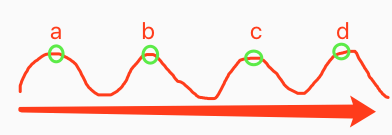

# 宇宙模型

<!-- TOC -->

- [宇宙模型](#宇宙模型)
  - [n1p1 物理](#n1p1-物理)
  - [n1p2 创世](#n1p2-创世)
  - [n1p3 创世20190622](#n1p3-创世20190622)
  - [n1p4 创世190624](#n1p4-创世190624)
  - [n1p5 音爆](#n1p5-音爆)
  - [n1p6 熵增源和宏微相对](#n1p6-熵增源和宏微相对)
  - [n1p7 元素](#n1p7-元素)
  - [n1p8 诞生消亡](#n1p8-诞生消亡)
  - [n1p9 能量传递与物质运动](#n1p9-能量传递与物质运动)
  - [n1p10 时间](#n1p10-时间)
  - [n1p11 粒子模型和粒子](#n1p11-粒子模型和粒子)
  - [n1p12 双缝实验与介质波模型](#n1p12-双缝实验与介质波模型)
  - [n1p13 纠缠波](#n1p13-纠缠波)
  - [n1p14 太阳系](#n1p14-太阳系)
  - [n1p15 熵减机](#n1p15-熵减机)
  - [n1p16 水](#n1p16-水)
  - [n1p17 波传递](#n1p17-波传递)

<!-- /TOC -->

## n1p1 物理
`CreateTime 2018.11.05`

> 从小米便签倒过来

1，晶体形状

2，共振 (详见n1p12)

3，用正负磁力表示万有引力

4，以小见大，反推宇宙真现

5，吸引物质，排斥反物质

6，暗物质为传播介质，传播光？传播物质？传播振动？声音物质传播，而光暗物质传播？或都是暗物质传播。

7，解释共振现象。

8，电子场在铜线中的速度是28.8千米秒。电子是0.07厘米秒。

9，粒子传播导致介质有了波，而波通过双缝产品漾涉，光或其它粒子只是传播时被干硗了。

10，光没有静质量

11，石头无法穿墙，但声音可以，某频光也可以。有哪些规律呢？声音是介质的振动传播，光却是穿透。

12，量子纠缠是不是共振

13，量子涨落是否是量子间的能量传递,在微观层面的表现;

14，中子星，小而密，恒星变黑洞失败的产物。

15，大自然比作宇宙，旋转水眼或龙卷风比作黑洞。

16，水流,与量子纠缠。

17，假如宇宙膨胀，会不会影响星球有序或其它？

18，物质只是传播，不存在移动。

19，双缝实验

双缝实验中，电子的能量场通过两个缝，然后像两个水波一样互相碰撞，最终呈现出那样的双缝实验结果。而最终打在电子测量板上面的结果其实就是为个双波互衍射的结果。

如果你可以测量到电子在传播过程中产生的波就像游艇快速移动在水面留下的痕迹一样，双缝只是把3维波过滤成2维波了而已，所以就有了双缝实验的结果。

20，熔点和沸点

21，空间填充和空间共振。

22，动的两种：传播和运动

23，观察太阳系，空间和物体谁在动。哪个强，哪个弱。

24，测不准原理，宇宙是否不可知，dna是否不可破解。

25，平衡一旦打破，会错的越发离谱。重新回到平衡的代价是巨大的。

     

## n1p2 创世
`CreateTime 2018.xx.xx`

1时2空3质4能

每个人的每一次运动，都对宇宙产生影响

问题1，宇宙有没有控制器。
问题2，宇宙有没有原力。'

 我觉得质能可以转化，但不能相加。如果有原力，就算相加也不会等于0。

从恒星，行星，卫星自传方向研究它们之间的相互作用，除了空间扭曲外，还有什么。

1. 行星的椭圆方向，也许与捕获切入方向有关。
2. 捕获有一个大趋势，要么被吸入恒星，要么随着太阳的燃烧，被逃出太阳系。
3. 空间扭曲，是否改用介质扭曲来替代。

     

## n1p3 创世20190622
`CreateTime 2018.06.22`

我觉得，爱因斯坦的相对论，只是把相对研究了个入门，其实相对远不止那么局限。

时空质能，你要想清楚，这几者横向相对，哪方在相对中为静，哪方在相对中为动。

比如
1，质为静，能为动。
2，质能合体为静，空为动。
3，物质与空间合体为静，时间为动。
4，时空合体为静，宇宙的发展方向为动。

     

## n1p4 创世190624
`CreateTime 2019.06.24`

没有时间就没有熵减，没有螺旋，定义、相对、循环，一切都不会有，一片混沌。那么时间从哪来的呢，或者说时间只是状态演化的状态机。

如果存在即定义，相对即变化，那么时间也在螺旋中产生。那么其具备一体性。

问题：

1，宇宙运作的原力是否源于mv。
2，输入输出口是否在黑洞。

## n1p5 音爆

1. 分析音爆的原因; (当物体移动与波传递有了,物撞波的情况)
2. 就像,气艇的加速超过水波速度时,或者气艇减速小于水波速度时,水波会与气艇产生撞击能量爆起水花;
3. 光爆时,会发生什么?(对比音爆时,都发生了什么)

     

## n1p6 熵增源和宏微相对
`CreateTime 2019.08.22`

**创世方案：**  
一.　孤立系统外，持续提供原力（熵增源）。  
二.　孤立系统外，一次性提供原力（熵增源）。

**宏微相对：**
1. 熵增减都足够活跃的一级宏观。
2. 嵌套规则固化的一级微观。
3. 再嵌套熵增减都足够活跃的二级宏观。
4. 再嵌套规则固化的二级微观。
5. ……

**宏微一体**
1. 涌现：微观每部分具备了同样的规则，所以才将整体熵减跃迁到宏观。
2. 例：水气到冰晶的形成。
  * 为什么会形成多少种冰晶？
  * 冰晶的形成由何控制器控制？或者说整体一直在抖动，一个冰晶的形成过程，一直在互相作用着。
  * 查看一个冰晶形成的全过程录像，看半段和后段，有何不同。形成全程是否具有固定规律。

     

## n1p7 元素
`CreateTime 2019.08.26`

1. 分析门捷列夫的元素周期性上升与渐变。
2. 分析什么是过渡性元素。
3. 分析金属与非金属元素的关键区别与原理。

     

## n1p8 诞生消亡
`CreateTime 2019.08.30`

1. 恒星的诞生和死亡;
2. 原子的诞生和死亡;

     

## n1p9 能量传递与物质运动
`CreateTime 2019.09.01`

**能量传递**
1. 研究热能在不同介质的传导效率。
2. 研究光在不同介质的传播效率。
3. 总结: 用具体数据来分析一下以上能量传递的规律与相对。

**物质运动**
1. 例1:微观电子围绕原子运动 (小而快);
  - 电子运动的能量,是否来源于原子衰减;
  - 研究下原子弹的原理;
2. 例2:宏观地球围绕太阳运动 (大而慢);
  - 研究下,自转方向与公转方向,是不是顺应(能量场/传递介质)摩擦的;
  - 根据自转方向,判断远日点摩擦力大,还是近日点摩擦力大;
3. 为什么充电,只能在电池介质中,什么是导电?电子运动;
4. 为什么磁铁,能够有那么强的磁场,什么是磁性强弱?如何仅让铁被影响运动;
  - 磁铁的场可以叫空间坍缩吗?(不能),那么应该叫什么?

     

## n1p10 时间
`CreateTime 2019.09.03`

1. 如果存在上帝,那么一定是时间 (但不存在);
2. 如果存在时间,只是相互作用罢了 (但不存在);
  * 相互作用决定了演化,而演化决定了对时间的感知;
  * 一切对时间的描述,都依赖某物或能量的演化,比如时钟,太阳,光走过的距离等;

     

## n1p11 粒子模型和粒子
`CreateTime 2019.09.08`

1. 标准模型和其61个粒子
2. 希格斯波色子

     

## n1p12 双缝实验与介质波模型
`CreateTime 2019.11.16`
> 1. 关于以下猜想,我们都要设计实验,来证明;
> 2. 设计一个双缝实验,验证物质只是能量在波形介质中的传递

1. 如果用液态泡沫做小球的传递双缝实验，或者用绝对透明的双缝板做双缝实验，结果如何？
2. 经典光子双缝实验中: 能否证明，光子只是在经过缝时受到了方向影响?
3. 如果在缝对面，双缝中间放中间隔板呢？能否证明关系的传递介质是能量传递出的波形。
3.2 如果在缝对面，双缝中间放中间隔板呢？能否证明光子的传递介质是能量传递出的波形。
4. 能否计算出传递介质的波速，波速等于光速吧？
5. 量子纠缠是否只是共振现象，在同一个波峰段时，以为纠缠。(见n1p13纠缠波)
6. 宇宙中,本没有物质,能量的各种形态,成为物质的各种特征,让我们以为有物质;
7. 质量只是一种直接感受,并不表示真实存在;

| 波粒二象性 |
| --- |
| **实例:** |
| 1. 一个人在长大前,都在学校学习; |
| 2. 而社会上有一个鉴定机构 (公司),只会招用毕业后人的; |
| 3. 有一天公司发现,人们都具备员工的特征 (工作期); |
| 4. 又有一次,公司发现,人们都是具备学生的特征,因为6月是毕业季招生 (学生期); |
| 5. 再后来公司发现,他们能见到的,都是工作期特征,而他们没看到时,这些人又呈学生期特征; |
| **实例总结:** |
| 1. 人们把这称为波粒二象性,并且还有人证明,一个人要么是学生,要么是员工,不可能即是学生,又是员工; |
| 2. 再后来,有个叫海森堡的提出测不准原理,他说:当公司去录用一名学生时,学生已经变成了员工,就不再是学生,所以永远无法观测到真实的学生状态; |
| 3. 物理有时候就是这么扯淡,如果换成通俗的事例,人人能懂,但偏要给你转J8转转绕绕; |
| **波粒二象性总结:** |
| 粒子方: 说白了,微观粒子在未被观测时呈波态,而要想观测,就得先捕获成粒子态,才能观测到; |
| 波方: 但人们发现,如果捕获足够多的粒子,发现这些粒子拼成了一段波,所以有人认为这是波; |
| 波粒二象方: 就这样,有人谁也劝服不了谁,最终发展出了波粒二象性的说法; |
| **总结说明:** |
| 1. 波与粒相对,波动而粒静,只是同一个玩意儿的两种状态罢了, |
| 2. 就像agi输入时为信息表现为信号,沉淀为知识后信息表现为数据; |
| 3. 那么我可以称其为信号与数据,也可以称其为"号数二象性"; |

| 问题 | 介质的阻力? |
| --- | --- |
| 说明 | 介质是否有阻力?如果有阻力,当波慢慢消散后,会怎么样? |
|  | 会不会粒子就不见了,或者粒子停下后,会是什么状态? |

     

## n1p13 纠缠波
`CreateTime 2019.11.16`

| 纠缠波 >> |
| --- |
|  |
| 1. 如图: abcd四个点,在波中的波峰位置,此时这四个粒子属于纠缠态; |
| 2. 比如: 从宇宙爆炸之初,到现在宇宙边缘有一个膨胀波,宇宙中心有一个a状态,与百亿光年外的d状态,是一致的; |
| 3. 实验: 我们可以找到宇宙本来存在的一个波,找到a和b点,再预测出c点的位置,去找到它;即可证明; |
| 4. 改进: 我们需要改进实验3,因为实验3不太可行,可行性可能比较差; |

     

## n1p14 太阳系
`CreateTime 2020.01.03`

1. 太阳耀斑11年周期: 尝试通过一或多个行星的公转周期,及涌现,来解释太阳耀斑的11年周期;看能否计算得出11年的涌现;
2. 物理，根据熵原理，太阳越来越轻，而地球越来越重。
3. 计算下太阳纪,太阳是围什么公转的,多久一轮,有无春夏秋冬,能否通过星象看出变化来计算;

     

## n1p15 熵减机
`CreateTime 2020.01.29`

宇宙是熵减机还是熵增演化机，取决于宇宙是否从外界吸取负熵？
1. 如果有则为熵减机，则宇宙整体可以不断从负熵中获取能量，并且维持一些状态的持久性。
2. 如果无则为熵增机，则宇宙整体在走向热寂，而我们所有的天体、生命等熵减机体，只是其绽放烟花过程中的一个局部熵减片断。

     

## n1p16 水
`CreateTime 2020.05.09`

1. 水的沸腾是否意味着微观向宏观的溢出?或者说本体向环境的能量传送,水的升温变成了水的运动;

     

## n1p17 波传递
`CreateTime 2020.12.07`

本节将主要针对能量波的传递,来进行思考;

1. 光波的传递中:
   - 波峰会衰减吗?
   - 传递速度会误减吗?
   - 即传递介质是否具备阻力?
   - 阻力是多少?
   - 阻力与当前空间的物质密度成正比吗?
   - 阻力误减掉的能量哪去了?
2. 介质密度(阻力)计算:
   - 根据太阳和地球的质量和直径,来计算宇宙中介质的密度 (根据不同介质密度产生的空间扭曲度不同);
