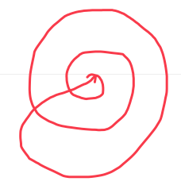

### 1. 简介说明：
　　在螺旋论中，有三大核心理论点，分别为：定义、相对和循环。而其中的循环又分为内层循环、中层循环和外层循环三层。本文重点对中层循环进行说明。

### 2. 概念与作用：
　　中层循环全称是思维与网络循环，在helix中，系统整体架构层面有着至关重要的作用。

### 3. 正文：
1. 思维是网络的操作者（帅），用来构建网络（生），运用网络（行），hebb加强网络（固）。
2. 网络是思维的填充者（母），用来在循环中不断的供养思维活力和思维运作（养），是思维运用的本体，思维没了网络则直接停止（载）。

### 4. 最后：
　　思维是动，网络是静。但在代码实践方面，思维是写死的代码，而网络是动态构建的数据。

### 5. 附：
　　本文简短，不代表螺旋论中关于中层循环的所有描述与应用。（因为实际理论中的细节较多，工程实践中更是有着很多与其它理论部分的共同作用与整体的协作）。且三层循环并非独立运行，而是互相嵌套〈见下图〉，对循环与螺旋论其它理论感兴趣的朋友可自行点击跳转到主页进行查看阅读相关文章、笔记与代码。

* 主页：<http://jiaxiaogang.github.io//>
* 示图：
