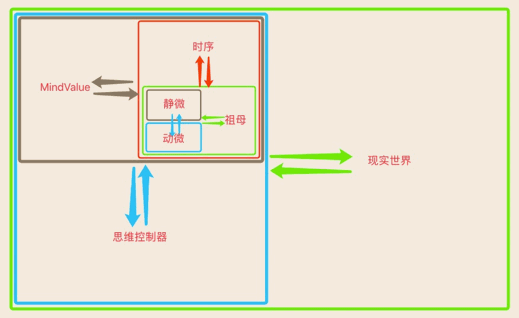
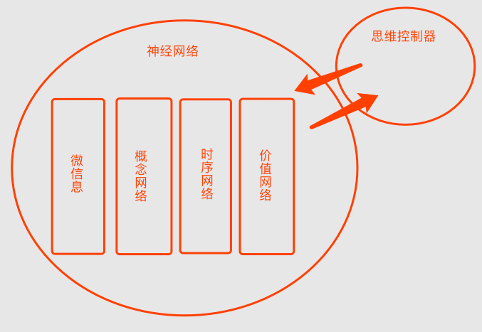

# 熵减机在人工智能中的应用

### 1. 引言：

>　　2005年加入IT行业工作直至如今，看到了国内移动互联网的兴起，了解到计算机的辉煌发展史和人工智能的数次寒冬。2006年，随着深度学习的兴起，2016年alphaGo围棋程序大获成功。作为数年深耕技术的软件工程师，我也被卷入这次人工智能的第三次浪潮。但人工智能技术远未成熟，近70年来在包括学术界、各机构及相关公司等等努力下，终未能有真正的通用人工智能系统落地，甚至理论支撑也远未成熟。作为一名软件工程师，我们生活在最好的时代，我一直希望通过技术推动人类文明的巨轮，改善所有人的生活。如何设计出通用型智能系统呢？本文将从理论、到模型、再到实践依次展开，来汇报17年3月至今我的一些思考和成果。

### 2. 大纲：

> 本文从理论，到模型，再到实践的方式逐步展开，来介绍整个熵减机系统的构建过程与方法。

* 理论：螺旋论理论  
* 模型：信息熵减机
* 实践：he4o系统

### 3. 目录：

<!-- TOC -->

- [熵减机在人工智能中的应用](#%E7%86%B5%E5%87%8F%E6%9C%BA%E5%9C%A8%E4%BA%BA%E5%B7%A5%E6%99%BA%E8%83%BD%E4%B8%AD%E7%9A%84%E5%BA%94%E7%94%A8)
  - [1. 引言：](#1-%E5%BC%95%E8%A8%80)
  - [2. 大纲：](#2-%E5%A4%A7%E7%BA%B2)
  - [3. 目录：](#3-%E7%9B%AE%E5%BD%95)
  - [第一部分：理论——螺旋论](#%E7%AC%AC%E4%B8%80%E9%83%A8%E5%88%86%E7%90%86%E8%AE%BA%E8%9E%BA%E6%97%8B%E8%AE%BA)
    - [1. 介绍：](#1-%E4%BB%8B%E7%BB%8D)
    - [2. 定义：](#2-%E5%AE%9A%E4%B9%89)
    - [3. 相对：](#3-%E7%9B%B8%E5%AF%B9)
    - [3. 循环：](#3-%E5%BE%AA%E7%8E%AF)
    - [4. 公式：](#4-%E5%85%AC%E5%BC%8F)
  - [第二部分：模型——信息熵减机](#%E7%AC%AC%E4%BA%8C%E9%83%A8%E5%88%86%E6%A8%A1%E5%9E%8B%E4%BF%A1%E6%81%AF%E7%86%B5%E5%87%8F%E6%9C%BA)
    - [1. 介绍：](#1-%E4%BB%8B%E7%BB%8D-1)
    - [2. 由静到动：](#2-%E7%94%B1%E9%9D%99%E5%88%B0%E5%8A%A8)
    - [3. 由动到静：](#3-%E7%94%B1%E5%8A%A8%E5%88%B0%E9%9D%99)
    - [4. 螺旋论三大核心展开在信息熵减机中：](#4-%E8%9E%BA%E6%97%8B%E8%AE%BA%E4%B8%89%E5%A4%A7%E6%A0%B8%E5%BF%83%E5%B1%95%E5%BC%80%E5%9C%A8%E4%BF%A1%E6%81%AF%E7%86%B5%E5%87%8F%E6%9C%BA%E4%B8%AD)
  - [第三部分：实践——he4o系统](#%E7%AC%AC%E4%B8%89%E9%83%A8%E5%88%86%E5%AE%9E%E8%B7%B5he4o%E7%B3%BB%E7%BB%9F)
    - [1. 事例：](#1-%E4%BA%8B%E4%BE%8B)
    - [2. HE系统架构：](#2-he%E7%B3%BB%E7%BB%9F%E6%9E%B6%E6%9E%84)
    - [3. DOP编程思想：](#3-dop%E7%BC%96%E7%A8%8B%E6%80%9D%E6%83%B3)
    - [4. HE的运作单流程：](#4-he%E7%9A%84%E8%BF%90%E4%BD%9C%E5%8D%95%E6%B5%81%E7%A8%8B)
    - [5. 最后：](#5-%E6%9C%80%E5%90%8E)

<!-- /TOC -->

<br>

***

## 第一部分：理论——螺旋论


### 1. 介绍：

　　螺旋论（theory of helix）本质上是一个熵减机理论。螺旋论认为，世界是熵增的，智能体（不限于智能体）是熵减的。智能体靠熵减赢得时间。一个熵增减都足够活跃的世界环境，才能够孕育出足够熵减体。

　　螺旋论共包含三个部分：定义、相对和循环，三者共同作用下呈螺旋形，这也是本理论的名字由来。螺旋论可用于但不限于构建AGI（通用人工智能）系统，本文重点讲述其在AGI上的应用，将从螺旋论展开，呈现一个自然而然的动态系统。

### 2. 定义：

　　定义标示了一个从无到有的过程，一切定义都是由模糊到相对确切的过程，不存在绝对确切的定义。

### 3. 相对：

　　在螺旋论由理论向模型与实践展开的过程中，几乎所有的设计都有着相对，有静有动。比如：有代码的固化就相对有数据的灵活、有思维的活跃就相对有神经网络的沉淀、一个值有加就相对有减，这样的设计数不胜数，此处不详列。相对在系统中，用来调和各种矛盾。无论是横向还是纵向，相对遍布在微观与宏观，作用在每一个角落，解决了无数问题。

### 3. 循环：

　　无相对不循环，相对间的互相转化，形成循环。循环与相对一样，也是存在广泛，而此处列出较显然的三层循环，以帮助理解循环在整个系统中的作用。

* 1. 外层循环——智能体与现实世界的循环：
  > 现实世界的信息输入到智能体的认知学习，再到决策行为的输出。两者相对方向相反，呈现出外层循环，智能体相对于现实世界是一个独立的维度。

* 2. 中层循环——思维与神经网络的循环：
  > 智能体的思维构建网络，而网络再影响思维。思维是网络动的呈现，网络是思维静的沉淀。两者在智能体中循环，使智能体产生内心活动和思考过程，HE认为自己具有自由思维，认为自己活着。

* 3. 内层循环——情感价值循环：
  > 情感价值（MindValue，以下简称MV）循环，仅作为一个值存在，MindValue会根据智能体的一些状态变化，或者其它事件而变化。MV值的变化带动指导着思维的运作，指导着整个网络的成长方向。而MV值的升与降形成了智能体最内层的循环。

### 4. 公式：

  * he并没有依赖数学,公式是:`0->1->(a:b)`,这其实并不是什么公式,只是he从0到1,再a和b相对关系的一个描述。

<br>

***

## 第二部分：模型——信息熵减机



### 1. 介绍：

　　信息熵减机模型以螺旋论展开。含：“静微信息”－“动微信息”－“概念网络”－“时序网络”－“MV价值网络”－“思维控制器”－“现实世界”，模型整体呈现为螺旋双向。

### 2. 由静到动：

> 决策行为，从抽象向具象。

　　以内到外的方向，即：“静微信息”－“动微信息”－“概念网络”－“时序网络”－“MV价值网络”－“思维控制器”－“现实世界”这样的方式逐级展开动起来。在相对中，其每一级前的总和为静，后一级为动。由静到动的情况如下：

| 由静到动 >> | 相对静 | 到 | 相对动 |
| --- | --- | --- | --- |
| 1. 微信息中 | 静微信息 | 到 | 动微信息 |
| 2. 静态概念网络中 | 微信息 | 到 | 概念网络 |
| 3. 数据网络中 | 静态概念网络 | 到 | 时序网络 |
| 4. 神经网络中 | 数据网络 | 到 | MV价值网络 |
| 5. 智能体中 | 神经网络 | 到 | 思维控制器 |
| 6. 物理世界中 | 智能体 | 到 | 现实世界 |

### 3. 由动到静：

> 认知学习，从具象向抽象。

　　相反，从外向内的方向，信息从现实世界流入到智能体，后逐步由动向静沉淀。其情况与上面相反（见下表）。从细节来说，是将输入的信息进行“类比”后发现规律并构建成网络的过程。即：“类比”－“规律”－“抽象”－“关联”－“网络”的处理过程。在智能体中，从无序化中找出有序化，并动态构建到网络中，以提供给智能体在需求中使用这些有序信息。


| 由动到静 >> | 相对动 | 到 | 相对静 |
| --- | --- | --- | --- |
| 1. 物理世界中 | 现实世界 | 到 | 智能体 |
| 2. 智能体中 | 思维控制器 | 到 | 神经网络 |
| 3. 神经网络中 | MV价值网络 | 到 | 数据网络 |
| 4. 数据网络中 | 时序网络 | 到 | 静态概念网络 |
| 5. 静态概念网络中 | 概念网络 | 到 | 微信息 |
| 6. 微信息中 | 动微信息 | 到 | 静微信息 |

### 4. 螺旋论三大核心展开在信息熵减机中：

| 定义 >> |  |
| --- | --- |
| 1. 微信息 | 微信息是一个具有“标识”和“值”的，最小信息单元。 |
| 2. 概念 | `微信息`无意义，但多个`微信息`组成的`概念节点`有模糊意义，且在不断的抽象中，其意义越来越确切。 |
| 3. 时序 | 多个`概念节点`组成了`时序节点`，时序导致了`MV价值网络`的变化，且在抽象中`时序`也越来越确切。 |
| 4.　价值MV | `MV`无意义，但却指导了所有数据的意义，是所有意义的核心。HE通过数据来解释MV，通过数据来解决MV需求，MV激活思维活力，转化成需求。MV是HE中最简单，但最核心且指导着`定义`，指导着`从无到有`的整个过程的。 |
| 5. 神经网络 | 神经网络的四个模块分别为：`微信息`、`概念网络`、`时序网络`和`价值网络`。其中`微信息`->组成->`概念`->组成->`时序`->导致->`价值变化`，这些都是一对多的关系。 |

| 相对 >> |  |
| --- | --- |
| 1. 类比 | `类比`是智能体（以下简称HE）唯一的内核算法单元，没有类比就没有相对，类比就是bool算法。类比应用在：微信息间、概念间、时序间和价值间四个方面。 |
| 2. 神经网络 | 神经网络是`横向四模块，纵向抽具象`。其中横向是前模块被后模块引用，纵向是具象向抽象关联。无论是横向还是纵向，都是一对多的关系。 |

<br>

***

## 第三部分：实践——he4o系统

> 1. 难事从易，大事从细。似乎一谈到实践，就总会有那么多道鸿沟挡在我们面前，寸步难行。但其实只要我们能够找到本质，回归具象。这样的整个实践过程，其实是自然而然而良性循环推进的。
>
> 2. 看起来，“计算机软件模拟”是当前做信息熵减机实验的综合最佳方式。所以螺旋论的实践选型也采用“计算机软件模拟”进行，目前HE选择了oc语言开发，所以项目名称为he4o（he for objective-c），其中原因众多，但下一步HE的计划是转到c或java来开发。

### 1. 事例：

* **先通过以下两个小事例来初步了解一下：**

  - **智能汽车：** 试想有一台可以自动控制油门的汽车，我们叫它小A，小A可以在上坡时自动加大油门，而在下坡时自动减小油门。它学会了灵活的控制油门与坡度的关系，但有一天，下雨了，它的油门在不断的加、减、加的调节着。这里我们实现了一台自动化油门车，但这并不智能。那么怎样让事情变的更有趣呢？我们尝试为其加入信息处理功能，我们先为其添加一个“精神价值”，如：“汽车不喜欢因违章而被罚款”。如果有一次小A因为停车压了白线，而被罚款了，此时小A的经历对其产生“精神价值”影响。再一次小A遇到一个被挤了半边的车位，它尝试着停进去，但小A发现自己的后轮总是停不进去，压着白线。小A只好放弃这个车位，去找其它的。这个场景在外人看来：“有一辆车，尝试着停到某个车位，但停好后，发现自己压了线，又退了出来，开走了”。现实无比复杂，但“精神价值”却非常非常简单。
  注：精神价值（即上文MindValue）。

  - **代码的运作：** 当我们写下"Hello World"，计算机从此运行起来。但这即是计算机之生，也是其之死。当我们定义一个变量，一个类，一个函数，从此计算机也只按着程序员既定的逻辑和路线进行运作，再也没有了自由与灵活可言。就像一个父亲看孩子：人类父亲仅指定孩子只能在屋子里玩，不许跑出去。而计算机则是指定了孩子的每一步应该往左还是往右，孩子只会机械的按着即定路线去一步步走完。如何设计一个自由且灵活，并且自发产生“定义”的智能系统变的非常重要。在HE中，看似运行的是代码，而真正运行的是数据（灵活多变的数据带给固化代码以变化）。

### 2. HE系统架构：

| 示图 |  |
| --- | --- |
| 1 | **代码组成：** HE代码60％为神经网络，30％为思维控制器，剩余部分共占10％。 |
| 2 | **系统架构：** HE微观向宏观的每一步，都是追求极简、自然而然的演化过程。所以几乎每个模块间都是一对多的结构化关系。 |
| 3 | **神经网络：** 神经网络中，全部为节点和连接（端口）。横向包括四种节点：微信息、概念节点、时序节点和MV节点。而关联包括两种，分别为：纵向抽具象关联（含抽象和具象两个端口）和横向引用关联（含引用和被引用两个端口）。 |
| 4 | **思维控制器：** HE所有的逻辑代码由思维控制器完成，思维控制器以非常固化的方式在做着重复的循环（含MIL输入循环和MOL输出循环）。而思维控制器即是网络的构建者，又是网络的使用者。所以思维控制器的运作因数据变化而变化。但整体来看，思维控制器是在做结构化递归循环。 |

### 3. DOP编程思想：

　　HE的编码方式与目前主流的OOP等有明显的区别，但最明显的区别就在于其“动态生成式”特性，所以我为其命名为：面向动态编程DOP（Dynamic Oriented Programming）。

### 4. HE的运作单流程：


```
> 流程开始：

1. 信息从现实世界传至Input层。（共两种：普通信息或MV信息）
2. Input层将各种信息转发给相对应的“算法层”。（如图像交给视觉算法）
3. 算法层将其处理结果：“微信息”，转交给思维控制器。
4. 思维控制器对信息进行判断。
5. 如果是普通微信息，则被组合构建成“具象概念节点”，并尝试识别，与收入瞬时记忆（瞬时记忆最多8个概念）［注1］。
6. 如果是MV信息，则构建成“MV节点”，并将瞬时记忆中的所有“概念节点”组成新的“具象时序节点”［注2］。
7. 此时判断MV信息，是否生成新的需求［注3］。（如饥饿MV产生饥饿需求）

> 认知学习流程：

a. 新构建的具象节点，会根据索引“微信息”联想到“概念节点”再联想到“时序节点”［注4］。
b. 新的时序与联想到的时序会进行类比，并找到规律，将规律结果进行抽象构建到网络［注5］。
c. 抽象后的“概念”和“时序”更加确切［注6］。

> 决策行为流程：

a. 当产生新的需求时，会存入需求序列［注7］。
b. 需求序列中当前最强需求，被取做当前任务，并激活思维控制器活力［注8］。
c. 根据当前任务找MV方向索引［注9］找到可解决此需求的MV经历，并评价［注10］。
d. 根据MV联想“抽象时序”，来复现“时序”发生过程。［注11］
e. 根据“时序”中的数个概念节点，来分别做"行为化评价"［注12］。
f. 时序与概念间互相协作，来递归出最终的行为化序列，并执行输出行为［注13］。

> 附注：

1. 结束是新的开始，会循环到起点处。
2. 限于篇幅，步骤中关于：识别、需求抵消、内存网络（短时记忆）、内外类比、固化网络（小脑）等等不再展开。

［注1］ ：构建概念节点后，概念节点会引用“微信息”，形成引用与被引用关联。
［注2］ ：构建时序节点后，时序节点会引用“概念节点”，形成引用与被引用关联。
［注3］ ：MV具有两个方向，升与降，一个方向是符合目标的，另一个方向则是不符合的。
［注4］ ：硬盘神经网络节点间引用等关联关系，以强度排序，强度在初始化时与mv强度正相关，在今后每次联想激活强度都会+1。
［注5］ ：时序的类比，意味着时序中各个“概念节点”间也会类比，所以此处不仅会抽象“时序”，也会抽象“概念”。
［注6］ ：“抽象概念节点”意义更加确切，“抽象时序节点”的时序性更加简短明确。
［注7］ ：“需求序列”中存储HE当前思维活动中的数个需求目标（需求序列根据迫切度实时有序）。
［注8］ ：MV的迫切度与激活思维控制器的活力正相关，而后的每一轮思考循环都会消耗此活力值。
［注9］ ：HE有两个索引，分别是网络的开始和结尾，开始是微信息索引，结尾是MV方向索引。
［注10］：在决策中的评价有效时，进入下一步，无效时，则此分支被“不应期”，并继续下一方案的尝试。
［注11］：一个需求会对应多种“MV节点”解决经历，一个MV会对应多个“时序节点”经验，整个决策过程其实是“一对多”的结构化递归展开过程。
［注12］：对于HE而言，实与虚并非现实世界与大脑中，而是信息复现与解决了问题，就是实。所以行为化，让“条件概念”再现，让“时序”被预测并再次发生。就是HE所坚信的实。
［注13］：时序需要实现其下的“概念”，而“概念”也会又被另一个时序所实现，两者协作密切。

```

### 5. 最后：

　　限于篇幅，本文无法对HE所有实践代码做详解。所以对此有兴趣的朋友，可以移步以下站点，获取更多相关信息、源码、手稿等。

<http://www.jiaxiaogang.top>
