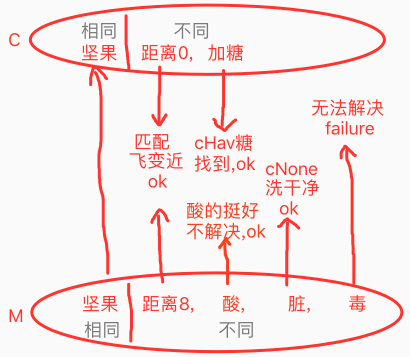

#### 1. 简介：
　　在决策行为化中对瞬时记忆的应用时，设此时，我们想要的为curAlg（以下简称C），瞬时记忆可提供的matchAlg（以下简称M）。在MC进行匹配时，会大机率如此只有一部分匹配，因为C偏抽象，而M偏具象。这样的矛盾导致C与M各有其特化信息，我们需要解决这些特化，而什么样的特化需要解决，什么样的不需要解决？这就涉及到反思评价。

#### 2. 实例：
　　当我们想吃煎蛋时，有鸡蛋但没火，我们想找加热源，此时C为加热，而与瞬时中所提供的进行匹配，可能会找到M为CPU，或者夏天的油路。

#### 3. 实例＋示图：

　　当我们想吃甜蘑菇时，C为甜蘑菇，而现在手头只有脏的酸的且有毒的蘑菇。此时：
* MC的共同信息mcs = (蘑菇)
* C的特化信息cs = (熟)
* M的特化信息ms = (脏,酸,毒)

| 实例示图 |
| --- |
|  |

说明：
1. 由图可见，对于相同的mcs我们不必处理。
2. 但对于cs的加糖等需求，需要满足。
3. 而对于ms脏和毒的需求，我们需要修正掉（图中脏可以洗净，但毒无解）。
4. 但对于ms中酸，却没有产生修正需求（因为反思发现我们喜欢酸的）。

#### 4. 模型＋解析：

|  |
| --- |
| MCS: 不处理; |
| CS: MIsC时不处理 / 同级时需满足; |
| MS: 需评价,看是否进行修正; |

　　在决策中，我们的向性是由上至下（抽象向具象），而在MC匹配过程中，需要根据MC的抽象来做评价，即由下至上（具象向抽象），因其截然相反的向性，这个过程称为反思过程。

#### 5. 白话：

即：我们本来要吃蘑菇：
1. 但反思一下它不甜，则加点糖。
2. 再反思它脏，则洗一下。
3. 再反思下它酸，但喜欢酸味儿，故不理会。
4. 再反思下它有毒，且解决不了，则放弃食用。
