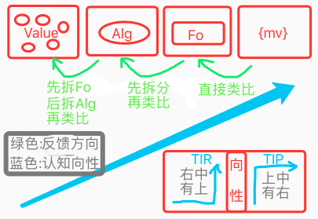

# 反向反馈类比
`CreateTime 2020.04.06`

### 1. 简介
　　前两天决策支持稀疏码行为化，发现常常有稀疏码很难反思到结果，以致评价失败或错误。经过两个角度分析如下：
1. 经细节分析，发现关键问题在于抽象的常识不够，导致此问题。
2. 经向性分析，发现抽象不够的问题是因为TIP到TIR的反馈类比不够（见模型）。

### 2. 正文
　　综上，我们通过扩展反馈类比的方式来从根本上解决此问题，早在17年，he已经具备了正向反馈类比（即“外类比”），并且在18年7月已经有关于类比的扩展设想，即本文主角：“反向反馈类比”（曾用名：“占位规律/找不同”）。

　　注：本文“反向反馈类比”与“正向反馈类比”，是相对的。所以即有的外类比算法保持不变，此二者互不影响运行。

| 19041反馈类比对比 | 数据全面性 | 确切化速度 | 调用频率 | 抽象确切度 |
| --- | --- | --- | --- | --- |
| 正向反馈类比 | 好 | 慢 | 经常 | 常模糊 |
| 反向反馈类比 | 差 | 快 | 很少 | 常确切 |

### 3. 模型
　　由以下模型可见，TIP会触发进行反馈类比，供由TOR反思时使用。




### 4. 伪代码

```c
+(void) analogy_Feedback_Diff:(AIFoNodeBase*)mFo p:(AIFoNodeBase*)pFo{
    if(不符合预测){ //指mMv和pMv同类型不同向 (一正一负);
        /** 第1级: 类比fo.content_ps;
          *  M:[abcd]->{mv+}
          *  P:[a3bcxyz]->{mv-}
          *  ms:[d]->{mv-/4}; (价值影响权重=ms数/M数);
          *  ps:[3xyz]->{mv-*4/7}; (价值影响权重=ps数/P数);
          */

        /** 第2级: 类比alg.content_ps;
          * M:[(w1),(d5,h6)]->{mv+};
          * P:[a,(w1,b2),(d5,h3)]->{mv-};
          * ms:[(h6)]->{mv-/2};
          * ps:[a,(b2),(h3)]->{mv-*3/3}
          */

        //3. 构建: 概念,时序和MV;
    }
}
```
***

### 5. 附

1. 源手稿：<https://github.com/jiaxiaogang/HELIX_THEORY/blob/master/%E6%89%8B%E5%86%99%E7%AC%94%E8%AE%B0/Note19.md#n19p3-%E5%8F%8D%E5%90%91%E5%8F%8D%E9%A6%88%E7%B1%BB%E6%AF%94>
2. 源码：<https://github.com/jiaxiaogang/he4o/blob/master/SMG_NothingIsAll/AIFoundation/AIThinkingControl/In/AIThinkInAnalogy.m>
