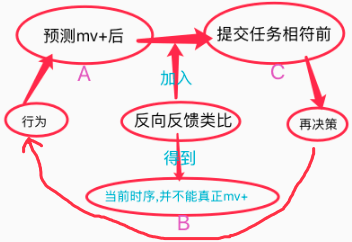

## MCV3算法
`CreateTime 2020.04.20`

#### 1. 简介：
　　一切的网络构建最终都是为了使用，前段时间将外类比，拆分为：正向反馈类比和反向反馈类比。而反向反馈类比所得的知识正好可供MC算法使用，过去的MCV2算法分为Alg和Value两个部分，但这样的设计容易使MC算法复杂度太高，而使决策过程显得非常混乱（或者效率低下）。本文根据反向反馈类比的构建结果，即ATPlus和ATSub，来重新设计MCV3算法。

#### 2. 起因：
　　根据MCV2算法进行决策训练时，发现必须有反向反馈的介入，否则会产生外层死循环，如下图：



　　并且反思的复杂度也因重组RTAlg和RTFo，导致越来越难以控制，如下图：


#### 3. 决定迭代V3：

　　综上考虑，加上决策的原则（下表），决定从决策行为化算法上，进行彻底的迭代来改进以应对此问题。

|  | TOR三原则 |
| --- | --- |
| 原则1 | 决策主体为用非体,故不重组识别,更不进行学习 (不重组概念或时序); |
| 原则2 | 用法一:向性左下,决策只顺着向`具象与理性`关联找实现; |
| 原则3 | 用法二:向性右上,反思只顺着向`抽象与感性`关联找评价; |

#### 4. MCV3模型：


#### 5. 伪代码：

```java
//19106伪代码完整版

void alg_cHav(AlgNode c){
  //对概念找cHav;
  c = c.findCHav()
  if (c != null) {
    this.mc_v3(c,m);
  }else{
    //整体行为化失败;
    failure();
  }
}

void mc_v3(AlgNode C,AlgNode M){
    //1. 判断有效性
    if(mIsC){
        //2. C的mv+处理;
        Array cPlus = C.absPlus;

        //2.1 有效性判断1: 到CFo中,判断是否也包含此mv+,包含才有效 (C甜,也正是要吃甜的);
        Array cFoPlus = cFo.absPlus;
        if (cFoPlus.contains(cPlus.item)) {
            //2.2 有效性判断2: 再判断M是否包含此mv+,不包含才需满足 (C甜,M不能甜);
            Array mPlus = M.absPlus;
            if (!mPlus.contains(cPlus.item)) {
                //2.3 有效性判断3: 再到M中找同区不同值,对C稀疏码进行满足 (如C中含距0,而M中为距50);
                if (M.item.identifier == cPlus.item.identifier) {
                    this.mc_Value(M.item.value,cPlus.item.value);
                }else{
                    //2.3B 匹配不上,转移;
                    this.alg_cHav(C);
                }
            }else{
                //2.2B 无需处理;
                success();
            }
        }else{
          //2.1B 无需处理
          success();
        }

        //3. M的mv-处理 (排除掉刚已处理过的);
        Array mSubs = M.absSub - alreadyMSub;

        //3.1 有效性判断: 从CFo的具象两层中,到mv+中找同区不同值的稀疏码映射,(比如CFo或其具象中,吃热食物mv+,而M冷吃了还肚子疼mv-,则需修正);
        Array cFoPlus2Layer = cFo.absPlus + cFo.conPorts.absPlus;
        Array validM2CDic = (mSubs.identifier & cFoPlus2Layer.identifier);

        //3.2 逐一对M做修正 (如:行为化加热);
        for(id item in validM2CDic){
            this.mc_Value(item.cValue,item.mValue);
        }
    }else{
        //4. m不是c,直接转移;
        this.alg_cHav(C);
    }
}

void mc_Value(Value cValue,Value mValue){
  //对稀疏码value进行行为化;
}

```

#### 6. 附：

源码链接：<https://github.com/jiaxiaogang/he4o/blob/master/SMG_NothingIsAll/AIFoundation/AIThinkingControl/Out/TOAlgScheme.m>
源手稿：[点击查看](../手写笔记/Note19.md#n19p10-mc_alg算法迭代v3)
