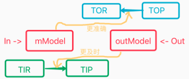

# 决策支持输入期短时记忆
***

## 1. 旧版说明：

　　在以往he的决策系统，仅支持输出期短时记忆outModel（原名DemandManager），而不支持输入期短时记忆mModel (原名ShortMatchManager)，这导致he仅用递归方式要做决策，而没有对当前的情况有充分考虑。

　　比如，在前段时间的二测训练中，发现he总是为当前的任务决策时做递归循环，可能原本应该很快完成的决策任务，却要循环上百轮。

## 2. 本节新做法说明：

　　本节针对此问题，使决策支持输入期短时记忆mModel，从而能够以更快速的方式得到决策结果，其循环次数，可由原先的上百轮降至几轮完成。

## 3. 模型：
　　**我们将从理感性与价值正负两个维度，对决策细分为四种工作模式，分别为：**
1. **R+**
  * 说明：理性正价值，以理性主导，指在mModel中预测了正价值。
  * 比如：我看到妈妈在做饭，预测一会就会有好吃的。

2. **R-**
  * 说明：理性负价值，以理性主导，指在mModel中预测了负价值。
  * 比如：我看到一辆车将要撞到我。

3. **P+**
  * 说明：感性正价值，以感性主导，指imv方向索引找到解决负价值的经验方案。
  * 比如：我饿了，我想到做饭可以解决此问题。
  * 模型：

4. **P－**
  * 说明：感性负价值，以感性主导，指imv方向索引找到导致了负价值的原因。
  * 比如：我累了，我想到刚刚打球导致此问题。
  * 模型：

## 4. 总结：
　　此次迭代对于决策系统非常重大，四种工作模式不仅会支持到TOP，也会支持TOR。并且紧跟其后还会有mModel和outModel的协作（见图4.1），以及行为化部分，所以这是一次对决策系统的全面升级。其不仅使he决策更加快速精准，也细化（分裂）了决策模型，使其更加理性，更加切合实际情况做出决策。

* 4.1　

## 5. 代码：

#### 5.1　TOP部分：

　　以下是TOP以及TOR的四种工作模式的代码（无行为化部分）。

```objective-c
//MARK:===============================================================
//MARK:              < 四种工作模式 (参考19152) >
//MARK:===============================================================

/**
 *  MARK:-------------------- R+ --------------------
 *  @desc
 *      主线: 对需要输出的的元素,进行配合输出即可 (比如吓一下鸟,它自己就飞走了);
 *      支线: 对不符合预测的元素修正 (比如剩下一只没飞走,我再更大声吓一下) (注:这涉及到外层循环,反向类比的修正);
 */
-(BOOL) reasonPlus:(AIFoNodeBase*)matchFo cutIndex:(NSInteger)cutIndex{
    //将matchFo+作为CFo行为化;
    //NSInteger start = cutIndex + 1;
    //NSArray *need2Act_ps = ARR_SUB(matchFo.content_ps, start, matchFo.content_ps.count - start);
    //return [self.delegate aiTOP_Commit2TOR_V2:need2Act_ps cFo:matchFo subNode:nil plusNode:nil];

    //对首元素进行行为化;
    AIKVPointer *cAlg_p = ARR_INDEX(matchFo.content_ps, cutIndex + 1);
    return [self.delegate aiTOP_2TOR_ReasonPlus:cAlg_p cFo:matchFo];
}
/**
 *  MARK:-------------------- R- --------------------
 *  @desc
 *      主线: 取matchFo的兄弟节点,进行行为化 (比如车将撞到我,我避开可避免);
 *      CutIndex: 本算法中,未使用cutIndex而是使用了subNode和plusNode来解决问题 (参考19152:R-)
 *  @TODO 1. 对抽象也尝试取brotherFo,比如车撞与落石撞,其实都是需要躲开"撞过来的物体";
 *  @version
 *      2020.05.12 - 支持cutIndex的判断,必须是未发生的部分才可以被修正 (如车将撞上,躲开是对的,但将已过去的出门改成不出门,是错的);
 */
-(BOOL) reasonSub:(AIFoNodeBase*)matchFo cutIndex:(NSInteger)cutIndex{
    //1. 数据检查
    if (!matchFo) return false;

    //2. 用负取正;
    __block BOOL success = false;
    [TOUtils getPlusBrotherBySubProtoFo_NoRepeatNotNull:matchFo tryResult:^BOOL(AIFoNodeBase *checkFo, AIFoNodeBase *subNode, AIFoNodeBase *plusNode) {
        success = [self.delegate aiTOP_2TOR_ReasonSub:matchFo plusFo:plusNode subFo:subNode checkFo:checkFo cutIndex:cutIndex];
        return success;//成功行为化,则中止递归;
    }];

    //3. 一条行为化成功,则整体成功;
    return success;
}
/**
 *  MARK:-------------------- P+ --------------------
 *  @desc
 *      1. 简介: mv方向索引找正价值解决方案;
 *      2. 实例: 饿了,现有面粉,做面吃可以解决;
 *      3. 步骤: 用A.refPorts ∩ F.conPorts (参考P+模式模型图);
 *  todo :
 *      1. 集成原有的能量判断与消耗 T;
 *      2. 评价机制1: 比如土豆我超不爱吃,在mvScheme中评价,入不应期,并继续下轮循环;
 *      3. 评价机制2: 比如炒土豆好麻烦,在行为化中反思评价,入不应期,并继续下轮循环;
 */
-(BOOL) perceptPlus:(AIAlgNodeBase*)matchAlg demandModel:(DemandModel*)demandModel{
    //1. 数据准备;
    if (!matchAlg || !demandModel) return false;
    MVDirection direction = [ThinkingUtils havDemand:demandModel.algsType delta:demandModel.delta];

    //2. 调用通用diff模式方法;
    __block BOOL success = false;//默认为失败
    [TOUtils topPerceptMode:matchAlg demandModel:demandModel direction:direction tryResult:^BOOL(AIFoNodeBase *sameFo) {

        //a. 取自身,实现吃,则可不饿;
        success = [self.delegate aiTOP_2TOR_PerceptPlus:sameFo];

        //b. 一条成功,则中止取消通用diff算法的交集循环;
        return success;
    } canAss:^BOOL{
        return [self havEnergy];
    } updateEnergy:^(CGFloat delta) {
        [self useEnergy:delta];
    }];

    //3. 返回P+模式结果;
    return success;
}
/**
 *  MARK:-------------------- P- --------------------
 *  @desc mv方向索引找负价值的兄弟节点解决方案 (比如:打球打累了,不打了,避免更累);
 */
-(BOOL) perceptSub:(AIAlgNodeBase*)matchAlg demandModel:(DemandModel*)demandModel{
    //1. 数据准备;
    if (!matchAlg || !demandModel) return false;
    MVDirection direction = [ThinkingUtils havDemand:demandModel.algsType delta:demandModel.delta];
    direction = labs(direction - 1);//取反方向;

    //2. 调用通用diff模式方法;
    __block BOOL success = false;//默认为失败
    [TOUtils topPerceptMode:matchAlg demandModel:demandModel direction:direction tryResult:^BOOL(AIFoNodeBase *sameFo) {

        //a. 取兄弟节点,停止打球,则不再累;
        [TOUtils getPlusBrotherBySubProtoFo_NoRepeatNotNull:sameFo tryResult:^BOOL(AIFoNodeBase *checkFo, AIFoNodeBase *subNode, AIFoNodeBase *plusNode) {

            //b. 指定subNode和plusNode到行为化;
            success = [self.delegate aiTOP_2TOR_PerceptSub:sameFo plusFo:plusNode subFo:subNode checkFo:checkFo];

            //c. 一条成功,则中止取兄弟节点循环;
            return success;
        }];

        //d. 一条成功,则中止取消通用diff算法的交集循环;
        return success;
    } canAss:^BOOL{
        return [self havEnergy];
    } updateEnergy:^(CGFloat delta) {
        [self useEnergy:delta];
    }];

    //3. 返回P-模式结果;
    return success;
}

```

#### 5.2 TOR部分：
```objective-c
/**
 *  MARK:--------------------R+行为化--------------------
 *  @desc R+行为化,两级判断,参考:19164;
 *          1. isOut则输出;
 *          2. notOut则等待;
 */
-(void) commitReasonPlus:(AIKVPointer*)curAlg_p cFo:(AIFoNodeBase*)cFo complete:(void(^)(BOOL actSuccess,NSArray *acts))complete{
    if (curAlg_p && curAlg_p.isOut) {
        complete(true,@[curAlg_p]);
    }else{
        complete(true,nil);
    }
}

/**
 *  MARK:--------------------R-行为化--------------------
 *  @desc R-行为化,三级判断,参考19165;
 *          1. is(SP)判断 (转移sp行为化);
 *          2. isOut判断 (输出);
 *          3. notOut判断 (等待);
 */
-(void) commitReasonSub:(AIFoNodeBase*)matchFo plusFo:(AIFoNodeBase*)plusFo subFo:(AIFoNodeBase*)subFo checkFo:(AIFoNodeBase*)checkFo cutIndex:(NSInteger)cutIndex complete:(void(^)(BOOL actSuccess,NSArray *acts))complete{
    //1. 数据准备
    AIKVPointer *firstSubItem = ARR_INDEX(subFo.content_ps, 0);
    AIKVPointer *firstPlusItem = ARR_INDEX(plusFo.content_ps, 0);
    AIKVPointer *curAlg_p = ARR_INDEX(checkFo.content_ps, cutIndex + 1);
    if (!matchFo || !plusFo || !subFo || !checkFo || !complete || !curAlg_p) {
        complete(false,nil);
        return;
    }

    //1. 负影响首元素,错过判断 (错过,行为化失败);
    NSInteger firstAt_Sub = [TOUtils indexOfAbsItem:firstSubItem atConContent:matchFo.content_ps];
    if (cutIndex >= firstAt_Sub) {
        complete(false,nil);
        return;
    }

    //2. 正影响首元素,错过判断 (错过,行为化失败);
    NSInteger firstAt_Plus = [TOUtils indexOfAbsItem:firstPlusItem atConContent:checkFo.content_ps];
    if (cutIndex >= firstAt_Plus) {
        complete(false,nil);
        return;
    }

    //3. 三级行为化判断;
    if (firstAt_Sub - cutIndex == 1 && firstAt_Plus - cutIndex == 1) {
        //a. 把S加工成P;
    }else if(firstAt_Sub - cutIndex == 1){
        //b. 把S加工修正;
    }else if(firstAt_Plus - cutIndex == 1){
        //c. 把P加工满足;
    }else if(curAlg_p.isOut){
        //d. isOut输出;
        complete(true,@[curAlg_p]);
    }else{
        //e. notOut等待;
        complete(true,nil);
    }
}

/**
 *  MARK:--------------------P+行为化--------------------
 *  @desc P+行为化,两级判断,参考:19166;
 *          1. isOut则输出;
 *          2. notOut则进行cHav行为化;
 */
-(void) commitPerceptPlus:(AIFoNodeBase*)matchFo complete:(void(^)(BOOL actSuccess,NSArray *acts))complete{
    //1. 数据检查
    if (!matchFo) {
        complete(false,nil);
        return;
    }

    //2. 行为化;
    AIKVPointer *curAlg_p = ARR_INDEX(matchFo.content_ps, 0);
    if (curAlg_p && curAlg_p.isOut) {
        complete(true,@[curAlg_p]);
    }else{
        //3. 等待 (真正向下帧跳转,发生在事实发生之后 (即新的input匹配到);
        complete(true,nil);
    }
}

/**
 *  MARK:--------------------P-行为化--------------------
 *  @desc P-行为化,三级判断,参考19167;
 *          1. is(SP)判断 (转移sp行为化);
 *          2. isOut判断 (输出);
 *          3. notOut判断 (等待);
 */
-(void) commitPerceptSub:(AIFoNodeBase*)matchFo plusFo:(AIFoNodeBase*)plusFo subFo:(AIFoNodeBase*)subFo checkFo:(AIFoNodeBase*)checkFo complete:(void(^)(BOOL actSuccess,NSArray *acts))complete{
    //1. 数据准备
    AIKVPointer *firstSubItem = ARR_INDEX(subFo.content_ps, 0);
    AIKVPointer *firstPlusItem = ARR_INDEX(plusFo.content_ps, 0);
    AIKVPointer *curAlg_p = ARR_INDEX(checkFo.content_ps, 0);//当前plusFo的具象首元素;
    if (!matchFo || !plusFo || !subFo || !checkFo || !complete || !curAlg_p) {
        complete(false,nil);
        return;
    }

    //1. 负影响首元素,错过判断 (错过,行为化失败);
    NSInteger firstAt_Sub = [TOUtils indexOfAbsItem:firstSubItem atConContent:matchFo.content_ps];

    //2. 正影响首元素,错过判断 (错过,行为化失败);
    NSInteger firstAt_Plus = [TOUtils indexOfAbsItem:firstPlusItem atConContent:checkFo.content_ps];

    //3. 三级行为化判断;
    if (firstAt_Sub == 0 && firstAt_Plus == 0) {
        //a. 把S加工成P;
    }else if(firstAt_Sub == 0){
        //b. 把S加工修正;
    }else if(firstAt_Plus == 0){
        //c. 把P加工满足;
    }else if(curAlg_p.isOut){
        //d. isOut输出;
        complete(true,@[curAlg_p]);
    }else{
        //e. notOut等待;
        complete(true,nil);
    }
}
```
