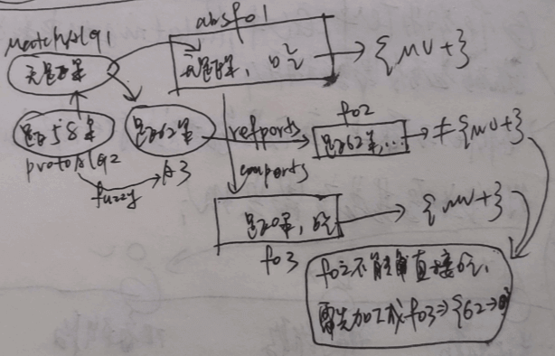

# PM算法
`CreateTime 2020.06.28`

***
## 1. PM算法介绍

　　**名称：** PM是ProtoAlg和MatchAlg的略写，P指外界传入的原始概念，而M指智能体期望得到的概念。

　　**作用：** 而智能体期望得到的M往往与真实得到的P之间，存在一些差异。而有些差异我们又不得不去加工以使其符合当前任务需求。所以PM算法又叫“PM理性评价”。

　　**示例：** 比如：冰箱有食物，那么我们想得到食物M是为了吃，但真实情况是我们从冰箱取得的食物P可能是冰的，吃了会肚子疼，那么我们就需要将其加热。

　　**功能：** 而PM算法就是用来分析出其中的差异，并将需要加工的部分做判断，并提交给行为化去进一步加工的。

　　**前提：** 之所以此次写PM算法，是因为以往在识别算法中使用了fuzzy模糊识别，但模糊识别可能会将错误信息带入进来，这违背了`认知期抽象，决策期具象`的原则，所以将fuzzyAlg算法废弃，并写了PM算法，用来解决其遗留问题导致的决策缺陷。

## 2. 模型
　　如下图：PM算法只是对P的独特特征进行判定，评价其是否应该被加工，如果应该则将结果传出。




## 3. 代码

源码链接：<https://github.com/jiaxiaogang/he4o/blob/master/SMG_NothingIsAll/AIFoundation/AIThinkingControl/Out/AIThinkOutReason.m>

```objective-c
/**
 *  MARK:--------------------理性评价--------------------
 *  @desc
 *      1. 对当前输入帧进行PM理性评价 (稀疏码检查,参考20063);
 *      2. 白话: 当具象要替代抽象时,对其多态性进行检查加工;
 *  @param outModel : 因本文是验证其多态性,所以传入的outModel.cotent即M必须是P的抽象;
 *  @version
 *      2020.07.02: 将outModel的pm相关字段放到方法调用前就处理好 (为了流程控制调用时,已经有完善可用的数据了);
 *  @result moveValueSuccess : 转移到稀疏码行为化了;
 *  @bug
 *      2020.07.05: BUG,在用MatchConF.content找交集同区稀疏码肯定找不到,改为用MatchConA后,ok了;
 *      2020.07.06: 此处M.conPorts,即sameLevelAlg_ps为空,明天查下原因 (因为MC以C做M,C有可能本来就是最具象概念);
 */
-(BOOL) reasonScorePM:(TOAlgModel*)outModel{
    //1. 数据准备
    if (!outModel || !outModel.pm_Fo) return false;
    AIAlgNodeBase *M = [SMGUtils searchNode:outModel.content_p];
    AIFoNodeBase *mMaskFo = outModel.pm_Fo;
    if (!M) return false;
    NSLog(@"\n\n=============================== PM ===============================\nM:%@\nMAtFo:%@",Alg2FStr(M),Fo2FStr(mMaskFo));

    //3. 将理性评价数据存到短时记忆模型;
    NSArray *except_ps = [TOUtils convertPointersFromTOModels:outModel.subModels];
    NSArray *validJustPValues = [SMGUtils removeSub_ps:except_ps parent_ps:outModel.justPValues];
    if (Log4PM) NSLog(@"---> P独特码:%@",Pits2FStr(outModel.justPValues));
    if (Log4PM) NSLog(@"---> 不应期:%@",Pits2FStr(except_ps));
    if (Log4PM) NSLog(@"---> P有效独特码:%@",Pits2FStr(validJustPValues));

    //4. 不用PM评价 (则交由流程控制方法,推动继续决策(跳转下帧/别的);
    if (!ARRISOK(validJustPValues)) return false;

    //5. 取到首个P独特稀疏码 (判断是否需要行为化);
    AIKVPointer *firstJustPValue = ARR_INDEX(validJustPValues, 0);
    NSArray *sameLevelAlg_ps = [SMGUtils convertPointersFromPorts:[AINetUtils conPorts_All:M]];
    BOOL firstPNeedGL = true;
    if (firstJustPValue) {
        //a. 取出首个独特稀疏码,从同层概念中,获取模糊序列 (根据pValue_p对sameLevel_ps排序);
        NSArray *sortAlgs = [ThinkingUtils getFuzzySortWithMaskValue:firstJustPValue fromProto_ps:sameLevelAlg_ps];

        //b. 取模糊最匹配的概念,并取出3条refPorts的时序;
        AIAlgNodeBase *fuzzyAlg = [SMGUtils searchNode:ARR_INDEX(sortAlgs, 0)];
        if (Log4PM && fuzzyAlg) NSLog(@"-> 当前操作:%@ => %@",Pit2FStr(firstJustPValue),Alg2FStr(fuzzyAlg));
        if (fuzzyAlg) {
            NSArray *fuzzyRef_ps = [SMGUtils convertPointersFromPorts:[AINetUtils refPorts_All4Alg:fuzzyAlg]];
            fuzzyRef_ps = ARR_SUB(fuzzyRef_ps, 0, cPM_RefLimit);

            //c. 依次判断refPorts时序的价值,是否与matchFo相符 (只需要有一条相符就行);
            for (AIKVPointer *fuzzyRef_p in fuzzyRef_ps) {
                AIFoNodeBase *fuzzyRef = [SMGUtils searchNode:fuzzyRef_p];

                //d. 同区且同向,则相符;
                BOOL sameIdent = [outModel.pm_MVAT isEqualToString:fuzzyRef.cmvNode_p.algsType];
                CGFloat fuzzyRefScore = [ThinkingUtils getScoreForce:fuzzyRef.cmvNode_p ratio:1.0f];
                if (fuzzyRef && sameIdent && [ThinkingUtils sameOfScore1:fuzzyRefScore score2:outModel.pm_Score]) {
                    firstPNeedGL = false;
                    break;
                }
            }
        }
    }else{
        firstPNeedGL = false;
    }

    if (!firstPNeedGL) {
        //6. 不需要处理时,直接Finish,转至决策流程控制方法 (注:在TOValueModel构造方法中: proto中的value,就是subValue);
        if (Log4PM) NSLog(@"-> 无需PM,转至流程控制Finish");
        TOValueModel *toValueModel = [TOValueModel newWithSValue:firstJustPValue pValue:nil group:outModel];
        toValueModel.status = TOModelStatus_Finish;
        [self singleLoopBackWithFinishModel:toValueModel];
        return true;
    }

    //7. 转至_GL行为化->从matchFo.conPorts中找稳定的价值指向;
    NSMutableArray *matchConF_ps = [SMGUtils convertPointersFromPorts:[AINetUtils conPorts_All:mMaskFo]];
    [matchConF_ps addObject:mMaskFo.pointer];//(像MC传过来的,mMaskFo为C所在的时序,有可能本身就是最具象节点,或包含了距0的果);

    //8. 依次判断conPorts是否包含"同区稀疏码" (只需要找到一条相符即可);
    for (AIKVPointer *matchConF_p in matchConF_ps) {
        //9. 找到含同区稀疏码的con时序;
        AIFoNodeBase *matchConF = [SMGUtils searchNode:matchConF_p];

        //9. 找到含同区稀疏码的con概念;
        AIKVPointer *matchConA_p = ARR_INDEX([SMGUtils filterSame_ps:sameLevelAlg_ps parent_ps:matchConF.content_ps], 0);
        AIAlgNodeBase *matchConA = [SMGUtils searchNode:matchConA_p];
        if (!matchConA) continue;

        //9. 找到同区稀疏码的glValue;
        AIKVPointer *glValue4M = [SMGUtils filterSameIdentifier_p:firstJustPValue b_ps:matchConA.content_ps];

        //10. 价值稳定,则转_GL行为化 (找到一条即可,因为此处只管转移,后面的逻辑由流程控制方法负责);
        BOOL sameIdent = [outModel.pm_MVAT isEqualToString:matchConF.cmvNode_p.algsType];
        CGFloat matchConScore = [ThinkingUtils getScoreForce:matchConF.cmvNode_p ratio:1.0f];
        if (glValue4M && sameIdent && [ThinkingUtils sameOfScore1:matchConScore score2:outModel.pm_Score]) {
            if (Log4PM) NSLog(@"-> 操作 Success:(%@->%@)",Pit2FStr(firstJustPValue),Pit2FStr(glValue4M));
            TOValueModel *toValueModel = [TOValueModel newWithSValue:firstJustPValue pValue:glValue4M group:outModel];
            outModel.sp_P = M;
            [self singleLoopBackWithBegin:toValueModel];
            return true;
        }
    }

    //11. 未找到GL的目标 (如距离0),直接计为失败;
    if (Log4PM) NSLog(@"-> 未找到GL目标,转至流程控制Failure");
    TOValueModel *toValueModel = [TOValueModel newWithSValue:firstJustPValue pValue:nil group:outModel];
    toValueModel.status = TOModelStatus_ActNo;
    [self singleLoopBackWithFailureModel:toValueModel];
    return true;
}
```
