# 小鸟生存演示 & 势

> 演示步骤 >>
> 1. 讲一只乌鸦带给我们的启示原文
> 2. 讲小鼠,小鸟与人类大脑的结构相似
> 3. 讲he4o在"小鸟生存演示"的实现

<!-- TOC depthFrom:1 depthTo:6 withLinks:1 updateOnSave:1 orderedList:0 -->

- [小鸟生存演示 & 势](#%E5%B0%8F%E9%B8%9F%E7%94%9F%E5%AD%98%E6%BC%94%E7%A4%BA--%E5%8A%BF)
	- [n15p1 小鸟生存](#n15p1-%E5%B0%8F%E9%B8%9F%E7%94%9F%E5%AD%98)
	- [n15p2 小鸟生存演示的实践细节点](#n15p2-%E5%B0%8F%E9%B8%9F%E7%94%9F%E5%AD%98%E6%BC%94%E7%A4%BA%E7%9A%84%E5%AE%9E%E8%B7%B5%E7%BB%86%E8%8A%82%E7%82%B9)
	- [n15p3 生存期场景搭建](#n15p3-%E7%94%9F%E5%AD%98%E6%9C%9F%E5%9C%BA%E6%99%AF%E6%90%AD%E5%BB%BA)
	- [n15p4 成长期之进食](#n15p4-%E6%88%90%E9%95%BF%E6%9C%9F%E4%B9%8B%E8%BF%9B%E9%A3%9F)
	- [n15p5 视觉算法](#n15p5-%E8%A7%86%E8%A7%89%E7%AE%97%E6%B3%95)
	- [n15p6 二次开发2 (吃)](#n15p6-%E4%BA%8C%E6%AC%A1%E5%BC%80%E5%8F%912-%E5%90%83)
	- [n15p7 二次开发3 (飞)](#n15p7-%E4%BA%8C%E6%AC%A1%E5%BC%80%E5%8F%913-%E9%A3%9E)
	- [n15p8 重构认知循环 (MIL)](#n15p8-%E9%87%8D%E6%9E%84%E8%AE%A4%E7%9F%A5%E5%BE%AA%E7%8E%AF-mil)
	- [n15p9 AlgNode前_算法结果(algsArr)的迭代](#n15p9-algnode%E5%89%8D_%E7%AE%97%E6%B3%95%E7%BB%93%E6%9E%9Calgsarr%E7%9A%84%E8%BF%AD%E4%BB%A3)
	- [n15p10 AlgNode中_神经网络(新)](#n15p10-algnode%E4%B8%AD_%E7%A5%9E%E7%BB%8F%E7%BD%91%E7%BB%9C%E6%96%B0)
	- [n15p11 AlgNode后_索引迭代 `reference入网/algNode替代reference`](#n15p11-algnode%E5%90%8E_%E7%B4%A2%E5%BC%95%E8%BF%AD%E4%BB%A3-reference%E5%85%A5%E7%BD%91algnode%E6%9B%BF%E4%BB%A3reference)
	- [n15p12 使用AlgNode构建归纳抽具象网络](#n15p12-%E4%BD%BF%E7%94%A8algnode%E6%9E%84%E5%BB%BA%E5%BD%92%E7%BA%B3%E6%8A%BD%E5%85%B7%E8%B1%A1%E7%BD%91%E7%BB%9C)
	- [n15p13 继续接入小鸟大脑](#n15p13-%E7%BB%A7%E7%BB%AD%E6%8E%A5%E5%85%A5%E5%B0%8F%E9%B8%9F%E5%A4%A7%E8%84%91)
	- [n15p14 自动训练机 & 联想的相对 & 小脑网络](#n15p14-%E8%87%AA%E5%8A%A8%E8%AE%AD%E7%BB%83%E6%9C%BA--%E8%81%94%E6%83%B3%E7%9A%84%E7%9B%B8%E5%AF%B9--%E5%B0%8F%E8%84%91%E7%BD%91%E7%BB%9C)
	- [n15p15 决策的迭代](#n15p15-%E5%86%B3%E7%AD%96%E7%9A%84%E8%BF%AD%E4%BB%A3)
	- [n15p16 决策的迭代之祖母与时序的协作代码实践](#n15p16-%E5%86%B3%E7%AD%96%E7%9A%84%E8%BF%AD%E4%BB%A3%E4%B9%8B%E7%A5%96%E6%AF%8D%E4%B8%8E%E6%97%B6%E5%BA%8F%E7%9A%84%E5%8D%8F%E4%BD%9C%E4%BB%A3%E7%A0%81%E5%AE%9E%E8%B7%B5)
	- [n15p17 决策后的外层循环](#n15p17-%E5%86%B3%E7%AD%96%E5%90%8E%E7%9A%84%E5%A4%96%E5%B1%82%E5%BE%AA%E7%8E%AF)
	- [n15p18 迭代网络`内类比`](#n15p18-%E8%BF%AD%E4%BB%A3%E7%BD%91%E7%BB%9C%E5%86%85%E7%B1%BB%E6%AF%94)
	- [n15p18 内类比的构建与使用](#n15p18-%E5%86%85%E7%B1%BB%E6%AF%94%E7%9A%84%E6%9E%84%E5%BB%BA%E4%B8%8E%E4%BD%BF%E7%94%A8)
	- [ToDoList](#todolist)

<!-- /TOC -->


<br><br><br><br><br>


## n15p1 小鸟生存
`CreateTime 2018.10.22`


| “小鸟生存演示”的简要说明：>> |
| --- |
| 1. 有一位纽约大学的教授，他每天下班路过一条路。 |
| 2. 然后路边有一些坚果树，树长大了，开始结果子。 |
| 3. 有一天来了几只乌鸦。 |
| 4. 乌鸦把路边有破壳的坚果肉吃了。 |
| 5. 再有一次下班，他看到乌鸦停在十字路口的电线上，把坚果扔在路上。 |
| 6. 等红灯的时候，乌鸦就下来吃被汽车压破的坚果肉。 |
|  |
| > 这是一个真实的故事，小鸟表现出了认知、学习、思考、分析、联想、需求、决策与行动等等智能体现。同时这位教授说：目前AI七十年来，全球范围内所有的科学家学者等，无人能解此题。所以他写了一篇文章：呼吁大家，来搞一个乌鸦启示的演示程序，用真正的AGI角度来解决这个问题。 |

<br>

| 简介 >> |
| --- |
| 以小鸟生存为例,设计一个类似而适用于he的演示示例; |
| 体现出he完全自主的智能。感知、认知、推理、学习、和执行; |
| 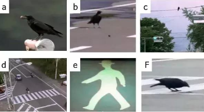 |

<br>

| 拆解思考 >> |  | status |
| --- | --- | --- |
| 1 | 食物欲望 | true |
| 2 | 无法直接获取食物 |  |
| 3 | 观察可获取的间接方式 |  |
| 4 | 间接方式导致危险 |  |
| 5 | 对危险的恐惧及避开方式 |  |
| 6 | 难点在于,乌鸦仅有一条生命,一次机会 |  |
| 7 | 后天对于撞击的疼痛,产生恐惧 (与一定相对速度物体撞击的距离感知,产生恐惧mv) |  |
| 8 | 乌鸦对于撞击的预测 |  |

<br>

| 代码实现 >> |  |
| --- | --- |
| 1 | 以游戏的方式来达成智能演示 |
| 2 | 乌鸦学会移动自己 (速度min-max) |
| 3 | 乌鸦对游戏场景的信息输入 (伪视觉) |
| 4 | 对场景中移动物体的视觉算法处理 |


<br><br><br><br><br>


## n15p2 小鸟生存演示的实践细节点
`CreateTime 2018.11.08`

| 成长期步骤 >> |  |
| --- | --- |
| 1 | 学习进食 |
| 2 | 学习飞行 |
| 3 | 学习碰撞疼痛 |
| 4 | ... |

<br>

| 生存期 >> |  |
| --- | --- |
| 1 | 看到坚果 |
| 2 | 看到公路 |
| 3 | 看到车辆 |
| 4 | 看到信号灯 |
| 5 | 看到车辆的行驶停止 |
| 6 | 看到车辆碾压坚果 |

<br>

| 其它 >> |  |
| --- | --- |
| 1_注意 | he4o并不具备独立成熟的小脑网络,所以小鸟要尽量依赖思考,不要依赖行动 |
| 2_难点 | he4o在"mv基本模型"中,对于时间间隔的信息是不够的,是否添加上? (曾这么做过) |
| 3_难点 | speed信息的变化->对应mv疼痛的变化; 此时信息变化不再是单独的值,而是抽象成方向; |


<br><br><br><br><br>


## n15p3 生存期场景搭建
`CreateTime 2018.11.12`

| 示图 >> |
| --- |
|  |
| 1. 汽车从左向右行驶在道路上; |
| 2. 红灯停,绿灯行; |
| 3. 坚果树向下掉落带壳坚果; |
| 4. 掉到公路上的坚果,会被汽车压掉壳; |


<br><br><br><br><br>


## n15p4 成长期之进食
`CreateTime 2018.11.13`

|  |
| --- |
| 1. 设置投喂按钮,用户做为鸟妈妈投食; |
| 2. 小鸟在吃的时候看到坚果,并吃掉坚果; |

| 示图 >> |
| --- |
|  |
| 1. 直投负责将食物直接喂食给小鸟; |
| 2. 乱投负责将食物投到指定位置; |
| 3. 小鸟在此场景内,需要学会进食、飞行、撞击的疼痛感。 |


<br><br><br><br><br>


## n15p5 视觉算法
`CreateTime 2018.11.13`

| 简介 >> |
| --- |
| 在本演示中,小鸟采用伪视觉 |
| 小鸟可以看到二维场景中的几个物体,如Car,Load,Food,Light |

<br>

| 视觉算法 >> |  |  | desc |
| --- | --- | --- | --- |
| 1 | 大小 | size |  |
| 2 | 颜色 | color |  |
| 3 | 形状(圆角) | radius |  |
| 4 | 相对位置 | origin | 视觉对象的位置,是相对小鸟而言的 |
| 5 | 相对速度 | speed | 视觉对象的速度,是相对小鸟而言的;速度由两桢位置算出 |


<br><br><br><br><br>


## n15p6 二次开发2 (吃)
`CreateTime 2018.11.16`

| 开发过程 (视觉) >> |  |  |
| --- | --- | --- |
| 1 | 为小鸟创建场景 |  |
| 2 | 为小鸟创建输出反射 | 如:飞行,吸吮反射 |
| 3 | 为小鸟创建信号输入 | 如:视觉等 |
| 4 | 扩展视觉算法 | size,color,radius,origin,speed等 |
| 5 | 扩展视觉算法结果模型 |  |
| 6 | 将算法结果生成模型,并传递给input |  |

<br>

| 开发过程 (学吃飞) >> |  |
| --- | --- |
| 1 | 以某条件触发先天反射,做出最简单的反应; (如吸吮,扇翅膀) |
| 2 | 将反射后,导致的结果信号传回给he; |
| 3 | he自己从中学会吃或飞的抽象; |
| 4 | he通过主动的方式来吃或飞; |

<br>

| QuestionTemplete 1 >> |  |
| --- | --- |
| 问题场景: | 在birdView下写了eat();并让growPage投喂后调用bird.eat(); |
| 问题描述: | 此处需要把吃掉的信号传达给he,否则he是无法理解吃的; |
| 问题分析: | 以代码调用的方式是错误的,此处虽然写了eat方法,但eat并不能代劳,eat这件事必须让he自己来做; |
| 解决思路: | 让he以吸吮反射的方式,去主动吃;并将out入网,以抽象出"吃"的节点; |
| 解决方式: |  |
|  | 1. 在eat()中以某种刺激来引发he的反射; |
|  | 2. 反射后开吃 (he主动调用eat()); |
|  | 3. eat()中, 销毁food,并将产生的mv传回给he; |
| 代码步骤: |  |
|  | 1. 定义一个reactorIdentifier反射标识 (作dS后辍,构建到网络中) |
|  | 2. 调用ReactorControl.commitReactor(),选择性传入runBlock |
|  | 3. 或使用output.delegate = self; (参考代码段A) |
|  | 4. 在回调中,判断reactorId,并做出相应肢体反应; |
| 代码步骤(重构后): |  |
|  | 1. 定义一个rds作为dataSource标识入网 (如下:EAT_RDS) |
|  | 2. 调用ReactorControl.commitReactor() |
|  | 3. 接收广播,并做出相应肢体反应; (参考代码段B) | |

```objective-c
//代码段A
// #define EAT_REACTORID @"eatReactorId" //吸吮反射标识
// [Output sharedInstance].delegate = self;
//
// /**
//  *  MARK:--------------------OutputDelegate--------------------
//  */
// -(void)output_Reactor:(NSString *)reactorId paramNum:(NSNumber *)paramNum{
//     if ([EAT_REACTORID isEqualToString:reactorId]) {
// 			NSLog(@"反射执行");
// 		}
// }
```

```objective-c
//代码段B
// #define EAT_RDS @"EAT_RDS" //吸吮反射标识
//
// //MARK:===============================================================
// //MARK:                     < outputObserver >
// //MARK:===============================================================
// -(void) outputObserver:(NSNotification*)notification{
//     if (notification) {
//         //1. 取数据
//         NSDictionary *obj = DICTOOK(notification.object);
//         NSString *rds = STRTOOK([obj objectForKey:@"rds"]);
//         NSNumber *paramNum = NUMTOOK([obj objectForKey:@"paramNum"]);
//
//         //2. 吸吮反射
//         if ([EAT_RDS isEqualToString:rds]) {
//             [self eat:[paramNum floatValue]];
//         }
//     }
// }
```


<br><br><br><br><br>


## n15p7 二次开发3 (飞)
`CreateTime 2018.11.27`

| 接上 >> | (n15p6二次开发2) |
| --- | --- |
| 1 | 小鸟可以根据`扇翅膀`反射,来学会主动飞行 |
| 2 | 以此可以解决小鸟的`移动`,`与坚果距离`,`与汽车相对速度`,`坚果搬运`等问题 |

<br>

| toDoList >> |  | status |
| --- | --- | --- |
| 1 | 测试小鸟可以根据`视觉`等信息来做,能吃到与否的原因分析;(`距离`或`坚果状态`) |  |

<br>

| 瞬时记忆优化 >> |  |  |
| --- | --- | --- |
| Q1 | TC对algsModel的应对量 `小鸟视觉算法出量大的问题` |  |
|  | 1. 增加瞬时记忆序列长度,则性能下降; | 与长度无关 |
|  | 2. 减少瞬时记忆序列长度,则认知基础下降; | 与长度无关 |
| A1 | 在保证序列长度8的同时,增加信息处理的组; |  |
|  | 由mv为始,向前8个,发现有组,则组为1个长度 | 是祖母组,而不是时序组 |
|  | 即7个+1组=8 `长度不变` |  |
|  | 以此类推,来推进认知的更广与更深 |  |
| 参考 | 代码段:以组替分; |  |

<br>

```c
//以组替分 >>
//因algsArr.lengeh > 8;
//所以,需要对algsArr中的元素,进行实时的联想,并将已抽象的微信息取回,来以组替分;
//TODOTMR: (2,5) 以组替分
//1. convert2Pointer; (已经ok)
//2. checkConvertAbsPointer; (节约瞬时记忆占用长度,同时为认知升级提供部分支撑)
//3. assData; (对dataIn_AssociativeData()方法进行拆分重构;先不搞)
//4. assMv; (对dataIn_AssociativeData()方法进行拆分重构;先不搞)
//5. ThinkingUtils.analogyOrdersA()方法,扩展对"微信息"信息本身的类比,而非只是pointer;

```


<br><br><br><br><br>


## n15p8 重构认知循环 (MIL)
`CreateTime 2018.12.03`


| 方案1:分层 >> |
| --- |
| 1. 第一层 (数据量大,到网络识别后,转化为节点,并存为瞬时记忆的item) |
| 2. 第二层 (第一层与第二层,是否分开?) |
| 3. 如果分开? 那么第二层其实就是瞬时记忆层; |
| 4. 如果不分开? 那么美女是否导致像素点变灰? |

<br>

| 方案2:不限 >> |  |
| --- | --- |
|  | 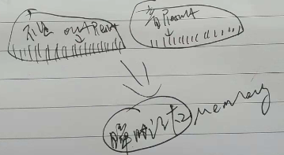 |
| 1 | 放开算法带宽的控制 (由8条改为不限) |
| 2 | 放开瞬时记忆由8条以内存容量和时间限制 (时间用redis自动,容量以后再限) |
| 问题: | 如果瞬时记忆不限条,导致的性能问题? |
| 难点1 | 一切祖母节点,终将回归网络才有意义,所以无法独立取出来限制条数; |
| 矛盾1 | 想限制条数,但又无法独立出网络的去限制; |
| 难点2 | 算法result数据的快速收敛过程; |
| 矛盾2 | 收敛而保留有用信息; |
| 难点3 | 保证收敛前,根据一堆微信息检索到足够正确的祖母节点 |
|  | 再以此祖母节点,进行mv,而不是微信息直接到mv; |

<br>

| 方案3:不变 >> |  |
| --- | --- |
| 现状 | 因为对"算法值"数据,并不支持并行类比; |
| 现状 | input输出的数据是巨量的,但"算法值"却是有限的 |
| 单次联想的索引 | 联合索引,模糊索引 |
| 联合索引实例 | 花生的形状联想到蝴蝶结 (`对称` `双` `曲线`) |
| 模糊索引 | 暂不支持,或此命题不成立; (`因为一切模糊到微观总是确定的,而索引正是在处理微观`) |
| 索引的现状 | 目前"算法值"是单一的 (`没有一堆值,作为同一结果`) |
| 索引现状导致的问题 | 目前无需使用联合索引,但单值索引,运行方式上是相通的 |
|  |  |
| 多次联想的协作 | 明明有多个索引,为什么要for一个个来呢 |
| 多次协作举例 | 花生形状指向`花生`和`蝴蝶结`,但再联想花生颜色则结果明确指向花生 |
| 多次协作代码 | dataIn_AssociativeData(arr){for in arr;} |
| toDo | 将`算法值`位宽扩到16 |
| toDo | 在认知函数`dataIn_AssociativeData()`中,写多次联想协作支持 |

| 算法结果的多次协作 >> | 转n15p9 |
| --- | --- |
| 1 | algsArr的多个元素,同在一组; `先天一` |
| 2 | algsArr组会构建到网络中; `后天一` |
| 举例 | 颜色不止是色值,也不止是视觉的颜色,而是某个algsArr组节点的颜色 |
| 说明 | 只有有了组的概念后,才能有多次联想的协作; |
| 思考 | algsArr组,能否作为瞬时记忆的一个元素存在? |
|  |  |


<br><br><br><br><br>


## n15p9 AlgNode前_算法结果(algsArr)的迭代
`CreateTime 2018.12.06`

| 简介 >> |
| --- |
| 1. 在视觉算法实践中,发现以往内核不支持的一些点,进行迭代支持; |
| 2. 如:`单个算法结果,到一组算法结果;` `在mv基本模型之前,便支持的网络结构` `不依赖类比构建的抽具象模型` |

| 步骤 >> |  |
| --- | --- |
|  |  |
| 1 | algsArr中元素进行装索引,各生成抽象节点; |
| 2 | 再根据algsArr生成的所有抽象节点,打包生成具象节点 (算法结果组节点); |

| 开发步骤 >> |  |
| --- | --- |
| 1 | 复用原来的AbsNode和Node类 (或在基础上改一个无cmv_p的node出来 ) |
|  | 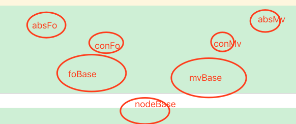 |
|  |  |
| Q1 | absAlgNode去重问题? (absAlgsNode的复用问题) |
| A1 |  |


```c
//algNode & absAlgNode伪代码;
absAlgNode {
	pointer;
	conPorts;
	value_p;//算法结果的微信息
}

algNode {
	pointer;
	absPorts;
	values_p;
}
```


<br><br><br><br><br>


## n15p10 AlgNode中_神经网络(新)
`CreateTime 2018.12.10`

> 注: algTypeNode表示:(algNode&absAlgNode)
>
> 注: foTypeNode表示:(foNode&absFoNode)

| 大脑网络 >> |
| --- |
| 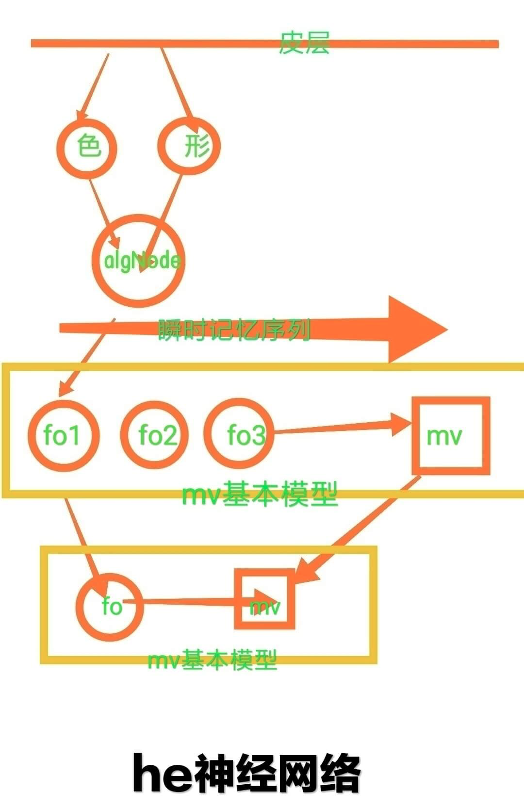 |
| 问题1: algTypeNode是否可以和foTypeNode构建到一个索引序列? |
| 1. algTypeNode不需要像foTypeNode那样灵活的类比抽象 |
| 2. algTypeNode相对先天些,foTypeNode相对后天些; `如颜色的后天概念和先天视觉色` |
| 注: 整个过程,更加完善的认知循环 |

| 相似物体的判定 >> |  |
| --- | --- |
| 1 | 算法上有相似性的物体,会有着共同的抽象,但它们未必是同一物体; |
| 2 | 举例: 流水线,汽车进去,出来苹果,人们会以为汽车变成了苹果; |
| 3 | 演示中例子: `带皮和不带皮的坚果;` `绿信号灯和红信号灯;` |
| 4 | 结论: 相似物品只能当两个algNode来处理,但absAlgNode的抽象共同点也是存在的; |

<br>

| 小脑网络 >> |  |
| --- | --- |
| 结构 | 非时序的组合输出网络 |
| 使用 | 大脑时序调用小脑 |

<br>

| conAlgNode模型 >> |
| --- |
|  |


<br><br><br><br><br>


## n15p11 AlgNode后_索引迭代 `reference入网/algNode替代reference`
`CreateTime 2018.12.18`

|  |
| --- |
| 1. 不再需要reference |
| 2. 需要将pointer序列和强度序列,写到node中 |
| 3. 引用序列入网的意义:`结构化相对序列的优势` `防止大量的组微信息以网络中匹配适可而止来优化io性能` `对多个皮层算法协同时结果的保真` |
| 注: 更加完善的`组分循环`; (algNode组,fo分) |
| 例: 吃发红的水果会饱; `什么是吃?(时序)发红?(absAlgNode类比再具象)的水果?(..)会饱?(mv基本模型)` |
|  |
|  |

<br>

| assData迭代 >> |  |
| --- | --- |
| 旧模型 |  |
|  | 1. 旧模型的引用序列,对assData联想起到重要作用;(取前两个) |
| 新模型 |  |
|  | 问题:参数问题A |

| 问题A >> |  |
| --- | --- |
| 发现问题: | 新模型下的assData如何完成识别联想过程? |
|  | 看到的algNode具象节点后,联想到后天祖母节点; |
| 收集信息: |  |
|  | 1. 以algNode为索引进行联想; |
|  | 2. 联想中以absAlgNode为依据;在网络中点亮与此符合的目标祖母节点; |
|  | 3. 但有时,多次或不同分区信息组成一个祖母细胞。 |
| 思考本质: |  |
|  | 在于algNode的不灵活,与祖母细胞的灵活问题 |
|  | 所以这应该是一个algNode的灵活化,后天化问题 |
| 解决方案: |  |
|  | 1. 去掉algNode，因为未定义前，它没意义。 |
|  | 2. 不删algNode,而是改进，支持后天思考联想到。algNode就是祖母细胞。 |
|  | 3. algNode去重的思路用于联想匹配问题。 |
| 解决步骤: | 把方案工程可实现化的思考 |
| 代码步骤: | 把工程步骤与系统架构进行整合思考 |
| 代码实践: | 把代码写出来 |

|  |
| --- |
| 1. 左侧为alg区模型 |
| 2. 右侧为fo区模型 |
| 3. 把alg区适当中止,并交付给fo区进行处理;例如`发现mv后联想,类比,抽象` |
| 4. 决定: 祖母抽象还在fo区完成; |
| 注Q: 为什么说吃`抽象水果`,而不是吃`抽象颜色`? |
| 注A: fo中抽象出水果,是在时序中的,而颜色仅在alg区作为抽象指向存在;只能表示`是`; |

<br>

| toDoList >> | status |
| --- | --- |
| 1. 写convertAlgTypeNode() | T |
| 2. 使dataIn_AssociativeData()中的assData&assMv支持algTypeNode; | T |
| 3. ThinkingUtils.analogyOrdersA(),扩展"微信息"类比,而非只pointer;`支持类比构建新conAlgNode` `而非只absFoNode` `参考algNode演化图` | T |
| 4. 单组临时存在,并在处理后,丢失一些细节; (将指向明确的,进行存瞬时记忆为一组); | 以algTypeNode的方式不会丢失细节,瞬时记忆存conAlgNode |
| 5. `-(void) dataIn:(NSObject*)algsModel`装箱后,对algNode改动支持 | T |
| 6. 写dataIn_ConvertAlgNode(); | T |
| 7. conAlgNode不直接指向"索引中微信息",而是依赖absPorts中的absAlgNode来取信息; | T(删除conAlgNode.values_p) |
| 8. 联想algNode_p的引用而不是取algsArr的reference序列; | T |
| 9. 将conFo的微信息get&set Reference重构为order中使用algNode_p | T |
| 10. 将absFo的组微信息也改用order中algNode_p; | T |
| 11. ThinkingUtils.analogyOrdersA的两个block;`判断能量值&构建祖母` | T |

| AlgNode演化图 >> |
| --- |
| 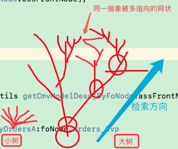 |
| 1. 树叶为absAlgNode |
| 2. 树干为conAlgNode |
| 3. 树叶为后天类比后动态形成的algNode |


<br><br><br><br><br>


## n15p12 使用AlgNode构建归纳抽具象网络
`CreateTime 2018.12.28`

| TODOLIST >> |  |  |
| --- | --- | --- |
| 1 | 把单信息的absAlgNode删除,conAlgNode中改用value_ps | T |
| 2 | 在AIPort中加header字段,以{value_pId1+value_pId2...}来组成 | T`md5` |
| 3 | 如何知道algA或algB是否已经有了匹配algSames的抽象节点; | T(用header) |
| 4 | 存单header序列,还是将header存在每一个absPort里; | T(存每个port) |
| 5 | 在netUtils中写convertValue_psToHeader(){value_ps2str2md5;} | T |
| 6 | createAbsAlgNode & AIAbsManager.create 重构相同逻辑部分 |  |

<br>

| algNode网络的必要性 >> |
| --- |
| 1. reference迭代为algNode静态信息网络的方式是有必要的,因为序列越来越大,会远超1G |
| 2. algNode间的关系并非单模型`注:node是单模型`,所以带强度关联的网络化是必要的; |

<br>

| 新网络与TC的交互 >> |
| --- |
| 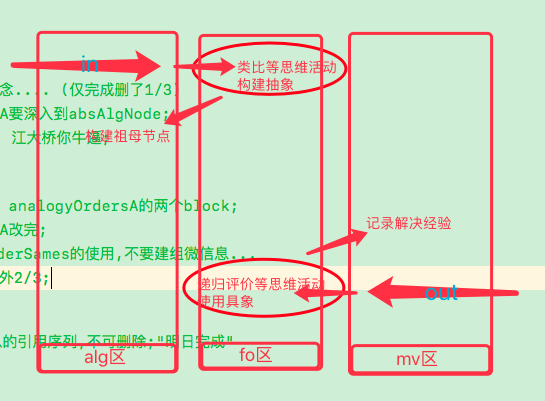 |
| 1. 合适使用循环与更加活跃的思维,可以在内心构建更加丰富的祖母细胞与解决问题的方案思考; |

<br>

| 识别祖母 >> |  |
| --- | --- |
| 1. 绝对匹配 | `认出苹果` 依header作绝对匹配; |
| 2. 局部匹配 | `蛇咬怕绳` 依引用强度前3,做最大计数匹配; |
| 另: 适当模糊范围 | 使其可匹配 `如:男认1种红色,与女认n种红色` `如:陌生人是人类` `a=9,b=2,c=10->a更接近模糊=c` |
|  | `在value层模糊%5 (先天,性能优化避免频繁构建变化相关节点) 且 在algNode层模糊%10 (后天:后天训练,网络结构决定)` |


<br><br><br><br><br>


## n15p13 继续接入小鸟大脑
`CreateTime 2019.01.07`

| QA >> |  |  |
| --- | --- | --- |
| Q1 | output的微信息是否要装到algNode再被fo引用;`90%应该被装到alg` |  |
| A1 | 应该使用algNode,因为如"eat"是祖母输出; | 已完成 |
|  |  |  |
| Q2 | 耳朵声音输入,与嘴巴发音,或钢琴发音的输出学习; |  |
| A2 | 对于输出的不断修正,以将输出时的一系列参数,记录到小脑网络; | 暂不做 |

<br>

| 明日计划 >> |
| --- |
| 1. 通过非近身投喂,小鸟视觉看到坚果,并联想到吃; |
| 2. 通过虚拟饿的按钮来,设立需求,并决策到吃坚果的执行方案; |
| 3. 通过虚拟刺激按钮,来触发扇翅膀反射,并学习主动飞行对于相对距离的影响; `距离微信息的值大小对比` |
| 4. 通过飞行来解决移动到食物; |
| 5. 并且根据决策行为主动吃掉; |
| 注: `扇翅膀反射`使用类似人类`抓握反射`的机制来触发; |
|  |
| 1. 小鸟在飞行过程中对于其它物体的碰撞,产生疼痛,并且以此来影响到飞行决策行为; |
| 2. 我们要做:`模拟物理碰撞` `扩展疼痛值mv` |

<br>

| BUG >> | STATUS |
| --- | --- |
| 1. mv的抽象未指定header; |  |
| 2. mv的抽象默认strong = 0; |  |
| 3. conMVNode.strong很轻易达到19;而absMVNode则达到38; |  |


<br><br><br><br><br>


## n15p14 自动训练机 & 联想的相对 & 小脑网络
`CreateTime 2019.01.18` `暂时不做`

| 自动训练机 >> |
| --- |
| 1. 类似脚本的步骤; |
| 2. 一步步,调用小鸟演示的某方法; |
| 3. 一步步,打出执行日志; |
| 4. 递归执行; (回调执行或延时下一步) |

| 单步训练模型 >> |
| --- |
| 1. 类名,方法名,参数,延时,日志; |
| 2. 执行,返回值; |

<br>

| 联想的相对 >> |  |
| --- | --- |
| **方案一** | 意识流方案 `投票:20%` |
| 1 | 代码为:`一个时间序列` |
| 2 | 销毁策略为:`时间密度 & 容量限制` |
| 3 | 使用原则: `不可穿透到硬盘操作` |
| 4 | 采用缓存组件: `依然使用xgRedis` |
| 5 | 使用方式: `联想时,先进行意识流联想,后进行net联想` |
|  |  |
| **方案二** | 双序列方案 `投票:80%` |
| 1 | 一个强度积累序列 `强度序列`,一个更新时间序列 `时间序列` |
| 2 | 关于强度序列与时间序列,综合排名的问题,`本质上是中和问题` |

<br>

| 小脑网络 >> |  |
| --- | --- |
| 1 | 猜想: 小脑网络可能是仅有时序,而没有mv的网络 |
| 2 | 所以,小脑部分是脱离了意识的; |
| 3 | 小脑部分,仅有fo的根部,连接到了大脑的`mv基本模型`; |
| 4 | 所以,大脑可以控制小脑进行主动输出,但对小脑的细节,却无法知悉; |


<br><br><br><br><br>


## n15p15 决策的迭代
`CreateTime 2019.01.19`

```c
# 调试步骤:
	马上饿->需求->空吃->根据fo知道自己差坚果->
	乱投坚果->吃需求(状态饿)->空吃->根据fo类比发现,坚果距离过远->
	摸翅膀->飞行->视觉发现坚果距离变化->主动飞行->发现飞行与距离变化的规律->

# 发现问题:
	1. `直投`->吸吮反射->吃->学会吃->`马上饿`->需求->空吃-> (没吃到的原因:没坚果)
	2. 乱投->空吃(不是不该吃,而是没吃到)->(分析没吃到的原因:太远)

# 收集信息:
	1. 吃坚果fo (坚果,吃)
	2. 没吃到fo (远坚果,吃)
	3. 没的吃fo (吃)
	例: "吃坚果fo" 类比 "没吃到fo" 需要得到距离delta的问题;(或只需要大于小于)
	例: "吃坚果fo" 类比 "没的吃fo" 需要得到缺条件坚果的问题;

//A1: 瞬时记忆处理逻辑的迭代
//Q1: 90%不需要迭代

//A2: `in类比sames` 与 `out类比sub(缺什么/渗透到algNode和微信息)`;
//Q2: 把决策中foOrder的类比出 `缺的条件与行为`; (随后写)

//A3: 在可预测的行为执行中(如正在飞行去坚果处),此时的mvCache状态如何处理;
//Q3: 预测本质上就是mv基本模型,给行为方案一个状态,来挂起mvCache;

//A4: mvCacheManager是否仅存一条需求;
//Q4: 先做挂起,然后逐步完善为仅存一条; (实时删,实时加)

//A5: TC295行updateCMVCache(),在mvCache有饿的需求时,乱投坚果,导致望梅止渴的bug;
//Q5: 先判断条件满足,只需要输出行为,即输出行为,然后可去掉此mvCache;

//A6: TC525行调用dataOut_TryOut()返回值,对mv无效时的判定及处理;
//Q6: 无法直接判定,可走预测方式,参见问题3;
```

| TODOLIST >> | STATUS |
| --- | --- |
| 1. 关于微信息大小的对比; `a对比b=delta` |  |
| 2. out类比sub() `参考A2` | 转变为alg的diff问题,再转变为ass具象问题 |
| 3. 可预测行为执行中,对mvCache进行挂起; |  |
| 4. 每次mvCache挂起时,我们仅需要对小脑输出进行处理 |  |
| 5. `微信息A=5`->`out_p飞行`->`微信息A=6`,因输出而A5变A6如何建索引; | `以学习解决决策问题,参考占位规律;` |
| 6. 决策中,动静态网络的支持; | T |

<br>

| 占位规律 >> |
| --- |
| 1. 抽象时不可丢失数据完整性; `如:吃苹果 与 吃水果` `如: 距离5 与 距离{x}` |
| 2. 在原先的analogyOrdersA()上改,原先mv反方向的不得作为assFoNode进行类比 |
|  |
| 示例: abcde3 类比 abcde8 得出最后一位3与8不一样的占位规律; (不同) |
| 示例: 1abcdef 类比 1hijklm 得出第一位都是1的sames规律; (相同) |
|  |
| 回归小鸟示例: `坚果A距离`与`坚果B距离`->抽象出`坚果{距离}` |
| 回归小鸟示例: `坚果{x}距离`与`汽车A距离`->抽象出`{物体}{距离}` |
| 示例: a{距离} 类比 b{距离} 得出距离前不一样的占位规律; (不同) |
|  |
| **>> 找相同 与 找不同 的矛盾问题 >>** |
| 1. 构建时->更准确->动态找相同sames->面向fo时序 |
| 2. 使用时->不丢失关键细节->静态找不同diff->面向alg祖母 |
| 注: 此处矛盾不存在,只需要找sames即可,diff可通过联想具象来解决; |
| 注: 对于如何找两个祖母的diff,两者有可能为纵向关联,或横向同一层等等; |

| 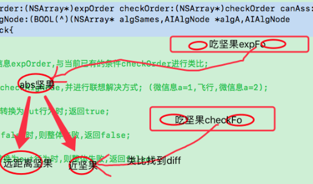 |
| --- |

|  |
| --- |

<br>

| 迭代决策架构 >> | 优先方向 | 命名 |
| --- | --- | --- |
| 1. 经验方案找mv,以方向来强度序列找 | 抽象优先 | mvScheme |
| 2. 解决方案找foNode时,可以在抽象中找 | 抽象优先 | foScheme |
| 3. 执行方案找祖母条件,要找出差什么条件,并转化成行为方案来解决 | 具象优先 | algScheme |
| 4. 行为方案,难点在于执行后,产生变化的信息被再次输入到思维控制器 | 具象优先 | actionScheme |

| 决策中时序与祖母的协作 >> |
| --- |
| 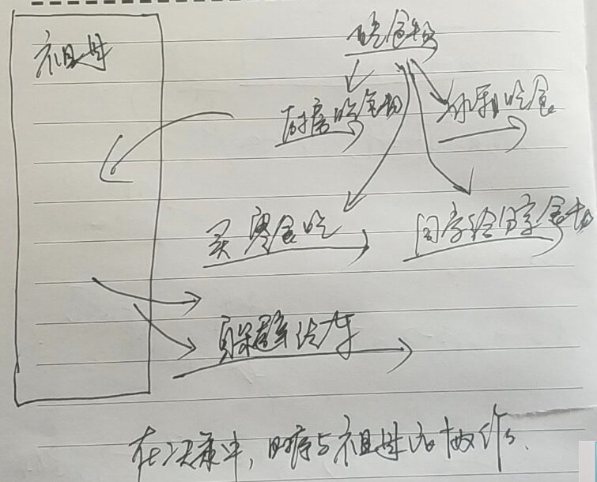 |
| 1. 抽象fo`吃食物` 有4个具象fo |
| 2. 有毫无关系的`躲避汽车`foNode (改变距离) |
| 3. 我们需要从`吃食物`的决策中,找到具体要执行什么,甚至找到`飞过去`这样未经历无关联的执行; |

| 思考与问题 >> |  |
| --- | --- |
| 思考1 | aiThinkIn_CommitMvNode:中mvNode是否需要保留到demandManager; |
| 思考2 | `学习时 & 决策时`,`静态网 & 动态网`,哪些找相同,哪些找不同; |
|  | 认知学,找相同 (含静态&动态网) |
|  | 决策用,找不同 (静态网`判定条件的不同,并行动改掉` & 动态网`对新祖母条件进行追加评价`) |
|  |  |
| Q1 | 与现实世界的交互; |
| A1 | 目前做法: 可通过内存out模型的方式来解决 |
| A2 | 以后改进: 以后必须再回归到网络中,而不是太多模型 |
|  |  |
| Q2 | alg引用fo的问题; |
| A2 | 实则是alg与fo的协作问题,参考上图 `手画图`; |
|  |  |
| Q3 | 难点: 条件的行为化 (祖母时序化); `将祖母变为isOut执行` |
| A3 | 如: `条件饭变为做饭,条件做变为厨房` `条件厨房变为回家` `条件回家变为打车` 所以:`我们看到自己饭时候,反而去打车` |
|  |  |
| Q4 | 吃饭没饭时,饭为条件,到alg联想fo得到饭的方法,`是做饭,而非吃饭`,为什么? |
| A4 | 本质上是`得到` `失去`的问题,时序中相关细节信息的缺失; |

<br>

| "决策用"中fo与alg间相对与循环 >> |
| --- |
|  |
| 1. fo中 `吃饭` 的条件 `饭` 在alg中找具象; |
| 2. 根据饭找到面 |
| 3. 根据面找到fo中 `做面吃` (`不对,fo的抽具象不能依赖alg的抽具象`) |
| 原则: fo作为思维操作的单元,要优先从fo的抽象向具象方向找解决方案 `但是可能会做没做过的螃蟹` |
| fo需要静态alg网的支撑,如条件的判定 |
| 即: 先从fo选择具象方案 `做饭` 或 `下馆子` |
| 再: 从alg选择具象祖母 `做什么饭` `下哪个馆子` `下馆子吃什么` |
| 原则: fo为用,alg为体,决策中,alg甚至可以构建`创造力`新的fo; |
| 原则: fo和alg的抽具象仅能依赖自己; |
| 原则: fo的alg元素algA,被conAlgA替代时,先构建到网络; 如:`吃饭`替换为`吃螃蟹`时,`吃螃蟹`被构建或加强 |


<br><br><br><br><br>


## n15p16 决策的迭代之祖母与时序的协作代码实践
`CreateTime 2019.02.16`

| TODOLIST >> | DESC | STATUS |
| --- | --- | --- |
| 1 | 去掉tryout执行 >> 对某标识ds&at的数据输出的激活功能; | `已由反射(如吸吮)过渡替代` |
| 2 | 新祖母无时间加层,容易联想不到,`thinkFeedCache,redis,kXGRedisGCObserver`配合来解决;可以先把thinkFeedCache作为一个list来简单实现功能 |  |

| 祖母的实与虚 >> |  |
| --- | --- |
| 1 | 祖母条件,不是每次都想那个最具象,`如昨天的午饭` |
| 2 | 我们如何辨别,瞬时记忆中,哪个条件是实,哪个是虚 |
| 思考1 | 来源上: `1.input` `2.新抽象的foNode` `3.outputLog` `0%采用` |
| 思考2 | 具象为实,抽象为虚; `80%采用` |
| 解答 | 找实,其实本质上是在祖母网络的具象之旅; |

| 祖母时序协作之从祖母回归时序 >> |
| --- |
| 简介: 以时序中的经验,找到/调整/创造出祖母,比如,`刚看到一个坚果`,`去路边打车`,`做饭` |
| 重点: 某条微信息的值的变化, `如距离` |
| 问题: 关于`找到祖母`,我们应该到瞬时记忆找,还是到时序找? |

| 决策流程图 >> |
| --- |
| 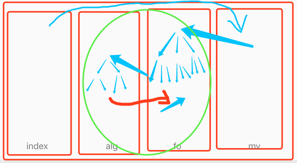 |
| 1. 从index索引到mv,找到符合的mv经历; |
| 2. 由mv到时序网中,具象依次进行时序评价与选择; |
| 3. 对fo时序的元素进行判定, 关键在:`虚实的判定(最具象)`与`微信息值的变化(距离等细节变化)` |
| 4. 子fo回归,通过各种行为,将父fo执行成功; |

<br>

| 祖母时序协作流程 >> |
| --- |
| 1. 时序中的: 吃饭 |
| 2. 找出祖母条件: 饭 (注:吃是行为) |
| 3. 满足祖母条件: 联想到时序做饭; |
| 难点问题: `做饭` 和 `吃饭` 在时序中,如何表示其不同? |
| 初步分析: 一个是直接解决mv,一个是间接创造条件; |
| 再次分析: 跳过mv的干扰,仅是行为与结果的时序; |
| 分析方向: 从认知开始思考并解决此问题 |
| 解决出路1: 要先回到祖母网络对于微信息变化的支持,还有认知时,支技相应网络构建; |
| 否决出路1: 采用更简单的方式,取到两个则对比变化,未取到则静态存在网络中 |
| 解决思考: 我们要找到相对确切的时序: 如order仅两个元素:`做饭`; |
| 知识结构: 行为导致祖母的变化,do->algChange |

<br>

| 祖母时序协作循环图 >> |
| --- |
|  |
| 1. 从起点开始,第一步为认知抽象; (抽象祖母与抽象时序此时构建) |
| 2. absFo3是决策的开始; |
| 3. 最具象,用来发现,飞行需要方向,而坚果具有距离; |
| 4. 具象祖母回归到具象fo,将conFo中向x飞->坚果距离x的片断取出,并作为行为; |
|  |
| **>> 反思alg&fo协作循环图的合理性** |
| 1. 从理论层面,相对与循环的支撑; |
| 2. 要在性能ok的基础上,达到更好的效果,则需要祖母网络的支持,也可以达成创造力; |
| 3. 如`首次吃芒果/牙签做凳子` (祖母帮助做从未做过的事,或创造出未见过的东西) |

<br>

| 祖母时序协作循环图修正 >> |
| --- |
| 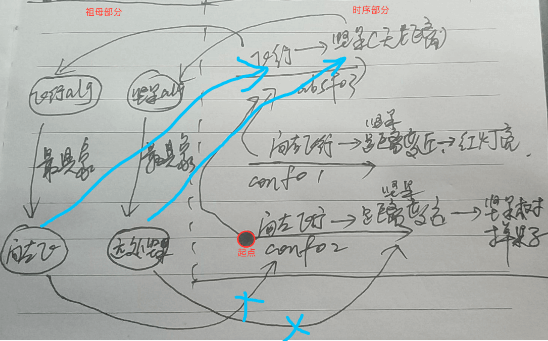 |
| 1. 简化: 直接将`最具象祖母`回归到absFo3; |

> 后续问题: 将哪个方向飞会更近? `小脑问题 / 视觉方向的前后问题`
>
> 解决: absFo3改为`飞向 坚果`,其中抽象祖母`飞向`就是"向目标方向飞行"的抽象;
>
> `向某目标的方向往前飞`是一个时序,,,此处`距离的远近`是一个微信息,容易形成祖母;但`方向的前后`是一个时序,不容易形成祖母; 所以,`前后`到底是时序还是祖母呢?


<br><br><br><br><br>


## n15p17 决策后的外层循环
`CreateTime 2019.02.20`

| 简介 >> |
| --- |
| 决策中,会有行为输出与现实世界的影响再次被返回到input,而对于行为与变化间的学习,训练出了不同算法间的参数映射,与构建了参数小脑网络; |

| 难点重点 >> |  |
| --- | --- |
| 1. 把“无数据”的“方向”祖母抽象出来； | 要到发现输出参数与此参数相关时,才可以抽象出来; |
| 2. 各alg间不可跨界类比，那么视觉方向与行为方向，如何对应？ | 仅是一些值的区间映射; |
| 3. 因为行为方向，导致了视觉方向的变化。 | 可以此为依据进行不断的反馈与修正; |
| 4. 让行为产生的结果，通过视觉，回到input的距离变化。再以此来抽象出，走近这样的祖母。 | 从中,找出距离变化与`飞方向`与`坚果方向`的关系; |

<br>

| algScheme&actionScheme的评价 >> |
| --- |
| 1. 决策中`行为祖母`的难点在于行为与变化的映射; |
| 2. 决策中`条件祖母`的难点在于判定其在任务中有效性; |
| 3. 本质上两者的难点都在外层循环,所以要通过迭代外层循环来找到解决问题的答案; |

| memOrder中条件祖母的判定问题 >> |
| --- |
| 判定的本质: 是可通过fo加工微信息,以得到条件祖母; |
| 如: 当已学会飞行时,可判定`距离为x的坚果`为实,不会飞行时则为虚; |
| **>> 所有的理性源于感性** |

| DoChange模型 >> |
| --- |
| **概念:** `DoChange模型仅是时序中,更加精细的一个祖母类比操作;` |
|  |
| **表示:** `{祖母[abs:a con:a1,a2] > 时序[a1_do_a2] -> MV[hunger]}` |
| 1. 示图简介: 图中为小人跑过一扇门后变成了狗; |
| 2. 小人与狗有很多微信息相同处,也有不同处 (以共同抽象为判断依据); |
| 3. a1与a2的判定相同点,以共同抽象为主; |

<br>

| 大小脑协作 >> |
| --- |
| 1. 大脑对`行为祖母`总参数要支持`区间`,然后`执行,反馈,修正`来构建更精细的网络; (如卖油翁对打油收发自如,对射箭却做不好); |
| 2. 大脑的`行为祖母`是小脑的指挥官,而小脑是指挥官之母,指挥官负责更精细的指挥,并构建与使用小脑; |
| 训练更好的小脑: 关于当前最好执行参数集，保留在小脑中。需要通过一些方式 `如执行精度偏差/动作的抽象迁移/区间` 来做的更好。 |

<br>

| 小脑网络 >> |
| --- |
| `动作的抽象迁移`,就是类似动作纹,在小脑中网络化,并且不同动作间,会共用到动作共同的某些部分; |


<br><br><br><br><br>


## n15p18 迭代网络`内类比`
`CreateTime 2019.03.04`

> 1. 内类比是比大小,而不是比相等;结果有 > = < 三种;
> 2. 但也有些微信息是无法比大小的,比如: 颜色;
> 3. 相对祖母只能被时序中两个祖母类比所解释,所以必须有a1与a2时,才能解释之;
> 4. 即a1与a2的相对来解释远近这样的 `相对祖母`;

> 名词解析:  
> 1. 相对祖母,是指a1与a2进行类比时,1到2的变化,所呈现出大小,远近,长短等对应的祖母节点;

| doChange模型深入 >> |  |
| --- | --- |
| 1. 事例: | 下雨导致衣服变湿; -> `水导致变湿` |
| 2. 回顾: | 在fo时序中,向来是上一个元素,导致下一个元素; |
| 3. 问题: | 什么时候找相同,什么时候找不同;(alg) |
| 4. 空祖母: | 无微信息的祖母,如fo1(吃A) fo2(吃B) fo3(吃C)抽象出(吃空),其中(空)是(ABC)的抽象祖母 |
| 5. 空祖母示图: |  |
| 6. 事例2: | 飞行导致坚果变近; -> 飞导致距离变小; |

| fo横向类比示图 >> |
| --- |
| 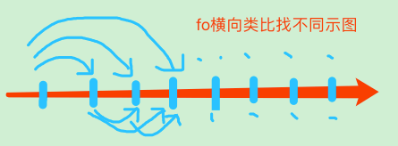 |
| 1. 结果的知识表示问题:`fo(1a,2,1b,4) 类比后,为fo(1a-1b)` |
| 问题: 是否1a因2变成1b?,而1a变成1b是否导致了4? |
|  |
| 2. `西瓜由绿变红` 与 `苹果由绿变红` 类比出 `绿变红` |
| 祖母可以包括:`绿色的苹果`,`绿色的水果`,`绿色的东西`等,都是可以的; |
|  |
| 3. 即不影响原来的order序列,又想知识表示出1a与1b的关系; |
| > 可以尝试使用`change桥`来表示;使用映射如map来表示; |
| > 或使用更加网络化的方式,(参考:fo内横向类比构建图) |
| > 索引问题,无论使用`change桥`还是`融入网络`的方式,都需要想好如何索引或联想; |

<br>

| fo内类比构建图 >> |
| --- |
|  |
| 1. 示图中左侧为alg祖母模块,右侧为fo时序模块; |
| 2. 由fo的内横向类比开始; |
| 3. 需构建3个节点; |
| //1. 构建红祖母 |
| //2. 构建绿祖母 |
| //3. 构建红瓜->绿瓜时序 |
| //4. 构建红->绿时序 (错误,因为抽象要逐步升级,参考`内类比的抽具象构建方向`) |

<br>

| 内外类比的协作 >> |
| --- |
|  |
| 想法: 用大小于号来替代微信息模糊是更加本质简单的做法; |
| 1. 图中问号部分,外类比导致失真,如果先外后内,会导致失败; |
| 2. 内类比抽象的比较彻底,导致具象太多杂乱; |
| 3. 所以,我们以内外部类比的互相协作,来解决这些问题; |
| 问题1. 当外部类比,包含内部类比时; |
| 问题2. 内部类比的构建时机问题; |

<br>

| 内与外独立,内中有外,外中有内 >> |
| --- |
| 1. 外中有内: 外类比中,内类比帮助避免order中产生`坚果`导致`坚果`的错误; |
| 2. 内中有外: 内类比中,再联想一个absFo,外类比帮助发现是什么导致了`远`变`近`; |
| 3. 内外相对一静一动; |
| 注: 内类比的结果本身就是fo中的特征;即动中有静; |

<br>

| 内中有外代码实现 >> |
| --- |
| 1. 内类比的去重;`祖母引用联想的方式去重` |
| 2. 内中有外,通过祖母引用联想assFo,后进行两者外类比,发现更确切的时序; |

| 内类比的抽具象构建方向 >> |
| --- |
| 1. 从下往上,与外类比的fo抽象从con往abs逐步确切类似; `90%采用` |
| 2. 从上往下,与外类比相反,先构建`最absFo`,再逐步`去重`向下关联; `10%` |
| 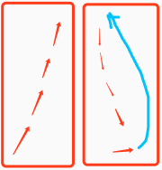 |
| 图中: 左侧为从下往上,右侧为从上往下; |
| 注: 从下往上的方式,更自然形成,在形成后,也自然具备非常好的网络结构; |

| 内类比的网络构建部分 >> |
| --- |
|  |
| 1. 遵循 "想到即构建" 的原则; |

| 外中有内代码实现 >> |
| --- |
| 1. 在外类比进行某alg的类比时,对alg优先进行内类比; (目前不重要,可先不写) |


<br><br><br><br><br>


## n15p18 内类比的构建与使用
`CreateTime 2019.03.12`

> 1. 如果可以通过命令服务员上菜,就不会自己去端;所以`远-近`的解决有不同的方式,
> 2. 内类比间的信息是同区不同值,所以可以比大小,范围匹配,等等;

|  |
| --- |
| 1. 如fo内类比时,有效,则仅抽象出 `fo红-绿` & `alg红` & `alg绿`; |
| 2. 外类比算法不变,但外类比生成的absFo要进行一次内类比; |
| 3. `远->近`的推理问题,要到网络具象找; |
| 4. 可采用类似mv的方向索引 或 采用+和-来表示一类相对祖母`如下图`; |

| 内类比远到近的fo区网络示图 >> |
| --- |
|  |
| 1. 微信息方向索引10% 或 相对祖母90% |
| 2. 将相对祖母作为类似mv基本模型的结构 0% |
| 3. 当conFo内类比有效时,构建步骤: |
| > 1. 先构建相对祖母; |
| > 2. 将conFo中**80与70间的祖母**,`骑自行车`作为前因+相对祖母,构建absFo; |
| > 3. 多次内类比构建的absFo1与absFo2间的外类比; |
| > 注: 重点为 `a1与a2之间的祖母们,作为抽象前因的前部分` |

| 代码实践 >> |  |
| --- | --- |
| 1 | 用IntMax来表示类比大于 `如:远,重,大,长等` |
| 2 | 用IntMin来表示类比小于 `如:近,轻,小,短等` |


<br><br><br><br><br>


## ToDoList

| TODOLIST | todo | status |
| --- | --- | --- |
| 1 | output的输出函数统一重构 (改为2个(主动输出 & 反射输出)) | T |
| 2 | Output使用多参数或后辍时,函数定义非常不灵活;(methodName+后辍) | T |
| 3 | 去掉output的block和delegate,改用广播方式; | T |
| 4 | reactorIdentifier作为rds(reactorDataSource)传递 | T |
| 5 | 异步持久化 `写个类似xgRedis的库来单独做这件事` `conNode只有反复使用到,才有资格被存储` | 异步持久化风险太高,时间影响强度序列的功能使用意识流来代替 |
| 7 | 重构:AIIndex中inModels&outModels改按at&ds分区,懒加载到redis的序列;`以防止inModels太长而性能问题` | T`algNode解决` |
| 8 | 将absFoNode的absValue_p改成orders;`元素为祖母节点` | T |
| 9 | 将absAlgNode.value_p改成直接使用value;`索引不再存值` `保留ds&at的索引序列` | 存疑,记忆印记在index |
| 10 | output支持祖母节点 | T |
| 11 | isOut不应该存在Pointer下,而应该在`祖母下` / `时序中的祖母下`; |  |
| 12 | 适当模糊范围 | 在算法层可模糊5%,alg层可模糊10%; `参考n15p12` |

| BUG | DESC | STATUS |
| --- | --- | --- |
| 1 | AINetDirectionReference.setNodePointerToDirectionReference中使用指针二分查找,却直接二分插入强度序列 |  |
| 2 | BUG:AINetDirectionReference.set()改为poiner&port双序列 |  |

<br>

| 问题备忘 >> |  |  |
| --- | --- | --- |
| 待思考 | 关于红和更红值比大小,在哪层 | `algNode(20%)`或`foNode(80%)` |
| 模型1 |  | `错误,应在后天` |


| 问题模板 >> |  |
| --- | --- |
| 发现问题: | 如:新模型下的assData如何完成识别联想过程? |
| 收集信息: | 如:看到的algNode具象节点后,联想到后天祖母节点; |
| 思考本质: | 如:对问题收集到的信息进行深入思考 |
| 解决方案: | 如:与当下系统,进行融合想出解决方案 |
| 解决步骤: | 如:把方案工程可实现化的思考 |
| 代码步骤: | 如:把工程步骤与系统架构进行整合思考 |
| 代码实践: | 如:把代码写出来 |
| PS: | 90%的问题是一个`新生入校(问题融入架构)`的问题,10%是`换老师等`; |


<br><br><br><br><br><br><br><br><br><br><br>
