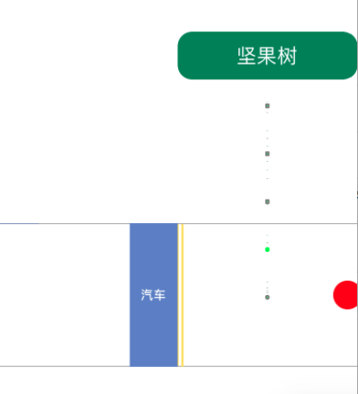
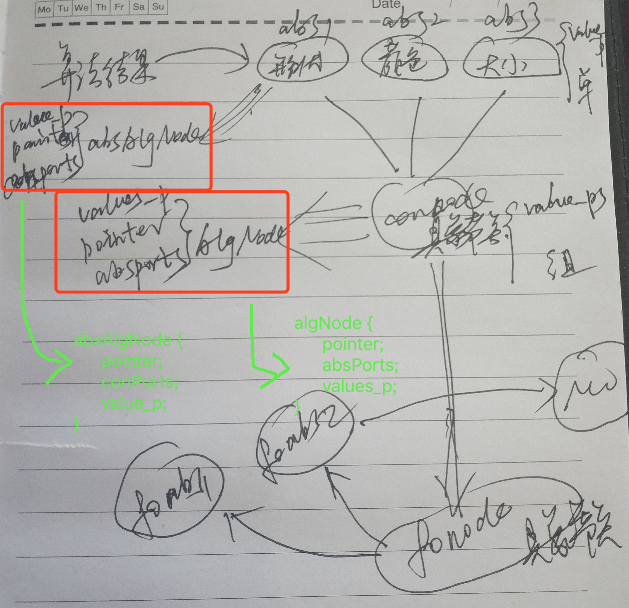
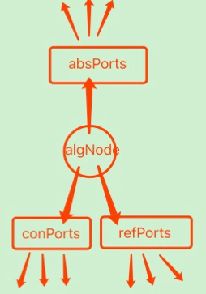
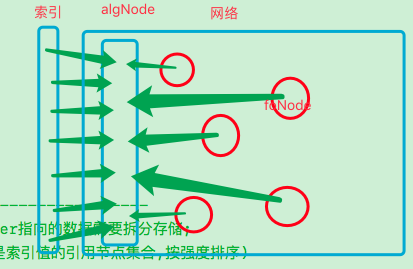
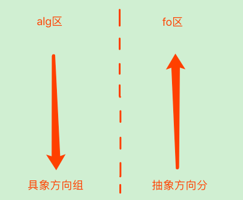
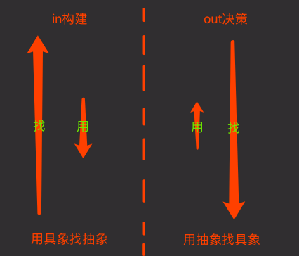
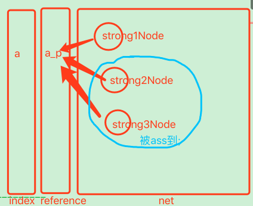
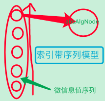

# 小鸟生存演示 & 势


<!-- TOC depthFrom:1 depthTo:6 withLinks:1 updateOnSave:1 orderedList:0 -->

- [小鸟生存演示 & 势](#%E5%B0%8F%E9%B8%9F%E7%94%9F%E5%AD%98%E6%BC%94%E7%A4%BA--%E5%8A%BF)
	- [n15p1 小鸟生存](#n15p1-%E5%B0%8F%E9%B8%9F%E7%94%9F%E5%AD%98)
	- [n15p2 小鸟生存演示的实践细节点](#n15p2-%E5%B0%8F%E9%B8%9F%E7%94%9F%E5%AD%98%E6%BC%94%E7%A4%BA%E7%9A%84%E5%AE%9E%E8%B7%B5%E7%BB%86%E8%8A%82%E7%82%B9)
	- [n15p3 生存期场景搭建](#n15p3-%E7%94%9F%E5%AD%98%E6%9C%9F%E5%9C%BA%E6%99%AF%E6%90%AD%E5%BB%BA)
	- [n15p4 成长期之进食](#n15p4-%E6%88%90%E9%95%BF%E6%9C%9F%E4%B9%8B%E8%BF%9B%E9%A3%9F)
	- [n15p5 视觉算法](#n15p5-%E8%A7%86%E8%A7%89%E7%AE%97%E6%B3%95)
	- [n15p6 二次开发2 (吃)](#n15p6-%E4%BA%8C%E6%AC%A1%E5%BC%80%E5%8F%912-%E5%90%83)
	- [n15p7 二次开发3 (飞)](#n15p7-%E4%BA%8C%E6%AC%A1%E5%BC%80%E5%8F%913-%E9%A3%9E)
	- [n15p8 重构认知循环 (MIL)](#n15p8-%E9%87%8D%E6%9E%84%E8%AE%A4%E7%9F%A5%E5%BE%AA%E7%8E%AF-mil)
	- [n15p9 演示](#n15p9-%E6%BC%94%E7%A4%BA)
	- [n15p10 AlgNode前_算法结果(algsArr)的迭代](#n15p10-algnode%E5%89%8D_%E7%AE%97%E6%B3%95%E7%BB%93%E6%9E%9Calgsarr%E7%9A%84%E8%BF%AD%E4%BB%A3)
	- [n15p11 AlgNode中_神经网络(新)](#n15p11-algnode%E4%B8%AD_%E7%A5%9E%E7%BB%8F%E7%BD%91%E7%BB%9C%E6%96%B0)
	- [n15p12 AlgNode后_索引迭代 `reference入网/algNode替代reference`](#n15p12-algnode%E5%90%8E_%E7%B4%A2%E5%BC%95%E8%BF%AD%E4%BB%A3-reference%E5%85%A5%E7%BD%91algnode%E6%9B%BF%E4%BB%A3reference)
	- [ToDoList](#todolist)

<!-- /TOC -->


<br><br><br><br><br>


## n15p1 小鸟生存
`CreateTime 2018.10.22`


| “小鸟生存演示”的简要说明：>> |
| --- |
| 1. 有一位纽约大学的教授，他每天下班路过一条路。 |
| 2. 然后路边有一些坚果树，树长大了，开始结果子。 |
| 3. 有一天来了几只乌鸦。 |
| 4. 乌鸦把路边有破壳的坚果肉吃了。 |
| 5. 再有一次下班，他看到乌鸦停在十字路口的电线上，把坚果扔在路上。 |
| 6. 等红灯的时候，乌鸦就下来吃被汽车压破的坚果肉。 |
|  |
| > 这是一个真实的故事，小鸟表现出了认知、学习、思考、分析、联想、需求、决策与行动等等智能体现。同时这位教授说：目前AI七十年来，全球范围内所有的科学家学者等，无人能解此题。所以他写了一篇文章：呼吁大家，来搞一个乌鸦启示的演示程序，用真正的AGI角度来解决这个问题。 |

<br>

| 简介 >> |
| --- |
| 以小鸟生存为例,设计一个类似而适用于he的演示示例; |
| 体现出he完全自主的智能。感知、认知、推理、学习、和执行; |
|  |

<br>

| 拆解思考 >> |  | status |
| --- | --- | --- |
| 1 | 食物欲望 | true |
| 2 | 无法直接获取食物 |  |
| 3 | 观察可获取的间接方式 |  |
| 4 | 间接方式导致危险 |  |
| 5 | 对危险的恐惧及避开方式 |  |
| 6 | 难点在于,乌鸦仅有一条生命,一次机会 |  |
| 7 | 后天对于撞击的疼痛,产生恐惧 (与一定相对速度物体撞击的距离感知,产生恐惧mv) |  |
| 8 | 乌鸦对于撞击的预测 |  |

<br>

| 代码实现 >> |  |
| --- | --- |
| 1 | 以游戏的方式来达成智能演示 |
| 2 | 乌鸦学会移动自己 (速度min-max) |
| 3 | 乌鸦对游戏场景的信息输入 (伪视觉) |
| 4 | 对场景中移动物体的视觉算法处理 |


<br><br><br><br><br>


## n15p2 小鸟生存演示的实践细节点
`CreateTime 2018.11.08`

| 成长期步骤 >> |  |
| --- | --- |
| 1 | 学习进食 |
| 2 | 学习飞行 |
| 3 | 学习碰撞疼痛 |
| 4 | ... |

<br>

| 生存期 >> |  |
| --- | --- |
| 1 | 看到坚果 |
| 2 | 看到公路 |
| 3 | 看到车辆 |
| 4 | 看到信号灯 |
| 5 | 看到车辆的行驶停止 |
| 6 | 看到车辆碾压坚果 |

<br>

| 其它 >> |  |
| --- | --- |
| 1_注意 | he4o并不具备独立成熟的小脑网络,所以小鸟要尽量依赖思考,不要依赖行动 |
| 2_难点 | he4o在"mv基本模型"中,对于时间间隔的信息是不够的,是否添加上? (曾这么做过) |
| 3_难点 | speed信息的变化->对应mv疼痛的变化; 此时信息变化不再是单独的值,而是抽象成方向; |


<br><br><br><br><br>


## n15p3 生存期场景搭建
`CreateTime 2018.11.12`

| 示图 >> |
| --- |
|  |
| 1. 汽车从左向右行驶在道路上; |
| 2. 红灯停,绿灯行; |
| 3. 坚果树向下掉落带壳坚果; |
| 4. 掉到公路上的坚果,会被汽车压掉壳; |


<br><br><br><br><br>


## n15p4 成长期之进食
`CreateTime 2018.11.13`

|  |
| --- |
| 1. 设置投喂按钮,用户做为鸟妈妈投食; |
| 2. 小鸟在吃的时候看到坚果,并吃掉坚果; |

| 示图 >> |
| --- |
|  |
| 1. 直投负责将食物直接喂食给小鸟; |
| 2. 乱投负责将食物投到指定位置; |
| 3. 小鸟在此场景内,需要学会进食、飞行、撞击的疼痛感。 |


<br><br><br><br><br>


## n15p5 视觉算法
`CreateTime 2018.11.13`

| 简介 >> |
| --- |
| 在本演示中,小鸟采用伪视觉 |
| 小鸟可以看到二维场景中的几个物体,如Car,Load,Food,Light |

<br>

| 视觉算法 >> |  |  | desc |
| --- | --- | --- | --- |
| 1 | 大小 | size |  |
| 2 | 颜色 | color |  |
| 3 | 形状(圆角) | radius |  |
| 4 | 相对位置 | origin | 视觉对象的位置,是相对小鸟而言的 |
| 5 | 相对速度 | speed | 视觉对象的速度,是相对小鸟而言的;速度由两桢位置算出 |


<br><br><br><br><br>


## n15p6 二次开发2 (吃)
`CreateTime 2018.11.16`

| 开发过程 (视觉) >> |  |  |
| --- | --- | --- |
| 1 | 为小鸟创建场景 |  |
| 2 | 为小鸟创建输出反射 | 如:飞行,吸吮反射 |
| 3 | 为小鸟创建信号输入 | 如:视觉等 |
| 4 | 扩展视觉算法 | size,color,radius,origin,speed等 |
| 5 | 扩展视觉算法结果模型 |  |
| 6 | 将算法结果生成模型,并传递给input |  |

<br>

| 开发过程 (学吃飞) >> |  |
| --- | --- |
| 1 | 以某条件触发先天反射,做出最简单的反应; (如吸吮,扇翅膀) |
| 2 | 将反射后,导致的结果信号传回给he; |
| 3 | he自己从中学会吃或飞的抽象; |
| 4 | he通过主动的方式来吃或飞; |

<br>

| QuestionTemplete 1 >> |  |
| --- | --- |
| 问题场景: | 在birdView下写了eat();并让growPage投喂后调用bird.eat(); |
| 问题描述: | 此处需要把吃掉的信号传达给he,否则he是无法理解吃的; |
| 问题分析: | 以代码调用的方式是错误的,此处虽然写了eat方法,但eat并不能代劳,eat这件事必须让he自己来做; |
| 解决思路: | 让he以吸吮反射的方式,去主动吃;并将out入网,以抽象出"吃"的节点; |
| 解决方式: |  |
|  | 1. 在eat()中以某种刺激来引发he的反射; |
|  | 2. 反射后开吃 (he主动调用eat()); |
|  | 3. eat()中, 销毁food,并将产生的mv传回给he; |
| 代码步骤: |  |
|  | 1. 定义一个reactorIdentifier反射标识 (作dS后辍,构建到网络中) |
|  | 2. 调用ReactorControl.commitReactor(),选择性传入runBlock |
|  | 3. 或使用output.delegate = self; (参考代码段A) |
|  | 4. 在回调中,判断reactorId,并做出相应肢体反应; |
| 代码步骤(重构后): |  |
|  | 1. 定义一个rds作为dataSource标识入网 (如下:EAT_RDS) |
|  | 2. 调用ReactorControl.commitReactor() |
|  | 3. 接收广播,并做出相应肢体反应; (参考代码段B) | |

```objective-c
//代码段A
// #define EAT_REACTORID @"eatReactorId" //吸吮反射标识
// [Output sharedInstance].delegate = self;
//
// /**
//  *  MARK:--------------------OutputDelegate--------------------
//  */
// -(void)output_Reactor:(NSString *)reactorId paramNum:(NSNumber *)paramNum{
//     if ([EAT_REACTORID isEqualToString:reactorId]) {
// 			NSLog(@"反射执行");
// 		}
// }
```

```objective-c
//代码段B
// #define EAT_RDS @"EAT_RDS" //吸吮反射标识
//
// //MARK:===============================================================
// //MARK:                     < outputObserver >
// //MARK:===============================================================
// -(void) outputObserver:(NSNotification*)notification{
//     if (notification) {
//         //1. 取数据
//         NSDictionary *obj = DICTOOK(notification.object);
//         NSString *rds = STRTOOK([obj objectForKey:@"rds"]);
//         NSNumber *paramNum = NUMTOOK([obj objectForKey:@"paramNum"]);
//
//         //2. 吸吮反射
//         if ([EAT_RDS isEqualToString:rds]) {
//             [self eat:[paramNum floatValue]];
//         }
//     }
// }
```


<br><br><br><br><br>


## n15p7 二次开发3 (飞)
`CreateTime 2018.11.27`

| 接上 >> | (n15p6二次开发2) |
| --- | --- |
| 1 | 小鸟可以根据`扇翅膀`反射,来学会主动飞行 |
| 2 | 以此可以解决小鸟的`移动`,`与坚果距离`,`与汽车相对速度`,`坚果搬运`等问题 |

<br>

| toDoList >> |  | status |
| --- | --- | --- |
| 1 | 测试小鸟可以根据`视觉`等信息来做,能吃到与否的原因分析;(`距离`或`坚果状态`) |  |

<br>

| 瞬时记忆优化 >> |  |
| --- | --- |
| Q1 | TC对algsModel的应对量 `小鸟视觉算法出量大的问题` |
|  | 1. 增加瞬时记忆序列长度,则性能下降; |
|  | 2. 减少瞬时记忆序列长度,则认知基础下降; |
| A1 | 在保证序列长度8的同时,增加信息处理的组; |
|  | 由mv为始,向前8个,发现有组,则组为1个长度 |
|  | 即7个+1组=8 `长度不变` |
|  | 以此类推,来推进认知的更广与更深 |
| 参考 | 代码段:以组替分; |

<br>

```c
//以组替分 >>
//因algsArr.lengeh > 8;
//所以,需要对algsArr中的元素,进行实时的联想,并将已抽象的微信息取回,来以组替分;
//TODOTMR: (2,5) 以组替分
//1. convert2Pointer; (已经ok)
//2. checkConvertAbsPointer; (节约瞬时记忆占用长度,同时为认知升级提供部分支撑)
//3. assData; (对dataIn_AssociativeData()方法进行拆分重构;先不搞)
//4. assMv; (对dataIn_AssociativeData()方法进行拆分重构;先不搞)
//5. ThinkingUtils.analogyOrdersA()方法,扩展对"微信息"信息本身的类比,而非只是pointer;
```


<br><br><br><br><br>


## n15p8 重构认知循环 (MIL)
`CreateTime 2018.12.03`


| 方案1:分层 >> |
| --- |
| 1. 第一层 (数据量大,到网络识别后,转化为节点,并存为瞬时记忆的item) |
| 2. 第二层 (第一层与第二层,是否分开?) |
| 3. 如果分开? 那么第二层其实就是瞬时记忆层; |
| 4. 如果不分开? 那么美女是否导致像素点变灰? |

<br>

| 方案2:不限 >> |  |
| --- | --- |
|  |  |
| 1 | 放开算法带宽的控制 (由8条改为不限) |
| 2 | 放开瞬时记忆由8条以内存容量和时间限制 (时间用redis自动,容量以后再限) |
| 问题: | 如果瞬时记忆不限条,导致的性能问题? |
| 难点1 | 一切祖母节点,终将回归网络才有意义,所以无法独立取出来限制条数; |
| 矛盾1 | 想限制条数,但又无法独立出网络的去限制; |
| 难点2 | 算法result数据的快速收敛过程; |
| 矛盾2 | 收敛而保留有用信息; |
| 难点3 | 保证收敛前,根据一堆微信息检索到足够正确的祖母节点 |
|  | 再以此祖母节点,进行mv,而不是微信息直接到mv; |

<br>

| 方案3:不变 >> |  |
| --- | --- |
| 现状 | 因为对"算法值"数据,并不支持并行类比; |
| 现状 | input输出的数据是巨量的,但"算法值"却是有限的 |
| 单次联想的索引 | 联合索引,模糊索引 |
| 联合索引实例 | 花生的形状联想到蝴蝶结 (`对称` `双` `曲线`) |
| 模糊索引 | 暂不支持,或此命题不成立; (`因为一切模糊到微观总是确定的,而索引正是在处理微观`) |
| 索引的现状 | 目前"算法值"是单一的 (`没有一堆值,作为同一结果`) |
| 索引现状导致的问题 | 目前无需使用联合索引,但单值索引,运行方式上是相通的 |
|  |  |
| 多次联想的协作 | 明明有多个索引,为什么要for一个个来呢 |
| 多次协作举例 | 花生形状指向`花生`和`蝴蝶结`,但再联想花生颜色则结果明确指向花生 |
| 多次协作代码 | dataIn_AssociativeData(arr){for in arr;} |
| toDo | 将`算法值`位宽扩到16 |
| toDo | 在认知函数`dataIn_AssociativeData()`中,写多次联想协作支持 |

| 算法结果的多次协作 >> | 转n15p10 |
| --- | --- |
| 1 | algsArr的多个元素,同在一组; `先天一` |
| 2 | algsArr组会构建到网络中; `后天一` |
| 举例 | 颜色不止是色值,也不止是视觉的颜色,而是某个algsArr组节点的颜色 |
| 说明 | 只有有了组的概念后,才能有多次联想的协作; |
| 思考 | algsArr组,能否作为瞬时记忆的一个元素存在? |
|  |  |



<br><br><br><br><br>


## n15p9 演示
`CreateTime 2018.12.05`

| 步骤 >> |  |
| --- | --- |
| 1 | 讲一只乌鸦带给我们的启示原文 |
| 2 | 讲小鼠,小鸟与人类大脑的结构相似 |
| 3 | 讲he4o在"小鸟生存演示"的实现 |


<br><br><br><br><br>


## n15p10 AlgNode前_算法结果(algsArr)的迭代
`CreateTime 2018.12.06`

| 简介 >> |
| --- |
| 1. 在视觉算法实践中,发现以往内核不支持的一些点,进行迭代支持; |
| 2. 如:`单个算法结果,到一组算法结果;` `在mv基本模型之前,便支持的网络结构` `不依赖类比构建的抽具象模型` |

| 步骤 >> |  |
| --- | --- |
|  |  |
| 1 | algsArr中元素进行装索引,各生成抽象节点; |
| 2 | 再根据algsArr生成的所有抽象节点,打包生成具象节点 (算法结果组节点); |

| 开发步骤 >> |  |
| --- | --- |
| 1 | 复用原来的AbsNode和Node类 (或在基础上改一个无cmv_p的node出来 ) |
|  |  |
|  |  |
| Q1 | absAlgNode去重问题? (absAlgsNode的复用问题) |
| A1 |  |


```c
//algNode & absAlgNode伪代码;
absAlgNode {
	pointer;
	conPorts;
	value_p;//算法结果的微信息
}

algNode {
	pointer;
	absPorts;
	values_p;
}
```


<br><br><br><br><br>


## n15p11 AlgNode中_神经网络(新)
`CreateTime 2018.12.10`

> 注: algTypeNode表示:(algNode&absAlgNode)
>
> 注: foTypeNode表示:(foNode&absFoNode)

| 大脑网络 >> |
| --- |
|  |
| 问题1: algTypeNode是否可以和foTypeNode构建到一个索引序列? |
| 1. algTypeNode不需要像foTypeNode那样灵活的类比抽象 |
| 2. algTypeNode相对先天些,foTypeNode相对后天些; `如颜色的后天概念和先天视觉色` |
| 注: 整个过程,更加完善的认知循环 |

| 相似物体的判定 >> |  |
| --- | --- |
| 1 | 算法上有相似性的物体,会有着共同的抽象,但它们未必是同一物体; |
| 2 | 举例: 流水线,汽车进去,出来苹果,人们会以为汽车变成了苹果; |
| 3 | 演示中例子: `带皮和不带皮的坚果;` `绿信号灯和红信号灯;` |
| 4 | 结论: 相似物品只能当两个algNode来处理,但absAlgNode的抽象共同点也是存在的; |

<br>

| 小脑网络 >> |  |
| --- | --- |
| 结构 | 非时序的组合输出网络 |
| 使用 | 大脑时序调用小脑 |

<br>

| conAlgNode模型 >> |
| --- |
|  |


<br><br><br><br><br>


## n15p12 AlgNode后_索引迭代 `reference入网/algNode替代reference`
`CreateTime 2018.12.18`

|  |
| --- |
| 1. 不再需要reference |
| 2. 需要将pointer序列和强度序列,写到node中 |
| 3. 引用序列入网的意义:`结构化相对序列的优势` `防止大量的组微信息以网络中匹配适可而止来优化io性能` `对多个皮层算法协同时结果的保真` |
| 注: 更加完善的`组分循环`; (algNode组,fo分) |
| 例: 吃发红的水果会饱; `什么是吃?(时序)发红?(absAlgNode类比再具象)的水果?(..)会饱?(mv基本模型)` |
|  |
|  |

<br>

| assData迭代 >> |  |
| --- | --- |
| 旧模型 |  |
|  | 1. 旧模型的引用序列,对assData联想起到重要作用;(取前两个) |
| 新模型 |  |
|  | 问题:参数问题A |

| 问题A >> |  |
| --- | --- |
| 发现问题: | 新模型下的assData如何完成识别联想过程? |
|  | 看到的algNode具象节点后,联想到后天祖母节点; |
| 收集信息: |  |
|  | 1. 以algNode为索引进行联想; |
|  | 2. 联想中以absAlgNode为依据;在网络中点亮与此符合的目标祖母节点; |
|  | 3. 但有时,多次或不同分区信息组成一个祖母细胞。 |
| 思考本质: |  |
|  | 在于algNode的不灵活,与祖母细胞的灵活问题 |
|  | 所以这应该是一个algNode的灵活化,后天化问题 |
| 解决方案: |  |
|  | 1. 去掉algNode，因为未定义前，它没意义。 |
|  | 2. 不删algNode,而是改进，支持后天思考联想到。algNode就是祖母细胞。 |
|  | 3. algNode去重的思路用于联想匹配问题。 |
| 解决步骤: | 把方案工程可实现化的思考 |
| 代码步骤: | 把工程步骤与系统架构进行整合思考 |
| 代码实践: | 把代码写出来 |

|  |
| --- |
| 1. 左侧为alg区模型 |
| 2. 右侧为fo区模型 |
| 3. 把alg区适当中止,并交付给fo区进行处理;例如`发现mv后联想,类比,抽象` |
| 4. 决定: 祖母抽象还在fo区完成; |
| 注Q: 为什么说吃`抽象水果`,而不是吃`抽象颜色`? |
| 注A: fo中抽象出水果,是在时序中的,而颜色仅在alg区作为抽象指向存在;只能表示`是`; |

| 明日计划 >> |  |
| --- | --- |
| 1. 联想algNode_p的引用而不是取algsArr的reference序列; |  |
| 2. 将conFo的微信息get&set Reference重构为order中使用algNode_p | T |
| 3. 将absFo的组微信息也改用order中algNode_p; |  |

<br>

| toDoList >> | status |
| --- | --- |
| 1. 写convertAlgTypeNode() | T |
| 2. 使dataIn_AssociativeData()中的assData&assMv支持algTypeNode; |  |
| 3. ThinkingUtils.analogyOrdersA(),扩展"微信息"类比,而非只pointer;`支持类比构建新conAlgNode` `而非只absFoNode` `参考algNode演化图` |  |
| 4. 单组临时存在,并在处理后,丢失一些细节; (将指向明确的,进行存瞬时记忆为一组); | 以algTypeNode的方式不会丢失细节,瞬时记忆存conAlgNode |
| 5. `-(void) dataIn:(NSObject*)algsModel`装箱后,对algNode改动支持 | T |
| 6. 写dataIn_ConvertAlgNode(); | T |
| 7. conAlgNode不直接指向"索引中微信息",而是依赖absPorts中的absAlgNode来取信息; | T(删除conAlgNode.values_p) |

| AlgNode演化图 >> |
| --- |
|  |
| 1. 树叶为absAlgNode |
| 2. 树干为conAlgNode |
| 3. 树叶为后天类比后动态形成的algNode |

<br><br><br><br><br>


## ToDoList

| TODOLIST | todo | status |
| --- | --- | --- |
| 1 | output的输出函数统一重构 (改为2个(主动输出 & 反射输出)) | T |
| 2 | Output使用多参数或后辍时,函数定义非常不灵活;(methodName+后辍) | T |
| 3 | 去掉output的block和delegate,改用广播方式; | T |
| 4 | reactorIdentifier作为rds(reactorDataSource)传递 | T |
| 5 | 异步持久化 `写个类似xgRedis的库来单独做这件事` |  |
| 6 | BUG:AINetDirectionReference.set()改为poiner&port双序列 |  |
| 7 | 重构:AIIndex中inModels&outModels改按at&ds分区,懒加载到redis的序列;`以防止inModels太长而性能问题` |  |
| 8 | 将absFoNode的absValue_p改成orders;`元素为祖母节点` |  |
| 9 | 将absAlgNode.value_p改成直接使用value;`索引不再存值` `保留ds&at的索引序列` | 存疑,记忆印记在index |

| BUG | DESC | STATUS |
| --- | --- | --- |
| 1 | AINetDirectionReference.setNodePointerToDirectionReference中使用指针二分查找,却直接二分插入强度序列 |  |

<br>

| 问题备忘 >> |  |  |
| --- | --- | --- |
| 待思考 | 关于红和更红值比大小,在哪层 | `algNode(20%)`或`foNode(80%)` |
| 模型1 |  | `错误,应在后天` |


| 问题模板 >> |  |
| --- | --- |
| 发现问题: | 如:新模型下的assData如何完成识别联想过程? |
| 收集信息: | 如:看到的algNode具象节点后,联想到后天祖母节点; |
| 思考本质: | 如:对问题收集到的信息进行深入思考 |
| 解决方案: | 如:与当下系统,进行融合想出解决方案 |
| 解决步骤: | 如:把方案工程可实现化的思考 |
| 代码步骤: | 如:把工程步骤与系统架构进行整合思考 |
| 代码实践: | 如:把代码写出来 |


<br><br><br><br><br><br><br><br><br><br><br>
