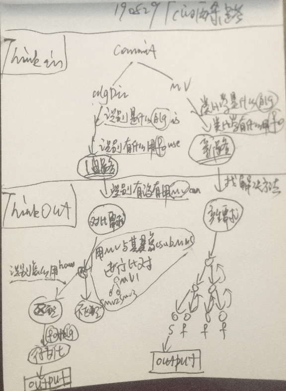
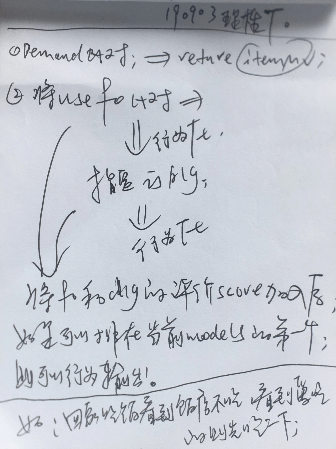
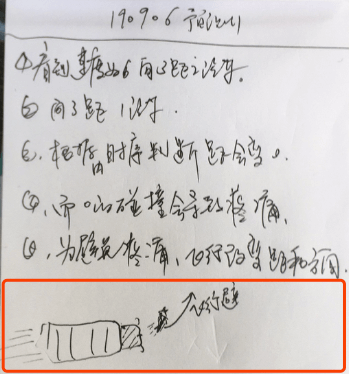
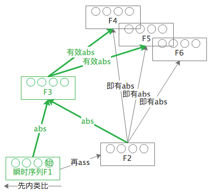
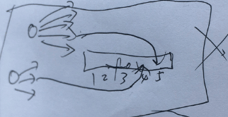
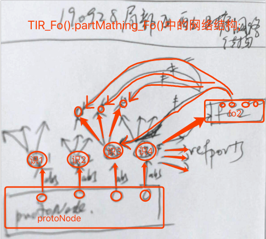
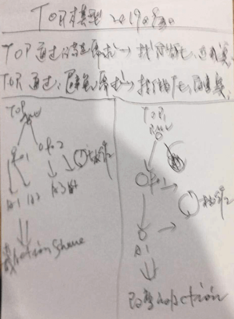
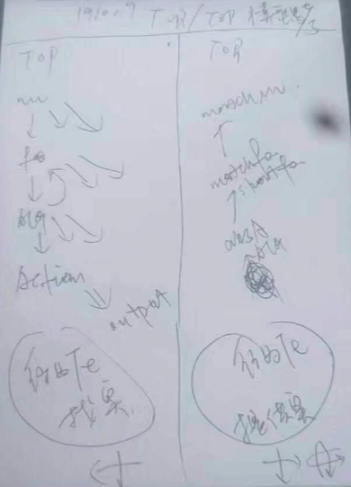
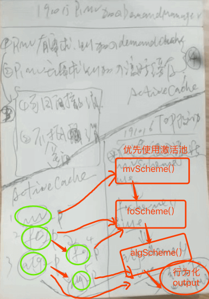
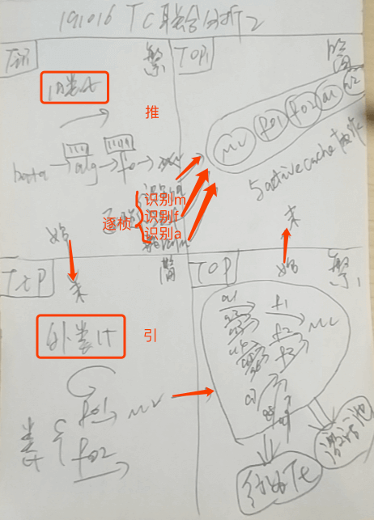

# V2.0的测试/训练/细节完善/理性思维

<!-- TOC -->

- [V2.0的测试/训练/细节完善/理性思维](#v20%E7%9A%84%E6%B5%8B%E8%AF%95%E8%AE%AD%E7%BB%83%E7%BB%86%E8%8A%82%E5%AE%8C%E5%96%84%E7%90%86%E6%80%A7%E6%80%9D%E7%BB%B4)
  - [n17p1 思维控制器的`理性流程`与`感性流程`](#n17p1-%E6%80%9D%E7%BB%B4%E6%8E%A7%E5%88%B6%E5%99%A8%E7%9A%84%E7%90%86%E6%80%A7%E6%B5%81%E7%A8%8B%E4%B8%8E%E6%84%9F%E6%80%A7%E6%B5%81%E7%A8%8B)
  - [n17p2 TOR(ThinkOutReason)-理性决策](#n17p2-torthinkoutreason-%E7%90%86%E6%80%A7%E5%86%B3%E7%AD%96)
  - [n17p3 TIR(ThinkInReason)-理性识别预测](#n17p3-tirthinkinreason-%E7%90%86%E6%80%A7%E8%AF%86%E5%88%AB%E9%A2%84%E6%B5%8B)
  - [n17p4 TIR&TOR-理性思维汇总](#n17p4-tirtor-%E7%90%86%E6%80%A7%E6%80%9D%E7%BB%B4%E6%B1%87%E6%80%BB)
  - [n17p5 TIR_Fo()理性时序](#n17p5-tir_fo%E7%90%86%E6%80%A7%E6%97%B6%E5%BA%8F)
  - [n17p6 TIR模型](#n17p6-tir%E6%A8%A1%E5%9E%8B)
  - [n17p7 TIR_FO模型到代码](#n17p7-tir_fo%E6%A8%A1%E5%9E%8B%E5%88%B0%E4%BB%A3%E7%A0%81)
  - [n17p8 TOR模型](#n17p8-tor%E6%A8%A1%E5%9E%8B)
  - [n17p9 TOR代码实践1](#n17p9-tor%E4%BB%A3%E7%A0%81%E5%AE%9E%E8%B7%B51)
  - [n17p10 TOR代码实践2](#n17p10-tor%E4%BB%A3%E7%A0%81%E5%AE%9E%E8%B7%B52)
  - [TODOLIST](#todolist)

<!-- /TOC -->

***

## n17p1 思维控制器的`理性流程`与`感性流程`
`CreateTime 2019.08.29`

> 在飞行训练时,发现思维控制器 "看到坚果" 的"理性之路"未走通,占整个思维控制器的25%,如下:
> 1. 做了的部分:
>   * 感性流程整体完成;
>   * 理性流程的ThinkIn部分（`是什么(is)`和`有什么用(use)`）;
> 2. 没做的部分:
>   * 理性流程的ThinkOut部分（`有没有用(can)`和`怎么用(how)`）;

| 两条路示图 >> |
| --- |
|  |
| A. 左侧为`理性路`,输入`algDic`信号,类比联想旧知识,后对比即有需求,行为向外循环达到目标(比如一步步飞行坚果); |
| B. 右侧为`感性路`,输入`mv`信号,类比构建新知识,后产生新需求,内心递归展开(比如内心找到解决方案并实施); |
| 1. 本文重点关注左侧的`理性路`; |
| 2. 本文重点规划左侧下方`ThinkOut部分`的代码实现; |

| TOReason流程分析 |
| --- |
|  |
| 1. 比对流程分析,方向为:从下向上,从左向右; |
| > 从下向上: 向抽具象比对,即当前识别的概念节点,是否可抽象解决当前的需求;(如砖头是重物,草也是食物) |
| > 从左向右: `algScheme_Is,foScheme_Use,mvScheme_Can,actionScheme_How` |

| TOReason模型分析 >> |
| --- |
|  |
| 1. TIR: → 理性向感性,根据index索引识别`is,use,mv`,并对energy影响;(如喜欢红色喜庆) |
| 1. TIR: ↓ 识别具象;(如识别砖头) |
| 2. TIP: ← 感性向理性,根据mv索引共同经历;(如曾风声导致吃饱) |
| 2. TIP: ↑ 具象向抽象,类比规律认知学习;(如铃声导致食物) |
| 3. TOR: → 理性向感性,比对当前信息,能否应用于当前的需求任务;(如草也能吃) |
| 3. TOR: ↑ 具象向抽象,比对当前信息,是否抽象对当前需求任务有用;(如砖头是重物) |
| 4. TOP: ← 感性向理性,根据价值找解决方案,递归找方法;(如饿了需要吃食物) |
| 4. TOP: ↓ 抽象向具象,找到更具体的解决方案;(如吃面,而不是吃食) |
| 注错误: 上图中,TIR应该是↑而不是↓; TOR应该是↓而不是↑; |

| TODO >> | STATUS |
| --- | --- |
| 1. 本文中断了飞行训练,等本文完成时继续: |  |


<br><br><br><br><br>


## n17p2 TOR(ThinkOutReason)-理性决策
`CreateTime 2019.09.05`
> 注:
> * `I`=`Input`
> * `O`=`Output`
> * `→`=`理性出发`
> * `←`=`感性出发`
> * `↑`=`从具象到抽象`
> * `↓`=`从抽象到具象`

| 思维控制器的四大部分 >> |  |
| --- | --- |
| 1. TIP认知 `学习` `I` `←` `↑` | 不解释 |
| 2. TIR识别 `预测` `I` `→` `↑` | 从具象识别为抽象,分为概念识别和时序识别; |
| 3. TOP决策 `行为` `O` `←` `↓` | 不解释 |
| 4. TOR比对 `修改` `O` `→` `↓` | 从抽象向具象修正,来达成或避免某价值变化; |

| 第二部分 >> |
| --- |
| 1. 识别概念: 如这是一辆汽车 `car1 is car` (汽车是抽象概念); |
| 2. 识别时序: 如预测这车马上会撞到我 `car距6 -> car距5` `距0 -> 疼` (抽象时序); |

| 第四部分 >> |
| --- |
| 1. 当具有饥饿需求时,修正坚果的位置,能吃到坚果,解决饥饿问题; |
| 2. 当预测撞车时,修改自己的位置,以避免被车撞到疼痛; |


<br><br><br><br><br>


## n17p3 TIR(ThinkInReason)-理性识别预测
`CreateTime 2019.09.06`

> 　　**概念：** TIR(ThinkInReason)的理性预测,本质上就是识别时序。从而提前预知即将到来的价值影响罢了。  
> 　　**后续支持：** 从而支撑TOR阶段进行一些提前的行为调整,以使价值MindValue正向;

| TIR预测流程图 >> |
| --- |
|  |
| 注: 小鸟的知识前提:`是经历过学习飞行时,多次左摇右撞,知道撞击的条件和撞击的后果;` |

| TIR模型草图 >> |  |
| --- | --- |
|  |  |
| 1. 从场景中,识别is出车; | 1. 向抽象方向匹配抽象概念; |
| 2. 从场景中,内类比,发现距离变化; | 2. 向抽象方向匹配抽象时序; |
|  |  |
| 3. 抽象匹配到,物体距离0时,距离为0时的撞击; |  |
| 4. 从而预测出,汽车为0时,会产生撞击; |  |

| 代码规划 >> |
| --- |
| 目标1: 小鸟看到坚果时,可以飞过去; |
| 目标2: 小鸟看到汽车时,可以躲避,与不作死; |
| 1. 每一桢输入的识别is; |
| 2. 由TIR触发shortMemory的内类比; |
| 3. 识别is+内类比一起运作,向抽象方向,匹配到符合当前`概念`与`时序`的预测结果; |
|  |

| TODOTOMORROW >> | STATUS |
| --- | --- |
| 1. 识别加上瞬时记忆中的时序预测; |  |


<br><br><br><br><br>


## n17p4 TIR&TOR-理性思维汇总
`CreateTime 2019.09.09`

| 思维模型 & 理性思维总结 >> |
| --- |
|  |
| 1. 绿色箭头为信息输入口; |
| 2. 红色为对网络模块的横向操作方向; (理性思维向感性,感性思维向理性) |
| 3. 理性思维的代码规划: |
| > TIR: 识别"概念与时序",并构建纵向关联; |
| > TOR: 类比决策,并修正结果输出; |


<br><br><br><br><br>


## n17p5 TIR_Fo()理性时序
`CreateTime 2019.09.11`

```c
/**
 *  MARK:--------------------理性时序--------------------
 *  @param alg_ps : 传入原始瞬时记忆序列 90% ,还是识别后的概念序列 10%;
 *  @desc 向性:
 *      1. ↑
 *      2. →
 *
 *  @desc 代码步骤:
 *      1. 用内类比的方式,发现概念的变化与有无; (理性结果)
 *      2. 用外类比的方式,匹配出靠前limit个中最相似抽象时序,并取到预测mv结果; (感性结果)
 *      3. 根据时序相似性 与 微信息差异度 得出 修正mv的紧迫度; (综合预测)
 *      4. 将fixMv添加到任务序列demandManager,做TOR处理;
 *
 *  @desc 举例步骤:
 *      1. 通过,内类比发现有一物体:方向不变 & 越来越近;
 *      2. 通过,识别概念,发现此物体是汽车; (注:已识别过,可以直接查看抽象指向);
 *      3. 通过,外类比,发现以此下去,"汽车距离变0"会撞到疼痛;
 *      4. 通过,"车-0-撞-疼"来计算时序相似度x% 与 通过"车距"y 计算= zMv;
 *      5. 将zMv提交给demandManager,做TOR处理;
 *
 */
+(void) TIR_Fo:(NSArray*)alg_ps canAss:(BOOL(^)())canAssBlock updateEnergy:(void(^)(CGFloat))updateEnergy{}
```
| A 时序预测代码分析 | B 取消内类比大小 |
| --- | --- |
|  |  |

| 解析上图 >> |
| --- |
| 1. 根据上图分析,理性时序方法中,仅需要匹配时序,不需要做内类比; |
| 2. 关于仅做时序匹配后,需要支持`跨时序处理`,因为"车距从10到0"不在同一时序中; |
| TODOTOMORROW: 分析下`跨时序`的问题; |

| 用示例,分析TIR_FO()的代码步骤 >> |
| --- |
| **A 示例简要与解读:** |
| 1. 在瞬时序列中有: 概念1布老虎,概念2兔子被吃 |
| 2. 我们会联想到布老虎吃的,但我们明确的知道布老虎是不会吃兔子的; |
| 解读: 如果非理性循环去反思其错误,我们会坚信布老虎吃了兔子; |
| **B 示例步骤分析:** |
| 1. 将布老虎抽象识别为老虎 (识别只是进行抽象关联); |
| 2. 将兔子抽象识别为肉 (识别仅是进行抽象关联); |
| 3. 从`老虎`和`肉`的refPorts,找到抽象时序`老虎吃肉`; |
| **总结:** |
| 1. 对`匹配`到的时序,后续将要发生的事,为预测; |
| 2. 对`匹配`到的时序,所导致的mv变化,为预测; |


<br><br><br><br><br>


## n17p6 TIR模型
`CreateTime 2019.09.18`

<left>


TIR模型草图2 >>
</left>

| TIR模型图 >> |
| --- |
|  |
| 1. 整体由理性向感性,由具象向抽象; |
| 2. 预测即将发生的`事`与`mv变化`; |

| TIR_ALG模型 >> |
| --- |
|  |
| 1. 输入A1,并识别匹配到A2; |
| 2. 构建A3,作为A1和A2的抽象; |
| 3. 好不容易建立起A2的absPorts,也要将有效的absPorts继给A3 (图中A4,A5); |
| <font color=AAAA00>修正: 图中有效的判定和迁移,为错误做法,原因参考代码段A</font> |

| TIR_FO模型 >> |
| --- |
|  |
| 1. 以F1中lastAlg为始; |
| 2. 先内类比,找出inner概念节点; |
| 3. 再根据F1中每个抽象概念联想被引用的时序: F2; |
| 4. 根据F1类比F2,抽象出F3 |
| 注1. 黑色为旧有网络部分; |
| 注2. 绿色为本次TIRFO新构建或产生的关联; |
| <font color=AAAA00>修正: 图中有效的判定和迁移,为错误做法,原因参考代码段A</font> |

| TIR_FO/ALG模型简化 >> |
| --- |
| 1. 问题: 模型中,绿色部分涉及太多节点,而每桢输入都变动这么多节点,显然不现实; |
| 2. 回答: 对A3/F3优先在A2.absPorts中找,否则再构建与迁移`有效Abs` |

| <font color=AAAA00>代码段A: 关于TIR_FO/ALG模型有效判定错误更正说明 >></font> |
| --- |
| 1. 为A2/F2的absPorts做有效判定,并迁移到A3/F3的做法,违背了思维才构建的原则; |
| 2. 在性能也可能导致卡壳,或者产生大量硬盘IO任务; |
| 3. 正确的做法,应该是不做有效判定和迁移,仅让A3/F3与A4/F4同时存在; |
| 4. 待往后,有别的事,思维想到有A3与A4进行类比之时,再做抽象关联; |

| TODO | STATUS |
| --- | --- |
| 1. 将createAbsAlg时,conAlg.absPorts中有效的部分,继给新抽象节点; | 取消 |
| 2. 将TIR_FO细化模型画出来,并作用于代码设计; | T |
| 3. 重新打开概念嵌套功能; (有什么和是什么,是两回事儿,故悔不该取消) |  |
| 4. 写构建A3/F3时,优先从A2.absPorts中找到,避免重复构建的代码; | T本来就有 |
| 5. 写迁移A2/F2的有效absPorts的代码; | 取消 |


<br><br><br><br><br>


## n17p7 TIR_FO模型到代码
`CreateTime 2019.09.24`

> 以前,手稿中提到的:"一切真实源于脑中信息"这句话是片面的;  
> 而是内与外之间的相对共同解决真实问题;

| TIR_FO()的代码到底需要匹配什么? |  |
| --- | --- |
| 1. 内类比大小,要去掉; (此处不做思考和处理) | 不做 |
| 2. 内类比有无,在此处,出现都是眼见为实; (要处理也在TOR阶段) | 不做 |
| 3. 故仅做时序匹配即可,从最后一个开始,向左,与时序做一一匹配,匹配到越多,越预测准确; | 做 |

| TIRFO()的联想匹配 >> |
| --- |
|  |
| 1. 只需要对fo.orders中,从右至左的alg.refPorts间,进行类比,找出共同的被引用时序,来找出最确切的预测; |
| <font color=red>问题: 但仅共同引用,并不能适用于时序;因为时序是有序的,我们需要对顺序做一些处理;参考以下方案表:</font> |

| FO匹配 | 顺序处理方案1 (多线) >> |
| --- | --- |
| 示图 |  |
| 说明 | 在一次次判定contains中,记录匹配到的index,下次时,仅截取有效部分进行判定; |
| 状态 | <font color=red>错误,不采用;</font> |
| 原因 | 因为,每一次,都取出对应的node,并判定index,性能吃不消; |
| 性能说明 | 多线联想再回来碰头,要求是必须做内存操作,否则无法解决性能问题; |

| FO匹配 | 顺序处理方案2 (单线) >> |
| --- | --- |
| 示图 |  |
| 说明 | 以lastAlg为开头,其对应的前20个refPorts,取出,并向前逐步匹配别的alg |
| 状态 | <font color=green>正确,采用;</font> |
| 原因 | 此方案,有效的整合了,目前我们所具备的焦点,于此展开的流程,且无性能问题; |
| 性能说明 | 单线联想无性能问题; |

|  |
| --- |
| 1. 左图为TIR的整体模型草图; |
| 2. 右图为TIRFo的匹配判定示图; |
| 说明: 在TIRFo中,使用protoFo.content_ps的抽象(`TIRAlg的识别结果`),来做匹配(`外类比`),然后将评价得分(`图中例为4和2分`); |
| 预想: 能否将认知和识别的一部分融为一体,两者在向性上,都是从下向上,认知是向上构建体,识别是向上联想用,然后认知是向左指引,识别是向右预测; (95%不能) |

| 局部匹配时序的向性: 抽象示图 >> |
| --- |
|  |
| 1. 并非直接以protoNode进行识别时序,而是以其抽象`识4`来,进行时序匹配; |
| 2. 并非必须要求时序`fo2`对`识`这一层,进行匹配,而是也可以对其再抽象,进行匹配 |
| 3. 目前,如图所示,fo2与左侧概念节点的匹配,仅支持上一层的判断,不支持多层; |

| TIRFo与TIRAlg的协作 >> |
| --- |
| 目前仅支持先TIRAlg再进行TIRFo单线工作; |


<br><br><br><br><br>


## n17p8 TOR模型
`CreateTime 2019.09.30`

```
//一些TOR主方法的代码逻辑:
//1. 把mv预测,加入到reasonDemandManager中,同台竞争,而执行是为了避免;
//2. 判断matchValue的匹配度,对mv的迫切度产生"正相关"影响;
//3. 判断matchingFo.mv是否有值,如果无值,则仅需要对matchingFo和matchingAlg做理性使用;
```

| TOR模型思考实例 |  |
| --- | --- |
| 1. 白话 | 比如预测到车将撞到自己,那么我们可以去查看避免被撞的方法; |
| 2. 表示 | [alg(车) -> fo(车变近) -> mv(疼痛)] |
| 3. 行为化 | 比如,飞行改变距离,改变方向,改变车的尺寸,改变车的速度,改变红绿灯为红灯等方式; |

| TOR模型分析 (TOP和TOR的区别) |
| --- |
|  |
| 1. TOP通过,满足需求,找行为化,达成实; |
| 2. TOR通过,避免需求,找行为化,改变实; |

| TOR&TOP联合推断TOR模型 >> |
| --- |
|  |

| 思维4部分 |  | 联合分析 >> |
| --- | --- | --- |
| 1. TIP认 | `学习` `←` `↑` | 从具象认识为抽象,构建体,感性,有什么,经历 |
| 2. TIR知 | `识别` `→` `↑` | 从具象识别为抽象,联想用,理性,是什么,预测 |
| 3. TOP决 | `经验` `←` `↓` | 从抽象向具象,联想用,感性,想怎么做 |
| 4. TOR策 | `行为` `→` `↓` | 从抽象向具象,构建体,理性,该怎么做,顺应需求 |

> * 12整体为认知: 其中,`学习` 与 `识别` 相对,一体一用; 一感性一理性;  
> * 34整体为决策: 其中,`经验` 与 `行为` 相对,3和4的协作,一左一右分别运行;
> * 13整体: `抽象学习`就是为了用作`具象经验`; TIP-TOP `感性向方案的转移`
> * 24整体: `抽象识别`就是为了用作`具象行为`; TIR-TOR `理性实,对方案的解决`

| TOR模型分析 >> |
| --- |
| 1. 需求分析需要`TOR中的实`作为引子; |
| 2. 可以将 `实` 单独放到demandManager的激活序列中,以供TOP&TOR使用; |
| *比如: 用手上的拍子,挡开砸过来的乒乓球;* |

| TOR模型联合分析4 >> |
| --- |
|  |
| 说明: |
| 1. 由上图可见,本次思维控制器的迭代,重点在于"TIR"部分的迭代; |
| 2. TIR部分,将识别与内类比都进行逐桢处理; |
| 3. 并且将识别算法细化,进行了全面的alg,fo,mv的识别与预测; |
| 4. 又通过最直接的方式,将其激活的节点(最后一桢的所有结果)进行保留; |
| 5. 供给TOP使用,以使TOP有更多的行为化成功; |


<br><br><br><br><br>


## n17p9 TOR代码实践1
`CreateTime 2019.10.13`

| 初步代码计划 >> |
| --- |
| 1. 把mv加入到demandManager; |
| `___1.1 判断matchingFo.mv有值才加入demandManager,同台竞争,执行顺应mv;` |
| `___1.2 判断matchValue的匹配度,对mv的迫切度产生"正相关"影响;` |
| 2. 将对matchingFo和matchingAlg做为激活节点,添加到demandManager中,供理性(实)使用; |
| 3. 对TOP的运作5个scheme做改动,以应用"激活"节点; |

| 理性mv加入demand逆向抵消的合理性分析 >> |
| --- |
| 前提: 预测并非已成现实,那么在demandManager中逆向抵消会导致并未真正解决; |
| 实例: 饿了,马上可以拿到面条,只是问题解决在望,并非已解决; |
| Q: 这里要思考一下,RMV和PMV这两者的区分,并分别给予合理的处理; |
| A: 望梅止渴,只要饥饿状态还在,会再次触发的,所以可以抵消; (错误,参考下表) |

| RMV加入DemandManager代码分析 >> |
| --- |
| > 望梅止渴,也是需要TOP分析的,所以要先把RMV加入到激活缓存,再TOP分析; |
| 1. RMV无需求 (如饱),则加入激活缓存activeCache,供TOP使用(如被饿需求用到) |
| 2. RMV有需求 (如饿),则加入demandCache (不逆向抵消); |
| 参见下图: |

|  |
| --- |
| **TOP中对应改动 >>** |
| 1. 在每个scheme中,对activeCache做优先使用; |
| 2. 此处关键难点,在于TOP"感"想法,和TOR的"实"数据间的协作; |


<br><br><br><br><br>


## n17p10 TOR代码实践2
`CreateTime 2019.10.16`

| TC模型联合分析 >> |
| --- |
|  |
| 1. 由上图可见,activeCache应由TOP来提供; |
| 2. 然后TOR中,来负责`决策末`的行为化; |
| 注: TOP有可能独立完成行为化,TOR只是更加补刀完善; |
| 如: TOP想吃面,但没面,而此时TOR有面时,可以与其对应行为化; |


<br><br><br><br><br>


## TODOLIST

| TODO >> | STATUS |
| --- | --- |
| 1. "嵌套概念"取消了,决策时行为化的代码逻辑,也得相应着改下; |  |
| 2. 训练机,可退一步,先采用he做命令触发,然后结合mac的git来做版本控制; |  |
| 3. 恢复出TIR的内类比代码,并每桢输入都执行,最后一条的内类比; | 转迭代计划26 |
