# V2.0的测试/训练/细节完善/理性思维

<!-- TOC -->

- [V2.0的测试/训练/细节完善/理性思维](#v20%E7%9A%84%E6%B5%8B%E8%AF%95%E8%AE%AD%E7%BB%83%E7%BB%86%E8%8A%82%E5%AE%8C%E5%96%84%E7%90%86%E6%80%A7%E6%80%9D%E7%BB%B4)
  - [n17p1 思维控制器的`理性流程`与`感性流程`](#n17p1-%E6%80%9D%E7%BB%B4%E6%8E%A7%E5%88%B6%E5%99%A8%E7%9A%84%E7%90%86%E6%80%A7%E6%B5%81%E7%A8%8B%E4%B8%8E%E6%84%9F%E6%80%A7%E6%B5%81%E7%A8%8B)
  - [n17p2 TOR(ThinkOutReason)-理性决策](#n17p2-torthinkoutreason-%E7%90%86%E6%80%A7%E5%86%B3%E7%AD%96)
  - [n17p3 TIR(ThinkInReason)-理性识别预测](#n17p3-tirthinkinreason-%E7%90%86%E6%80%A7%E8%AF%86%E5%88%AB%E9%A2%84%E6%B5%8B)
  - [n17p4 TIR&TOR-理性思维汇总](#n17p4-tirtor-%E7%90%86%E6%80%A7%E6%80%9D%E7%BB%B4%E6%B1%87%E6%80%BB)
  - [n17p5 TIR_Fo()理性时序](#n17p5-tir_fo%E7%90%86%E6%80%A7%E6%97%B6%E5%BA%8F)
  - [n17p6 TIR模型](#n17p6-tir%E6%A8%A1%E5%9E%8B)
  - [n17p7 TIR_FO模型到代码](#n17p7-tir_fo%E6%A8%A1%E5%9E%8B%E5%88%B0%E4%BB%A3%E7%A0%81)
  - [n17p8 TOR模型](#n17p8-tor%E6%A8%A1%E5%9E%8B)
  - [n17p9 TOR代码实践1](#n17p9-tor%E4%BB%A3%E7%A0%81%E5%AE%9E%E8%B7%B51)
  - [n17p10 TOR代码实践2](#n17p10-tor%E4%BB%A3%E7%A0%81%E5%AE%9E%E8%B7%B52)
  - [n17p11 TOR代码实践3](#n17p11-tor%E4%BB%A3%E7%A0%81%E5%AE%9E%E8%B7%B53)
  - [n17p12 TOR之行为化代码迭代](#n17p12-tor%E4%B9%8B%E8%A1%8C%E4%B8%BA%E5%8C%96%E4%BB%A3%E7%A0%81%E8%BF%AD%E4%BB%A3)
  - [n17p13 概念嵌套](#n17p13-%E6%A6%82%E5%BF%B5%E5%B5%8C%E5%A5%97)
  - [n17p14 回到理性决策](#n17p14-%E5%9B%9E%E5%88%B0%E7%90%86%E6%80%A7%E5%86%B3%E7%AD%96)
  - [n17p15 回到理性决策2](#n17p15-%E5%9B%9E%E5%88%B0%E7%90%86%E6%80%A7%E5%86%B3%E7%AD%962)
  - [n17p16 行为化代码实践](#n17p16-%E8%A1%8C%E4%B8%BA%E5%8C%96%E4%BB%A3%E7%A0%81%E5%AE%9E%E8%B7%B5)
  - [n17p17 foScheme()的迁移](#n17p17-foscheme%E7%9A%84%E8%BF%81%E7%A7%BB)
  - [TODOLIST](#todolist)

<!-- /TOC -->

***

## n17p1 思维控制器的`理性流程`与`感性流程`
`CreateTime 2019.08.29`

> 在飞行训练时,发现思维控制器 "看到坚果" 的"理性之路"未走通,占整个思维控制器的25%,如下:
> 1. 做了的部分:
>   * 感性流程整体完成;
>   * 理性流程的ThinkIn部分（`是什么(is)`和`有什么用(use)`）;
> 2. 没做的部分:
>   * 理性流程的ThinkOut部分（`有没有用(can)`和`怎么用(how)`）;

| 两条路示图 >> |
| --- |
|  |
| A. 左侧为`理性路`,输入`algDic`信号,类比联想旧知识,后对比即有需求,行为向外循环达到目标(比如一步步飞行坚果); |
| B. 右侧为`感性路`,输入`mv`信号,类比构建新知识,后产生新需求,内心递归展开(比如内心找到解决方案并实施); |
| 1. 本文重点关注左侧的`理性路`; |
| 2. 本文重点规划左侧下方`ThinkOut部分`的代码实现; |

| TOReason流程分析 |
| --- |
|  |
| 1. 比对流程分析,方向为:从下向上,从左向右; |
| > 从下向上: 向抽具象比对,即当前识别的概念节点,是否可抽象解决当前的需求;(如砖头是重物,草也是食物) |
| > 从左向右: `algScheme_Is,foScheme_Use,mvScheme_Can,actionScheme_How` |

| TOReason模型分析 >> |
| --- |
|  |
| 1. TIR: → 理性向感性,根据index索引识别`is,use,mv`,并对energy影响;(如喜欢红色喜庆) |
| 1. TIR: ↓ 识别具象;(如识别砖头) |
| 2. TIP: ← 感性向理性,根据mv索引共同经历;(如曾风声导致吃饱) |
| 2. TIP: ↑ 具象向抽象,类比规律认知学习;(如铃声导致食物) |
| 3. TOR: → 理性向感性,比对当前信息,能否应用于当前的需求任务;(如草也能吃) |
| 3. TOR: ↑ 具象向抽象,比对当前信息,是否抽象对当前需求任务有用;(如砖头是重物) |
| 4. TOP: ← 感性向理性,根据价值找解决方案,递归找方法;(如饿了需要吃食物) |
| 4. TOP: ↓ 抽象向具象,找到更具体的解决方案;(如吃面,而不是吃食) |
| 注错误: 上图中,TIR应该是↑而不是↓; TOR应该是↓而不是↑; |

| TODO >> | STATUS |
| --- | --- |
| 1. 本文中断了飞行训练,等本文完成时继续: |  |


<br><br><br><br><br>


## n17p2 TOR(ThinkOutReason)-理性决策
`CreateTime 2019.09.05`
> 注:
> * `I`=`Input`
> * `O`=`Output`
> * `→`=`理性出发`
> * `←`=`感性出发`
> * `↑`=`从具象到抽象`
> * `↓`=`从抽象到具象`

| 思维控制器的四大部分 >> |  |
| --- | --- |
| 1. TIP认知 `学习` `I` `←` `↑` | 不解释 |
| 2. TIR识别 `预测` `I` `→` `↑` | 从具象识别为抽象,分为概念识别和时序识别; |
| 3. TOP决策 `行为` `O` `←` `↓` | 不解释 |
| 4. TOR比对 `修改` `O` `→` `↓` | 从抽象向具象修正,来达成或避免某价值变化; |

| 第二部分 >> |
| --- |
| 1. 识别概念: 如这是一辆汽车 `car1 is car` (汽车是抽象概念); |
| 2. 识别时序: 如预测这车马上会撞到我 `car距6 -> car距5` `距0 -> 疼` (抽象时序); |

| 第四部分 >> |
| --- |
| 1. 当具有饥饿需求时,修正坚果的位置,能吃到坚果,解决饥饿问题; |
| 2. 当预测撞车时,修改自己的位置,以避免被车撞到疼痛; |


<br><br><br><br><br>


## n17p3 TIR(ThinkInReason)-理性识别预测
`CreateTime 2019.09.06`

> 　　**概念：** TIR(ThinkInReason)的理性预测,本质上就是识别时序。从而提前预知即将到来的价值影响罢了。  
> 　　**后续支持：** 从而支撑TOR阶段进行一些提前的行为调整,以使价值MindValue正向;

| TIR预测流程图 >> |
| --- |
|  |
| 注: 小鸟的知识前提:`是经历过学习飞行时,多次左摇右撞,知道撞击的条件和撞击的后果;` |

| TIR模型草图 >> |  |
| --- | --- |
| 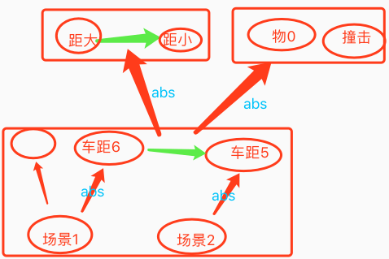 | 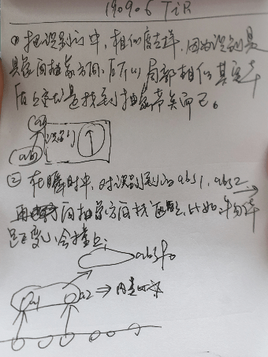 |
| 1. 从场景中,识别is出车; | 1. 向抽象方向匹配抽象概念; |
| 2. 从场景中,内类比,发现距离变化; | 2. 向抽象方向匹配抽象时序; |
|  |  |
| 3. 抽象匹配到,物体距离0时,距离为0时的撞击; |  |
| 4. 从而预测出,汽车为0时,会产生撞击; |  |

| 代码规划 >> |
| --- |
| 目标1: 小鸟看到坚果时,可以飞过去; |
| 目标2: 小鸟看到汽车时,可以躲避,与不作死; |
| 1. 每一桢输入的识别is; |
| 2. 由TIR触发shortMemory的内类比; |
| 3. 识别is+内类比一起运作,向抽象方向,匹配到符合当前`概念`与`时序`的预测结果; |
| 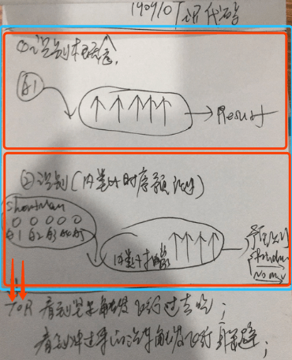 |

| TODOTOMORROW >> | STATUS |
| --- | --- |
| 1. 识别加上瞬时记忆中的时序预测; |  |


<br><br><br><br><br>


## n17p4 TIR&TOR-理性思维汇总
`CreateTime 2019.09.09`

| 思维模型 & 理性思维总结 >> |
| --- |
|  |
| 1. 绿色箭头为信息输入口; |
| 2. 红色为对网络模块的横向操作方向; (理性思维向感性,感性思维向理性) |
| 3. 理性思维的代码规划: |
| > TIR: 识别"概念与时序",并构建纵向关联; |
| > TOR: 类比决策,并修正结果输出; |


<br><br><br><br><br>


## n17p5 TIR_Fo()理性时序
`CreateTime 2019.09.11`

```c
/**
 *  MARK:--------------------理性时序--------------------
 *  @param alg_ps : 传入原始瞬时记忆序列 90% ,还是识别后的概念序列 10%;
 *  @desc 向性:
 *      1. ↑
 *      2. →
 *
 *  @desc 代码步骤:
 *      1. 用内类比的方式,发现概念的变化与有无; (理性结果)
 *      2. 用外类比的方式,匹配出靠前limit个中最相似抽象时序,并取到预测mv结果; (感性结果)
 *      3. 根据时序相似性 与 微信息差异度 得出 修正mv的紧迫度; (综合预测)
 *      4. 将fixMv添加到任务序列demandManager,做TOR处理;
 *
 *  @desc 举例步骤:
 *      1. 通过,内类比发现有一物体:方向不变 & 越来越近;
 *      2. 通过,识别概念,发现此物体是汽车; (注:已识别过,可以直接查看抽象指向);
 *      3. 通过,外类比,发现以此下去,"汽车距离变0"会撞到疼痛;
 *      4. 通过,"车-0-撞-疼"来计算时序相似度x% 与 通过"车距"y 计算= zMv;
 *      5. 将zMv提交给demandManager,做TOR处理;
 *
 */
+(void) TIR_Fo:(NSArray*)alg_ps canAss:(BOOL(^)())canAssBlock updateEnergy:(void(^)(CGFloat))updateEnergy{}
```
| A 时序预测代码分析 | B 取消内类比大小 |
| --- | --- |
| 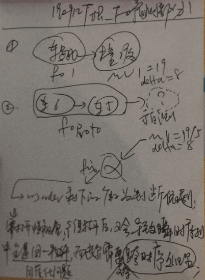 | 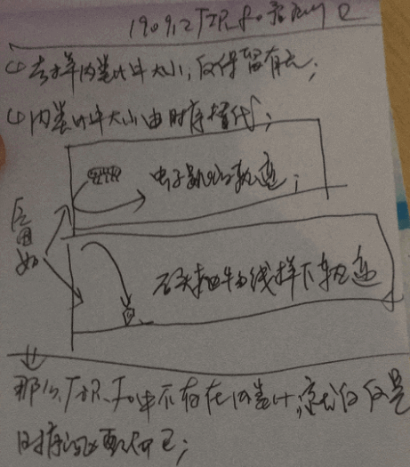 |

| 解析上图 >> |
| --- |
| 1. 根据上图分析,理性时序方法中,仅需要匹配时序,不需要做内类比; |
| 2. 关于仅做时序匹配后,需要支持`跨时序处理`,因为"车距从10到0"不在同一时序中; |
| TODOTOMORROW: 分析下`跨时序`的问题; |

| 用示例,分析TIR_FO()的代码步骤 >> |
| --- |
| **A 示例简要与解读:** |
| 1. 在瞬时序列中有: 概念1布老虎,概念2兔子被吃 |
| 2. 我们会联想到布老虎吃的,但我们明确的知道布老虎是不会吃兔子的; |
| 解读: 如果非理性循环去反思其错误,我们会坚信布老虎吃了兔子; |
| **B 示例步骤分析:** |
| 1. 将布老虎抽象识别为老虎 (识别只是进行抽象关联); |
| 2. 将兔子抽象识别为肉 (识别仅是进行抽象关联); |
| 3. 从`老虎`和`肉`的refPorts,找到抽象时序`老虎吃肉`; |
| **总结:** |
| 1. 对`匹配`到的时序,后续将要发生的事,为预测; |
| 2. 对`匹配`到的时序,所导致的mv变化,为预测; |


<br><br><br><br><br>


## n17p6 TIR模型
`CreateTime 2019.09.18`

<left>


TIR模型草图2 >>
</left>

| TIR模型图 >> |
| --- |
| 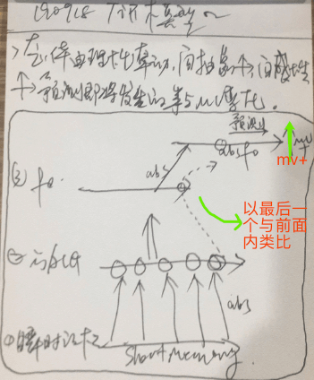 |
| 1. 整体由理性向感性,由具象向抽象; |
| 2. 预测即将发生的`事`与`mv变化`; |

| TIR_ALG模型 >> |
| --- |
| 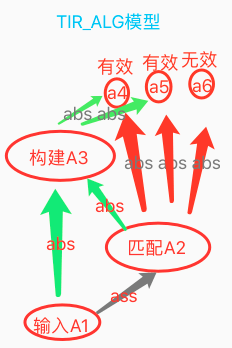 |
| 1. 输入A1,并识别匹配到A2; |
| 2. 构建A3,作为A1和A2的抽象; |
| 3. 好不容易建立起A2的absPorts,也要将有效的absPorts继给A3 (图中A4,A5); |
| <font color=AAAA00>修正: 图中有效的判定和迁移,为错误做法,原因参考代码段A</font> |

| TIR_FO模型 >> |
| --- |
|  |
| 1. 以F1中lastAlg为始; |
| 2. 先内类比,找出inner概念节点; |
| 3. 再根据F1中每个抽象概念联想被引用的时序: F2; |
| 4. 根据F1类比F2,抽象出F3 |
| 注1. 黑色为旧有网络部分; |
| 注2. 绿色为本次TIRFO新构建或产生的关联; |
| <font color=AAAA00>修正: 图中有效的判定和迁移,为错误做法,原因参考代码段A</font> |

| TIR_FO/ALG模型简化 >> |
| --- |
| 1. 问题: 模型中,绿色部分涉及太多节点,而每桢输入都变动这么多节点,显然不现实; |
| 2. 回答: 对A3/F3优先在A2.absPorts中找,否则再构建与迁移`有效Abs` |

| <font color=AAAA00>代码段A: 关于TIR_FO/ALG模型有效判定错误更正说明 >></font> |
| --- |
| 1. 为A2/F2的absPorts做有效判定,并迁移到A3/F3的做法,违背了思维才构建的原则; |
| 2. 在性能也可能导致卡壳,或者产生大量硬盘IO任务; |
| 3. 正确的做法,应该是不做有效判定和迁移,仅让A3/F3与A4/F4同时存在; |
| 4. 待往后,有别的事,思维想到有A3与A4进行类比之时,再做抽象关联; |

| TODO | STATUS |
| --- | --- |
| 1. 将createAbsAlg时,conAlg.absPorts中有效的部分,继给新抽象节点; | 取消 |
| 2. 将TIR_FO细化模型画出来,并作用于代码设计; | T |
| 3. 重新打开概念嵌套功能; (有什么和是什么,是两回事儿,故悔不该取消) |  |
| 4. 写构建A3/F3时,优先从A2.absPorts中找到,避免重复构建的代码; | T本来就有 |
| 5. 写迁移A2/F2的有效absPorts的代码; | 取消 |


<br><br><br><br><br>


## n17p7 TIR_FO模型到代码
`CreateTime 2019.09.24`

> 以前,手稿中提到的:"一切真实源于脑中信息"这句话是片面的;  
> 而是内与外之间的相对共同解决真实问题;

| TIR_FO()的代码到底需要匹配什么? |  |
| --- | --- |
| 1. 内类比大小,要去掉; (此处不做思考和处理) | 不做 |
| 2. 内类比有无,在此处,出现都是眼见为实; (要处理也在TOR阶段) | 不做 |
| 3. 故仅做时序匹配即可,从最后一个开始,向左,与时序做一一匹配,匹配到越多,越预测准确; | 做 |

| TIRFO()的联想匹配 >> |
| --- |
| 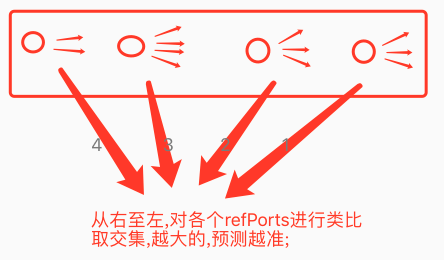 |
| 1. 只需要对fo.orders中,从右至左的alg.refPorts间,进行类比,找出共同的被引用时序,来找出最确切的预测; |
| <font color=red>问题: 但仅共同引用,并不能适用于时序;因为时序是有序的,我们需要对顺序做一些处理;参考以下方案表:</font> |

| FO匹配 | 顺序处理方案1 (多线) >> |
| --- | --- |
| 示图 |  |
| 说明 | 在一次次判定contains中,记录匹配到的index,下次时,仅截取有效部分进行判定; |
| 状态 | <font color=red>错误,不采用;</font> |
| 原因 | 因为,每一次,都取出对应的node,并判定index,性能吃不消; |
| 性能说明 | 多线联想再回来碰头,要求是必须做内存操作,否则无法解决性能问题; |

| FO匹配 | 顺序处理方案2 (单线) >> |
| --- | --- |
| 示图 | 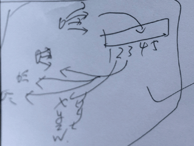 |
| 说明 | 以lastAlg为开头,其对应的前20个refPorts,取出,并向前逐步匹配别的alg |
| 状态 | <font color=green>正确,采用;</font> |
| 原因 | 此方案,有效的整合了,目前我们所具备的焦点,于此展开的流程,且无性能问题; |
| 性能说明 | 单线联想无性能问题; |

|  |
| --- |
| 1. 左图为TIR的整体模型草图; |
| 2. 右图为TIRFo的匹配判定示图; |
| 说明: 在TIRFo中,使用protoFo.content_ps的抽象(`TIRAlg的识别结果`),来做匹配(`外类比`),然后将评价得分(`图中例为4和2分`); |
| 预想: 能否将认知和识别的一部分融为一体,两者在向性上,都是从下向上,认知是向上构建体,识别是向上联想用,然后认知是向左指引,识别是向右预测; (95%不能) |

| 局部匹配时序的向性: 抽象示图 >> |
| --- |
|  |
| 1. 并非直接以protoNode进行识别时序,而是以其抽象`识4`来,进行时序匹配; |
| 2. 并非必须要求时序`fo2`对`识`这一层,进行匹配,而是也可以对其再抽象,进行匹配 |
| 3. 目前,如图所示,fo2与左侧概念节点的匹配,仅支持上一层的判断,不支持多层; |

| TIRFo与TIRAlg的协作 >> |
| --- |
| 目前仅支持先TIRAlg再进行TIRFo单线工作; |


<br><br><br><br><br>


## n17p8 TOR模型
`CreateTime 2019.09.30`

```
//一些TOR主方法的代码逻辑:
//1. 把mv预测,加入到reasonDemandManager中,同台竞争,而执行是为了避免;
//2. 判断matchValue的匹配度,对mv的迫切度产生"正相关"影响;
//3. 判断matchingFo.mv是否有值,如果无值,则仅需要对matchingFo和matchingAlg做理性使用;
```

| TOR模型思考实例 |  |
| --- | --- |
| 1. 白话 | 比如预测到车将撞到自己,那么我们可以去查看避免被撞的方法; |
| 2. 表示 | [alg(车) -> fo(车变近) -> mv(疼痛)] |
| 3. 行为化 | 比如,飞行改变距离,改变方向,改变车的尺寸,改变车的速度,改变红绿灯为红灯等方式; |

| TOR模型分析 (TOP和TOR的区别) |
| --- |
|  |
| 1. TOP通过,满足需求,找行为化,达成实; |
| 2. TOR通过,避免需求,找行为化,改变实; |

| TOR&TOP联合推断TOR模型 >> |
| --- |
|  |

| 思维4部分 |  | 联合分析 >> |
| --- | --- | --- |
| 1. TIP认 | `学习` `←` `↑` | 从具象认识为抽象,构建体,感性,有什么,经历 |
| 2. TIR知 | `识别` `→` `↑` | 从具象识别为抽象,联想用,理性,是什么,预测 |
| 3. TOP决 | `经验` `←` `↓` | 从抽象向具象,联想用,感性,想怎么做 |
| 4. TOR策 | `行为` `→` `↓` | 从抽象向具象,构建体,理性,该怎么做,顺应需求 |

> * 12整体为认知: 其中,`学习` 与 `识别` 相对,一体一用; 一感性一理性;  
> * 34整体为决策: 其中,`经验` 与 `行为` 相对,3和4的协作,一左一右分别运行;
> * 13整体: `抽象学习`就是为了用作`具象经验`; TIP-TOP `感性向方案的转移`
> * 24整体: `抽象识别`就是为了用作`具象行为`; TIR-TOR `理性实,对方案的解决`

| TOR模型分析 >> |
| --- |
| 1. 需求分析需要`TOR中的实`作为引子; |
| 2. 可以将 `实` 单独放到demandManager的激活序列中,以供TOP&TOR使用; |
| *比如: 用手上的拍子,挡开砸过来的乒乓球;* |

| TOR模型联合分析4 >> |
| --- |
| 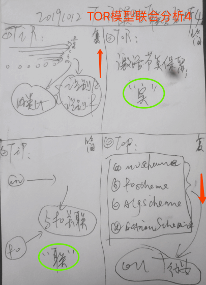 |
| 说明: |
| 1. 由上图可见,本次思维控制器的迭代,重点在于"TIR"部分的迭代; |
| 2. TIR部分,将识别与内类比都进行逐桢处理; |
| 3. 并且将识别算法细化,进行了全面的alg,fo,mv的识别与预测; |
| 4. 又通过最直接的方式,将其激活的节点(最后一桢的所有结果)进行保留; |
| 5. 供给TOP使用,以使TOP有更多的行为化成功; |


<br><br><br><br><br>


## n17p9 TOR代码实践1
`CreateTime 2019.10.13`

| 初步代码计划 >> |
| --- |
| 1. 把mv加入到demandManager; |
| `___1.1 判断matchingFo.mv有值才加入demandManager,同台竞争,执行顺应mv;` |
| `___1.2 判断matchValue的匹配度,对mv的迫切度产生"正相关"影响;` |
| 2. 将对matchingFo和matchingAlg做为激活节点,添加到demandManager中,供理性(实)使用; |
| 3. 对TOP的运作5个scheme做改动,以应用"激活"节点; |

| 理性mv加入demand逆向抵消的合理性分析 >> |
| --- |
| 前提: 预测并非已成现实,那么在demandManager中逆向抵消会导致并未真正解决; |
| 实例: 饿了,马上可以拿到面条,只是问题解决在望,并非已解决; |
| Q: 这里要思考一下,RMV和PMV这两者的区分,并分别给予合理的处理; |
| A: 望梅止渴,只要饥饿状态还在,会再次触发的,所以可以抵消; (错误,参考下表) |

| RMV加入DemandManager代码分析 >> |
| --- |
| > 望梅止渴,也是需要TOP分析的,所以要先把RMV加入到激活缓存,再TOP分析; |
| 1. RMV无需求 (如饱),则加入激活缓存activeCache,供TOP使用(如被饿需求用到) |
| 2. RMV有需求 (如饿),则加入demandCache (不逆向抵消); |
| 参见下图: |

|  |
| --- |
| **TOP中对应改动 >>** |
| 1. 在每个scheme中,对activeCache做优先使用; |
| 2. 此处关键难点,在于TOP"感"想法,和TOR的"实"数据间的协作; |


<br><br><br><br><br>


## n17p10 TOR代码实践2
`CreateTime 2019.10.16`

| TC模型联合分析 之 TOR与TOP的协作分析 >> |
| --- |
|  |
| 1. 由上图可见,activeCache应由TOP来提供; |
| 2. 然后TOR中,来负责`决策末`的行为化; |
| 注: TOP有可能独立完成行为化,TOR只是更加补刀完善; |
| 如: TOP想吃面,但没面,而此时TOR有面时,可以与其对应行为化; |

| TOP&TOR协作 方案一 >> 65% |
| --- |
| 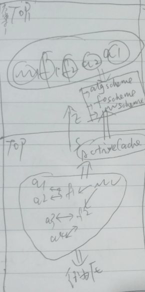 |
| 说明: 此方案由TOP为始,提供"激活池"给TOR,做最终的决策; |
| 优点: 更解耦 `所以需要分析单靠TOP能否解决所有情况的决策任务` |
| 1. 将RMV提交给demand后,不排优先级; |
| 2. 此处取激活池时,先取demand.firstDemand(); |
| 3. 再根据demandModel取其下的:"激活池"; |
| 4. 将TOP的:条件"有,无"的分析,以TOR中的"实"为出发点; |
| 注. 思考下,TOP的代码,如何拆分,把理性的部分拆过来; |
| 注. 或不用拆TOP,而是直接将demand中的"不应期"也作为"激活池",在此处使用判定; |
| 拉票1: TOP为始,TOR为终,这一点更加符合"信息熵减机"模型中相对的理念; |
| 拉票2: 从决策复杂度上看,单靠TOP并不能解决所有情况,所以两条scheme线有必要; |
| 拉票3: 应对TOP的"不应期",又被当做"激活池"使用,相关代码都在TOP中会显得混乱 |

| TOP&TOR协作 方案二 >> 35% |
| --- |
| 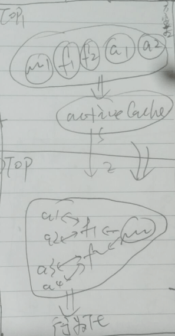 |
| 说明: 此方案由TOR为始,提供"激活池"给TOP,做最终的决策; |
| 优点: 更简单,`所以需要重点判定,分解为两条scheme线的必要性` |
| 1. TOR中的激活节点,是可以作用于任何任务的; |
| 2. 所以应该将TOR的节点,作为激活池;供TOP使用,帮助TOP把感性的路跑通; |
| 3. 供RMV时,把思维激活,然后,TOP.dataOut()执行,并使用上激活池,即可,直接看行为化结果; |
| 注. TOP初轮理性决策时,已经将很多设为不应期; |
| 注. 而这些不应期,有了TOR的"实"也许就可以行为化成功; |

| 问题: |  |
| --- | --- |
| Q1 | 思考下,把mv提交给demandManager后,是否需要排好优先级; |
| A1 | 不需要,因为使用时,会实时排序; |


<br><br><br><br><br>


## n17p11 TOR代码实践3
`CreateTime 2019.10.18`

| 方案1代码实践分析 >> |
| --- |
| 1. 整理demandModel.subModel.except_ps,并依此,做TOR中的匹配,进尔行为化; |
| 2. 整理TOP中的行为化代码,看是否拆分一些出来到TOR中; |
| 3. TOR的向性,是从左至右,从上至下,这一原则一定要符合; |
| 4. TOR的思维energy,源于其预测这一点,如果不足够时,可以尝试别的方式,比如依curMvModel再次给思维注入一定量的活跃度; |
| 5. demandModel.except_ps标志了不想,mvModel.except_p标志了行为化失败; |

| TOP&TOR协作的向性示图 >> |
| --- |
|  |
| 1. 如图: 将行为化整体从TOP交由TOR来执行; |
| 2. 在TOR达标后,最终应输出一个行为化成功的actions输出; |

| TODO >> | STATUS |
| --- | --- |
| 1. 更细化的保留行为化失败的细节原因(至少到absAlg),因为TOR要用; | 整个行为化交给TOR执行 |

| TOAlgScheme行为化迭代计划 >> |
| --- |
| 1. 把TOR中:"激活池"数据,作用到TOAlgScheme的行为化中; |
| 2. 针对"概念嵌套"的变动,对单个概念行为化convert2Out_Single()方法变动 |
| 3. 针对"内类比大小"的取消,对行为化相关代码做变动; |

| TOR将ActiveCache加入行为化示图 >> |
| --- |
| 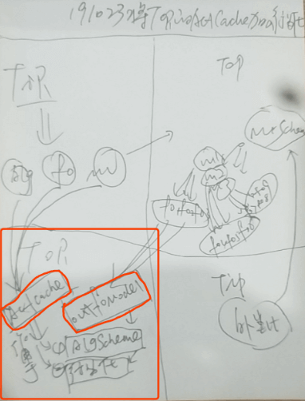 |
| 1. matchMv(如饱) 预测对于demandManager.curMvModel(如饿) 的直接解决暂不支持; |
| 2. 但如果支持,可能会大大提高行为化成功率 (如,直接吃面前的面,肯定比买菜做面行为化成功率更高) |


<br><br><br><br><br>


## n17p12 TOR之行为化代码迭代
`CreateTime 2019.10.23`

| 行为化代码迭代分析(现有流程) >> |
| --- |
| .png) |
| 1. 现有流程,仅是针对每个algNode进行行为化,(双线) |
| 2. 双线,分别为:直接cHav,和cHav+cValue修正; |
| 3. TODO: 中间红椭圆框起来部分,可以直接由activeCache来解决; |

| >> | 行为化的目的 |
| --- | --- |
| 问题 | 行为化的目的,二选一,如下: |
|  | A. 为了一定能解决问题,而判定行为化是否成功; (以前) |
|  | B. 行为化仅是为了提高预测匹配度 (或做符合预测的事); |
| 分析 | 站在系统角度,和自省事例角度,综合分析: |
|  | 1. 失去至亲的人,用餐时会摆一副碗筷在餐桌上;`投B一票` |
|  | 2. 提高匹配度,就会提高对应的预测mv.urgentTo值;`投B一票` |
|  | 3. 越多次循环的理性逻辑运算,与真实未来会越难匹配(即使逻辑严密)`投B一票` |
|  | 4. B会使内核demandManager和决策更加细化,需要工作量`投A一票` |
|  | 5. 小鸟演示,用不着B,A应该足够;`投A一票` |
| 结果 | 因当前A够用,所以虽然B更正确,但现在选`A`,未来迭代`B`; |

| 行为化与ActiveCache的协作 >> |
| --- |
| 1. matchAlg与foModel.itemAlg的匹配判定; (比如,要吃食物,有面) |
| 2. matchAlg向foModel.itemAlg的修正; (比如,要吃坚果,坚果远,得拿过来) |
| 3. matchFo与当前demandModel匹配直接解决问题; `暂不支持` `参考迭代计划28` |

| 重新打开概念嵌套 >> |
| --- |
| 1. 回忆下当时关闭的原因; |
| 2. 打开嵌套的匹配问题; 如: |
| > 1. A1(A2[abc]) 和 A3(A4[ab]); |
| > 2. A1和A3完全不同,但A2和A4却差了个c,要想分析出A1A3的差别,就得`解套`; |
| > 3. 或不解套,就直接判定为A1和A3不同; |
| 总结: 迟早会打开,但太麻烦,尝试下能不能`偷懒`,`先不打开`; |
| 再总结: 必须先恢复概念嵌套!内类比和行为化的代码目前都支持;不必为了愉懒,走烦杂的回头路; |

| 尝试在不恢复概念嵌套的情况下,行为化 >> |
| --- |
| 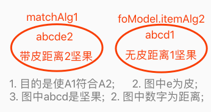 |
| 1. 单特征概念节点 (目前是单稀疏码概念) 的`有无`问题; (图中为去皮问题) |
| 2. 距离的`变化`问题,需要匹配时序中,飞行经历来解决; |
| 3. 因为matchAlg有可能提供坚果,也有可能提供锤子; |
| 4. 所以只需将matchAlg融入到原有的行为化(结构化循环)中,使其按原方式运作即可; |
| 注: 以后根据时序来解决,`变化`的问题,而目前暂用`内类比大小`来解决; |
| 注: 内类比大小,还未取消; |
| 注: 概念嵌套,还未恢复; |

| 尝试在不恢复概念嵌套的情况下,行为化 TODO: | STATUS |
| --- | --- |
| 1. 复查下`概念有无`的代码,看是否需要改动; |  |
| 2. 根据时序来解决,`变化`的问题,或使用当下更简单的`内类比大小`来解决; |  |
| 3. 将matchAlg融入到行为化中,提供`有`; |  |
| 4. 恢复概念嵌套; |  |


<br><br><br><br><br>


## n17p13 概念嵌套
`CreateTime 2019.10.28`

| 思考 >> | 是否恢复嵌套 ? |
| --- | --- |
| 1. 现状 | 内类比和行为化代码,都支持嵌套; |
| 2. 知识结构 | 嵌套是组分关联,而非抽具象关联; |
| 3. 投不恢复票 | `5%` |
|  | a. 导致不灵活 `解决:抽象一致即可` |
|  | b. 导致多层解套的性能问题 `解决:不解套即可` |
| 4. 投恢复票 | `95%` |
|  | a. 内类比需要支持cHav |
|  | b. 行为化需要支持cHav |
|  | c. 有什么 (含4个轮的车) |
|  | d. 美国有总统 (抽象国家有国王,的概念嵌套) `参考思考计划1` |
|  |  |
| 5. 抽具象 | 源于外类比 |
|  | 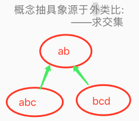 |
| 6. 组分 | 源于内类比 |
|  | 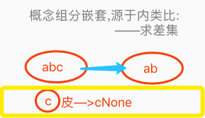 |
| 7. 代码 | Q: refPorts_Fo和refPorts_Alg分开,还是放一起? |
|  | A: 分开 `95%` |
|  | A: 放一起 `5%` |
| 8. 代码 | Q: content_ps_Alg和content_ps_Fo分开,还是放一起? |
|  | A: 放一起 |

| 内类比全流程回顾 >> |
| --- |
| 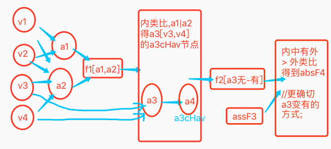 |
| 1. a3不能与a2/a1有抽具象关系,因为"皮"不是"坚果"; |
| 2. a4不能与a3有抽具象关系,因为这两者是嵌套引用关系 (可写成refPorts_Inner) |
| 注: a3要去重,因为要根据a4的引用,联想assF3,外类比,找更确切; |
| 注: a4的联想,直接由TCUtils.getAlgNodeWithInnerType()找索引完成; |

```c
//静概念与动概念的关系:   a4的知识表示方案:
//1. 现代码方案: (抽具象关系)
a4.identifier = a3.identifier
a4.content_ps = value_p(cHavValue/cNoneValue)
a3.absPorts 指向 a4
a4.conPorts 指向 a3

//2. 现规划方案: (组分关系)
a4.content_ps = @[a3.pointer]
a3.refPorts_Inner 指向 a4;

//3. 结果:
目前,先不改为方案二,保持方案一,并把方案1的抽具象关系切断;
原因,因为太麻烦了,目前所有的联想索引,等已经写好,懒得改;先放迭代计划中吧;
```

```c
//TODOTOMORROW:
1. 目前,内类比,已经支持了cHav;
2. 以此,在行为化中,也可以使用这些cHav;
3. 但目前并未恢复概念嵌套,如果不影响内类比和行为化运作,就先不恢复;
```


<br><br><br><br><br>


## n17p14 回到理性决策
`CreateTime 2019.11.04`

> 更名警告:
> 1. 以上matchAlg&matchFo; 由activeCache更名为瞬时网络(shortMatch);

| 理性决策分类 >> |
| --- |
| 1. 瞬时 (从TIR中传递过来的识别与预测等) |
| 2. 短时 (优先取内存网络) |
| 3. 长时 (以硬盘网络为根基) |

| TOAlgScheme的大BUG记录与总结 (历时三个月+) |
| --- |
| Q: 190725,outMvModel取到解决问题的mvDirection结果,但再往下仍进到反射输出,查为什么行为化失败了; |
| A: 190820-191022: 由此处行为化失败率太高,而引出必须细化TR`理性思维`; |
| A: 191104: 行为化失败率太高,可能仅是因为内类比构建时未去重,导致无法索引到 |
| R: 191104: 但也因此而细化了理性思维,也细化了瞬时记忆对理性的支持 |
| R: 191104: 此次的TR细化,尤其在TR支持瞬时网络,对TR意义重大 (参考下表) |

| 网络\思维 | 理性作用力 | 感性作用力 |
| --- | --- | --- |
| **瞬时** | 大 | 小 |
| **短时** | 中 | 中 |
| **长时** | 小 | 大 |

| 代码TODO >> |
| --- |
| 1. 在所有outScheme中,涉及短时和长时的前面加上对瞬时的支持; |
| 2. 总结下outScheme中,有多少处使用短时&长时,在前面插入瞬时; |
| 3. 行为化中,针对概念嵌套的代码 (如fo.content_ps.count=2),先去掉; |
| `181`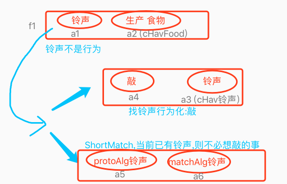 |
| 4. 考虑将TOP.foScheme搬到TOR,优先使用matchFo做第一解决方案;(TOP仅决定mv优先级和评价,其余全由TOR来完成) |

| 行为化实例辅助分析代码 >> |
| --- |
| `182`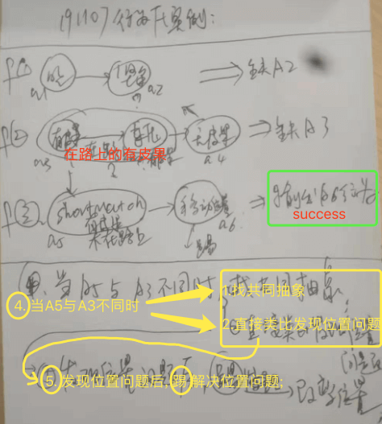 |
| 1. 发现"没什么"时; (如图第1步,坚果a2 或 第四步对比A5,A3) |
| > 优先取瞬时 (可直接对比,因为A5是瞬时,本来就有) |
| > 其次取短长时 (需要先索引联想到A5,那么问题在于,如何联想到局部匹配的cHav?) |
| 问题: 取短长记忆cHav时,如何联想到局部匹配的cHav? |
| 分析1: 以前的_sub方法,先拆分成一个subAlg_p一个value_p,再分别联想 |
| 分析2: 此处则不能1拆为2,只能去直接判断局部匹配的cHav |
| 分析3: 那么,现在的只能通过identifier来取绝对匹配的cHav的方式,就行不通了; |
| 答案: 通过A3,优取1个绝对匹配alg,次取n个局部匹配alg,而根据alg取其cHav; |
| 解析: 即,优先取绝对匹配->cHav,行不通,再依次取局部匹配alg->cHav; |
| 解析: 这也是一个递归过程,每循环看是否取到A5 (是否取到就是评价); |
| 191113补充: 在第4步中,应该选择4.1找共同抽象,并发现距离问题;补充见MC关系表和示图184,185,186 |

| 2Out_single() | 单概念行为化之找到A5 >> |
| --- | --- |
| 1. 瞬时 | 优先类比瞬时alg,看是否匹配到 (并类比缺失部分,循环); |
| 2. 短长绝对匹配 | 其次取短长alg绝对匹配,后取其cHav; (注: 核实下将absAlg去重,为了避免绝对匹配重复导致的联想不以cHav); |
| 3. 短长局部匹配 | 再次,取短长alg局部匹配,递归取3个左右,逐个取并取其cHav (并类比缺失部分,循环); |

| 2Out_Single()之瞬时匹配分析 >> (废弃) |
| --- |
| `183`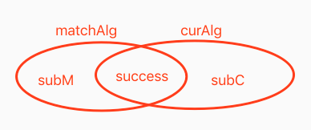 |
| Q1. subM是否多余 (如坚果带皮) |
| Q2. subC是否需满足 (如坚果不在身边) |
| **废弃原因: 因为TOR是用网络,而不是建,此处不允许类比,只允许用即有关联;** |


> **Q1实例分析：(废弃)**  
> 　　有一些信息是不影响的（如坚果有个小斑点），另外一些则影响（如坚果皮）。  
> 　　是否影响的前提条件之一：是必须有此概念（比如坚果皮）。实例如：非美术生，分不清粉红和桃红，因为在稀疏码到特征，更没有这个细化的概念。  

> **Q1Q2的两个解决方案：(废弃)**  
> 　　1. 对subM和subC做单独的分析，看是否多余或需满足，最终设计完善代码，注：可同时完成思考计划2。（未来采用）  
> 　　2. 在本v2.0版本，做完美匹配，比如，必须匹配到：“无皮无斑点的在身边的坚果”。（当前采用）

> **Q1Q2方案2详解：(废弃)**
> 1. 其实就是：“去掉subM，满足subC”。
> 2. success是否需要达到一个匹配度? 比如:60%;

```java
//小节总结:
1. 制定了瞬时模型:shortMatchModel
2. 制定本次迭代主要针对瞬时作用于理性思维的方向;
3. 瞬短长时记忆,分别对思维的作用力;
4. 在单概念行为化中,瞬时优先的策略;
5. 分析决策递归循环的实例182图,以标出A5问题,和A5对比A3的问题 (下节继续);
```

<br><br><br><br><br>


## n17p15 回到理性决策2
`CreateTime 2019.11.12`

> 本节大方向和原则如下:
> 1. 大方向: 整体保持Fo&Alg协作的整体递归,细节以瞬时优先做单个curAlg匹配;
> 2. 原则: 在TOR中,以用为主,而不是学;
>
> 名词解释:
> 1. curAlg: 在行为化时,当前正在行为化的单个概念,命名为curAlg;
> 2. matchAlg: 在行为化时,瞬时模型中,存储着刚刚识别到的概念,命名为matchAlg;
> 3. TOR主辅原则: 在理性决策中,以递归为主,匹配为辅 `优先级: 1瞬2短3长`;
> 4. MC: 指MatchAlg和CurAlg的缩写;

| 长时和瞬时的协作分析 >> (下见瞬时表和长时表) |
| --- |
| 1. 长时fo的解决效果好 `递归` //参考示图182,在递归中把握主节奏; |
| 2. 瞬时alg的更实际可行 `匹配` //每次取cHav时matchAlg优先,辅助行为化成功 |
| 注1: 在整体递归中: `长时为主,瞬时为辅` |
| 注2: 在单条cHav判定中: `瞬时优先,长短时在后` |

| 瞬时表 | matchAlg和curAlg匹配判定 >> |
| --- | --- |
| 原则 | 只能根据matchAlg的关联来寻找解决方法, (`用`而不是`学`) |
| 代码 | 取matchAlg.absPorts和curAlg.absPorts,查看其关系如下图: |

| MC关系表 | 184 | 185 | 186 |
| --- | --- | --- | --- |
| 示图 | 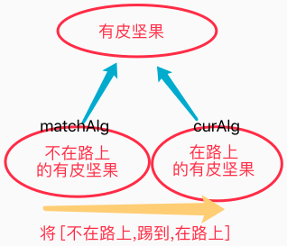 | 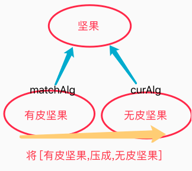 | 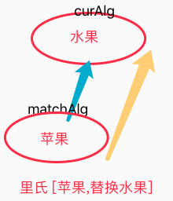 |
| MC关联 | 有共同抽象 | 有共同抽象 | 有抽象关联 |
| 代码加工 | 将M不同的部分加工成C | 将M多余的部分加工成C | M直接当C使用 |

| 长时表 | 短长时的单概念行为化模型示图 >> |
| --- | --- |
| 示图 | .png) |
| 注1 | 从红线可见,每次失败后,要向具象递归; (找更具体的实现,里氏替换抽象C) |
| 注2 | f1,f2只要有一个成功,即可退出递归; |
| 注3 | f3时,a5成了新的条件Alg,从而递归到f4,才成功退出递归; |
| 实例 | a1为食物,a3为坚果,a5为有皮坚果,f3中A5设为(路上的有皮坚果),f4设为(不在路上的有皮坚果,踢,路上的有皮坚果); |
| 实例解释 | 如下步骤: `其中f3[0]表示时序f3中的下标第1个元素` `a2例中略` |
|  | 1. 未找到食物(a1)的cHav; |
|  | 2. 找到路上的有皮坚果(f3.a5)可以生产坚果(a3) |
|  | 3. 找到不在路上有皮坚果(f4[0])可以踢(f4[1])成在路上的有皮坚果(f4[2]) |
| 疑问 | f3和f4时序是无法直接联想到的; |
| 解答 | 见下表(协作表); |

| `瞬时MC`和`长时递归`的协作 >> |
| --- |
| 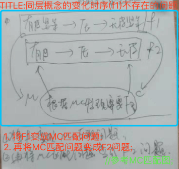 |


<br><br><br><br><br>


## n17p16 行为化代码实践
`CreateTime 2019.11.14`

> 本节目的:
> 1. 行为化的代码架构设计;
> 2. 行为化的代码迭代实践;

| 单概念行为化代码设计 >> |
| --- |
| 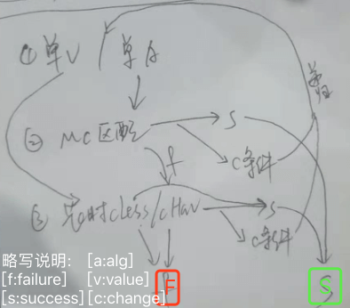 |

```objective-c
//单概念行为化伪代码:

/**
 *  MARK:--------------------总入口fo--------------------
 */
-(void) convert2Out_Fo:(NSArray*)curAlg_ps{
  //1. for循环调用convert2Out_Alg();
}

/**
 *  MARK:--------------------单个概念的行为化--------------------
 */
-(void) convert2Out_Alg:(AIKVPointer*)curAlg_p{
  //1. MC之里氏匹配;
  //  2. 匹配 -> success
  //  3. 无匹配 -> 做同级匹配:
  //      4. 无匹配 -> 跳到12;
  //      5. 匹配 -> changeM2C,判断条件为value_p还是alg_p;
  //          6. alg_p,递归到1;
  //          7. value_p,调用convert_RelativeValue(value_p),找glAlg;
  //            8. 未找到,跳到12;
  //            9. 找到,调用relative_Fos(); 判断range是否导致转移;
  //              10. 转移,递归到convert2Out_Fo(range);
  //              11. 未转移,success
  //12. 长时hnAlg,是否联想到;
  //  13. 未联想到,failure
  //  14. 联想到,调用relative_Fos(); 判断range是否导致转移;
  //      15. 转移,递归到convert2Out_Fo(range);
  //      16. 未转移,success
}

/**
 *  MARK:--------------------对单稀疏码的变化进行行为化--------------------
 */
-(void) convert2Out_RelativeValue:(AIKVPointer*)value_p type:(AnalogyInnerType)type{
  //1. 根据type和value_p找glAlg;
  //  2. 找不到,failure;
  //  3. 找到,调用relative_Fos();
}

/**
 *  MARK:--------------------末口fos--------------------
 */
-(void) convert2Out_RelativeFo_ps:(NSArray*)relativeFo_ps{
  //1. for循环递归到fo总入口,有一个成功即可;
}
```
*-----代码实践分界线,此线以下笔记为行为化代码迭代后-----*

| 行为化新架构图 |
| --- |
| 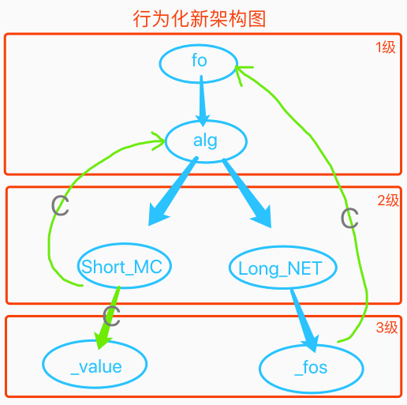 |
| 1. 图中C为change转移的缩写; |
| 2. 图中绿色线为转移后流程线; |
| 3. 图中左右两根绿色线,为递归线; |
| 4. 补充箭头: (_value) -> (_fos) //_value的变化,也需时序来实现; |


<br><br><br><br><br>


## n17p17 foScheme()的迁移
`CreateTime 2019.11.21`

> 1. foScheme在TOP中,太过于感性,需要向行为化迁移,以获得更多的行为化成功率;
> 2. 比如: 假如坚果已经在路上放着,那么我们只需要等绿灯,把坚果压破即可;
> 3. foScheme也需要MC优先参与竞争;
> 4. 比如: 饿了,面前的饭已经快烧好了,我们需要知道加盐关火即可,而不是必须重新找另外一个解决方案 (如下馆子);


<br><br><br><br><br>


## TODOLIST

| TODO >> | STATUS |
| --- | --- |
| 1. "嵌套概念"取消了,决策时行为化的代码逻辑,也得相应着改下; |  |
| 2. 训练机,可退一步,先采用he做命令触发,然后结合mac的git来做版本控制; |  |
| 3. 恢复出TIR的内类比代码,并每桢输入都执行,最后一条的内类比; | 转迭代计划26 |
