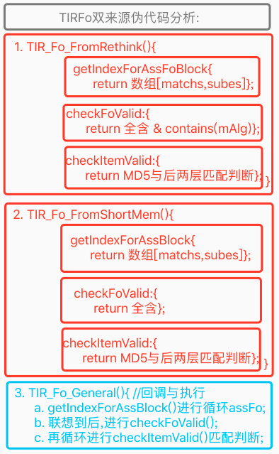

# 训练

<!-- TOC -->

- [训练](#%E8%AE%AD%E7%BB%83)
  - [n18p1 回归训练](#n18p1-%E5%9B%9E%E5%BD%92%E8%AE%AD%E7%BB%83)
  - [n18p2 时序识别测试](#n18p2-%E6%97%B6%E5%BA%8F%E8%AF%86%E5%88%AB%E6%B5%8B%E8%AF%95)
  - [n18p4 价值概念化](#n18p4-%E4%BB%B7%E5%80%BC%E6%A6%82%E5%BF%B5%E5%8C%96)

<!-- /TOC -->

***

### n18p1 回归训练
`CreateTime 2019.12.27`

> 经过4个多月完善理性思维,我们可以回归到乌鸦的训练中来,本节,重点对小鸟成长训练,做步骤规划和记录;

| 训练飞行 `From N16P16` | TITLE | DESC |
| --- | --- | --- |
| 1 | 直投 | 知道吃坚果解决饥饿问题 |
| 2 | 马上饿 | 有解决饥饿的需求 |
| 3 | 远投 | 看到坚果吃不到,知道是因为距离问题,但解决不了 |
| 4 | 摸翅膀 | 学习飞行方向所导致的距离变化;(飞8方向x坚果8方向=64映射) (小鸟更关注飞近,而非飞远) |
| 5 | 主动飞 | 小鸟可逐步学会飞行方向越来越准确; |
| 6 | 主动吃 | 小鸟可在飞行坚果旁边时,吃掉坚果; |

| 18011 | 训练进度可视化 |
| --- | --- |
| 功能 | 技能检测,进度可视 |
| 触发 | 点击进行技能检测 |
|  | 1. 会吃 √ |
|  | 2. 会飞 ✕ |
|  | 3. 会躲 |
|  | 4. 会疼 |

     

### n18p2 时序识别测试
`CreateTime 2020.01.06`
> **简介:**  
> 　　本节处理在TIR_Fo的测试中,遇到的问题;  
> **本文名词与缩写解析:**
>   1. 四层: parent层,proto层,match层,abs层 (参考18021示图)
>   2. 前两层: parent层和proto层;
>   3. 后两层: match层和abs层;

| 18021 | 时序识别辅助测试图 |
| --- | --- |
| 示图 |  |

| 18022 | BUG | STATUS |
| --- | --- | --- |
| 1 | 测出A1.absPorts为空的BUG; |  |
| 2 | shortMemFo.last_p取出的是parentA1,而不是protoAlg的问题 |  |
| 3 | 在TIR_Fo的返回结果总是nil (因以上各BUG导致); |  |

| 18023 | 迭代`全含` |
| --- | --- |
| 说明 | 对于matchFo的前半匹配部分,要全含; |
| 举例 | [老虎,跑过来,咬我],前半部分,即`老虎`和`跑过来`要全含,预测`咬`; |

| 18024 | 迭代`四层fo` |
| --- | --- |
| 说明 | 支持四层.refPorts联想assFo; |
| 举例 | 否则看到重石压自己,会因为未经历过重石压,而不懂预测 |
| 附注 | 前两层主要做引导,后两层联想assFo (match优先,abs次之); |

| 18025 | 迭代`四层alg` |
| --- | --- |
| 说明 | 判断fo.itemAlg匹配时,先做contains判断为true,后做四层absPorts匹配 |
| 举例 | 非老虎时,另一种巨兽冲过来,一样预测到咬/危险; |
| 废弃 | 以上contains判断废弃,用MD5替代; |
| 附注 | 前两层主要做引导,后两层做MD5匹配 (match优先,abs次之); |

| 18026 | TIR_Fo源于瞬时/反思的伪代码 |
| --- | --- |
| 伪代码 |  |
| 注1 | 用于解决: shortMem有四层,而rethink只有两层; |
| 注2 | rethink除全含外,还须包含mAlg,而shortMem只需要全含即可; |
| 实际代码 | 1. rethink中,包含mAlg用assFoBlock()来实现了; |
|  | 2. 废弃checkFoValid,改成了独立checkFoValid()来实现了; |
|  | 3. 废弃getIndexForAssBlock,改成一条条回调assFoBlock来实现了; |

     

### n18p4 价值概念化
`CreateTime 2020.01.13`

> 1. 本文中情感,系价值的概念化 (类似时序概念化);
> 2. 大多数人都喜欢正能量,不喜欢负能量,但其实正负本来就是相对的,不可能把某个完全摒弃掉;

| 18041 | 价值概念化 >> | 简 |
| --- | --- | --- |
| 喜 | 对于已`正价值`的`感性`的喜悦 | 已正感 |
| 好 | 对于已`正价值`的`理性`的偏好 | 已正理 |
| 悲 | 对于已`负价值`的`感性`的悲伤 | 已负感 |
| 怒 | 对于已`负价值`的`理性`的愤怒 | 已负理 |
| 盼 | 对于将`正价值`的`感性`的期盼 | 将正感 |
| 思 | 对于将`正价值`的`理性`的思念 | 将正理 |
| 忧 | 对于将`负价值`的`感性`的担忧 | 将负感 |
| 恐 | 对于将`负价值`的`理性`的恐惧 | 将负理 |
| 注: | 文中,感性表示网络中mvModule |  |
| 注: | 文中,理性表示dataModule(含概念与时序) |  |

     
