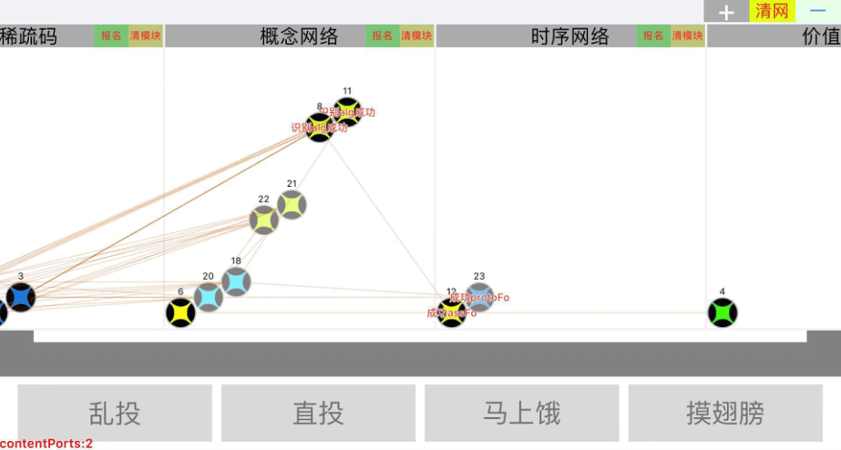
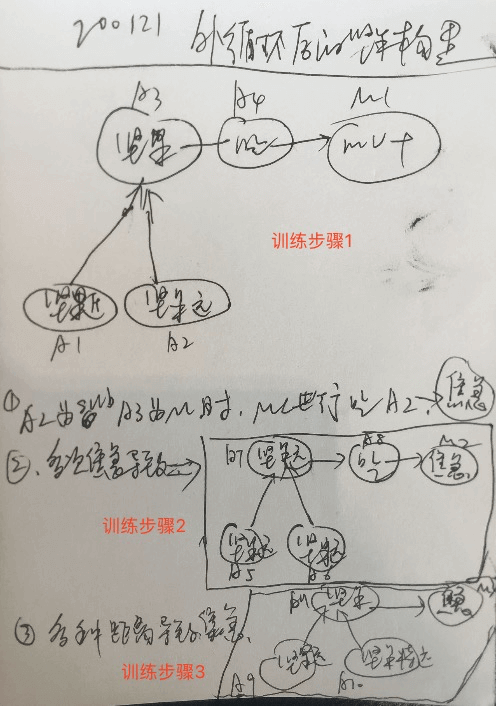

# 测试 & 细节改动 & 训练

<!-- TOC -->

- [测试 & 细节改动 & 训练](#%E6%B5%8B%E8%AF%95--%E7%BB%86%E8%8A%82%E6%94%B9%E5%8A%A8--%E8%AE%AD%E7%BB%83)
  - [n18p1 训练进度可视化](#n18p1-%E8%AE%AD%E7%BB%83%E8%BF%9B%E5%BA%A6%E5%8F%AF%E8%A7%86%E5%8C%96)
  - [n18p2 时序识别测试](#n18p2-%E6%97%B6%E5%BA%8F%E8%AF%86%E5%88%AB%E6%B5%8B%E8%AF%95)
  - [n18p4 价值概念化](#n18p4-%E4%BB%B7%E5%80%BC%E6%A6%82%E5%BF%B5%E5%8C%96)
  - [n18p5 测试训练](#n18p5-%E6%B5%8B%E8%AF%95%E8%AE%AD%E7%BB%83)
  - [n18p6 反省](#n18p6-%E5%8F%8D%E7%9C%81)
  - [n18p7 反省2: 外循环类比 (距离分析)](#n18p7-%E5%8F%8D%E7%9C%812-%E5%A4%96%E5%BE%AA%E7%8E%AF%E7%B1%BB%E6%AF%94-%E8%B7%9D%E7%A6%BB%E5%88%86%E6%9E%90)
  - [n18p8 学用常识:`远果不能吃`](#n18p8-%E5%AD%A6%E7%94%A8%E5%B8%B8%E8%AF%86%E8%BF%9C%E6%9E%9C%E4%B8%8D%E8%83%BD%E5%90%83)

<!-- /TOC -->

***

### n18p1 训练进度可视化
`CreateTime 2019.12.27`

> 经过4个多月完善理性思维,我们可以回归到乌鸦的训练中来,本节,重点对小鸟成长训练,做步骤规划和记录;

| 训练飞行 `From N16P16` | TITLE | DESC |
| --- | --- | --- |
| 1 | 直投 | 知道吃坚果解决饥饿问题 |
| 2 | 马上饿 | 有解决饥饿的需求 |
| 3 | 远投 | 看到坚果吃不到,知道是因为距离问题,但解决不了 |
| 4 | 摸翅膀 | 学习飞行方向所导致的距离变化;(飞8方向x坚果8方向=64映射) (小鸟更关注飞近,而非飞远) |
| 5 | 主动飞 | 小鸟可逐步学会飞行方向越来越准确; |
| 6 | 主动吃 | 小鸟可在飞行坚果旁边时,吃掉坚果; |

| 18011 | 训练进度可视化 |
| --- | --- |
| 功能 | 技能检测,进度可视 |
| 触发 | 点击进行技能检测 |
|  | 1. 会吃 √ |
|  | 2. 会飞 ✕ |
|  | 3. 会躲 |
|  | 4. 会疼 |

     

### n18p2 时序识别测试
`CreateTime 2020.01.06`
> **简介:**  
> 　　本节处理在TIR_Fo的测试中,遇到的问题;  
> **本文名词与缩写解析:**
>   1. 四层: parent层,proto层,match层,abs层 (参考18021示图)
>   2. 前两层: parent层和proto层;
>   3. 后两层: match层和abs层;

| 18021 | 时序识别辅助测试图 |
| --- | --- |
| 示图 |  |

| 18022 | BUG | STATUS |
| --- | --- | --- |
| 1 | 测出A1.absPorts为空的BUG; |  |
| 2 | shortMemFo.last_p取出的是parentA1,而不是protoAlg的问题 |  |
| 3 | 在TIR_Fo的返回结果总是nil (因以上各BUG导致); |  |

| 18023 | 迭代`全含` |
| --- | --- |
| 说明 | 对于matchFo的前半匹配部分,要全含; |
| 举例 | [老虎,跑过来,咬我],前半部分,即`老虎`和`跑过来`要全含,预测`咬`; |

| 18024 | 迭代`四层fo` |
| --- | --- |
| 说明 | 支持四层.refPorts联想assFo; |
| 举例 | 否则看到重石压自己,会因为未经历过重石压,而不懂预测 |
| 附注 | 前两层主要做引导,后两层联想assFo (match优先,abs次之); |

| 18025 | 迭代`四层alg` |
| --- | --- |
| 说明 | 判断fo.itemAlg匹配时,先做contains判断为true,后做四层absPorts匹配 |
| 举例 | 非老虎时,另一种巨兽冲过来,一样预测到咬/危险; |
| 废弃 | 以上contains判断废弃,用MD5替代; |
| 附注 | 前两层主要做引导,后两层做MD5匹配 (match优先,abs次之); |

| 18026 | TIR_Fo源于瞬时/反思的伪代码 |
| --- | --- |
| 伪代码 |  |
| 注1 | 用于解决: shortMem有四层,而rethink只有两层; |
| 注2 | rethink除全含外,还须包含mAlg,而shortMem只需要全含即可; |
| 实际代码 | 1. rethink中,包含mAlg用assFoBlock()来实现了; |
|  | 2. 废弃checkFoValid,改成了独立checkFoValid()来实现了; |
|  | 3. 废弃getIndexForAssBlock,改成一条条回调assFoBlock来实现了; |

     

### n18p4 价值概念化
`CreateTime 2020.01.13`

> 1. 本文中情感,系价值的概念化 (类似时序概念化);
> 2. 大多数人都喜欢正能量,不喜欢负能量,但其实正负本来就是相对的,不可能把某个完全摒弃掉;

| 18041 | 价值概念化 >> | 简 |
| --- | --- | --- |
| 喜 | 对于已`正价值`的`感性`的喜悦 | 已正感 |
| 好 | 对于已`正价值`的`理性`的偏好 | 已正理 |
| 悲 | 对于已`负价值`的`感性`的悲伤 | 已负感 |
| 怒 | 对于已`负价值`的`理性`的愤怒 | 已负理 |
| 盼 | 对于将`正价值`的`感性`的期盼 | 将正感 |
| 思 | 对于将`正价值`的`理性`的思念 | 将正理 |
| 忧 | 对于将`负价值`的`感性`的担忧 | 将负感 |
| 恐 | 对于将`负价值`的`理性`的恐惧 | 将负理 |
| 注: | 文中,感性表示网络中mvModule |  |
| 注: | 文中,理性表示dataModule(含概念与时序) |  |

| 另附 | 思维方式概念化 / 思维概念化 >> |
| --- | --- |
| 说明 | 将一些思维方式进行概念化,比如:`大小约为x的水果是什么?`,在此描述中,我们会联想到水果,然后再具象水果中,以此大小进行特征匹配,并最终得出答案; |

     

### n18p5 测试训练
`CreateTime 2020.01.14`

| TODO | DESC | STATUS |
| --- | --- | --- |
| 1 | 乱扔很多坚果,都是最具象alg,且在内存中,导致识别失败 | T 同BUG3 |
| 2 | 查日志:"最后一个alg都未匹配,查看是否在联想时就出bug了",经查是因为checkItemValid中,从parent层到match层,少取了一层,导致无法匹配到; | T |
| 3 | "概念识别"在内存局部匹配时,极易匹配到最具象节点,导致关联失败; **解决方式:** 废弃内存局部匹配, **因为:**硬盘局部匹配其实也有最具象的时候,不过这种情况少,是可接受的,算做智能体在最初学习阶段,不易识别,因为还没学好,但如果内存局部匹配的话,这种问题是贯彻始终的,即智能体已经学的非常溜,依然会有这种情况; | T |
| 4 | 在点击直投时,先吃,才看到吃前视觉的坚果,这显然不对 (写OutputObserverType解决); | T |
| 5 | 列举出,一个时序 如[吃坚果饱],来测试时序识别; | T |
| 6 | 在步骤一和二进行训练后,重启应用训练,`乱投`无法识别到坚果,怀疑是内存网络中,有些抽象未持久化导致; |  |
| 7 | 在训练1+2后,第三步训练时,坚果乱投,却行为化成功为act=[],未发现距离问题 (经测试,发现mcs&cs&ms都为空,因为MC类比时,M.absPorts和C.absPorts都为空,并没有抽象为距离坚果); | 转至n18p7 |
| 8 | 输出失败,焦急时,产生负mv | T |
| 9 | 点`马上饿`决定吃掉面前坚果,此时: `吃`前要`看`,`看`到坚果又决定`吃`,形成外层死循环 | T |

| BUG9 解决方案>> |
| --- |
| 1. 吃前不看,(都决定行为了,临门一脚,再多余的动作,是不可能滴) |
| 2. 瞬时不清空 (行为输出后,能够将时序连起来) |
| 3. 方案1+2 |
| 4. 输出行为的去重 |
| 5. DemandModel中存actionsFo,并判断去重等; |
| 6. 新OutputActions时,将旧的作废 (以后改为连续视觉后,会需要这样的支持,同时只能输出一个行为); |
| 结果: 95%选择方案3,其无多余动作,故天然避免4和5所指的重复问题; |
| 结果: 6所提及问题,可与1+2配合,但在v2.0暂不需要,所以放到迭代计划中; |

***

| 训练计划 (步骤) |
| --- |
| 1. 点`直投`抽象出assFo[坚果,吃] -> (饱mv↑) |
| 2. 点`乱投`坚果,进行概念识别,并时序识别,conProtoFo[坚果,...]预测 -> (饱mv↑) |
| 3. 点`马上饿`产生需求进行决策,MC匹配,因为不明白距离的影响,智能体会直接吃远处坚果,但吃不饱 (从而焦急); |
| 4. 训练计划：在外循环，有效利用焦急情绪，让智能体发现距离＞0的坚果不能吃。 |
| 5. 点`摸翅膀`,学会飞行,并且能够通过飞行解决距离问题 -> 飞行 |
| 6. 并决策有皮的问题 -> 去皮 |
| **考虑下是否需要一些前期工作:** |
| 1. 在各种位置吃坚果 |
| 2. 点`摸翅膀`训练飞行 |

| 步骤1 | 抽象出assFo[坚果,吃] -> (饱mv↑) |
| --- | --- |
| 训练 | 在新安装后,直接进行直投,三次后,得到正确结果,如下图: |
| 结果 |  |
| 说明 | 1. `f12[a8,a6]` 其中a8主抽象坚果,a6为吃; |
|  | 2. `f5[a7,a4,a9]` 其中a7为场景坚果,a4为吃,a9为空场景; |
|  | 3. `f11[a10,a5,a12]` 其中a10为场景坚果,a5为吃,a12为空场景; |

| 步骤2.1 | 点`乱投`,进行概念识别; |
| --- | --- |
| 训练 | 点击`乱投`后,直接打印"识别alg成功",且未发现可疑问题,继续下一步训练; |
| **步骤2.2** | **点`乱投`,进行时序识别;** |
| 训练 | 点击`乱投`前两次识别时序失败,后两次再点又成功了;如下图: |
| 示图 |  |
| 说明 | 1. protoFo仅由一个场景视觉中的坚果组成 (见f23); |
|  | 2. 识别得f12[a8坚果,a6吃] |
|  | 3. 且预测得m4(价值↑) |
| 问题 | 前两次,未识别时序成功,疑为当时关联强度为默认1,导致初时未联想到导致; |

| 步骤1+2 | 联合训练记录 |
| --- | --- |
| 训练1 | 点击`直投`三次,发现抽象出抽象时序,对应[坚果,吃] |
| 训练2 | 点击`乱投`一次,发现识别出assFo,对应[坚果,吃]->{mv↑} |

| 步骤3.1 | 点`马上饿`产生需求进行决策,并MC发现距离问题; |
| --- | --- |
|  |  |
| **步骤3.2** | **点`摸翅膀`由触摸反射被动飞行,学习各种方向的飞行时序;** |
|  |  |
| **步骤3.3** | **点`马上饿`产生需求,并主动飞行解决距离问题;** |

| 步骤4 | 多次吃不到时,焦急且类比,进行抽象距离>0,而导致吃不到; |
| --- | --- |
| 迭代 | 考虑将from-to方式，添加到稀疏码类比中，抽象时，值为from-to。 |

     

### n18p6 反省
`CreateTime 2020.01.19`
> 在训练步骤三时,发现MC没有共同抽象"距离",导致距离的差异并不能被he反思到;而位置>0时,导致吃不到,这个时序会作为新的输入信息;
>
> 此时只要做新的类比,就可以发现距离>0会导致mv-,而距离=0才可以mv+;
>
> 所以本节,主要讲将外层循环考虑进来,看对训练的作用,以解决此问题;

1. 换个位置直投，抽象出与位置无关。
2. 有距离时吃不到，反省类比出距离抽象，距离对mv，一者指正，一者指负。
3. 外层循环,打通,可解决此问题;

| 18061 | 思考如何取得预测fo与行为fo，才能进行类比。 |
| --- | --- |
| 1. 纯循环方式: | 测试下行为fo，在TIP中进行输入联想后类比会得到什么结果？ |
| 2. 反省方式: | 测试下在demandManager中,放上actionFo,并与执行出的结果newFo,进行类比; |

     

### n18p7 反省2: 外循环类比 (距离分析)
`CreateTime 2020.01.21`
> 在训练中,小鸟吃了远距离坚果,未发现距离问题 (经测试,发现mcs&cs&ms都为空,因为MC类比时,M.absPorts和C.absPorts都为空,并没有抽象为距离坚果);
> * 本节重点解决,关于距离的认知和使用;
> * 本节中提到的from-to,其实2017年就有微信息支持抽象,只是后来取消掉了,,,
> * 分析下,能否在v2.0中,先别做稀疏码抽象,比如使用区间距离的方式 (如精度为4级: 0距离,小距离,中距离,远距离);

| 18071 | 前提: 外循环类比 |
| --- | --- |
| 取俩fo | 认识到fo1[实际行为的输出结果] 不符合fo2[预测],并进行两个fo的类比; |
| 理性类比 | 能吃[坚果有,吃,坚果无],不能吃 [坚果有,吃,...] 无法吃掉; |
| 感性类比 | 吃不饱 [坚果,吃]->{mv没变化`没饱`,或为负`焦急`}; |
| 注 | 预测fo,不应在上次循环中保留,而是重新联想取出 (比如我去年存一年钱,今年得利息,去年的预测显然已非上次循环,所以要重新联想取); |

| 18072 | 表征: 稀疏码from-to (>from&<=to) |
| --- | --- |
| 能吃 | 能吃的那些距离值范围坚果 (一般=0) |
| 不能吃 | 不能吃的那些距离值范围坚果 (一般>0) |
| 注 | 值范围是多变的,比如0-5能吃,5-10不能吃,10-15又能吃; |
| 索引表征 | 假如把from-to表征成一个抽象稀疏节点absValueNode,那么 |
| 索引说明 | from-to的稀疏码易表示,难索引,因为一般被引用范围都太广; |
| 时序类比 | 在内类比和外类比中,对value_p进行类比时,要支持absValue; |

| 18073 | 使用: 多角度分析 |
| --- | --- |
| 索引角度 | `value_p=3`.absPorts->`absValue>0`.refPorts->`远距坚果` |
| 概念角度 | 在概念节点的抽具象匹配中,要回归到稀疏码层先类比,再返给概念层结果; |

| 决定TODO春节后 >> |
| --- |
| 1. 先不做,只对距离分4级精度; |
| 2. 然后在执行Output_General后,如果未解决问题,则产生焦急情绪; |
| 3. 如此两次后,应该能够抽象出,[远坚果,吃]->{焦急} |
| 4. 在下次,再想吃远坚果时,就会在反思中,发现此路不可行; |
| 5. 然后紧跟着MC来判断将远坚果变成近坚果的方法; (abs1:远坚果,abs2:近坚果) |
| 6. ???继续分析下,此处在MC匹配后,如何做出飞行,改变`远坚果`->`近坚果`的行为化; |

| 网络构建步骤示图 | 训练距离抽象示图 |
| --- | --- |
|  |  |
| 上图,标示出在外循环基础上,关于后面吃坚果的知识训练过程; | 上图,标示出训练距离抽象的方式,并给出原则与实施方案; |

* ##### 18074_外层循环分析 >>

1. 外层循环中,上轮的输出,是新轮的输入,而对于瞬时中时序的匹配,能否`符合预测`(见下方案)
2. 出与入非同类型问题分析: 很多行为输出与输入其实非同类型信息,且很难判断,比如`输出肌肉参数打自己`,对应输入应该是`输入疼痛感`,但在时序中,各个概念本来就不要求同类型,所以不影响;
3. 方案1: 以上`符合预测`改为`TIR_FO匹配成功`,即用新的TIR来进行新轮循环:
  * 示例: 有狗冲我叫,我喊一声吓它,有可能吓走,也有可能冲过来,这两者都是符合常理的,但我的预测其实是希望吓走它,所以TIR_Fo可以对以上两种输入都有好的处理; `80%采用`
4. 方案2: 以上`符合预测`在DemandManager中,进行类比,并得出结果:
  * 示例: 预测吃掉坚果,结果没吃掉,从而对比出`距离`问题; `20%采用`
5. 两个方案分析1: 当我们吃坚果,未吃到时,是否能够分析到`距离`问题(`答案参考18075`)?如果我们自省发现,我们对距离产生无意识类比分析了,那么方案2是正确的,如果我们并未无意识分析得到答案,那么方案1是正确的;
6. 两个方案分析2: 方案1更自然而然,也更加符合he的循环设计(因为一切可能导致复杂的变数,都不能指望,比如我们喊一声,得到的反馈也许是几十种,变化极多);
7. 两个方案分析实例:我们吃了距离>0的坚果,但并不能说明一定是距离导致没吃到,也许是因为此时正好发生了别的鸟抢坚果吃的事;所以我们更应该关注正时序TIR_Fo(`距离>0吃不到 & 距离=0吃的到`),而不应用方案2的方式,如果要支持方案2,那么我们需要非常多长期的类比,来得到确切的原因点,比如长期观察,确实是(`距离!=0吃不到`);

* ##### 18075_外循环方案1,分析距离问题

* 
* 如图:
  1. 不需要抽象距离节点,只需要[无距果]抽象节点,使MC为同级;
  2. 解决MC同级问题,有两个方案,目前可以采用方案2 (因为目前he支持cGreater和cLess)//注:在v3.0应该会去掉比大小,由完全的时序匹配替代;
  3. 在外循环中,要形成两个前提fo (训练中用可视化来达成);
* 代码化:
  1. 前提部分: 本身代码未发现bug;
  2. 方案部分: 执行方案2,在MC匹配行为化时,对ms&cs的抵消条件,由`总长度为1`改为判断`不同稀疏码长度为1`条时;
* 训练:
  - 前提部分: 用可视化,训练出fo1和fo2的构建,并且调试其在MC中被联想到;
  - 训练出fo3:[距大,飞,距小],调试其构建;
  - 方案部分: 在`MC行为化算法`中,要对距离进行抵消,并找到fo3,输出飞行;
* 疑问:
  - 在`MC类比算法`中,HE是采用以抽象为基准进行类比的,而在`MC行为化算法`中,进行修正M与满足C时,依然采用以抽象为基准,会不会误杀掉某细节信息;
  - 比如:毒蘑菇要去毒,我把它烧成渣渣,自然就没毒了,但其也无法被食用了;
  - 解决方案: 保持以抽象为基准不变 (因为时序的元素是概念,`时序的思维要优先操作概念`),而在修正M与满足C后,对C的加工准确性进行`理性判定`,确实合格,或者说评价中,进行`感性判定`,判断我们爱不爱吃渣渣,吃后能不能饱;

| TODO | STATUS |
| --- | --- |
| 1. 目前稀疏码索引不支持模糊匹配,所以先对距离精粒度设为5dp=1; | T |
| 2. 在`MC行为化算法`中,对ms&cs抵消条件,改为不同稀疏码长度=1; | T |
| 3. 对于Output_General,未解决问题,要产生焦急情绪,以形成[远果,吃]->{焦急} (焦急触发是否需要条件); | 弃,原因见18076 |
| 4. 测下,在TIR中,能否对[远果,吃],产生长时时序记忆; | T 用更饿mv触发写到长时参考:18084_1 |
| 5. 测下,能否形成[远果,吃]->{焦急}; | T 无需焦急 |

* ##### 18076_焦急情绪的触发分析
  > 原本要形成时序:[远果,吃]->{焦急mv-},但发现,焦急的触发是个问题,所以此处分析下此问题;
  > 1. 解决方案: 焦急源于无能为力,所以采用正向循环方案;
  > 2. 实例说明: 程序员改一bug时,尝试方案1,未解决,想到第2方案,不急,尝试方案2,未解决,想不到有什么办法了,焦急;
  > 3. 实例解析: 以上实例表明,焦急并不是对当前输出行为的`挫败感`而生,而是因`无能为力`,导致焦急情绪;
  > 4. 疑问: 如果没有焦急,那么对`远果不能吃`的常识问题,参考下节;

     

### n18p8 学用常识:`远果不能吃`
`CreateTime 2020.02.06`

> ##### 简介：
>　　在上节末,对外循环中焦急时机分析,导致远果不能吃,不能够以焦急来做感性评价,而转向理性判定`远果不能吃`,所以本节主要针对此常识的学习以及使用展开,分析理性时序[远果,吃]!->{mv}的形成,以及使用其进行评价`不能吃`;
> ##### 回顾:
> 　　在以往,he采用了外围循环mv-,的感性方式进行`远果不能吃`的处理,而现在发现`焦急`情绪,因触发条件等,并不足够 (就是不够规律,不够熵减),所以我们需要找出更加规律的方式。
>
> 　　本节将在mv-的方式上，扩展mv0，并且将扩展理性方式，来分析全面解决此问题的方式。但在目前的v2.0中，未必就全部代码实现，因为原则上，只要v2.0能够实现小鸟演示的需求，即止，其余部分全部在v3.0或以后再行迭代完善。
> ##### 符号说明:
> 1. !->{mv}: 表示fo未指向mv;

* ##### 18081_分析`远果不能吃`的理性与感性

1. 理性上,无法吃掉,即为不能吃;
  * 如:`[远果,吃]`与`[近果有,吃,近果无]`;
2. 感性上,mv<=0,即为不能吃;
  * 如:`[远果,吃]!->{mv}`或`[毒蘑菇,吃]->{疼mv-}`
3. 分析：本节重要采用感性方式来实现，原因如下：
  * 过度抽象问题：如`[果,吃]->{饱mv+}`在过度抽象的时序中,并没有`无`的概念;
  * 理性方式的复杂度太高: 因`mv指导一切意义`的原则,吃不掉未必不能饱,吃掉也未必能饱`5%`;
  * 感性方式的实现分析: 只要吃掉坚果,立马会mv+,而未吃到,则各种混乱,最终抽象出的也不会是{饱mv+} `95%`;
  * 白话结果: 我们总是优先关注mv+,所以mv0则学习起来略慢,但最终只要可以学到即可;

* ##### 18082_学习`远果不能吃`常识 (学习过程分析)
1. 初版,针对感理性都有涉及 (完成度15%) `废弃,>=v3.0再迭代支持`
  * TIR,形成内存fo1[远果,吃]
  * TIP,偶尔形成fo2[远果,吃]->{更饿mv-}
  * 第一步: 考虑,对fo1的持久化;
  * 第二步: 考虑,对fo1的抽象 (形成确切的不能吃);
  * ...后选用感性mv0方案后,中止了此分析 (参考18081);
2. 二版,针对感性的mv0进行学习; `采用`
  * 第一步: TIP,偶尔形成fo1[远果,吃]->{更饿mv-}
  * 第二步: TIP,偶尔形成fo2[远果,吃]->{焦急mv-}
  * 第三步: 各种f1,f2,fn...进行抽象,形成absF3: [远果,吃]->{无定义mv-或mv0}
  * 完成: absFo3可用于感性`远果不能吃`,且可训练 (训练略慢些);
  * 注: fo1和fo2属于试错学习,其实只是未习得前,的训练过程而已;

* ##### 18083_使用`远果不能吃`常识 (判定不能吃)
1. 初版,针对感理性都有涉及 (完成度60%) `废弃,>=v3.0再迭代支持`
  * 前提: 形成[远果,吃]!->{mv}(未指向mv)后;
  * 判定: 在行为化中,进行理性判定,远果不能吃;
  * 分析: 不能吃在理性上判定有两条,一是无法吃为(果无),二是无法解决{mv+};此处采用第二种;
  * 代码: 取到fo[远果,吃]未指向mv,故判定无法解决饥饿问题;
  * ...后选用二版感性方案后,此分析中止 (参考18081);
2. 二版,针对感性的mv0进行使用; `采用`
  * 第一步: 取到absFo[远果,吃]->{无定义mv-或mv0};
  * 第二步: 感性评价mv的负或0,`远果不能吃`,并转移为距离问题(18075已解决);

| 18084 | TODOLIST | STATUS |
| --- | --- | --- |
| 1 | 把demo中,吃不能吃的坚果时,可以随机30%触发小鸟更饿,或者计时器,10s内未吃到时,则触发更饿,因为未吃到食物的饱腹感; | T |
| 2 | 训练:1.`决策[远果,吃]`; 2.`形成[远果,吃]->{更饿}`; |  |
| 3 | 测下,在行为化分析中,[远果,吃]并未指向{mv+},导致感性判定为远果不能吃; |  |

     
