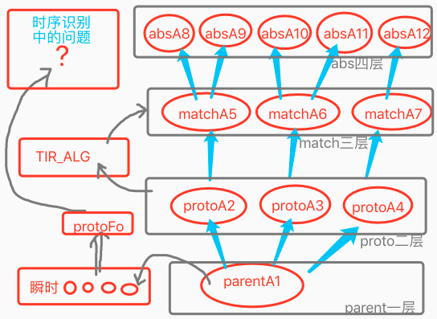
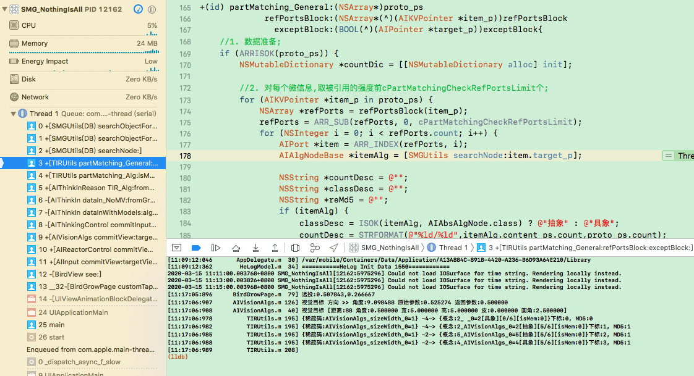
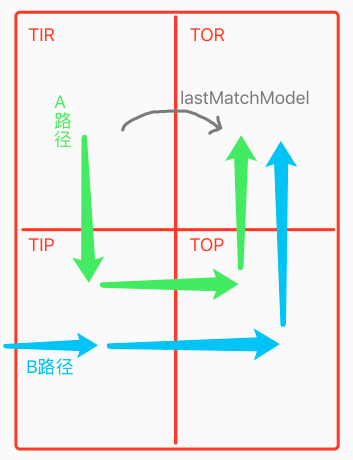
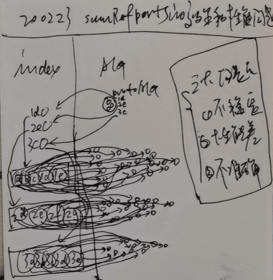
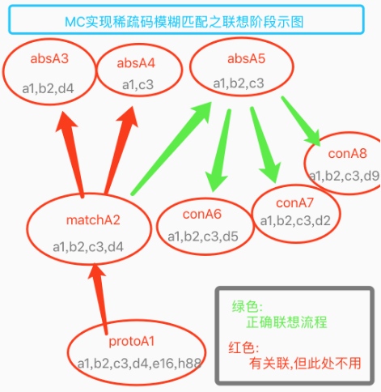
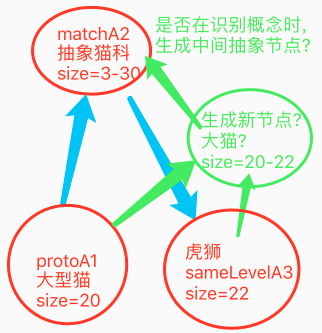

# 测试 & 细节改动 & 训练

<!-- TOC -->

- [测试 & 细节改动 & 训练](#%E6%B5%8B%E8%AF%95--%E7%BB%86%E8%8A%82%E6%94%B9%E5%8A%A8--%E8%AE%AD%E7%BB%83)
  - [n18p1 训练进度可视化](#n18p1-%E8%AE%AD%E7%BB%83%E8%BF%9B%E5%BA%A6%E5%8F%AF%E8%A7%86%E5%8C%96)
  - [n18p2 时序识别测试](#n18p2-%E6%97%B6%E5%BA%8F%E8%AF%86%E5%88%AB%E6%B5%8B%E8%AF%95)
  - [n18p4 价值概念化](#n18p4-%E4%BB%B7%E5%80%BC%E6%A6%82%E5%BF%B5%E5%8C%96)
  - [n18p5 测试训练](#n18p5-%E6%B5%8B%E8%AF%95%E8%AE%AD%E7%BB%83)
  - [n18p6 反省](#n18p6-%E5%8F%8D%E7%9C%81)
  - [n18p7 反省2: 外循环类比 (距离分析)](#n18p7-%E5%8F%8D%E7%9C%812-%E5%A4%96%E5%BE%AA%E7%8E%AF%E7%B1%BB%E6%AF%94-%E8%B7%9D%E7%A6%BB%E5%88%86%E6%9E%90)
  - [n18p8 学用常识:`远果不能吃`](#n18p8-%E5%AD%A6%E7%94%A8%E5%B8%B8%E8%AF%86%E8%BF%9C%E6%9E%9C%E4%B8%8D%E8%83%BD%E5%90%83)
  - [n18p9 训练整体步骤记录](#n18p9-%E8%AE%AD%E7%BB%83%E6%95%B4%E4%BD%93%E6%AD%A5%E9%AA%A4%E8%AE%B0%E5%BD%95)
  - [n18p10 思维控制器协作迭代 (废弃,目前无需迭代)](#n18p10-%E6%80%9D%E7%BB%B4%E6%8E%A7%E5%88%B6%E5%99%A8%E5%8D%8F%E4%BD%9C%E8%BF%AD%E4%BB%A3-%E5%BA%9F%E5%BC%83%E7%9B%AE%E5%89%8D%E6%97%A0%E9%9C%80%E8%BF%AD%E4%BB%A3)
  - [n18p11 外类比迭代-支持有序](#n18p11-%E5%A4%96%E7%B1%BB%E6%AF%94%E8%BF%AD%E4%BB%A3-%E6%94%AF%E6%8C%81%E6%9C%89%E5%BA%8F)
  - [n18p12 TIR稀疏码模糊匹配](#n18p12-tir%E7%A8%80%E7%96%8F%E7%A0%81%E6%A8%A1%E7%B3%8A%E5%8C%B9%E9%85%8D)
  - [n18p13 TOR稀疏码模糊匹配](#n18p13-tor%E7%A8%80%E7%96%8F%E7%A0%81%E6%A8%A1%E7%B3%8A%E5%8C%B9%E9%85%8D)
  - [n18p14 理性解决`远果不能吃`](#n18p14-%E7%90%86%E6%80%A7%E8%A7%A3%E5%86%B3%E8%BF%9C%E6%9E%9C%E4%B8%8D%E8%83%BD%E5%90%83)
  - [n18p15 TIR_Alg中解决稀疏码模糊匹配V2](#n18p15-tir_alg%E4%B8%AD%E8%A7%A3%E5%86%B3%E7%A8%80%E7%96%8F%E7%A0%81%E6%A8%A1%E7%B3%8A%E5%8C%B9%E9%85%8Dv2)
  - [n18p16 精细化训练](#n18p16-%E7%B2%BE%E7%BB%86%E5%8C%96%E8%AE%AD%E7%BB%83)

<!-- /TOC -->

***

### n18p1 训练进度可视化
`CreateTime 2019.12.27`

> 经过4个多月完善理性思维,我们可以回归到乌鸦的训练中来,本节,重点对小鸟成长训练,做步骤规划和记录;

| 训练飞行 `From N16P16` | TITLE | DESC |
| --- | --- | --- |
| 1 | 直投 | 知道吃坚果解决饥饿问题 |
| 2 | 马上饿 | 有解决饥饿的需求 |
| 3 | 远投 | 看到坚果吃不到,知道是因为距离问题,但解决不了 |
| 4 | 摸翅膀 | 学习飞行方向所导致的距离变化;(飞8方向x坚果8方向=64映射) (小鸟更关注飞近,而非飞远) |
| 5 | 主动飞 | 小鸟可逐步学会飞行方向越来越准确; |
| 6 | 主动吃 | 小鸟可在飞行坚果旁边时,吃掉坚果; |

| 18011 | 训练进度可视化 |
| --- | --- |
| 功能 | 技能检测,进度可视 |
| 触发 | 点击进行技能检测 |
|  | 1. 会吃 √ |
|  | 2. 会飞 ✕ |
|  | 3. 会躲 |
|  | 4. 会疼 |

     

### n18p2 时序识别测试
`CreateTime 2020.01.06`
> **简介:**  
> 　　本节处理在TIR_Fo的测试中,遇到的问题;  
> **本文名词与缩写解析:**
>   1. 四层: parent层,proto层,match层,abs层 (参考18021示图)
>   2. 前两层: parent层和proto层;
>   3. 后两层: match层和abs层;

| 18021 | 时序识别辅助测试图 |
| --- | --- |
| 示图 |  |

| 18022 | BUG | STATUS |
| --- | --- | --- |
| 1 | 测出A1.absPorts为空的BUG; |  |
| 2 | shortMemFo.last_p取出的是parentA1,而不是protoAlg的问题 |  |
| 3 | 在TIR_Fo的返回结果总是nil (因以上各BUG导致); |  |

| 18023 | 迭代`全含` |
| --- | --- |
| 说明 | 对于matchFo的前半匹配部分,要全含; |
| 举例 | [老虎,跑过来,咬我],前半部分,即`老虎`和`跑过来`要全含,预测`咬`; |

| 18024 | 迭代`四层fo` |
| --- | --- |
| 说明 | 支持四层.refPorts联想assFo; |
| 举例 | 否则看到重石压自己,会因为未经历过重石压,而不懂预测 |
| 附注 | 前两层主要做引导,后两层联想assFo (match优先,abs次之); |

| 18025 | 迭代`四层alg` |
| --- | --- |
| 说明 | 判断fo.itemAlg匹配时,先做contains判断为true,后做四层absPorts匹配 |
| 举例 | 非老虎时,另一种巨兽冲过来,一样预测到咬/危险; |
| 废弃 | 以上contains判断废弃,用MD5替代; |
| 附注 | 前两层主要做引导,后两层做MD5匹配 (match优先,abs次之); |

| 18026 | TIR_Fo源于瞬时/反思的伪代码 |
| --- | --- |
| 伪代码 |  |
| 注1 | 用于解决: shortMem有四层,而rethink只有两层; |
| 注2 | rethink除全含外,还须包含mAlg,而shortMem只需要全含即可; |
| 实际代码 | 1. rethink中,包含mAlg用assFoBlock()来实现了; |
|  | 2. 废弃checkFoValid,改成了独立checkFoValid()来实现了; |
|  | 3. 废弃getIndexForAssBlock,改成一条条回调assFoBlock来实现了; |

     

### n18p4 价值概念化
`CreateTime 2020.01.13`

> 1. 本文中情感,系价值的概念化 (类似时序概念化);
> 2. 大多数人都喜欢正能量,不喜欢负能量,但其实正负本来就是相对的,不可能把某个完全摒弃掉;

| 18041 | 价值概念化 >> | 简 |
| --- | --- | --- |
| 喜 | 对于已`正价值`的`感性`的喜悦 | 已正感 |
| 好 | 对于已`正价值`的`理性`的偏好 | 已正理 |
| 悲 | 对于已`负价值`的`感性`的悲伤 | 已负感 |
| 怒 | 对于已`负价值`的`理性`的愤怒 | 已负理 |
| 盼 | 对于将`正价值`的`感性`的期盼 | 将正感 |
| 思 | 对于将`正价值`的`理性`的思念 | 将正理 |
| 忧 | 对于将`负价值`的`感性`的担忧 | 将负感 |
| 恐 | 对于将`负价值`的`理性`的恐惧 | 将负理 |
| 注: | 文中,感性表示网络中mvModule |  |
| 注: | 文中,理性表示dataModule(含概念与时序) |  |

| 另附 | 思维方式概念化 / 思维概念化 >> |
| --- | --- |
| 说明 | 将一些思维方式进行概念化,比如:`大小约为x的水果是什么?`,在此描述中,我们会联想到水果,然后再具象水果中,以此大小进行特征匹配,并最终得出答案; |

     

### n18p5 测试训练
`CreateTime 2020.01.14`

| TODO | DESC | STATUS |
| --- | --- | --- |
| 1 | 乱扔很多坚果,都是最具象alg,且在内存中,导致识别失败 | T 同BUG3 |
| 2 | 查日志:"最后一个alg都未匹配,查看是否在联想时就出bug了",经查是因为checkItemValid中,从parent层到match层,少取了一层,导致无法匹配到; | T |
| 3 | "概念识别"在内存局部匹配时,极易匹配到最具象节点,导致关联失败; **解决方式:** 废弃内存局部匹配, **因为:**硬盘局部匹配其实也有最具象的时候,不过这种情况少,是可接受的,算做智能体在最初学习阶段,不易识别,因为还没学好,但如果内存局部匹配的话,这种问题是贯彻始终的,即智能体已经学的非常溜,依然会有这种情况; | T |
| 4 | 在点击直投时,先吃,才看到吃前视觉的坚果,这显然不对 (写OutputObserverType解决); | T |
| 5 | 列举出,一个时序 如[吃坚果饱],来测试时序识别; | T |
| 6 | 在步骤一和二进行训练后,重启应用训练,`乱投`无法识别到坚果,怀疑是内存网络中,有些抽象未持久化导致; |  |
| 7 | 在训练1+2后,第三步训练时,坚果乱投,却行为化成功为act=[],未发现距离问题 (经测试,发现mcs&cs&ms都为空,因为MC类比时,M.absPorts和C.absPorts都为空,并没有抽象为距离坚果); | 转至n18p7 |
| 8 | 输出失败,焦急时,产生负mv | T |
| 9 | 点`马上饿`决定吃掉面前坚果,此时: `吃`前要`看`,`看`到坚果又决定`吃`,形成外层死循环 | T |

| BUG9 解决方案>> |
| --- |
| 1. 吃前不看,(都决定行为了,临门一脚,再多余的动作,是不可能滴) |
| 2. 瞬时不清空 (行为输出后,能够将时序连起来) 比如:[远果,饿,吃],如果在饿时将远果清空,则时序中,只有[吃]; |
| 3. 方案1+2 |
| 4. 输出行为的去重 |
| 5. DemandModel中存actionsFo,并判断去重等; |
| 6. 新OutputActions时,将旧的作废 (以后改为连续视觉后,会需要这样的支持,同时只能输出一个行为); |
| 结果: 95%选择方案3,其无多余动作,故天然避免4和5所指的重复问题; |
| 结果: 6所提及问题,可与1+2配合,但在v2.0暂不需要,所以放到迭代计划中; |

| BUG9 解决方案v2 20200212 |
| --- |
| 见: 18101 |

***

| 训练计划 (步骤) |
| --- |
| 1. 点`直投`抽象出assFo[坚果,吃] -> (饱mv↑) |
| 2. 点`乱投`坚果,进行概念识别,并时序识别,conProtoFo[坚果,...]预测 -> (饱mv↑) |
| 3. 点`马上饿`产生需求进行决策,MC匹配,因为不明白距离的影响,智能体会直接吃远处坚果,但吃不饱 (从而焦急); |
| 4. 训练计划：在外循环，有效利用焦急情绪，让智能体发现距离＞0的坚果不能吃。 |
| 5. 点`摸翅膀`,学会飞行,并且能够通过飞行解决距离问题 -> 飞行 |
| 6. 并决策有皮的问题 -> 去皮 |
| **考虑下是否需要一些前期工作:** |
| 1. 在各种位置吃坚果 |
| 2. 点`摸翅膀`训练飞行 |

| 步骤1 | 抽象出assFo[坚果,吃] -> (饱mv↑) |
| --- | --- |
| 训练 | 在新安装后,直接进行直投,三次后,得到正确结果,如下图: |
| 结果 |  |
| 说明 | 1. `f12[a8,a6]` 其中a8主抽象坚果,a6为吃; |
|  | 2. `f5[a7,a4,a9]` 其中a7为场景坚果,a4为吃,a9为空场景; |
|  | 3. `f11[a10,a5,a12]` 其中a10为场景坚果,a5为吃,a12为空场景; |

| 步骤2.1 | 点`乱投`,进行概念识别; |
| --- | --- |
| 训练 | 点击`乱投`后,直接打印"识别alg成功",且未发现可疑问题,继续下一步训练; |
| **步骤2.2** | **点`乱投`,进行时序识别;** |
| 训练 | 点击`乱投`前两次识别时序失败,后两次再点又成功了;如下图: |
| 示图 |  |
| 说明 | 1. protoFo仅由一个场景视觉中的坚果组成 (见f23); |
|  | 2. 识别得f12[a8坚果,a6吃] |
|  | 3. 且预测得m4(价值↑) |
| 问题 | 前两次,未识别时序成功,疑为当时关联强度为默认1,导致初时未联想到导致; |

| 步骤1+2 | 联合训练记录 |
| --- | --- |
| 训练1 | 点击`直投`三次,发现抽象出抽象时序,对应[坚果,吃] |
| 训练2 | 点击`乱投`一次,发现识别出assFo,对应[坚果,吃]->{mv↑} |

| 步骤3.1 | 点`马上饿`产生需求进行决策,并MC发现距离问题; |
| --- | --- |
|  |  |
| **步骤3.2** | **点`摸翅膀`由触摸反射被动飞行,学习各种方向的飞行时序;** |
|  |  |
| **步骤3.3** | **点`马上饿`产生需求,并主动飞行解决距离问题;** |

| 步骤4 | 多次吃不到时,焦急且类比,进行抽象距离>0,而导致吃不到; |
| --- | --- |
| 迭代 | 考虑将from-to方式，添加到稀疏码类比中，抽象时，值为from-to。 |

     

### n18p6 反省
`CreateTime 2020.01.19`
> 在训练步骤三时,发现MC没有共同抽象"距离",导致距离的差异并不能被he反思到;而位置>0时,导致吃不到,这个时序会作为新的输入信息;
>
> 此时只要做新的类比,就可以发现距离>0会导致mv-,而距离=0才可以mv+;
>
> 所以本节,主要讲将外层循环考虑进来,看对训练的作用,以解决此问题;

1. 换个位置直投，抽象出与位置无关。
2. 有距离时吃不到，反省类比出距离抽象，距离对mv，一者指正，一者指负。
3. 外层循环,打通,可解决此问题;

| 18061 | 思考如何取得预测fo与行为fo，才能进行类比。 |
| --- | --- |
| 1. 纯循环方式: | 测试下行为fo，在TIP中进行输入联想后类比会得到什么结果？ |
| 2. 反省方式: | 测试下在demandManager中,放上actionFo,并与执行出的结果newFo,进行类比; |

     

### n18p7 反省2: 外循环类比 (距离分析)
`CreateTime 2020.01.21`
> 在训练中,小鸟吃了远距离坚果,未发现距离问题 (经测试,发现mcs&cs&ms都为空,因为MC类比时,M.absPorts和C.absPorts都为空,并没有抽象为距离坚果);
> * 本节重点解决,关于距离的认知和使用;
> * 本节中提到的from-to,其实2017年就有微信息支持抽象,只是后来取消掉了,,,
> * 分析下,能否在v2.0中,先别做稀疏码抽象,比如使用区间距离的方式 (如精度为4级: 0距离,小距离,中距离,远距离);

| 18071 | 前提: 外循环类比 |
| --- | --- |
| 取俩fo | 认识到fo1[实际行为的输出结果] 不符合fo2[预测],并进行两个fo的类比; |
| 理性类比 | 能吃[坚果有,吃,坚果无],不能吃 [坚果有,吃,...] 无法吃掉; |
| 感性类比 | 吃不饱 [坚果,吃]->{mv没变化`没饱`,或为负`焦急`}; |
| 注 | 预测fo,不应在上次循环中保留,而是重新联想取出 (比如我去年存一年钱,今年得利息,去年的预测显然已非上次循环,所以要重新联想取); |

| 18072 | 表征: 稀疏码from-to (>from&<=to) |
| --- | --- |
| 能吃 | 能吃的那些距离值范围坚果 (一般=0) |
| 不能吃 | 不能吃的那些距离值范围坚果 (一般>0) |
| 注 | 值范围是多变的,比如0-5能吃,5-10不能吃,10-15又能吃; |
| 索引表征 | 假如把from-to表征成一个抽象稀疏节点absValueNode,那么 |
| 索引说明 | from-to的稀疏码易表示,难索引,因为一般被引用范围都太广; |
| 时序类比 | 在内类比和外类比中,对value_p进行类比时,要支持absValue; |

| 18073 | 使用: 多角度分析 |
| --- | --- |
| 索引角度 | `value_p=3`.absPorts->`absValue>0`.refPorts->`远距坚果` |
| 概念角度 | 在概念节点的抽具象匹配中,要回归到稀疏码层先类比,再返给概念层结果; |

| 决定TODO春节后 >> |
| --- |
| 1. 先不做,只对距离分4级精度; |
| 2. 然后在执行Output_General后,如果未解决问题,则产生焦急情绪; |
| 3. 如此两次后,应该能够抽象出,[远坚果,吃]->{焦急} |
| 4. 在下次,再想吃远坚果时,就会在反思中,发现此路不可行; |
| 5. 然后紧跟着MC来判断将远坚果变成近坚果的方法; (abs1:远坚果,abs2:近坚果) |
| 6. ???继续分析下,此处在MC匹配后,如何做出飞行,改变`远坚果`->`近坚果`的行为化; |

| 网络构建步骤示图 | 训练距离抽象示图 |
| --- | --- |
|  |  |
| 上图,标示出在外循环基础上,关于后面吃坚果的知识训练过程; | 上图,标示出训练距离抽象的方式,并给出原则与实施方案; |

* ##### 18074_外层循环分析 >>

1. 外层循环中,上轮的输出,是新轮的输入,而对于瞬时中时序的匹配,能否`符合预测`(见下方案)
2. 出与入非同类型问题分析: 很多行为输出与输入其实非同类型信息,且很难判断,比如`输出肌肉参数打自己`,对应输入应该是`输入疼痛感`,但在时序中,各个概念本来就不要求同类型,所以不影响;
3. 方案1: 以上`符合预测`改为`TIR_FO匹配成功`,即用新的TIR来进行新轮循环:
  * 示例: 有狗冲我叫,我喊一声吓它,有可能吓走,也有可能冲过来,这两者都是符合常理的,但我的预测其实是希望吓走它,所以TIR_Fo可以对以上两种输入都有好的处理; `80%采用`
4. 方案2: 以上`符合预测`在DemandManager中,进行类比,并得出结果:
  * 示例: 预测吃掉坚果,结果没吃掉,从而对比出`距离`问题; `20%采用`
5. 两个方案分析1: 当我们吃坚果,未吃到时,是否能够分析到`距离`问题(`答案参考18075`)?如果我们自省发现,我们对距离产生无意识类比分析了,那么方案2是正确的,如果我们并未无意识分析得到答案,那么方案1是正确的;
6. 两个方案分析2: 方案1更自然而然,也更加符合he的循环设计(因为一切可能导致复杂的变数,都不能指望,比如我们喊一声,得到的反馈也许是几十种,变化极多);
7. 两个方案分析实例:我们吃了距离>0的坚果,但并不能说明一定是距离导致没吃到,也许是因为此时正好发生了别的鸟抢坚果吃的事;所以我们更应该关注正时序TIR_Fo(`距离>0吃不到 & 距离=0吃的到`),而不应用方案2的方式,如果要支持方案2,那么我们需要非常多长期的类比,来得到确切的原因点,比如长期观察,确实是(`距离!=0吃不到`);

* ##### 18075_外循环方案1,分析距离问题

* 
* 如图:
  1. 不需要抽象距离节点,只需要[无距果]抽象节点,使MC为同级;
  2. 解决MC同级问题,有两个方案,目前可以采用方案2 (因为目前he支持cGreater和cLess)//注:在v3.0应该会去掉比大小,由完全的时序匹配替代;
  3. 在外循环中,要形成两个前提fo (训练中用可视化来达成);
* 代码化:
  1. 前提部分: 本身代码未发现bug;
  2. 方案部分: 执行方案2,在MC匹配行为化时,对ms&cs的抵消条件,由`总长度为1`改为判断`不同稀疏码长度为1`条时;
* 训练:
  - 前提部分: 用可视化,训练出fo1和fo2的构建,并且调试其在MC中被联想到;
  - 训练出fo3:[距大,飞,距小],调试其构建;
  - 方案部分: 在`MC行为化算法`中,要对距离进行抵消,并找到fo3,输出飞行;
* 疑问:
  - 在`MC类比算法`中,HE是采用以抽象为基准进行类比的,而在`MC行为化算法`中,进行修正M与满足C时,依然采用以抽象为基准,会不会误杀掉某细节信息;
  - 比如:毒蘑菇要去毒,我把它烧成渣渣,自然就没毒了,但其也无法被食用了;
  - 解决方案: 保持以抽象为基准不变 (因为时序的元素是概念,`时序的思维要优先操作概念`),而在修正M与满足C后,对C的加工准确性进行`理性判定`,确实合格,或者说评价中,进行`感性判定`,判断我们爱不爱吃渣渣,吃后能不能饱;

| TODO | STATUS |
| --- | --- |
| 1. 目前稀疏码索引不支持模糊匹配,所以先对距离精粒度设为5dp=1; | T |
| 2. 在`MC行为化算法`中,对ms&cs抵消条件,改为不同稀疏码长度=1; | T |
| 3. 对于Output_General,未解决问题,要产生焦急情绪,以形成[远果,吃]->{焦急} (焦急触发是否需要条件); | 弃,原因见18076 |
| 4. 测下,在TIR中,能否对[远果,吃],产生长时时序记忆; | T 用更饿mv触发写到长时参考:18084_1 |
| 5. 测下,能否形成[远果,吃]->{焦急}; | T 无需焦急 |

* ##### 18076_焦急情绪的触发分析
  > 原本要形成时序:[远果,吃]->{焦急mv-},但发现,焦急的触发是个问题,所以此处分析下此问题;
  > 1. 解决方案: 焦急源于无能为力,所以采用正向循环方案;
  > 2. 实例说明: 程序员改一bug时,尝试方案1,未解决,想到第2方案,不急,尝试方案2,未解决,想不到有什么办法了,焦急;
  > 3. 实例解析: 以上实例表明,焦急并不是对当前输出行为的`挫败感`而生,而是因`无能为力`,导致焦急情绪;
  > 4. 疑问: 如果没有焦急,那么对`远果不能吃`的常识问题,参考下节;

     

### n18p8 学用常识:`远果不能吃`
`CreateTime 2020.02.06`

> ##### 简介：
>　　在上节末,对外循环中焦急时机分析,导致远果不能吃,不能够以焦急来做感性评价,而转向理性判定`远果不能吃`,所以本节主要针对此常识的学习以及使用展开,分析理性时序[远果,吃]!->{mv}的形成,以及使用其进行评价`不能吃`;
> ##### 回顾:
> 　　在以往,he采用了外围循环mv-,的感性方式进行`远果不能吃`的处理,而现在发现`焦急`情绪,因触发条件等,并不足够 (就是不够规律,不够熵减),所以我们需要找出更加规律的方式。
>
> 　　本节将在mv-的方式上，扩展mv0，并且将扩展理性方式，来分析全面解决此问题的方式。但在目前的v2.0中，未必就全部代码实现，因为原则上，只要v2.0能够实现小鸟演示的需求，即止，其余部分全部在v3.0或以后再行迭代完善。
> ##### 符号说明:
> 1. !->{mv}: 表示fo未指向mv;

* ##### 18081_分析`远果不能吃`的理性与感性

1. 理性上,无法吃掉,即为不能吃;
  * 如:`[远果,吃]`与`[近果有,吃,近果无]`;
2. 感性上,mv<=0,即为不能吃;
  * 如:`[远果,吃]!->{mv}`或`[毒蘑菇,吃]->{疼mv-}`
3. 分析：本节重要采用感性方式来实现，原因如下：
  * 过度抽象问题：如`[果,吃]->{饱mv+}`在过度抽象的时序中,并没有`无`的概念;
  * 理性方式的复杂度太高: 因`mv指导一切意义`的原则,吃不掉未必不能饱,吃掉也未必能饱`5%`;
  * 感性方式的实现分析: 只要吃掉坚果,立马会mv+,而未吃到,则各种混乱,最终抽象出的也不会是{饱mv+} `95%`;
  * 白话结果: 我们总是优先关注mv+,所以mv0则学习起来略慢,但最终只要可以学到即可;

* ##### 18082_学习`远果不能吃`常识 (学习过程分析)
1. 初版,针对感理性都有涉及 (完成度15%) `废弃,>=v3.0再迭代支持`
  * TIR,形成内存fo1[远果,吃]
  * TIP,偶尔形成fo2[远果,吃]->{更饿mv-}
  * 第一步: 考虑,对fo1的持久化;
  * 第二步: 考虑,对fo1的抽象 (形成确切的不能吃);
  * ...后选用感性mv0方案后,中止了此分析 (参考18081);
2. 二版,针对感性的mv0进行学习; `采用`
  * 第一步: TIP,偶尔形成fo1[远果,吃]->{更饿mv-}
  * 第二步: TIP,偶尔形成fo2[远果,吃]->{焦急mv-}
  * 第三步: 各种f1,f2,fn...进行抽象,形成absF3: [远果,吃]->{无定义mv-或mv0}
  * 完成: absFo3可用于感性`远果不能吃`,且可训练 (训练略慢些);
  * 注: fo1和fo2属于试错学习,其实只是未习得前,的训练过程而已;

* ##### 18083_使用`远果不能吃`常识 (判定不能吃)
1. 初版,针对感理性都有涉及 (完成度60%) `废弃,>=v3.0再迭代支持`
  * 前提: 形成[远果,吃]!->{mv}(未指向mv)后;
  * 判定: 在行为化中,进行理性判定,远果不能吃;
  * 分析: 不能吃在理性上判定有两条,一是无法吃为(果无),二是无法解决{mv+};此处采用第二种;
  * 代码: 取到fo[远果,吃]未指向mv,故判定无法解决饥饿问题;
  * ...后选用二版感性方案后,此分析中止 (参考18081);
2. 二版,针对感性的mv0进行使用; `采用`
  * 第一步: 取到absFo[远果,吃]->{无定义mv-或mv0};
  * 第二步: 感性评价mv的负或0,`远果不能吃`,并转移为距离问题(18075已解决);

| 18084 | TODOLIST | STATUS |
| --- | --- | --- |
| 1 | 把demo中,吃不能吃的坚果时,可以随机30%触发小鸟更饿,或者计时器,10s内未吃到时,则触发更饿,因为未吃到食物的饱腹感; | T |
| 2 | 训练:1.`决策[远果,吃]`; 2.`形成[远果,吃]->{更饿}`; |  |
| 3 | 测下,在行为化分析中,[远果,吃]并未指向{mv+},导致感性判定为远果不能吃; |  |
| 4 | 训练得到确切的absFo[坚果,吃]->{饱}; | T |
| 5 | 在外类比中,对时序的有序性做处理; (原先的类比是无序的类比方式) | 转至n18p11 |

| 18085 | BUG | STATUS |
| --- | --- | --- |
| 1 | 点击`乱投`-`马上饿`后,行为化成功,但有不止一个`吃`输出; | T |
|  | 分析: 因为在n18p5_bug9瞬时记忆不清空了,所以导致确切的[坚果,吃]->{饱}需要多次训练得出; | T |
|  | 解决: 参考18101_2 | T |
| 2 | 在多次,`运行->直投`后,形成的抽象时序长度为4,但引用的节点数为2 (经查为`[坚果,坚果,吃,吃]`);解决方法: 外类比应改为有序类比; | 转至n18p11 |

| 18086 | 疑问:在18082二方案第三步,f1f2不会触发外类比抽象; |
| --- | --- |
| 原因: | 在外类比是TIP触发的感性联想,所以非同类型的mv压根不会联想到; |
| 分析: | 基于思考即构建的原则,从什么时候会思考到相关数据入手,分析以下方案: |
| 方案1 | 在TIR_Fo中,是否可以进行理性外类比; `40%` |
|  | 否定: TIR时,无mv指向,但识别到的matchFo却有mv指向,两者无法类比; |
|  | 尝试: 在TIR_Fo时,多识别几个matchFo,并进行类比; `可解` |
| 方案2 | 在行为化,反馈中进行类比 `5%` |
|  | 否定: he中,不存在反向反馈,只有正向循环; |
| 方案3 | 在多次TIP后,进行外类比; `40%` |
|  | 否定: 在多次TIP导致同类型mv时,会认为远距果,越吃越饿,这显然是不正确的; |
|  | 尝试: 多次TIP,各类型mv各自抽象,导致[远果,吃]->{饿}和[远果,吃]->{焦急}两个抽象时序,会同时存在,但无论哪个存在,都可以正常执行负评价; `可解` |
| 综合: | 以上有1,3两个方案可解; |
|  | 1. 方案1中,TIR_Fo为识别阶段,不建议进行过多的联想与外类比; `20%` |
|  | 2. 方案3中,多个抽象时序同时存在,这个是ok的,且够简单够用; `80%` |
| 总结: | 目前,选用第3方案,在未来不排除选用更好的方案; |

     

### n18p9 训练整体步骤记录
`CreateTime 2020.02.12`

1. 习得absFo[坚果,吃]->{饱}
  > 1. 运行->直投,直投 `抽象出[坚果,吃,]->{饱}`
2. 习得`远果不能吃`
  > 注: 此步,进行先`马上饿`再`远投`,因为识别时序[远果,吃]预测符合->{饱},所以无法形成需求,所以此处先`远投`再`马上饿`;
  > 1. 远投 `需重运行`
  > 2. 马上饿;
  > 3. 行为化:输出行为`吃`;
  > 4. 点击马上饿;
  > 注: 以上四步,应构建[远果,吃]!->{mv}

* 2-4 问题:
1. 到外类比处,查看`远距坚果`的类比情况,看能否抽象出`距x坚果`;
2. 就算抽象出`距x坚果`,依然有问题,即x-1坚果呢?x-2呢?难道百种距离就要抽象百种远果吗?
3. 所以引出稀疏码模糊匹配任务,见n18p12;

| TODOTEST | DESC | STATUS |
| --- | --- | --- |
| 20200308 | 训练至2-4步可得[远果,吃]->{mv-},但同时也有很多过度抽象的常识,如[空场景]->{mv-},调试一下,这是否对后面决策等造成影响; |  |
| 20200309 |  |  |
|  | 如图,正常训练至2-4步后,再重运行,远投,只识别出matchAlg23,且A23有3个具象节点,但却没识别出fuzzyAlg,且A23.content_ps竟然为空; |  |
|  | 问题1: 为什么会识别到matchA23这种稀疏码为空的节点; |  |
|  | 问题2: 为何有matchA23,有3个具象节点,却无法fuzzyAlg识别到结果? |  |
| 20200311 | 识别到的抽象Alg.content_ps为空的问题; |  |
|  | 训练: `直投,直投,乱投,马上饿,马上饿,返回页面重进,再远投`; |  |
|  | 描述: 此时,节点显示绿色为坚果,content为0,但却被坚果的value所指向; |  |
|  | 15号更新: 点击直投,直投,重启,远投,发现读到为0情况,截图如下: |  |
|  |  |  |
|  | 分析: 在从XGRedis取值,最开始为5,突然变成0,待调试日志继续断点查明; |  |
| 20200310 | 查下为什么那么多远投坚果,最终 (Height5).refPorts才3个; |  |
| 20200315 | 非全含导致的识别alg失败 | T |
|  | 原因: 因每次都在同一位置,导致抽象坚果,只在一个位置被抽象,远投更换了位置,自然无法全含; |  |
|  | 解决: 点摸翅膀,再直投,重复几次,即可; |  |
|  | 疑问: 重启下app后,好像远投,还是无法识别; | T `参考18162` |
| 20200315 | `Terminating app due to uncaught exception ‘NSGenericException’, reason: ‘*** Collection <__NSArrayM: 0xb550c30> was mutated while being enumerated` 将异步存heLog去掉,暂未再闪; | T |

     

### n18p10 思维控制器协作迭代 (废弃,目前无需迭代)
`CreateTime 2020.02.12`

> ###### 名词解析:
> 1. 区间: 在瞬时记忆序列中,以mv为一个中间点,那么中间点之间,为区间;
> 2. 前置: 在每个fo->mv模型中,fo表示前置信息;
>
> ###### 本节说明:
> 　　在以往偏感性思维时，he中很多思维都是以TIP来触发的。但在过去半年迭代了更加理性的思维后，有了两条触发路径：
>   1. `TIP->TOP->TOR`
>   2. `TIR->TIP->TOP->TOR`
>
>　　随着越来越完善的理性支持，触发上也需要变得越来越向理性触发偏移。本文将以此问题为切入，思考he中四个思维控制模块间的协作，主旋律是从TP触发向TR触发转变。

| 18101 | 一种新的TC协作方式 >> (废弃,参考本节下文) |
| --- | --- |
| 1 | 帧视觉,按1s每帧; |
|  | 解释: 用于触发,在TIR时,直接过度到TOR进行决策,而不是保留lastMatchModel |
|  | 反例: lastMatchModel的方式,虽然看似是最近的,但显然亦非实时,故迭代后是一种改进; |
|  | 废弃: 因在v2.0中,触发式视觉足够用,吃食、车行进等都可以用demo触发; |
| 2 | 瞬时在新mv输入时进行清空; (废弃,参考:18103) |
|  | 解释: 跨区间会产生很多问题,更多的杂乱信息,如[远果,吃,近果,吃,飞]->{饱} |
|  | 解释: 跨区间导致很多别的mv的前置信息,与当前mv并不相关,如[红灯,饿,近果,吃]->{饱},其中红灯与饱无任何关系,但却因跨了区间而导致干扰; |
| 3 | 新的mv输入到TIP后,仅做demandManager的更新,而不做决策; (废弃,参考18102) |
| 4 | 而在TIR后,再进行识别预测,并转至TOR进行决策; (废弃,参考18102) |

| 18102 | TOR的触发问题分析 |
| --- | --- |
| 1 | 由TIP触发; (v1.0时方案,太感性) |
| 2 | 由TIR触发; (v2.0新增) |
| 3 | 都会触发,协作; (v2.0方案,如下图:) |
| 示图 |  |
| 说明 | 上图中,AB两条路径,无论感性还是理性,都已支持完善,所以下面通过实例,来展开细节进行分析; |

| 18103 | 实例细节分析`是否清空瞬时` |
| --- | --- |
| 示例1 | [远果,马上饿,飞,吃]->{饱} |
|  | 1. 看到`远果`,并形成lastMatchModel到TOR中; |
|  | 2. 点`马上饿`,清空瞬时记忆,并触发决策; |
|  | 3. 在决策中,通过MC行为化,并`飞`到坚果附近; |
|  | 4. `吃`掉坚果,并变`饱`; |
|  | 结果: 以上因清空了瞬时记忆,只能生成fo[飞,吃]->{饱} |
|  | 总结: 以上导致的问题是无解的,所以不应清空; |
| 示例2 | [车撞,疼,红灯,饿,近果,吃]->{饱} |
|  | 1. 在车撞疼,红灯饿,近果吃,三个区间都不进行清空; |
|  | 2. 这导致,生成的时序更加模糊,也需要更多的类比抽象,来确切化; |
|  | 总结: 以上导致的问题,是可解的,只是需要多几次抽象训练,所以不应清空; |
| 总结 | 依以上两个示例结果,瞬时不应在inputMV时被清空; |

     

### n18p11 外类比迭代-支持有序
`CreateTime 2020.02.14`

> 　　在v1.0的外类比中，直接使用两个for循环嵌套来类比，并且判定条件为最简单的contains()，而事实上fo本来就是有序的，所以本节重点迭代外类比，使其支持有序化类比。

| 18111 | 举例 |
| --- | --- |
| **当前** | `f1[a,a,b,b]` 类比 `f2[a,b]` => abs`f3[a,a,b,b]` |
| **改后** | 1. `f1[a,a,b,b]` 类比 `f2[a,b]` => abs`f3[a,b]` |
|  | 2. `f1[c,a,b]` 类比 `f2[a,b,c]` => abs`f3[a,b]` |
| **综上** | 1. 记录一个curIndex来记录当前已类比进度; |
|  | 2. 倒着来匹配 (因后面比前面相关性更强); |

| BUG | STATUS |
| --- | --- |
| 1. 在新运行:直投,直投,外类比后抽象出了[吃,坚果]时序,而非[坚果,吃]时序; | T |

     

### n18p12 TIR稀疏码模糊匹配
`CreateTime 2020.02.20`

> 　　在训练`远果不能吃`时,发现远果,有上百种距离,我们无法针对上百种稀疏码分别构建上百种概念与时序,来表达`远果不能吃`。
>
> 　　所以本文将提前实现`稀疏码模糊匹配`功能(原计划在v3.0),来解决这一问题。
>
> 名词解析:
> 1. **临近度:** 比如根据5,找到临近的4和8,那么判定4比8更临近;
> 2. **ft稀疏码:** 前身为`动微信息`,后废弃掉,但这次需要重新写回,ft稀疏码也是稀疏码;
> 3. **v稀疏码:** 单值(静态)稀疏码,前身为`静微信息`;
> 4. **最小范围<f,t>:** 比如根据5,找到<f3,t6>和<f2,t9>,那么<f3,t6>范围更小;
>
> **总结:** 本节至18128表,方案2,转至n18p13

| 18121 | 支持前的描述 |
| --- | --- |
| 1 | [距169果,吃]!->{饱},[距168果,吃]!->{饱},[距...果,吃]!->{饱}... |
| 总结 | 我们无法描述所有的距离情况,而模糊匹配可以解决这一问题; |

| 18122 | 两个模糊匹配方案 |
| --- | --- |
| 方案1 | 临近度排序,并依次匹配,即169取不到,则尝试168,170,167,171... `30%` |
|  | 缺点: 性能不好; |
|  | 优点: 简单灵活,且稳定达到效果; |
| 方案2 | 在每次根据监控度匹配后,生成一个from-to稀疏码,方便复用,复用时只要包含在from-to之间,即可; `30%` |
|  | 缺点: 固化,如无法解释:美术生从一种红,认识到数几种红; |
|  | 优点: 性能好; |
| 方案3 | 将方案1和2进行综合,1做开头,2做结尾,每一次1又略影响2; `90%` |
|  | 优点: 性能均衡,灵活性均衡; |

| 18123 | 方案3分析 |
| --- | --- |
| 示图 |  |
| 1 | 在最初时,找到最临近的稀疏码,并对其refPorts,进行匹配; |
|  | 成功: 则生成新的from-to; |
|  | 失败: 则跳转到下一步; |
| 2 | 上步失败时,找到匹配的最小范围<f,t>,并对其refPorts,进行匹配; |
|  | 成功: 得到resultAlg; |
|  | 失败: failure |
| 3 | 问题: |
|  | 1. <f,t>的排序问题,比如<f3,t6>和<f4,t8>哪个排前面?怎么排才方便查找; |
|  | 2. ft.refPorts何时被引用,能否由v.refPorts在合适时机继承过来; |

| 18124 | 代码实践 |
| --- | --- |
| 1 | 制定一个活跃度,比如3.0,每帧视觉时,都可以有此活跃度供TIR使用; |
| 2 | 在TIR识别中,使用此模糊匹配功能; |

| 18125 | 隔日更新分析 `废弃ft稀疏码` |
| --- | --- |
| 论断 | 在稀疏码中,其实很难建立ft; |
| 实例 | 比如3-5距离的坚果不可以吃,4-8距离的坚果可以打人; |
| 疑问 | 那么,我们应该建立f3t5呢?还是f4t8呢? |
| 解答 | ft的范围,是取决于其概念,时序,甚至其意义取决于mv; |
| 结果 | 所以很难建立ft,来达到索引到合理的alg,fo,mv的目的; |

| 18126 | 实例训练步骤 |
| --- | --- |
| 1 | 输入0果可吃,f1[0果,吃]->{饱} |
| 2 | 输入169果不可吃,f2[169果,吃]->{mv-} |
| 3 | 输入1果,模糊匹配到0果,但最终并不可吃,f3[1果,吃]->{mv-} |
| 4 | 输入50车,模糊匹配到1,并匹配为远处的物体; [50车,撞]->{疼} |
| 5 | 输入100果: |
|  | a. 模型匹配到50,识别为远处的物体,预测并不能解决饥饿问题,继续再识别; |
|  | b. 模糊匹配到169果,预测不可吃,但MC发现0果可吃,所以飞行解决距离问题; |
| Q | 在第5步中,直接进行识别a&b两条,还是a不行,再来b?还是从a和b中挑最全含的? |
| A | 从a和b中,挑出前limit个refPorts,并组成sumRefPorts `见18127`; |

| 18127 | TIR_Alg应用模糊稀疏码 |
| --- | --- |
| 示图 |  |
| 说明 | 在refPortsBlock中,对模糊匹配的value_p.refPorts也进行取用,并依次放到原refPorts之后,以进行兼容模糊稀疏码作用于识别算法; |

| 18128 | 18127使用依次排sumRefPorts的问题 |
| --- | --- |
| 示图 |  |
| 问题 | sumRefPorts可能拼很多value_p.refPorts,有三大问题; |
|  | 1. 效果不好,不稳定 (不总是能够联想到,比如:当距离有1-169种,1和169描述坚果,2-168描述汽车,我们根据169拼接sumRefPorts时,会有大量的无效,最终还得不到好的效果;) |
|  | 2. 性能差 (太多value_p.refPorts索引操作,性能差) |
|  | 3. 准确度问题 (即有可能识别为不匹配的结果) |
| 方案 | 方案1: 考虑以当前要识别的alg为中心,进行判断; `0%` |
|  | 否决: 因为alg还未识别,alg很难提供帮助到有效判断的信息; |
|  | 比如: 我们想通过别的坚果,知道坚果的距离只有1和169,但我们还未识别,所以无法做此判断,这是无解死循环; |
|  | 方案2: 因TIR是建立向抽象方向建立关联,所以对于特化信息 (如距离)在TIR中不进行处理,而延迟到TOR.MC中再进行处理;`参考:n18p13` `80%` |

| TODO | STATUS |
| --- | --- |
| 1. 在外类比时,支持ft稀疏码和单值稀疏码间的类比 | 废弃 见18125 & 迭代计划3 |
| 2. ft稀疏码序列的排序; | 废弃 见18125 |
| 3. 在TIR识别中,使用此模糊匹配功能; |  |
| 4. 每帧添加3.0的活跃度; | 使用配置参数来配置联想limit来解决; |
| 5. 在TIR中,消耗活跃度; | TIR不消耗活跃度 |
| 6. 对识别到的matchModel进行TOR,判定无用时,重新进行识别 `参考18127` |  |

     

### n18p13 TOR稀疏码模糊匹配
`CreateTime 2020.02.23`

> 　　当我们发现问题,思考问题时,恰好就是解决的最佳时机;在155距离坚果是否可吃的问题中,当我们思考155距离坚果是否可吃，恰恰就是评价时机，也是与以往坚果进行模糊匹配并评价的时机（如153的坚果不能吃，155大机率也不能吃）。
>
> 　　本节中，将在TOR.MC中进行Alg同层思维操作，进行稀疏码的模糊匹配并评价。
>
> 注: proto的同层,即是match的下层;因为matchAlg是protoAlg的抽象概念;

| 18131 | 说明 |
| --- | --- |
| 简介 | 对MC中,换成protoAlg进行行为化,并且对特化信息做反思; |
| 分析 | 在MC中,可以做同级的判断 (此时具象直接指向),根据同标识value_p下值的相似度,进行预判,返回评价结果; |

| 18132 | 代码规划 |
| --- | --- |
| 1 | 在MC匹配中,将_value行为化时,以protoAlg.value作为基准; |
| 2 | 在MC匹配中,将_value行为化时,步骤如下: |
|  | a. 取protoAlg同标识的_value为值; |
|  | b. 先联想同层algs并评价 (需要支持同标识稀疏码的模糊匹配,然后类比评价); |
|  | c. 再尝试找cGreater/cLess进行行为化; |

| 18133 | 同层Alg._value的模糊匹配与类比评价细则分析 (结合实例分析) |
| --- | --- |
| 联想阶段 | 1. 取得protoAlg._value的值为[distance:8] |
|  | 2. 根据matchAlg联想conPorts前10个,判断含distance标识_value的有[A1,A2,A3,A4]; |
|  | 3. 从7个结果中,分别取出_value的值为[A1_1,A2_5,A3_10,A4_168]; |
|  | 4. 根据最相似度排序为[A3_10,A2_5,A1_1,A4_168]; |
| 评价阶段 | 5. 依次从前到后,进行价值评价; |
|  | 方案1: 从MC中的CAlg中,找到CFo,并向具象找包含了A3_10的时序; `5%` |
|  | 方案2: 将A3_10提交到TIR进行识别,并最终给出时序和价值预测; `5%` |
|  | 方案3: 将A3_10与curFo组成新的TRFo,并提供给TIR_Fo进行时序与价值预测; `90%` |
|  | 方案1优点: `性能好` 缺点: `可能导致找不到包含A3_10的时序`,`可能CFo需要向具象取N层导致性能问题`; |
|  | 方案2优点: `符合反思做法` 缺点:`性能略差`,`可能预测到的价值与当前任务无关,如饼干可以做玩具玩开心,但我并不爱吃饼干`; |
|  | 方案3优点: `符合反思做法` 缺点:`暂无` |
|  | 结果: 选择方案3; |
| 行为化阶段 | 10. 找cGreater/cLess时序进行行为化; |
|  | 11. 飞行行为,要带方向参数,所以需进行飞行训练; |

| 18134 | 联想阶段v2.0 |
| --- | --- |
| 问题 | 外类比抽象概念时没有from_to,故18133_2中:conPorts并不能取得多种值 |
| 方案1 | 使外类比抽象概念时,支持from_to; |
|  | 分析: 弱点太复杂, 采用 `5%` |
| 方案2 | 不取matchAlg.conPorts,而是取matchAlg的同级节点,来找出同区各种值 |
|  | 分析: 简单方便, 采用 `95%`,如下图: |
|  | 示图:  |
|  | 方案2示图步骤说明 |
|  | 1. 取到matchAlg的最相似,且不包含value标识的absAlg: result1; |
|  | 2. 取result1的conPorts前20个: result2; |
|  | 3. 对result2筛选出包含同标识value值的: result3; |
|  | 4. 对result3进行取值value并排序: result4; |
|  | 5. 对result4中前5个进行反思; `跳至评价阶段,此处略...` |
| 疑问 | **方案2中,matchA2中,可能不存在`d4距离`,而只在protoA1中存在;** |
|  | 原因: 因为吃不到的坚果距离多变; |
|  | 解决: 在MC中,对比value时,可以到protoA1中去找同标识值; |

| 18135 | 本节所需的测试训练 |
| --- | --- |
| 1 | 测试代码流程逻辑正确; |
| 2 | 测试`评价阶段`,进行方案3,反思评价是否正确可联想到:"无果不能吃"; |
| 3 | 测试`行为化阶段`是否可正确执行飞行; |
| 4 | 训练`飞行`; |

| 18136 | 对MC实现稀疏码模糊匹配的总结以及质疑 |
| --- | --- |
| 总结简图 |  |
| 质疑 | 稀疏码模糊匹配是否应放到TIR_Fo中,因为在TIR_Fo中,已经有了matchAlg,也可以做同层Alg的分析,与预测; |
| 最终 | 至此,MC稀疏码模糊匹配的代码已经初写完,先搁置不用,先做n18p14做理性`远果不能吃`; |

     

### n18p14 理性解决`远果不能吃`
`CreateTime 2020.03.05`

> 　　过去一个月,在解决远果不能吃的问题,后重点从感性角度进行了解决,然后又因此而做了稀疏码模糊匹配功能,但目前想重新回到理性角度,去解决此问题,本节重点从理性角度分析`远果不能吃`问题;

| 18141 | 理性解决`远果不能吃`方案 |
| --- | --- |
| 描述 | [远果有,吃] 与 [近果有,吃,近果无] |
| 说明 | 从以上描述中可见,远果很明确不能被吃成`无`,即行为化Alg`无`会失败; |
| 代码 | 如果`无`不好操作,那么我们可以新增一个虚拟的嘴巴触摸信号 (如触或味觉); |

> 本节中止: 因目前用感性可以先训练小鸟,待下版本,或者必要时,再迭代支持理性吧;

     

### n18p15 TIR_Alg中解决稀疏码模糊匹配V2
`CreateTime 2020.03.05`

> 　　在模糊匹配中,即使我们不进行任何决策,也应当是会模糊识别的,而到了决策期,再反过来进行模糊匹配,会使性能更复杂,因为模糊匹配是非常偏理性识别的,所以本节将模糊匹配的重心从TOR.MC中重新回到TIR中,再结合18134的示图成果,重新考虑在TIR_Alg中,实现模糊匹配;

| 18151 | TIR_Alg进行稀疏码模糊匹配示图 >> |
| --- | --- |
| 示图 |  |
| 说明 | 1. 以前是将a2识别为matchAlg,现在是a4; |
|  | 2. A2虽然是全含的,但缺失细节,导致随后的决策也受其影响 (如无距离的坚果,判断不了距离产生的问题) |
|  | 3. 示图中,将红粉色(偏红)最终识别成了红色; |
|  | 4. 并以此来直接影响其后的,时序识别、价值预测、决策。 |
| Q | MatchAlg是A4的话,A1与A2还是A4进行抽具象关联? |
| A | 暂保持A2,看后面代码改动时,答案自浮现; |

| 18152 | 训练步骤 |
| --- | --- |
| 1 | 学会[距0果,吃]->{mv+} |
| 2 | 学会[远果,吃]->{mv-} |
| 3 | `远投`TIR看到距27.6489果,识别`absAlg=无距果` `match=距30果` |
| 4 | `马上饿`,根据match行为化,找到距离问题,并找[5向远->5向飞->5向近] |
| 5 | 输出`5向飞`; |
| 注 | `向=方向`, `距num=距离num`, `无距=不含距离特征`, `远果=距离>0` |

| 18153 | 迭代计划 |
| --- | --- |
| 简介 | 在v3.0中,在algNode中支持value的from-to,如下图所示: |
| 示图 |  |
| 说明 | 1. 图中蓝色为旧有做法, 绿色为迭代新做法; |
|  | 2. 图中alg节点有特征的from-to表示; |
|  | 3. 并且在模糊匹配同级时,会产生新的中间抽象节点;(见图中绿色大猫节点) |

     

### n18p16 精细化训练
`CreateTime 2020.03.16`

> 说明: 前段时间一直卡在几个小bug上（识别概念稳定性问题），但却要卡很长时间。  
> 　　而从细节分析中,可以找出很多细节信息,避免明明不是bug却一直想找出bug,或者明明有bug,却很难找出问题所在;
> 本节就从边训练边分析细节，来推进测试和训练的进程，避免被小问题久久卡住。
> 1. 先规划后训练;
> 2. 从微观一层分析训练中的问题;

| 18161 | 训练步骤细节分析版: |
| --- | --- |
| 1 | **直投** |
|  | 生成conAlg(g255,size5,pos38,dis0) |
| 2 | **直投** |
|  | 生成conAlg(g255,size5,pos38,dis0) |
|  | =>抽象出absAlg(g255,size5,pos38,dis0) |
| 3 | **移动,并直投** |
|  | 生成conAlg(g255,size5,pos27,dis0) |
|  | =>抽象出absAlg(g255,size5,dis0) |
| 4 | **远投** |
|  | 生成A6(g255,size5,pos19,dis7) |
|  | =>识别失败,因从未见过dis!=0 |
| 5 | **马上饿** |
|  | 生成A6->{饿} |
| 6 | **远投** |
|  | 生成A7(g255,size5,pos23,dis9) |
|  | =>识别失败,因从未见过pos23,dis9 `转TODO_Q1` |
| 7 | **马上饿** |
|  | 生成A7->{饿} |
|  | =>抽象出absA8(g255,size5)->{饿} |
| 8 | **远投** |
|  | 生成A9(g255,size5,pos28,dis12) |
|  | =>识别matchA = A8(g255,size5) |
|  | =>识别fuzzyA = A7 `转TODO_Q2` |

| 18162 | 精细化训练结论总结 |
| --- | --- |
| 1 | **关于alg非全含BUG:** |
|  | 从1-3步可知,直投的dis永远为0,故无法作为远投时,进行识别,所以非全含是正常现象; |

| TODOLIST | DESC |
| --- | --- |
| Q1 | 第6步识别部分,如果模糊匹配是否可以识别为A6?原先先match后fuzzy的方式,是否不妥? |
| Q2 | 第8步识别fuzzy部分,如果模糊匹配支持多个稀疏码,就可以成功识别为A7;此处需看下代码是否已支持,如不支持,需迭代支持下; |

     

| TODO | DESC | STATUS |
| --- | --- | --- |
| 20200219 | 对18086,选定一种方案,习得`远果不能吃`的知识; |  |
| 20200221 | 在MC匹配中,对matchModel取抽象判断等,但最终行为化时(比如飞行),要针对input概念来; |  |
| 20200308 | 神经网络可视化,支持触发角点击时,显示相应节点间的关联强度 | T |
| 20200308 | 提升TIR_Alg的识别稳定性,`最初可识别坚果,后面再远投却又失败` |  |
| 20200309 | 排查一下,构建节点的初始强度,是否与mv正相关了; |  |
| 20200309 | 根据蛇咬十年怕绳的示例,TIR_Alg()中应该分别对多个全含进行价值预测(如例中绳的形态非常抽象,但指向强烈的mv-,故此预测被重点关注) |  |
