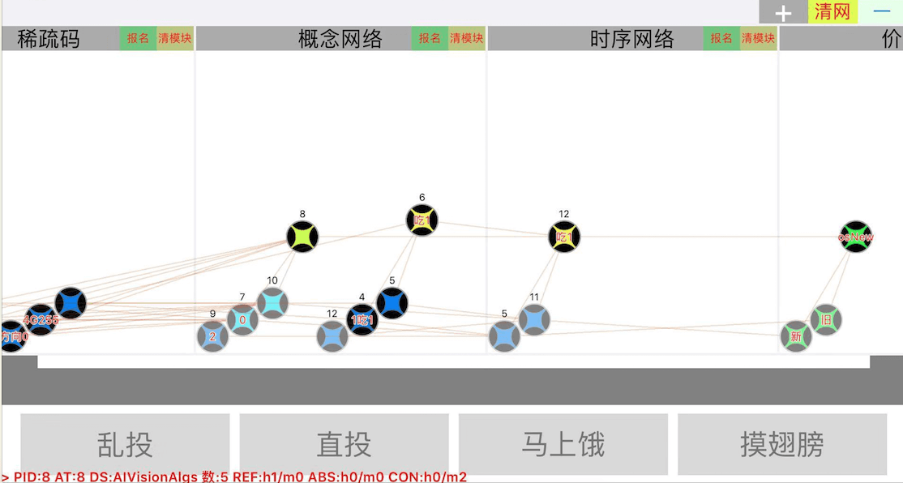

# 训练

<!-- TOC -->

- [训练](#%E8%AE%AD%E7%BB%83)
  - [n18p1 训练进度可视化](#n18p1-%E8%AE%AD%E7%BB%83%E8%BF%9B%E5%BA%A6%E5%8F%AF%E8%A7%86%E5%8C%96)
  - [n18p2 时序识别测试](#n18p2-%E6%97%B6%E5%BA%8F%E8%AF%86%E5%88%AB%E6%B5%8B%E8%AF%95)
  - [n18p4 价值概念化](#n18p4-%E4%BB%B7%E5%80%BC%E6%A6%82%E5%BF%B5%E5%8C%96)
  - [n18p5 测试训练](#n18p5-%E6%B5%8B%E8%AF%95%E8%AE%AD%E7%BB%83)
  - [n18p6 反省](#n18p6-%E5%8F%8D%E7%9C%81)

<!-- /TOC -->

***

### n18p1 训练进度可视化
`CreateTime 2019.12.27`

> 经过4个多月完善理性思维,我们可以回归到乌鸦的训练中来,本节,重点对小鸟成长训练,做步骤规划和记录;

| 训练飞行 `From N16P16` | TITLE | DESC |
| --- | --- | --- |
| 1 | 直投 | 知道吃坚果解决饥饿问题 |
| 2 | 马上饿 | 有解决饥饿的需求 |
| 3 | 远投 | 看到坚果吃不到,知道是因为距离问题,但解决不了 |
| 4 | 摸翅膀 | 学习飞行方向所导致的距离变化;(飞8方向x坚果8方向=64映射) (小鸟更关注飞近,而非飞远) |
| 5 | 主动飞 | 小鸟可逐步学会飞行方向越来越准确; |
| 6 | 主动吃 | 小鸟可在飞行坚果旁边时,吃掉坚果; |

| 18011 | 训练进度可视化 |
| --- | --- |
| 功能 | 技能检测,进度可视 |
| 触发 | 点击进行技能检测 |
|  | 1. 会吃 √ |
|  | 2. 会飞 ✕ |
|  | 3. 会躲 |
|  | 4. 会疼 |

     

### n18p2 时序识别测试
`CreateTime 2020.01.06`
> **简介:**  
> 　　本节处理在TIR_Fo的测试中,遇到的问题;  
> **本文名词与缩写解析:**
>   1. 四层: parent层,proto层,match层,abs层 (参考18021示图)
>   2. 前两层: parent层和proto层;
>   3. 后两层: match层和abs层;

| 18021 | 时序识别辅助测试图 |
| --- | --- |
| 示图 |  |

| 18022 | BUG | STATUS |
| --- | --- | --- |
| 1 | 测出A1.absPorts为空的BUG; |  |
| 2 | shortMemFo.last_p取出的是parentA1,而不是protoAlg的问题 |  |
| 3 | 在TIR_Fo的返回结果总是nil (因以上各BUG导致); |  |

| 18023 | 迭代`全含` |
| --- | --- |
| 说明 | 对于matchFo的前半匹配部分,要全含; |
| 举例 | [老虎,跑过来,咬我],前半部分,即`老虎`和`跑过来`要全含,预测`咬`; |

| 18024 | 迭代`四层fo` |
| --- | --- |
| 说明 | 支持四层.refPorts联想assFo; |
| 举例 | 否则看到重石压自己,会因为未经历过重石压,而不懂预测 |
| 附注 | 前两层主要做引导,后两层联想assFo (match优先,abs次之); |

| 18025 | 迭代`四层alg` |
| --- | --- |
| 说明 | 判断fo.itemAlg匹配时,先做contains判断为true,后做四层absPorts匹配 |
| 举例 | 非老虎时,另一种巨兽冲过来,一样预测到咬/危险; |
| 废弃 | 以上contains判断废弃,用MD5替代; |
| 附注 | 前两层主要做引导,后两层做MD5匹配 (match优先,abs次之); |

| 18026 | TIR_Fo源于瞬时/反思的伪代码 |
| --- | --- |
| 伪代码 |  |
| 注1 | 用于解决: shortMem有四层,而rethink只有两层; |
| 注2 | rethink除全含外,还须包含mAlg,而shortMem只需要全含即可; |
| 实际代码 | 1. rethink中,包含mAlg用assFoBlock()来实现了; |
|  | 2. 废弃checkFoValid,改成了独立checkFoValid()来实现了; |
|  | 3. 废弃getIndexForAssBlock,改成一条条回调assFoBlock来实现了; |

     

### n18p4 价值概念化
`CreateTime 2020.01.13`

> 1. 本文中情感,系价值的概念化 (类似时序概念化);
> 2. 大多数人都喜欢正能量,不喜欢负能量,但其实正负本来就是相对的,不可能把某个完全摒弃掉;

| 18041 | 价值概念化 >> | 简 |
| --- | --- | --- |
| 喜 | 对于已`正价值`的`感性`的喜悦 | 已正感 |
| 好 | 对于已`正价值`的`理性`的偏好 | 已正理 |
| 悲 | 对于已`负价值`的`感性`的悲伤 | 已负感 |
| 怒 | 对于已`负价值`的`理性`的愤怒 | 已负理 |
| 盼 | 对于将`正价值`的`感性`的期盼 | 将正感 |
| 思 | 对于将`正价值`的`理性`的思念 | 将正理 |
| 忧 | 对于将`负价值`的`感性`的担忧 | 将负感 |
| 恐 | 对于将`负价值`的`理性`的恐惧 | 将负理 |
| 注: | 文中,感性表示网络中mvModule |  |
| 注: | 文中,理性表示dataModule(含概念与时序) |  |

     

### n18p5 测试训练
`CreateTime 2020.01.14`

| TODO | DESC | STATUS |
| --- | --- | --- |
| 1 | 乱扔很多坚果,都是最具象alg,且在内存中,导致识别失败 | T 同BUG3 |
| 2 | 查日志:"最后一个alg都未匹配,查看是否在联想时就出bug了",经查是因为checkItemValid中,从parent层到match层,少取了一层,导致无法匹配到; | T |
| 3 | "概念识别"在内存局部匹配时,极易匹配到最具象节点,导致关联失败; **解决方式:** 废弃内存局部匹配, **因为:**硬盘局部匹配其实也有最具象的时候,不过这种情况少,是可接受的,算做智能体在最初学习阶段,不易识别,因为还没学好,但如果内存局部匹配的话,这种问题是贯彻始终的,即智能体已经学的非常溜,依然会有这种情况; | T |
| 4 | 在点击直投时,先吃,才看到吃前视觉的坚果,这显然不对 (写OutputObserverType解决); | T |
| 5 | 列举出,一个时序 如[吃坚果饱],来测试时序识别; | T |
| 6 | 在步骤一和二进行训练后,重启应用训练,`乱投`无法识别到坚果,怀疑是内存网络中,有些抽象未持久化导致; |  |
| 7 | 在训练1+2后,第三步训练时,坚果乱投,却行为化成功为act=[],未发现距离问题 (经测试,发现mcs&cs&ms都为空,因为MC类比时,M.absPorts和C.absPorts都为空,并没有抽象为距离坚果); |  |
| 8 | 输出失败,焦急时,产生负mv | T |
| 9 | 点`马上饿`决定吃掉面前坚果,此时: `吃`前要`看`,`看`到坚果又决定`吃`,形成外层死循环 | T |

| BUG9 解决方案>> |
| --- |
| 1. 吃前不看,(都决定行为了,临门一脚,再多余的动作,是不可能滴) |
| 2. 瞬时不清空 (行为输出后,能够将时序连起来) |
| 3. 方案1+2 |
| 4. 输出行为的去重 |
| 5. DemandModel中存actionsFo,并判断去重等; |
| 6. 新OutputActions时,将旧的作废 (以后改为连续视觉后,会需要这样的支持,同时只能输出一个行为); |
| 结果: 95%选择方案3,其无多余动作,故天然避免4和5所指的重复问题; |
| 结果: 6所提及问题,可与1+2配合,但在v2.0暂不需要,所以放到迭代计划中; |

| 训练计划 (步骤) |
| --- |
| 1. 点`直投`抽象出assFo[坚果,吃] -> (饱mv↑) |
| 2. 点`乱投`坚果,进行概念识别,并时序识别,conProtoFo[坚果,...]预测 -> (饱mv↑) |
| 3. 点`马上饿`产生需求进行决策,MC匹配,因为不明白距离的影响,智能体会直接吃远处坚果,但吃不饱 (从而焦急); |
| 4. 训练计划：在外循环，有效利用焦急情绪，让智能体发现距离＞0的坚果不能吃。 |
| 5. 点`摸翅膀`,学会飞行,并且能够通过飞行解决距离问题 -> 飞行 |
| 6. 并决策有皮的问题 -> 去皮 |
| **考虑下是否需要一些前期工作:** |
| 1. 在各种位置吃坚果 |
| 2. 点`摸翅膀`训练飞行 |

| 步骤1 | 抽象出assFo[坚果,吃] -> (饱mv↑) |
| --- | --- |
| 训练 | 在新安装后,直接进行直投,三次后,得到正确结果,如下图: |
| 结果 |  |
| 说明 | 1. `f12[a8,a6]` 其中a8主抽象坚果,a6为吃; |
|  | 2. `f5[a7,a4,a9]` 其中a7为场景坚果,a4为吃,a9为空场景; |
|  | 3. `f11[a10,a5,a12]` 其中a10为场景坚果,a5为吃,a12为空场景; |

| 步骤2.1 | 点`乱投`,进行概念识别; |
| --- | --- |
| 训练 | 点击`乱投`后,直接打印"识别alg成功",且未发现可疑问题,继续下一步训练; |
| **步骤2.2** | **点`乱投`,进行时序识别;** |
| 训练 | 点击`乱投`前两次识别时序失败,后两次再点又成功了;如下图: |
| 示图 |  |
| 说明 | 1. protoFo仅由一个场景视觉中的坚果组成 (见f23); |
|  | 2. 识别得f12[a8坚果,a6吃] |
|  | 3. 且预测得m4(价值↑) |
| 问题 | 前两次,未识别时序成功,疑为当时关联强度为默认1,导致初时未联想到导致; |

| 步骤1+2 | 联合训练记录 |
| --- | --- |
| 训练1 | 点击`直投`三次,发现抽象出抽象时序,对应[坚果,吃] |
| 训练2 | 点击`乱投`一次,发现识别出assFo,对应[坚果,吃]->(mv↑) |

| 步骤3.1 | 点`马上饿`产生需求进行决策,并MC发现距离问题; |
| --- | --- |
|  |  |
| **步骤3.2** | **点`摸翅膀`由触摸反射被动飞行,学习各种方向的飞行时序;** |
|  |  |
| **步骤3.3** | **点`马上饿`产生需求,并主动飞行解决距离问题;** |

| 步骤4 | 多次吃不到时,焦急且类比,进行抽象距离>0,而导致吃不到; |
| --- | --- |
| 迭代 | 考虑将from-to方式，添加到稀疏码类比中，抽象时，值为from-to。 |

     

### n18p6 反省
`CreateTime 2020.01.19`
> 在训练步骤三时,发现MC没有共同抽象"距离",导致距离的差异并不能被he反思到;而位置>0时,导致吃不到,这个时序会作为新的输入信息;
>
> 此时只要做新的类比,就可以发现距离>0会导致mv-,而距离=0才可以mv+;
>
> 所以本节,主要讲将外层循环考虑进来,看对训练的作用,以解决此问题;

1. 换个位置直投，抽象出与位置无关。
2. 有距离时吃不到，反省类比出距离抽象，距离对mv，一者指正，一者指负。
3. 外层循环,打通,可解决此问题;

| 18061 | 思考如何取得预测fo与行为fo，才能进行类比。 |
| --- | --- |
| 1. 纯循环方式: | 测试下行为fo，在TIP中进行输入联想后类比会得到什么结果？ |
| 2. 反省方式: | 测试下在demandManager中,放上actionFo,并与执行出的结果newFo,进行类比; |

     
