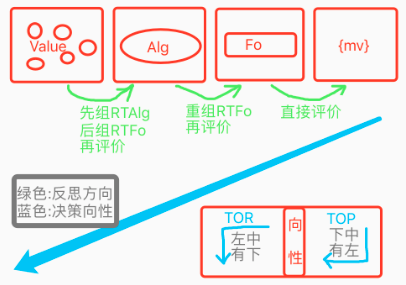

# 测试 & 细节改动 & 训练

<!-- TOC -->

- [测试 & 细节改动 & 训练](#%E6%B5%8B%E8%AF%95--%E7%BB%86%E8%8A%82%E6%94%B9%E5%8A%A8--%E8%AE%AD%E7%BB%83)
  - [n19p1 精细化训练2](#n19p1-%E7%B2%BE%E7%BB%86%E5%8C%96%E8%AE%AD%E7%BB%832)
  - [n19p2 TIR_Alg_FromRT算法迭代](#n19p2-tir_alg_fromrt%E7%AE%97%E6%B3%95%E8%BF%AD%E4%BB%A3)
  - [n19p3 预测不符引发: 反馈类比](#n19p3-%E9%A2%84%E6%B5%8B%E4%B8%8D%E7%AC%A6%E5%BC%95%E5%8F%91-%E5%8F%8D%E9%A6%88%E7%B1%BB%E6%AF%94)

<!-- /TOC -->

***

### n19p1 精细化训练2
`CreateTime 2020.04.06`

> 说明: 继续note18的训练进度;

| 19011 | 训练步骤细节分析版: | STATUS |
| --- | --- | --- |
| **A组** | 目标: `果可吃` | 独立可训 |
| A1,2 | **直投,直投** | T |
| A3 | **重启,移动,并直投** | T |
| **B组** | 目标: `远果不能吃+模糊识别` | 独立可训 |
| B4,5 | **重启,远投,马上饿,马上饿** | T |
| B6 | **重启,远投(投向与A6不同的方向),马上饿** | T |
| B7 | **返回,重进成长演示页,远投** | T |
| **C组** | 目标: `学习飞行,可解决距离的常识+内类比` | 独立可训 |
| C8 | **重启,远投上,摸翅膀上** | T |
| C9 | **再摸...(从各种飞行角度,发现与距离的变化的映射)** | 暂略 |
| **D组** | 目标: `决策,并输出飞行离坚果更近` |  |
| D10 | **重启,远投上,马上饿** | 依赖ABC组 |
|  | =>行为化输出吃,而不是飞,应该从`远果,吃`中学习到,远果不能吃 `BUG_1`; |  |
|  | =>MC_Value到RelativeValue行为化 `BUG_2` |  |
| D11 |  |  |

| BUG | STATUS |
| --- | --- |
| 1. 远投后,MC行为化结果为`吃`,而不是`飞`的问题; |  |
| 2. 下投坚果,行为化为`飞上`,导致更飞远了; |  |
| > 分析: 小鸟只经历过飞上,离上坚果更近,所以这里要加入对方向的判断,抽象出不同方向坚果进行不同方向飞行的知识; |  |

    

### n19p2 TIR_Alg_FromRT算法迭代
`CreateTime 2020.04.06`
> 因为在精训D10时,发现M特化值:`经266`,在TIR_Alg_FromRT()时,重组[经266,高5],识别后,得到[距20,经266,高5],其中杂质`距20`导致评价失败;所以本节对TIR_Alg_FromRT算法进行迭代;

| 19021 | 算法变动说明 |
| --- | --- |
| 1 | 去除fuzzy模糊匹配,仅将match返回; |
| 2 | 返回结果必须包含mUniqueValue特化值; |

| 19022 | 改动后,测试与BUG |
| --- | --- |
| BUG | 当mUniqueValue=`距20`,same_ps=`w5,h5,g1`时,rtAlg=`w5,h5,g1,距20`,执行新版识别后,发现根本找不到距20的,全含的坚果,因为在抽象时,距20早已被去除; |
|  | 分析: 此问题关键在于,识别无法成功,我们需要更多抽象的常识,我们可以通过以下两种途径来获取: |
|  | 途径1: 认知阶段,更多确切的常识 (依赖更多经历,进行外类比); |
|  | 途径2: 决策反馈,更多的对确切信息的价值指向; |
|  | 总结: 综上,我们需要整个系统的角度来分析此问题的解,分析转至19023; |

| 19023 | 从系统TO角度,分析抽象不足的问题; |
| --- | --- |
| 决策与反思示图 |  |
| 说明 | 绿色: 根据MModel识别与预测,进行反思评价; |

| 19024 | 从系统TI角度,分析抽象不足的问题; |
| --- | --- |
| 认知与反馈示图 |  |
| 说明 | 绿色: 根据MModel识别与预测,进行反馈认知; |

    

### n19p3 预测不符引发: 反馈类比
`CreateTime 2020.04.06`
> 简介: 在TIP时,假如imv与mModel的预测不符,会触发类比,以快速获取非常确切的抽象常识;本节从此出发,设计此类比算法;  
> 简写说明:
> 1. MP (Match&Proto) `M指识别预测的,P指原始输入的`

| 19031 | 不相符的原因,归咎于两种: |
| --- | --- |
| **第1种** | 该出现的(`概念`/`稀疏码`)未出现; |
| 举例 | 玩成语接龙,以张三时未接上; |
| **第2种** | 不该出现的(`概念`/`稀疏码`)出现; |
| 举例 | 一直能赢,今天李四加入,我们输了; |

 
