# v2.0版本三测
　　本章对v2.0进行第三轮测试训练，此前一测为2019年5月，二测为2019年12月，本轮改进主要是在上轮二测后，改进了以下几个方面:
  1. 反向反馈类比，更快更全面的抽象。
  2. 以及决策期对网络更全面的使用（主要是SP方面）。
  3. 对短时记忆更全面的支持。
  4. 以及对外循环更好的支持完善。

　　所以本次三测，或有望成为发布v2.0前的最后一轮测试，且在上轮二测中已经基本测通了认知期的代码，以及测了大多数决策期的代码。

***

<!-- TOC -->

- [v2.0版本三测](#v20版本三测)
  - [n20p1 三测: 规划训练1](#n20p1-三测-规划训练1)
  - [n20p2 三测: 规划训练2](#n20p2-三测-规划训练2)
  - [n20p3 三测: 耗时BUG](#n20p3-三测-耗时bug)
  - [n20p4 从`ft稀疏码`到`MultiMatch`](#n20p4-从ft稀疏码到multimatch)
  - [n20p5 识别算法迭代](#n20p5-识别算法迭代)
  - [n20p6 PM理性评价](#n20p6-pm理性评价)
  - [n20p7 三测: 规划训练3](#n20p7-三测-规划训练3)
  - [n20p8 决策流程控制整理->支持HNGL时序、支持Fo](#n20p8-决策流程控制整理-支持hngl时序支持fo)
  - [n20p9 继续三测](#n20p9-继续三测)
  - [n20p10 PM理性反思评价准确度迭代](#n20p10-pm理性反思评价准确度迭代)
  - [n20p11 TIR_Fo识别率迭代](#n20p11-tir_fo识别率迭代)
  - [TODOLIST](#todolist)

<!-- /TOC -->

***

### n20p1 三测: 规划训练1
`CreateTime 2020.06.06`

| 20011 | 训练步骤细节分析版: | STATUS |
| --- | --- | --- |
| A | 果可吃 | T |
|  | **1. 直投,飞右上,直投** | T |
| B | 远果不能吃 | T |
|  | **1. 重启,远投右,饿** | T |
|  | **2. 重进成长页,远投右** | T |
| C | 学飞 |  |
|  | **1. 重启,远投右,飞右** |  |
| D | 用飞 |  |
|  | **重启,远投上,马上饿** |  |

**20012完成标记**

* A组: 果可吃
  - 直投,飞右上,直投
    ```c
    //类比出无经纬果可吃;
    //1. 正向类比-抽象时序
    STEPKEY------------------------ 正向反馈类比 START ------------------------
    F8[A4(),A5(速0,宽5,高5,形2.5,距0,向→,红0,绿255,蓝0,皮0,经199,纬375),A1(吃1),A6()]->M3{64}
    F3[A1(速0,宽5,高5,形2.5,经207,纬368,距0,向→,红0,绿255,蓝0,皮0),A1(吃1),A2()]->M1{64}
    STEPKEY--->> 构建时序:F11[A10(速0,宽5,高5,形2.5,距0,向→,红0,绿255,蓝0,皮0),A1(吃1)]->M7{64}
    //2. 正向类比-抽象概念
    STEPKEY—> 构建概念:A10(速0,宽5,高5,形2.5,距0,向→,红0,绿255,蓝0,皮0)
    STEPKEY具象1:A5(速0,宽5,高5,形2.5,距0,向→,红0,绿255,蓝0,皮0,经199,纬375)
    STEPKEY具象2:A1(速0,宽5,高5,形2.5,经207,纬368,距0,向→,红0,绿255,蓝0,皮0)
    ```
* B组: 远果不能吃
  - 远投右
    ```c
    //B1-远投 (预测吃可饱);
    STEPKEY时序识别: SUCCESS >>> matchValue:0.500000 F11[A10(速0,宽5,高5,形2.5,距0,向→,红0,绿255,蓝0,皮0),A1(吃1)]->M7{64}
    //B1-饿 (真实为饿)
    STEPKEY------------------------ 反向反馈类比 START ------------------------
    STEPKEY----> 反向反馈类比 CreateFo内容:F2[A1(距0),A1(吃1)]->M10{64}
    STEPKEY----> 反向反馈类比 CreateFo内容:F2[A1(距46,经202,纬508)]->M13{-51}
    //B1-进R+,输出吃,但并不能解决问题;
    -> SP_Hav_isOut为TRUE: A1(吃1)

    //B2-远投右 (预测更饿)
    STEPKEY时序识别: SUCCESS >>> matchValue:1.000000 F13[A7(速0,宽5,高5,形2.5,向→,红0,绿255,蓝0,皮0,距54,经191,纬531)]->M8{-51}
    //B2-进R- (进入SP行为化,得到了GLDic,但失败了,因为此时的行为应该是飞近,但没学过飞)
    ------SP_GL行为化:距37 -> 距0
    //B2-进R+ (循环前两帧,一帧越界`参考bug7`,一帧输出吃`同B1`)
    <警告> 行为化概念无效
    -> SP_Hav_isOut为TRUE: A1(吃1)
    ```
* C组: 学飞
  - 远投右,飞右
    ```c
    //C1-飞右 (进入SP-GL行为化)
    ------SP_GL行为化:距52 -> 距0
    //BUG-发现GL找不以索引glAlg,导致行为化失败;
    ```


| 20013_BUG | STATUS |
| --- | --- |
| 1. 活跃度消耗在决策每轮循环调用之前,导致决策循环完未消耗活跃度; | T |
| 2. demand.fo不应期不工作,导致每轮循环联想同一解决方案; | T |
| 3. 训练到C时,远投右,预测时序为mv-,应该进TOP.R-,但却进了P+; | T |
| 4. 训练到B1点击饿时,进了R+,而不是R- (预测为正,实际为负); | T |
| > 正常的,因为预测为正,所以会R+输出`吃` (虽然并吃不到); | T |
| 5. 当决策完成时,是否主动观察自身价值状态 (比如输出吃,观察饥饿状态是否变化); | T |
| > 暂不,因为尽量让imv自然发生,像吃时不会马上饱,而是有味觉吸引着继续; | T |
| 6. TOR.R-中indexOfAbsItem方法得到-1失败的bug | T |
| 7. 有outModel.actionIndex>fo.content.count的问题,导致"行为化概念无效"; | T |
| > 因为B组共三帧,最近一帧右投预测不能吃,R-行为化失败,因为不会飞; | T |
| > 倒数二帧,是B1的马上饿,输出吃,预测可饱,R+行为化失败,因为`吃`已输出,所以越界; | T |
| 8. C1训练右飞两次后,为何还是找不到距离变小索引; |  |
| > 分析原因: 因为在用pAlg索引找,未经历过飞至距0,所以无法找到; |  |
| > 修复方案: 改为由sAlg索引,找s出发,变小接近p; |  |
| > 经查,修改为sAlg依然没有glAlg,所以查内类比是否根本没构建`距变小`节点; |  |
| 9. C1飞右后一帧,被识别为距0果,导致前后内类比成了`距71->0`,这显然不对; |  |
| > 经查因为飞后一帧的速度!=0,所以无法全含,只能纯相似匹配,导致识别为距0果; |  |
| > 修复方案1: 飞到0,吃掉坚果->{mv+} |  |
| > 修复方案2: 训练不同方向飞 (速度也不同),从而抽象出无速度坚果; |  |
| > 执行: 将C1改为向各种方向飞,先抽象出无速坚果,再专注训练飞变近; |  |


<br/><br/><br/><br/><br/>


### n20p2 三测: 规划训练2
`CreateTime 2020.06.18`

> 上节中,因BUG8和9导致速>0的问题,本节调整训练方式,尝试找出更少步骤的新版训练步骤;

* **20021 >> A组-构建无速果,远果不能吃**
  - A1右投
    - `A1(速0,高5,经217,纬536,距56,向→,皮0)` `下简称A1`
  - A2饿
  - A3右飞
    - `A2(高5,经217,纬536,距56,向→,皮0,速-0.000002)`
    - matchA_Seem:`A1`
    - `F4[A1]`
    - matchF:`F2[A1]->M1{-51}`
    - `A3(高5,经217,纬536,向→,皮0,距52,速-9.980625)`
    - `F6[A1,A1]`
    - matchF:`F2`
  - A4右上飞
    - `A4(速0,高5,经217,纬536,向→,皮0,距52)`
    - `A5(高5,经217,纬536,向→,皮0,距50,速-6.417388)`
  - A5饿
    - 正向类比:`F2[A1]->M1{-51}`
    - 正向类比:`F10[A3,A4,A2(飞↗),A5]->M3{-51}`
    - 构建概念:`A12(高5,经217,纬536,向→,皮0)`
    - 构建时序:`F13[A12(高5,经217,纬536,向→,皮0)]->M7{-51}`
* **20022 >> B组-果可吃**
  - B1重启,直投
    - `A6(速0,高5,向→,皮0,经207,纬368,距0)` `下简称A6`
    - matchA_Seem:`A1`
    - `F14[A1]`
    - matchF:`F2[A1]->M1{-51}`
    - 反向类比:`F2[A1]->M1{-51}`
    - 反向类比:`F16[A6(速0,高5,向→,皮0,经207,纬368,距0),A1(吃1),A7()]->M8{64}`
    - 构建S:`F2[A1(经217,纬536,距56)]->M10{-51}`
    - 构建P:`F2[A1(经207,纬368,距0),A1(吃1),A7()]->M13{64}`
  - B2飞右上
    - `A2(飞↗)`
    - `F19[A1,A2(飞↗)]`
  - B3直投
    - `A10(速0,高5,向→,皮0,经199,纬375,距0)`
    - matchA_Seem:`A6`
    - `F20[A1,A2(飞↗),A6]`
    - matchF:`F16[A6,A1(吃1),A7()]->M8{64}`
    - 内类比:`F20[A1(速0,高5,经217,纬536,距56,向→,皮0),A2(飞↗),A6(速0,高5,向→,皮0,经207,纬368,距0)]`
      - 内类比 (大小) 前: 纬536 -> 纬368
      - 内类比 (大小) 前: 距56 -> 距0
      - 内类比 (大小) 前: 经217 -> 经207
    - 正向类比:
      - Con1`F16[A6(速0,高5,向→,皮0,经207,纬368,距0),A1(吃1),A7()]->M8{64}`
      - Con2`F22[A9(),A10(速0,高5,向→,皮0,经199,纬375,距0),A1(吃1),A11()]->M14{64}`
      - Abs:`F25[A24(速0,高5,向→,皮0,距0),A1(吃1)]->M16{64}`
  - B4,重启,右投,饿; `避免让小鸟以为右投就能饱`
  - B5,重启,右投,饿; `避免让小鸟以为右投就能饱`
* **20023 >> C组-训练飞**
  - C1:重启,远投右
    - `A12(速0,高5,纬536,距56,向→,皮0,经211)`
    - matchA_Fuzzy:`A1(速0,高5,经217,纬536,距56,向→,皮0)`
    - `F26[A1(速0,高5,经217,纬536,距56,向→,皮0)]`
    - matchF:`F23[A1,A2(飞↗),A6,A1(吃1)]->M15{64}`
  - C2:飞右
    - `A13(速0,高5,纬536,距56,向→,皮0,经211)`
    - matchA_Fuzzy:`A1(速0,高5,经217,纬536,距56,向→,皮0)`
    - `F27[A1(速0,高5,经217,纬536,距56,向→,皮0),A1(速0,高5,经217,纬536,距56,向→,皮0)]`
    - matchF:`F11[A1,A1,A1,A1]->M4{-51}`
    - 行为化topV2_R+:`-> SP_Hav_isOut为TRUE: A2(飞↗)`
  - C3:重启,右投一飞距离;
  - C4:右飞;

| BUG | STATUS |
| --- | --- |
| 2. 查下C1为何未预测到远果不能吃; |  |
| 3. 在B3时,对F20[]进行内类比,得到距大到距0,变小,查下这里为什么会有距50,因为B组都是直投; |  |
| > `F20[A1(速0,高5,经211,纬518,距50,向→,皮0),A2(飞↗),A6(速0,高5,向→,皮0,经207,纬368,距0)]->F2[A2(飞↗),A1(纬小)]` |  |
| > 查下,F20何来,或者说A1为什么会出现在此处; |  |
| 4. 在C2时,行为化先输出了`飞右上`,后输出了`吃`,查下为什么飞右上后,直接就输出吃了?因为飞右上,并没有直接让坚果的距离为0,此时是吃不到坚果的; |  |
| 5. 输出飞右上行为后,并没有解决Demand,却中止的问题; `转至todo2` | T |
| 6. 在B组之后,需要插入右投马上饿,否则会将C1的远果预测为mv+,查下为什么? |  |
| 7. 在C4飞到距离0时,为什么反而识别成了距7果? |  |

| TODO | STATUS |
| --- | --- |
| 1. 用于描述外观的:`红绿蓝角宽高`,调试时看着眼累,可保留`高`,其它去掉,不影响且直观; | T |
| 2. DemandModel.status完成,只会发生在两种情况下,1是任务被抵消(如饱腹感),2是活跃度为0(如想不到方法了); |  |
| 3. 对飞行8个方向的调试,要支持根据坚果方向,飞向不同方向,以保证飞近; |  |
| 4. 测试_GL行为化,找不到glAlg的BUG,是否ok了; | T |
| > 经测,依然无法联想到glAlg,测试方式为将B组后,插入,远投右,马上饿,重启三步; | T |
| 5. 对决策系统,写打印日志,进行测试; |  |
| 6. 测试任务未完即断的问题 (已修复bug,但还没测); |  |
| 7. 查下fuzzyAlg匹配,是不是模糊条数少会优先,比如(a1,b0),会匹配到(a1,b2),而不是(a1,b1,c1); |  |


<br/><br/><br/><br/><br/>


### n20p3 三测: 耗时BUG
`CreateTime 2020.06.24`

| 20031 | 找不到glAlgBUG; |
| --- | --- |
| 简介 | 无法联想到glAlg的bug,因为`SP构建线`和`GL构建线`本来就不同,所以找不到glAlg; |
| 分析 | 现有代码仅支持从P找一层抽象,而这无法与GL找到交集,故联想失败; |
| 示图 | 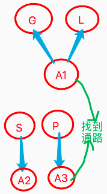  |
| 图解 | 1. GL和SP的构建并非同时,但从理性考虑,其越相似,GL也同时可对P有效; |
|  | 2. 用A3找A1,优先从纵向`找抽具象有关系`的,其次用`相似度匹配`个有相似的; |
| 改测 | 1. 见图2,发现确实存在抽具象关联,不过GL为具象,P为抽象; |
| 结果 | 先仅对GL和P做mIsC的判断,至于是否要支持相似度以后再说; |


<br/><br/><br/><br/><br/>


### n20p4 从`ft稀疏码`到`MultiMatch`
`CreateTime 2020.06.25`

起因:
1. posX/Y并不是放弃行为化,而是因为本来posX/Y符合ft稀疏码,所以根本不需要行为化;
2. fuzzy匹配充满不确定性,而决策害怕这种不确定性,故习得ft稀疏码,更全面的经验为了更好使用;
3. fuzzy需要计算推测(即相似度模糊匹配),而ft稀疏码不需要计算,这符合`类比结果保留`原则;
4. 类比时,不同不表示无信息,比如8cm苹果和9cm苹果并不表示苹果无大小;

| 20041 | ft稀疏码的两个解决方案 |
| --- | --- |
| **激进方案** | 可以写ft稀疏码索引,并在抽象概念中引用,比如苹果的大小为(6cm-13cm)`5%`; |
| 缺点 | ft稀疏码索引不好维护,比如3比5得到(f3t5),而(f3t5)比8得到(f3t8),但he的知识是不能变动,只能新增的; |
| 优点 | 符合将全面经验存留,并在今后使用的原则; |
| **保守方案** | 不特意写ft,仅在匹配时,对conPorts的同区稀疏码取出,并得到大概范围`95%`; |
| 缺点 | 性能不如方案一好,也犯下了经验不全,实时运算收集的错误; |
| 优点 | 现在这需求并不急,而这些对当前训练的影响,可以先转由别的方法解决 `见20042`; |

| 20042 | MultiMatch |
| --- | --- |
| 比如 | fuzzy带来posX/Y的要求,而这显然并不需要,的问题; |
| 解决 | 多识别:多个全含识别,替代fuzzy匹配,即可更全面预测,又避免了fuzzy带来的不确定性; |
| 举例 | 可将远果,识别为:`果可吃`和`远果不可吃`,两个全含概念与时序; |

| 20043 | fuzzy算法的本质矛盾 |
| --- | --- |
| 1 | 要求,fuzzy算法模糊匹配到`距离`; |
| 2 | 要求,fuzzy不能模糊匹配到`位置`; |
| 问题 | 这二者,是矛盾的,我们不能要求同样的代码逻辑下,对二者的结果要求截然相反; |
| 示图 | 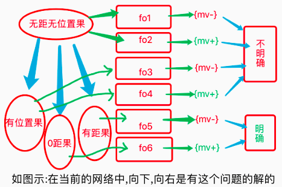 |
| 解读 | 本图,可用来指导迭代时序价值预测算法,即利用稀疏码尽量避免价值预测的不确切性; |

<br/><br/><br/><br/><br/>

### n20p5 识别算法迭代
`CreateTime 2020.06.27`

　　因fuzzy带来的不确定性，原则上与信息熵减机的熵减相违背，本节将针对这一点，对识别算法进行迭代。本节共分两个部分进行迭代，一是取消概念识别中的fuzzy模糊部分，二是对时序识别进行迭代使之支持更加确切的时序与价值预测。

| 20051 | MatchAlg部分->代码变动规划 |
| --- | --- |
| 1 | 取消tirAlg算法的fuzzy算法,仅保留全含; |
| 说明 | 因为fuzzy是熵增的,而不是熵减,无论如何都会带来不确定性,蝴蝶效应致其后运转混乱; |

| 20052 | MatchFo部分->代码变动规划 |
| --- | --- |
| 规划 | 对tirAlg的全含结果进行refPorts联想,查看其是否价值稳定; |
| 1 | 如果稳定,可直接返回匹配度最高的时序识别结果 `->识别成功`; |
| 2 | 如果不稳定,即价值时正时负,则进行以下操作: |
|  | a. 根据protoAlg中,找出独特部分的指引 (如距8,pos9等...); |
|  | b. 顺着时序具象,找出稳定的结果,如有距果总是不能吃,则返回结果 `->识别成功`; |
| 注 | 因为protoAlg的独特稀疏码可能多条,所以最终稳定的结果,也可能是多条; |
| 性能 | 关于此规划方案,的性能问题,有以下两种方式: |
|  | 1. 学习期间即构建from-to概念,因本身已具象关联,故不采用; `5%` |
|  | 2. 不构建from-to节点,而是在`独特稀疏码`同区指引下,用全含fo向具象找出答案 `95%`; |
| 废弃 | 中止本节开发,转至n20p6分析从理性角度求解; |


<br/><br/><br/><br/><br/>


### n20p6 PM理性评价
`CreateTime 2020.06.28`

　　本节起因为：`距离`与`位置`的矛盾,分析尝试从类比或理性解决,最终演化为在决策中进行PM理性评价 (PM为ProtoMatch略写),评价失败时,转行为化;

| 20061 | 分析 |
| --- | --- |
| 示图 |  |
| 解读 | 如图,距离是稳定的,而位置是不稳定的; |
| 原则1 | 距离与位置能否吃,是一个理性问题 (无论它们导致的价值如何,理性上是可判断的); |
| 原则2 | `距离`与`位置`矛盾的向性应该是向下的,所以应由决策解决; |
| 方案1 | 决策时,理性判定`距0果能吃`,`距>0果不能吃`,`位置不影响`; |
|  | 优点: 可保证在识别与预测中,广泛的精准的放开想法,到决策期再进行理性的可行性判断; |
|  | 比如: 看到电视上的美食,我也会预测是吃的然后想吃,只是决策分析到需要网购发快递; |
|  | 反例: 如果因为价值不稳定,就想都不想吃,就会错过很多熵减的机会 (因为不稳定是可操作的); |

| 20062 | 代码规划 |
| --- | --- |
| 示图 |  |
| 1 | 在识别阶段,仅作全含识别; |
| 2.1 | 在行为化时,用protoAlg独特稀疏码指引,向具象理性判定其是否需实现; |
| 2.2 | 在行为化_GL中,用RelativeFo_ps判断具体稀疏码是否需行为化; |
| 总结 | 本表,仅决定了,此问题需在决策阶段解决,但对代码的规划还太过粗糙,继20063 |

| 20063 | 代码规划2 |
| --- | --- |
| 代码 | 在TOR.R+中,每一帧protoAlg输入,都做下图中操作; |
| 初步示图 | 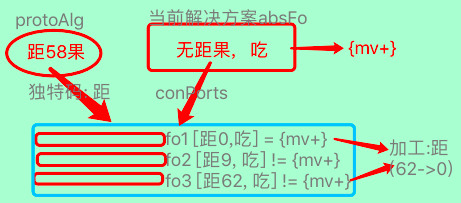 |
| 说明 | 图中,以protoAlg特化码`距`为指引,从absFo.conPorts中,找出价值`正`和`非正`,并得到加工结果`62->0`; |
| 疑点 | Q: fo2和fo3怎样与absFo建立的抽具象关联? |
|  | A1: 如果`fo2=[距5,距0,吃]={mv+}`,即可; |
|  | A2: 或`fo2[距9果,吃]`压根不存在,先用protoAlg找同级坚果们,并fuzzy匹配到距62果,再找refPorts,看是否指向{mv+},未指向,说明不能直接吃; |
|  | 总结: 两种回答,同存而各自工作,比如拿桌上苹果吃用A1,将屏幕上的苹果网购回来用A2; |
| A2示图 |  |
| 说明 | 此图是A2解答的修正示图,步骤如下: |
|  | 1. 用A2模糊匹配到同层A3(距62); |
|  | 2. 并根据A3.refPorts,发现与F1.conPorts无交集,且得到的fo2发现并不直接指向mv+; |
|  | 3. 根据`分区距`找F1.conPorts,找到F3,发现`距0`指向mv+; |
|  | 4. 得出,需将F2的距62,加工成F3的距0; |
| 注 | **PM理性评价,只需mv同区同向即可评价成功,评价失败时,用GL加工稀疏码;** |
| 进阶 | **分析下,用不用对P.refPort和M.conPorts先取交集,再做相符判断;** |

| TODO | DESC | STATUS |
| --- | --- | --- |
| 1 | 删掉TIRAlg的fuzzy功能; | T |
| 2 | 删掉TIRFo写了一半的`更加确切的时序价值预测`代码; | T |
| 3 | 整理TOAlgModel代码,使理性评价与GL的数据兼容至TOAlgModel和决策流程控制中; | T |
| 4 | 写理性决策PM算法; | T |
| 5 | 将理性决策算法PM集成到TOR与决策流程控制中; | T |


<br/><br/><br/><br/><br/>


### n20p7 三测: 规划训练3
`CreateTime 2020.07.03`

| 20071 | 花样训练记录1 |
| --- | --- |
| 1 | 右投,饿,飞右,飞右上,饿; |
| 2 | 直投,飞右上,直投; |
| 3 | 右投,马上饿; |
| 问题 | 点马上饿,未执行到决策中,查下为什么; |

| 20072 | 花样训练记录2 |
| --- | --- |
| 1 | 直投,飞右上,直投; |
| 2 | 右投,饿,飞右,飞右上,饿; |
| 问题 | 在第2步,`SP_GL行为化:距45 -> 距0`,但未找到glAlg:`getInnerAlg: 根据:距45->距0 找:distance小 GLAlg:`; |

| 20073 | 花样训练记录3 |
| --- | --- |
| 前提 | 在记录2中,有找不到glAlg的bug, |
| 1 | 直投 |
| 2 | 右上飞,直投 |
| 3 | 右投,各种方向飞到坚果上; |
| 4 | 右投,直接点飞到坚果上; |
| 5 | 右投,马上饿; |
| BUG1 | 右投时,识别为全含抽象坚果是ok的,但马上饿后,未执行行为化,查下为什么没执行; |
| 分析 | `远果`只会识别为`无距果`,然后TOP.P+找解决方案时,参数MAlg的具象找`距0果`,才可能被解决方案引用; |
| 修复 | 将topPerceptMode()方法中,MatchAlg先取conPorts再取refPorts; |
| BUG2 | 右投,马上饿时,在_Hav行为化中,M在MModel中为无距果,C为有距果,但匹配不到,行为化失败; |
| 分析 | 经查C为M的具象,此处补上MC代码优先,判断mIsC或cIsM都可以; |
| 修复 | 写上MC,并且当MC匹配时,转给PM算法做理性评价; |


<br/><br/><br/><br/><br/>

### n20p8 决策流程控制整理->支持HNGL时序、支持Fo
`CreateTime 2020.07.07`

1. 以往的决策流程控制不支持TOFoModel，本节给予支持。
2. RelativeFo在迭代及时输出行为到外循环后，最后一位HNGL的剔除，由节给予支持。

| TODO | STATUS |
| --- | --- |
| 1. 决策流程控制支持TOFoModel,分别在Finish,Begin,Failure三个流程控制方法中支持; | T |
| 2. _Hav中对HNGL的跳过,直接Finish,并递归到流程控制的Finish方法; | T |

| 20081 | 行为"飞"死循环BUG (为测通`持续飞行功能`) |
| --- | --- |
| 说明 | 右投偏上,饿,会死循环"飞右"输出,查下原因; |
| 分析 | 1. 此处PM时,其实已经输出上一轮飞行了,那么其实位置应该已经变了; |
|  | 2. 当Fo[飞,近]飞行输出后,当前value.baseAlg.status应该=ActYes,因为飞后的结果还未传回; |
|  | 3. 如果传给PM的话,PM会重新根据alg的pm相关参数,进行重新行为化,也就会陷入再飞,再循环的死循环之中; |
|  | 4. 应该等飞行结果传入,并能够在"外推动中"之中,判断出距离变小 (或者用新的protoAlg,继续进行PM循环再飞); |
| TODO1 | 在飞行行为改为飞行结束时,才再做为input传入 (先不改有影响再说); |
| TODO2 | 在_Hav中参数为HNGL时,只将状态改为Finish但不LoopBack (先不设定独立FinishNotLoopBack状态,而是不调用递归方法); |
| TODO3 | 在下轮输入时,需要判断是否与上轮的HNGL匹配 (不用判断HNGL匹配,直接开始新一轮决策即可,比如再飞,或者重下蛋); |
| 结果 | 将_Hav中,HNGL调用递归去掉即可; |
| 进阶 | 改掉BUG后,可在此基础上,进一步测试持续飞行功能; |

| 20082 | 学习飞别的方向 |
| --- | --- |
| 说明 | 在`20081进阶`完成,BUG1也解决后,鸟学会了持续飞行,但发现下面两个问题; |
| 问题 | 一是鸟会连飞直至超过坚果一点,还不会向左下飞修正,如下图: |
| 示图 | 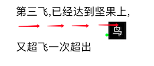 |
| 分析 | 在第三飞后,坚果在右下方,而不是(0右),导致识别不成(速0,高5,向→,皮0); |
| 方案 | 1. 在多个方向训练吃坚果,使乌鸦知道与方向无关; |
|  | 2. 只要坚果到了乌鸦手上,就识别为无向(0右),因为此时方向没什么意义; `80%` |
| 结果 | 先采用方案2,至于方案1,以后有的是时间慢慢训练,以后再说喽; |

| 20083 | 飞超过的BUG `纬度影响` |
| --- | --- |
| 说明 | 发现鸟向右飞,距0的时候,还继续飞,即飞超了; |
| 日志 | 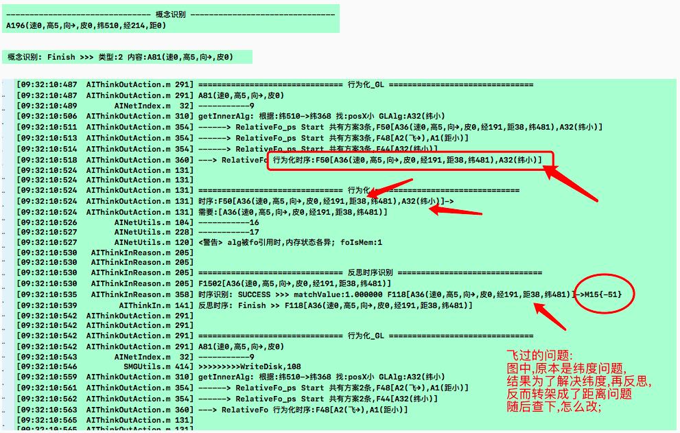 |
| 分析 | 距0时,识别为,带纬度的坚果,所以对续度的思考,导致了BUG; |

| BUG | STATUS |
| --- | --- |
| 1. 右投,马上饿,飞两步,就停住的BUG (应该是有效的fo解决方案也被不应期了导致); | T |
| 2. 右投偏下,马上饿,偶尔会在内类比处闪退,报NSArray在遍历时,同时操作了; | T |


<br/><br/><br/><br/><br/>

### n20p9 继续三测
`CreateTime 2020.07.11`

　　在上节的测试中，远投坚果后，小鸟可以在饿的时候持续飞过去，并吃掉坚果。但更多时候在这期间会出现各种各样的BUG，本节针对这些继续测试与修复BUG。

| 20091 | "投饿飞吃"后收尾测试 |
| --- | --- |
| 测试 | 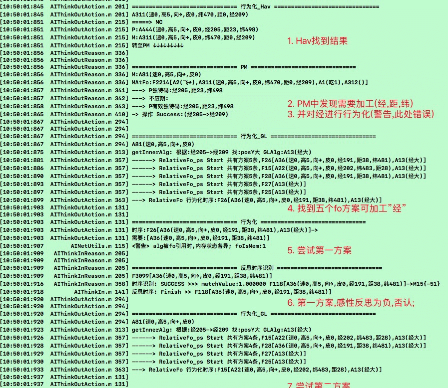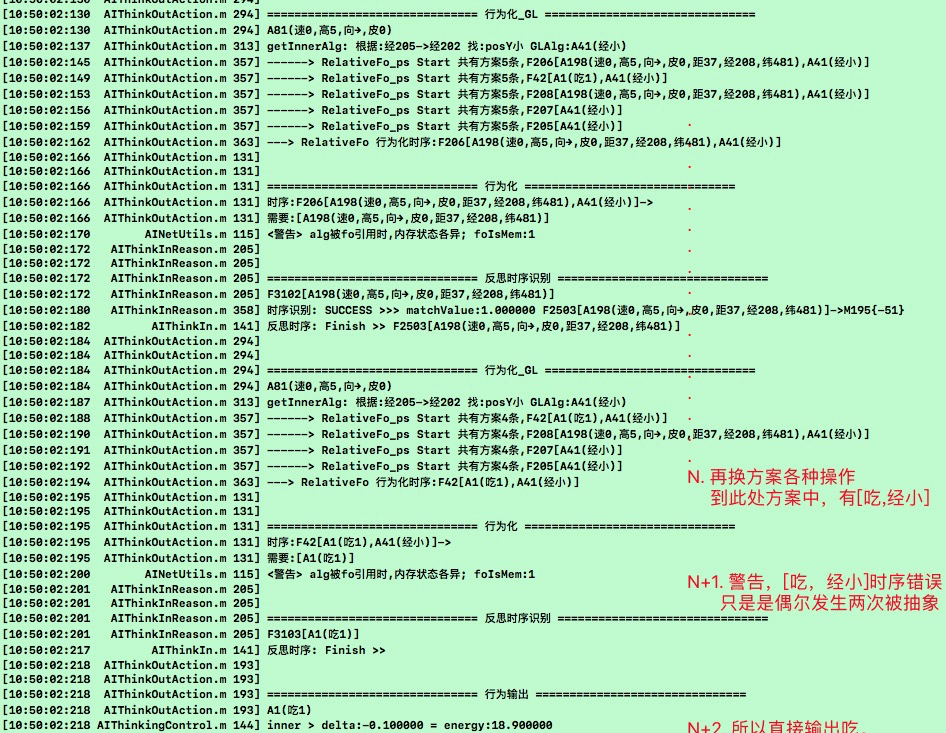 |
| 问题 | 1. 第0步：F2214的解决方案太复杂了，成功率当然低。 |
|  | 2. 第3步：第PM中，为什么会对经度进行加工？ |
|  | 3. 第10步：反思为空时，为何判定为否认了。 |
|  | 4. 第N+1步：如何避免错误时序长期为祸。 |

| 20092 | BUG2_PM为什么会对"经"进行加工 |
| --- | --- |
| 分析 | 在PM中,依`经`进行fuzzy排序后; |
|  | 1. 排在首位`经214`,其引用时序,20条,没有一个有效指向cmv价值变化的; |
|  | 2. 在第二位`经214`,其引用时序,有一个指向了{mv-}的 (需加工); |
|  | 3. 在第三位`经209`,其引用时序,有一个指向了{mv+}的 (无需加工); |
| 方案 | 将取首位前3个,改为从sortAlgs中循环取出3-5个有效价值指向的 (因为无效的没用); |
| 最后 | 原逻辑不变,只要这3-5个中,有一个指向{mv+}(即同向),则无需加工; |
| TODO | `方案`中,找出3-5个有效时序,可能要取几十次fo的io操作,为性能,可考虑将fo指针添加havMv字段,使不必取出时序,即可判断是否指向价值 `先不改,后性能不行再改`; |

| 20093 | PM理性评价不稳定的BUG |
| --- | --- |
| 情景 | 判断当前P独特码是否需要加工时,因其先fuzzy,再A-F-M长路径联想,致M指向不确定; |
| 问题 | 以往做法是找到一条`同向mv`,则不必加工,但发现距43时,甚至找到了距0指向正mv,从而未对距43进行加工,这导致了bug,本表重点针对此问题,分析更好的评价方案; |
| 原则 | 这类分析必须放在TO,不能在TI中实现; |
| 示图 | 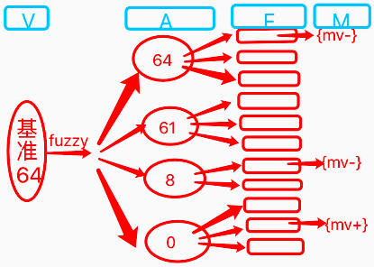 |
| 说明 | 无论是fuzzy,还是后续的指向价值,都是一种预估,因为不会有一模一样的经历; |
| 方案 | 找到首例同向前,将异向评分也存下来,在正式找到同向时,进行综合评分为结果; |
| 比如 | 找到`-64,-64,+64,综合评分为-64,需加工` 或 `-54,+64,综合评分为+10,无需加工`; |


<br/><br/><br/><br/><br/>

### n20p10 PM理性反思评价准确度迭代
`CreateTime 2020.07.15`

　　在训练中发现，即使采用了综合评价（参考20093），距和纬两个码，几乎指向一致的概念与时序，都是前三个为负价值，最后一个为正价值，综合评价为需加工。显然这样的结果并不准确，而本节将解决此问题。

| 20101 | 分析问题：`制定解决方案` |
| --- | --- |
| 问题 | PM中，距与纬有雷同的经历，并且这种情况肯定也不太少数。 |
| 分析 | 从具象中找理性评价，似乎变的不太够用，也不太好用，且与反思的向性相违背。 |
| 向性 | PM是理性反思评价，而反思的向性应该是向上、向右。 |
| 方案1 | 是乌鸦吃的太少,再多吃一些,应该就可以了 `5％`; |
|  | 分析：违背向性原则，并且也不能解决根本问题，故应该不会采用。 |
| 方案2 | PM采用SP进行反思评价 `95%`; |
|  | 分析：此方案符合向性原则（小），且符合决策更好的使用TI知识的原则（中）。 |
| 方案3 | 在方案2的基础上，是否对SP再进行外类比，使其更确切 `50％`; |
|  | 分析：实现起来略麻烦，能不用尽量不用，实在不行，再考虑。 |

| 20102 | 方案2：PM采用SP进行反思评价：代码规划 |
| --- | --- |
| 1 | 使神经网络可视化，对SP节点支持不同色显示，以查看PM中是否抽象指向SP节点。 |
| 2 | 查下反向类比代码，使之仅支持`A有无`、`V大小`，不要有`V有无`。 |
| 3 | 查下反射类比代码，是MFo和PFo间类比，还是两个MFo类比的，看是否需调整。 |
| 结果12 | 经查，`PM并没有指向SP`，且`反向类比又很难执行到（靠不住）`。 |
| 结果3 | 经查为MFo和PFo间的类比，但这没什么问题，无需调整。 |
| 结论 | 方案2，看起来并不乐观，故重新制定新方案，见20103。 |

| 20103 | 新方案：解决PM理性反思评价的准确度问题 |
| --- | --- |
| 原则 | 我无需知道理性否，只需知道理性是。 |
| 例1 | 我无需知道脏的不能吃，只需知道干净的可以吃。 |
| 例2 | 我无需知道距27不能吃，只需知道距0、距3可以吃。 |
| 例3 | 我无需知道经278不能吃，只需知道经276能吃。 |
| 示图 | 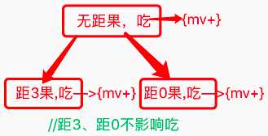 |
| 分析 | 直接根据P独特码，找是否指向`理性是`，是则能吃。如果未指向`理性是`，则加工。 |
| 方案4 | 从外类比中，生成`理性是`节点，比如距3能吃。`5%` |
|  | 分析：太麻烦，尽量不用，实在不行，再考虑。 |
| 方案5 | 直接在PM从conPorts中找到`理性是`所经历的经验。`95%` |
|  | 分析：现在PM就这么做的，但实测中并不行，明天结合实测再分析下。 |

| 20104 | 新方案: 用模糊与相对确切的角度,解决PM评价准确度问题 |
| --- | --- |
| 实训日志 | 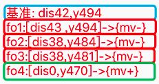 |
| 示图Q | 图中,dis和y有类似的情况,但要求dis加工为0,而y即不必加工,如何兼顾二者? |
| 示图A | 需找出dis和y的区别,此二者区别为:dis已较为确切,而y确还模糊,但智能体不知其模糊状态 (即智能体对模糊或相对确切的经验代码处理方式是一致的); |
| 方案6 | 加大对y的训练量,使其认识到任何y都可以吃 `95%`; |
|  | 注意: 此处与`远果不能吃`的训练相矛盾,即不用刻意再训练`远果不能吃`; |
|  | 分析: 这会影响到`反向类比`的调用率吗?事实上,真正的mv-前置时序,比如[车,撞],其抽象时序[物体,撞],是真实发生的mv-时序,而躲避汽车并不会导致mv+,所以反向类比,不应以同区正负mv时序时才触发类比; |
|  | 分析2: 将预测[车,撞]->{mv-},改为预测非{mv-}时,即可进行反向类比,因为理性上已经成功避免mv-; |

| 20105 | 针对方案6的训练 |
| --- | --- |
| 说明 | 飞到左下角,然后一飞一直投,一直飞到右上角为止,打出日志发现多为构建F4060节点; |
| 示图 | 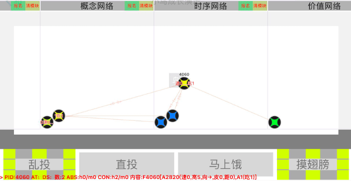 |
| 问题 | 发现F4060节点,只有两个具象,并且这两个具象没有再指向具象节点; |
| BUG | 右下角,边飞边直投到右上角,结果其抽象时序只指向两个具象,查下为什么; |
|  | 调试:发现新时序[坚果,吃]很难识别到结果,转n20p11;  |

| TODO | STATUS |
| --- | --- |
| 1. 因20104方案6,废弃综合评价,改为同区价值时,需要同向; | T |
| 2. PM评价,不同区价值时,其和需>0 `先不做`; |  |


<br/><br/><br/><br/><br/>

### n20p11 TIR_Fo识别率迭代
`CreateTime 2020.07.17`

　　在20105中，做左下边飞边吃到右上训练时，发现新的[坚果,吃]时序很难识别成功，本节将针对此问题，对TIR_Fo算法进行迭代。

| 20111 | 旧TIR_Fo算法模型图 |
| --- | --- |
| 示图 |  |
| 说明 | 由图可见,(吃)可能有上万条refPorts,前十条极可能都是非常具体的坚果,根本不可能全含A81抽象果; |
| 如图 |  |
| 说明 | 图中proto是F4545,assFo是F1265,要全含就需要A81是A311,但事实上相反A311是A81; |
|  | 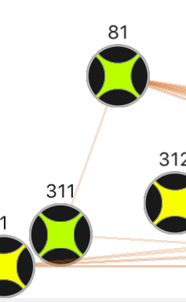 |

| 20112 | 新TIR_Fo算法模型图 |
| --- | --- |
| 示图 | 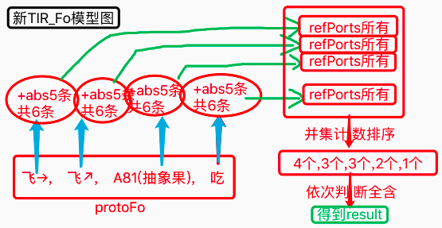 |
| 说明 | 新模型中,用取交集计数的方式排序,是更理性的做法,自然能够提升识别率; |
| 进阶 | 可以添加一条要求,比如全含且必须包含最后一位(吃),以减少范围,提升性能; |


<br/><br/><br/><br/><br/>


### TODOLIST

| TODO | STATUS |
| --- | --- |
| 20200716 | 参考20104末行说明+分析2,对反向类比进行迭代; |
| 20200716 | 参考20104末行说明,对R-算法进行迭代,使其不依赖SP兄弟节点解决; |


<br/><br/><br/><br/><br/>
