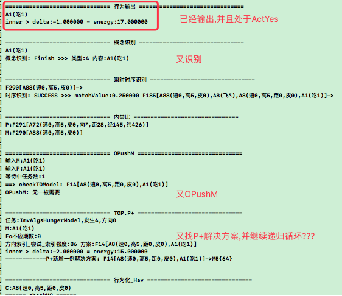
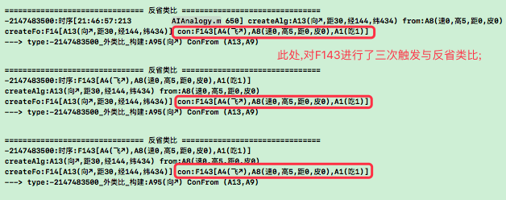
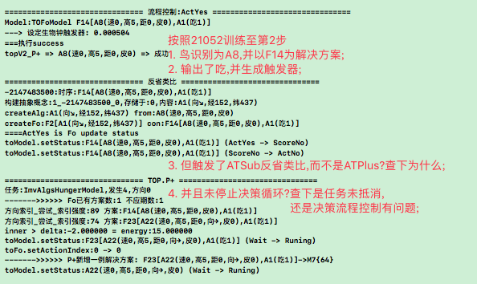
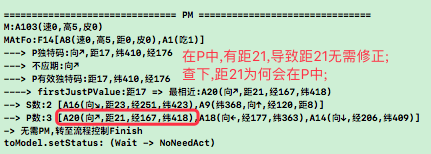
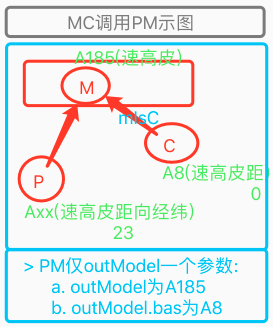

# v2.0版本四测

***

<!-- TOC -->

- [v2.0版本四测](#v20版本四测)
  - [n21p1 四测: 规划训练](#n21p1-四测-规划训练)
  - [n21p2 反省类比测试-前(deltaTimes记录,触发器,ActYes流程控制等)](#n21p2-反省类比测试-前deltatimes记录触发器actyes流程控制等)
  - [n21p3 特征模块迭代计划](#n21p3-特征模块迭代计划)
  - [n21p4 反省类比测试-后(生成SP,抽象SP,与PM应用SP)](#n21p4-反省类比测试-后生成sp抽象sp与pm应用sp)
  - [n21p5 四测:规划训练2](#n21p5-四测规划训练2)
  - [n21p6 反省递归](#n21p6-反省递归)
  - [n21p7 特征模块迭代计划2](#n21p7-特征模块迭代计划2)

<!-- /TOC -->

***

### n21p1 四测: 规划训练
`CreateTime 2020.09.01`

| 21011 | 简化训练步骤 |
| --- | --- |
| 1 | `直投,右下飞,直投,边吃边飞至右上` |
| 2 | `重启,右投,飞至坚果,吃掉` |
| 3 | `重启,右投,马上饿` (小鸟自行飞到坚果并吃掉); |

| 21012 | 简化训练步骤-多向版 |
| --- | --- |
| 1 | `直投,右下飞,直投,边吃边飞至右上` |
| 2 | `重启,右投,飞至坚果,吃掉`,`右上投,飞至吃`,`左下投,飞至吃`... |
| 3 | `重启,右上投,马上饿` (小鸟自行飞到坚果并吃掉); |

<br><br><br>

## n21p2 反省类比测试-前(deltaTimes记录,触发器,ActYes流程控制等)
`CreateTime 2020.09.01`

| 21021 | BUG |
| --- | --- |
| 1 | ATHav时序的,deltaTimes和mvDeltaTime为0的BUG (参考21022); |
| 2 | 将训练第3步右投果识别为M有向果,所以MC时失败,因为C为无距无向果; |
| 3 | 第3步改成左投,成功识别为`无距无向果`,但马上饿找到-mv解决方案 (转21024); |

| 21022 | BUG1-deltaTime为0; T |
| --- | --- |
| 示图 |  |
| 总结 | 修复getDeltaTimes()中多个BUG,现仍为0的情况参考fo.deltaTimes注释 |

| 21023 | BUG2-MC中mIsC失败; |
| --- | --- |
| 示图 |  |
| 方案1 | **将M识别为无向果M[速0,高5,皮0],即可;** |
|  | 方案1解析: 参考20172-方案2 ↓↓↓↓↓; |
| 结果 | **将第3步改成左投,可成功识别为`无距无向果`;** |
| 方案2 | **MC中不判断mIsC,而是判断MC二者的absPorts前三条,有交集;** |
|  | 方案2解析: M和C未必是抽具象上下层关系,可能是同级关系,因为后面要执行PM,所以应该广入口,窄修正,所以选择方案2,实例如下: |
|  | 实例: 奶奶听到孙女给同学打电话,说想吃`治愈系水果`,所以拿一根香蕉给孙女; |
|  | 1. 孙女:"我不要吃香蕉"; |
|  | 2. 奶奶:"你不是要吃水果吗?" |
|  | 3. 孙女:"是治愈系水果,香蕉不是" |
|  | 4. 奶奶:"什么是`至于是水果`?" |
|  | 5. 孙女:"就是甜的" |
|  | 6. 奶奶:"把香蕉切开,拌了点白糖,然后递给孙女;" |
| 解析 | 1. 例中,`治愈系水果是C`,那根`实际的香蕉是P`,`香蕉是M`,`水果是S` |
|  | 2. 显然,MC非抽具象关系,但奶奶认为M和C都是S,所以就拿给孙女; |
|  | 3. 当孙女反馈后,奶奶又在PM中,对香蕉进行特征修正,加了白糖 ↓↓↓↓↓; |
| 实测 | **实测显示,MC是同级,但并不是有共同抽象,而是有共同具象;** |
| 复现 | 按着21012训练,第3步改为右投,即可复现; |

| 21024 | BUG3-P+的解决方案为负价值; |
| --- | --- |
| 示图 |  |

| 21025 | 最后一帧isOut=true,导致反省类比未触发的BUG; T |
| --- | --- |
| 日志 |  |
| 说明 | 在21012训练后,第三步没飞过去,而是直接原地空吃; |
| 分析 | PM未发现SP,所以理性评价通过,未飞是正常的; |
| 问题 | 但下帧输出(即空吃)后,却没有触发反省类比; |
| 原因 | 经查,行为输出时isOut=true未触发ActYes,也没触发Finish; |
| 解决 | 使行为输出时,触发Finish,从而递归至base,即demand时可以触发ActYes; |
| 复现 | 按着21012训练,即可复现; |
| 总结 | 将流程控制fo.finish直接转至fo.actYes后解决 (参考流程控制Finish方法的注释version-20200916); |

| 21026 | ActYes时,决策系统还在继续P+模式继续递归着; T |
| --- | --- |
| 日志 |  |
| 说明 | 在21012训练后,ActYes时,当前任务还在反复思考F14方案; |
| 分析 | 估计是流程控制问题,新输入又尝试解当前任务,未判断其ActYes状态; |
| 解决 | 在ActYes中的解决方案(如F14),继续等待,而不是反复决策; |
| 结果 | 将isOut=true时的情况,先改为ActYes,等输出行为后,再改为Finish即可; |

| 21027 | 反省类比算法中,明明PM有四个特有码,却取到0个; T |
| --- | --- |
| 问题 | 经查,取fo.subAlg.justPValues是没有码的; |
| 解决 | 经查,短时记忆取fo.subAlg.subAlg.justPValues才可以; |

<br><br><br>

## n21p3 特征模块迭代计划
`CreateTime 2020.09.10`

　　在v3.0版本时，我们将支持多码特征，从而对特征的类比抽象有所支持，本节提前进行些记录，特征的类比，不仅包含特征间纵向类比，也包含稀疏码间的横向类比，从而形成更多样的特征。而感官算法上只需像以往所述，将稀疏码集输入即可。

　　前段时间有个新闻，是说把视觉接到听觉脑区，照样工作，但需要一定的时间来慢慢形成。

　　这里其实显示出皮层的可塑性，说明视觉算法输入时我们只提供稀疏码信息，然后通过组合方式得出模糊特征，再通过互相类比得到抽象特征。以此得到外形等特征信息（组分）。

　　这与当下的概念和时序模块非常类似。但目前代码上还是仅支持单码特征，在3.0版本时，面向现实世界的迭代中，再对特征模块进行多码支持与完善。所以本节暂止，v3.0时再续。

我语音中只是举例说明,比如说咱们两个有个算法,得出稀疏码仅为:"灰度值",

* 示例: 解释下图中我们如何认知飞机特征,以及识别飞机头;
  - 
  - 注: 本问题和图来自`@张仙_用友`提问;

```
* 假设:现感官视觉算法中:
  1. 灰度0-1表示白到黑;
  2. xy表示坐标;

* 第一次看到飞机得到最初的稀疏码可能为:
x0,y1,灰1
x2,y1,灰0
x1,y1,灰1
x2,y2,灰0
x2,y3,灰0
x1,y2,灰1
x2,y3,灰1
x2,y4,灰1
...

* 通过色值类比发现:
x0,y1,灰1
x1,y1,灰1
x1,y2,灰1
x2,y3,灰1
x2,y4,灰1

* 通过坐标类比发现 (外形):
灰1路径为: 原点-> 右1 -> 上1 -> 右上1.4 -> 上1

* 当第二次,再发现飞机时,可能有所变化,比如:
飞机2的灰1路径为: 原点-> 右1 -> 上1 -> 右上2 -> 上1

* 两个外形,再进行类比,发现,抽象飞机3的路径为:
原点-> 右1 -> 上1 -> 右上1.4/2 -> 上1

* 当描述飞机头时,发现,路径为:
原点-> 右1 -> 上1

* 注:
  1. 当然,你也可以在此基础上,支持RGB,支持模糊匹配,支持亮度,等;
  2. 就是这种,最最基础的视觉算法,通过类比后,发现各种各样多样的特征;
  3. 以上多个稀疏码组成一个字典,多个字典的数组,为一帧输入;
```

<br><br><br>

## n21p4 反省类比测试-后(生成SP,抽象SP,与PM应用SP)
`CreateTime 2020.09.18`

| 21041 | SP的抽象,往往是方向而不是距离 `未构成BUG` T |
| --- | --- |
| 分析 | 因为只有8种方向,却有数百种距离,导致方向较容易抽象; |
| 待办 | 1. 实测下,是否果真如此,即方向更易被抽象,而距离不行; |
|  | 2. 分析下,此问题如何解决? |
| 分析 | 在SP中,无非是S或P有明确的,也有模糊的,各举一例如下: |
|  | 1. S更明确例: S为:`pos5,6,7` P为:`pos0,1,2,3,4,8,9,10` |
|  | 2. P更明确例: S为:`dis7,8,12,29,311` P为:`dis0` |
|  | 3. SP一样例: S为:`dir1,2,3,4,5,6,7,8` P为:`dir1,2,3,4,5,6,7,8` |
|  | 说明1: 只有S中fuzzy匹配到结果,才会到P中尝试找出较近的目标值进行修正; |
|  | 说明2: 所以S与P是明确还是模糊不再重要,因为说明1的运行,不受其影响; |
| 总结 | 问题中,距离与方向是否更容易抽象,并不重要,因为无论是否抽象,都在考虑范围,并且抽象强度也不那么重要,因为最终匹配时,是以fuzzy理性的模糊匹配的,这导致更接近的值排最前面,而不是强度最强的; |

| 21042 | BUG_同一fo执行多次触发,并反省类比 T |
| --- | --- |
| 说明 | 在测试中,发现同一个时序,进行了多次触发,并反省类比; |
| 如图 |  |
| 修复 | 经查共有两个地方会导致重复触发反省类比,改动如下; |
|  | 1. 为OPushM多次触发导致,对OPushM防止第二次触发即可; |
|  | 2. 行为输出调用Finish,推进流程控制也会触发反省类比所致,取消调用即可; |
| 总结 | 最终,改为仅由OPushM中,调用一次推进流程控制与反省类比; |

| 21043 | BUG_demand取到重复解决方案 T |
| --- | --- |
| 如图 |  |
| 解决 | 共有4处,修改了3处; |
|  | 1. demand转移时,仅执行一次,而不是原来的一帧瞬时一次; T |
|  | 2. 新解决方案后,直接返回true中止,因为流程控制会接管此后流程; T |
|  | 3. ActYes的解决方案,加入到不应期,避免重复行为化; T |
|  | 4. ActYes的demand不再尝试新解决方案; `暂不改,如饭快好了,也先吃些零食` |


<br><br><br>

## n21p5 四测:规划训练2
`CreateTime 2020.09.21`

| 21051 | 因得不到P,PM测试受阻 `T` |
| --- | --- |
| 示图 |  |
| 说明 | 在21012的训练方式中,发现只反省类比出S,而没有P,所以需改进训练方式; |
| 分析 | 因为21012训练的第1,2步中,正价值都是反射反应触发的,并无主动行为输出; |
|  | 所以,从未以mv+触发反省类比,所以也就未生成P; |
|  | 这形成了没P就没法成功,没成功过就不会生成P的死循环; |
| 解决 | 方案1: 在训练第2步时,尝试点击马上饿吃掉0距果,而不是摸嘴触发吸吮反射; |
|  | 方案2: 在正向反馈类比中,构建P; `需分析理论模型支撑,不能轻率这么做` |
| 结果 | 暂采用方案1,规划出21052的训练方案,见下表,方案2等待后续需求明确再说; |

| 21052 | 新规划训练步骤 |
| --- | --- |
| 1 | `直投,右下飞,直投,边吃边飞至右上` |
| 2 | `重启,右投,飞至坚果,马上饿`,`右上投,马上饿`,`左下投,马上饿`... |
| 3 | `重启,右上投,马上饿` (小鸟自行飞到坚果并吃掉); |

| 21053 | BUG-反省类比SP触发类型BUG和决策循环未停止的BUG `T` |
| --- | --- |
| 示图 |  |
| 说明 | 1. 明明吃到坚果了,却反省类比S,而不是P的问题; |
|  | 2. 明明吃到坚果了,却没有抵消demand,也没有中止决策循环的问题; |
| 结果 | 经查,deltaTime单位为s,但在生成触发器时却当做ms来计算了,修改后好了; |
| 结果 | 关于决策循环未停止的问题,确是按ms算触发时任务善未抵消导致,修后好了; |

| 21054 | 反省类比P中出现`距6`的BUG `T` |
| --- | --- |
| 示图 |  |
| 说明 | 如图所示,距6是上一位置,当前位置是距0,但反省类比P却在以距6处理; |
| 分析 |  |
| 结果 | 如上图,将_Hav中改为`新帧优先`即可 (参考_Hav.200928注释); |

| 21055 | 反省类比P的内容经常为空的BUG `T` |
| --- | --- |
| 示图 |  |
| 说明 | 经测反省类比中,常常因justPValues都被不应期掉,导致反省类比放空炮; |
| 复现 | 依21052训练至第二步,第二小轮,点击马上饿时,即可复现; |
| 分析 | 在PM中,发现三个独特码,都在`无需PM`时转为Finish,致其为不应期状态; |
| 示图 |  |
| 解决 | 代码中取excepts取错了,错成了左边的部分,所以导致反省的内容经常为空; |

| 21056 | 在PM中,取AIKVPointer.pointer导致闪退 `T` |
| --- | --- |
| 示图 |  |
| 总结 | PM中,Alg与Pointer类型错乱导致,修复后ok; |

| 21057 | 第3步训练时,进入死循环的BUG |
| --- | --- |
| 示图 |  |
| 分析 | 1. `向小`并不重要,可能是PM经历太少导致 (因为P只有2条); |
|  | 2. 查下为什么会进入死循环 (训练至第3步,可复现); |
|  | 3. 似乎_GL太容易转到_Hav了,导致明明该是PM修正的问题,却变成了各种_Hav后乱飞 (猜测未实证); |

| 21058 | P中有距21的BUG |
| --- | --- |
| 示图 |  |
| 说明 | 如图,在P中有`距21`,导致距21无需修正,事实上距21显然不能直接吃; |
| 分析 | P在反省类比中构建,所以需通过`反省类比`,分析`距21`的P是从何而来的; |

| 21059 | PM独特码不在P中的BUG `T` |
| --- | --- |
| 示图 |  |
| 说明 | 如图,因为mIsC时,隔了层,所以M和MAtFo并非同层,导致"距0"要从M具象找; |
| 结构图 |  |
| 结果 | 优先从C中找距0,即解决; |

| 210510 | 同一解决方案的重试问题 `暂绕过问题` |
| --- | --- |
| 说明 | 同一解决方案,首次PM时无SP,但反省类比后有了SP,却未能及时重新PM |
| 示图 |  |
| 分析 | 解决方案1: 可以通过反省结果SP与`justPValues独特码`比较,如有同区,则说明发现了问题,则重置现执行中解决方案(从demand.sub删掉即可,只要不在不应期,自然会再次被取到,重执行),而不是使其失败; |
|  | 绕行方案2: 直接重启之,重训练第3步,相当于下次遇到任务时SP再生效; |
| 结果 | 方案1彻底但麻烦,先不做,执行方案2; |

| 210511 | PM中独特码方向_转移GL问题 |
| --- | --- |
| 示图 |  |
| 分析 | 多进行各方向吃食物的训练,即可使乌鸦知道,方向右不影响吃; |
| 方案 | 1. 训练第2步,多训练一些方向,尤其"右"; |
|  | 2. 使P有了各方向后,再训练第3步,看是否可以依各方向飞过去吃掉坚果; |
|  | 结果: 似乎训练后,并没有得到`右`; |

| 210512 | PM修正距离飞错方向的问题 |
| --- | --- |
| 示图 |  |
| 分析 | 调试下,在PM转移GL后,是否将`方向右上`的概念节点,传进去参与联想glFo; |

<br><br><br>

## n21p6 反省递归
`CreateTime 2020.09.24`

| 21061 | 思考支持结构化循环-反省递归 |
| --- | --- |
| 示例 | 1. 战败,反省敌方机枪手太厉害 |
|  | 2. 因为我方狙击手未干掉对方机枪手 |
|  | 3. 想到前两天,狙击手打篮球手受伤了 |
|  | 4. 通知狙击班长将篮球框拆掉; |
| 说明 | 例中,类似决策循环,做了反省循环,并最终找到原因; |
| 分析 | 广义上说,找出原因,是一个任务,其实这就是在做决策循环而已; |
|  | 但确实可以在下次打战前昔,通知狙击手不允许打篮球,即SP起作用; |

<br><br><br>

## n21p7 特征模块迭代计划2
`CreateTime 2020.09.28`

　　本节记录，源于群友@陈国冬 交流话题：关于“线”是否是先天算法。

| 21071 | 我的回答 |
| --- | --- |
| 主张 | 我并不反对先天“线”的作法，只是我一贯主张**感官算法越简单通用越好**。 |
| 回答 | 以`点`为单位，通过色值和点间相对位置来解决线的问题。 |
| 说明 | 关于这一点主张，我从17年一开始就是如此主张，至今未变。不仅线，如果我们现在认为“外形”是一个不可拆分的感官算法，那么外形算法也是可以被接入的。 |
| 优缺分析 | 只是越复合度高的感官算法，其通用性就越受限，这种受限越来越明显时，我们自然会去想办法迭代之，使之更通用。 |
| v2.0做法说明 | 当下认为什么是Ok的，就先这么写，只要理论上原则定了，模型的方向定了，其实后面大几率也就是这么个路子去迭代。 |
| 现有接口设计 | 但是我要说明的一点是，HE的内核在模型设计的接口上，已经具备了支撑现在做法，以及下版本做法。即：**HE的感官算法，只有一个要求，即转为稀疏码格式。** |
| 例1 | 如果我们将味觉算法，中的甜和咸的分区标识，都定为a23b，那么HE理论上就无法分辨甜和咸，因为二者的分区标识是一致的。 |
| 例2 | HE的听觉算法，假如只能够转换20000hz以下的声音，那么理论上，超过这个频率的声音，HE是听不到的。 |
| 例3 | HE的听觉算法，假如只能分辨出细粒度为10的声音，那么10005hz和10008hz对于HE而言就是一致的。 |
| v3.0做法计划 | 一组稀疏码输入为模糊,后以类比抽象来确切化,与`概念与时序`一致 |


<br><br><br><br><br>
