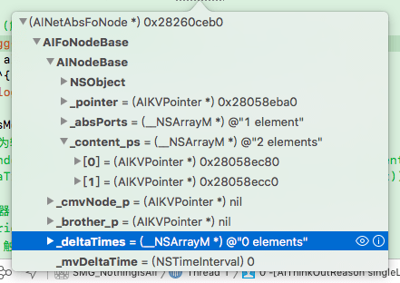
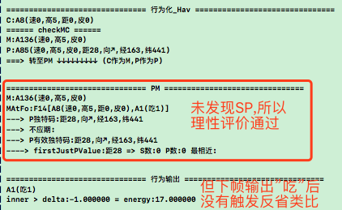
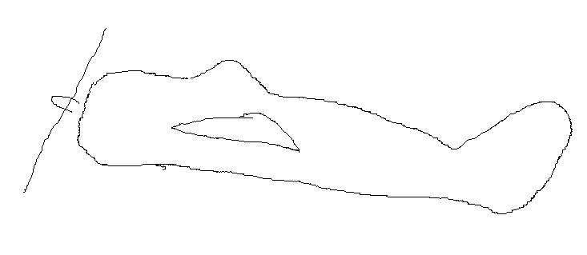

# v2.0版本四测

***

<!-- TOC -->

- [v2.0版本四测](#v20版本四测)
  - [n21p1 四测: 规划训练](#n21p1-四测-规划训练)
  - [n21p2 反省类比测试](#n21p2-反省类比测试)
  - [n21p3 特征模块迭代计划](#n21p3-特征模块迭代计划)

<!-- /TOC -->

***

### n21p1 四测: 规划训练
`CreateTime 2020.09.01`

| 21011 | 简化训练步骤 |
| --- | --- |
| 1 | `直投,右下飞,直投,边吃边飞至右上` |
| 2 | `重启,右投,飞至坚果,吃掉` |
| 3 | `重启,右投,马上饿` (小鸟自行飞到坚果并吃掉); |

| 21012 | 简化训练步骤-多向版 |
| --- | --- |
| 1 | `直投,右下飞,直投,边吃边飞至右上` |
| 2 | `重启,右投,飞至坚果,吃掉`,`右上投,飞至吃`,`左下投,飞至吃`... |
| 3 | `重启,右上投,马上饿` (小鸟自行飞到坚果并吃掉); |

<br><br><br>

## n21p2 反省类比测试
`CreateTime 2020.09.01`

| 21021 | BUG |
| --- | --- |
| 1 | ATHav时序的,deltaTimes和mvDeltaTime为0的BUG (参考21022); |
| 2 | 将训练第3步右投果识别为M有向果,所以MC时失败,因为C为无距无向果; |
| 3 | 第3步改成左投,成功识别为`无距无向果`,但马上饿找到-mv解决方案 (转21024); |

| 21022 | BUG1-deltaTime为0; |
| --- | --- |
| 示图 |  |

| 21023 | BUG2-MC中mIsC失败; |
| --- | --- |
| 示图 |  |
| 方案1 | **将M识别为无向果M[速0,高5,皮0],即可;** |
|  | 方案1解析: 参考20172-方案2 ↓↓↓↓↓; |
| 结果 | **将第3步改成左投,可成功识别为`无距无向果`;** |
| 方案2 | **MC中不判断mIsC,而是判断MC二者的absPorts前三条,有交集;** |
|  | 方案2解析: M和C未必是抽具象上下层关系,可能是同级关系,因为后面要执行PM,所以应该广入口,窄修正,所以选择方案2,实例如下: |
|  | 实例: 奶奶听到孙女给同学打电话,说想吃`治愈系水果`,所以拿一根香蕉给孙女; |
|  | 1. 孙女:"我不要吃香蕉"; |
|  | 2. 奶奶:"你不是要吃水果吗?" |
|  | 3. 孙女:"是治愈系水果,香蕉不是" |
|  | 4. 奶奶:"什么是`至于是水果`?" |
|  | 5. 孙女:"就是甜的" |
|  | 6. 奶奶:"把香蕉切开,拌了点白糖,然后递给孙女;" |
| 解析 | 1. 例中,`治愈系水果是C`,那根`实际的香蕉是P`,`香蕉是M`,`水果是S` |
|  | 2. 显然,MC非抽具象关系,但奶奶认为M和C都是S,所以就拿给孙女; |
|  | 3. 当孙女反馈后,奶奶又在PM中,对香蕉进行特征修正,加了白糖 ↓↓↓↓↓; |
| 实测 | **实测显示,MC是同级,但并不是有共同抽象,而是有共同具象;** |

| 21024 | BUG3-P+的解决方案为负价值; |
| --- | --- |
| 示图 |  |

| 21025 | 最后一帧isOut=true,导致反省类比未触发的BUG |
| --- | --- |
| 日志 |  |
| 说明 | 在21012训练后,第三步没飞过去,而是直接原地空吃; |
| 分析 | PM未发现SP,所以理性评价通过,未飞是正常的; |
| 问题 | 但下帧输出(即空吃)后,却没有触发反省类比; |
| 原因 | 经查,行为输出时isOut=true未触发ActYes,也没触发Finish; |
| 解决 | 使行为输出时,触发Finish,从而递归至base,即demand时可以触发ActYes; |

<br><br><br>

## n21p3 特征模块迭代计划
`CreateTime 2020.09.10`

　　在v3.0版本时，我们将支持多码特征，从而对特征的类比抽象有所支持，本节提前进行些记录，特征的类比，不仅包含特征间纵向类比，也包含稀疏码间的横向类比，从而形成更多样的特征。而感官算法上只需像以往所述，将稀疏码集输入即可。

　　前段时间有个新闻，是说把视觉接到听觉脑区，照样工作，但需要一定的时间来慢慢形成。

　　这里其实显示出皮层的可塑性，说明视觉算法输入时我们只提供稀疏码信息，然后通过组合方式得出模糊特征，再通过互相类比得到抽象特征。以此得到外形等特征信息（组分）。

　　这与当下的概念和时序模块非常类似。但目前代码上还是仅支持单码特征，在3.0版本时，面向现实世界的迭代中，再对特征模块进行多码支持与完善。所以本节暂止，v3.0时再续。

我语音中只是举例说明,比如说咱们两个有个算法,得出稀疏码仅为:"灰度值",

* 示例: 解释下图中我们如何认知飞机特征,以及识别飞机头;
  - 
  - 注: 本问题和图来自`@张仙_用友`提问;

```
* 假设:现感官视觉算法中:
  1. 灰度0-1表示白到黑;
  2. xy表示坐标;

* 第一次看到飞机得到最初的稀疏码可能为:
x0,y1,灰1
x2,y1,灰0
x1,y1,灰1
x2,y2,灰0
x2,y3,灰0
x1,y2,灰1
x2,y3,灰1
x2,y4,灰1
...

* 通过色值类比发现:
x0,y1,灰1
x1,y1,灰1
x1,y2,灰1
x2,y3,灰1
x2,y4,灰1

* 通过坐标类比发现 (外形):
灰1路径为: 原点-> 右1 -> 上1 -> 右上1.4 -> 上1

* 当第二次,再发现飞机时,可能有所变化,比如:
飞机2的灰1路径为: 原点-> 右1 -> 上1 -> 右上2 -> 上1

* 两个外形,再进行类比,发现,抽象飞机3的路径为:
原点-> 右1 -> 上1 -> 右上1.4/2 -> 上1

* 当描述飞机头时,发现,路径为:
原点-> 右1 -> 上1

* 注:
  1. 当然,你也可以在此基础上,支持RGB,支持模糊匹配,支持亮度,等;
  2. 就是这种,最最基础的视觉算法,通过类比后,发现各种各样多样的特征;
  3. 以上多个稀疏码组成一个字典,多个字典的数组,为一帧输入;
```

<br><br><br><br><br>
