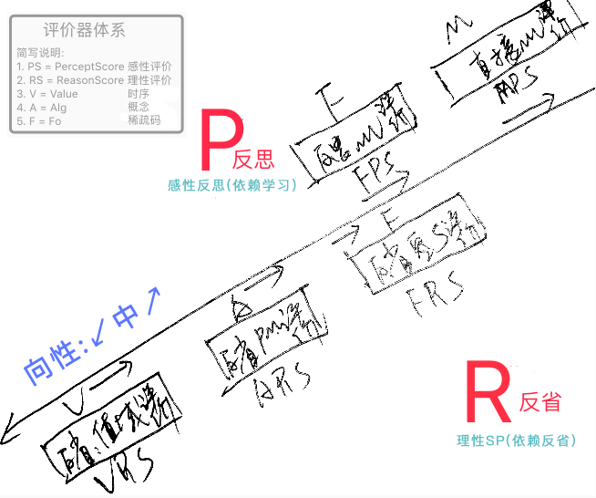
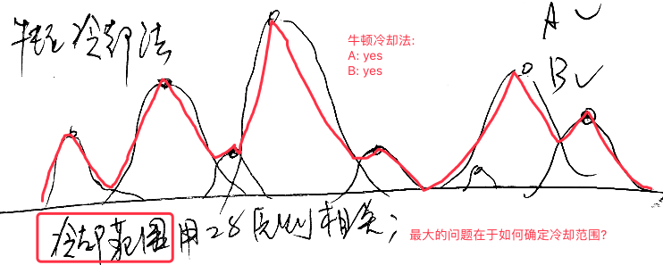
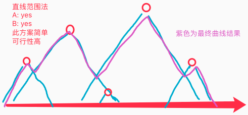
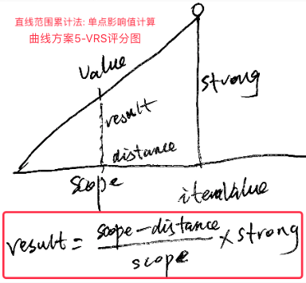
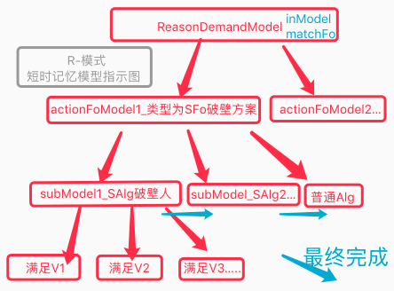
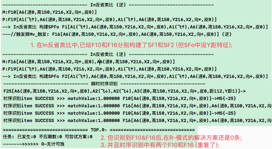

# v2.0版本六测 & 评价器 & R-模式迭代 & 防撞训练

> 注:
> 1. 六测在n21p20已经开始->本章继续;
> 2. V评价迭代在n21p21已经开始->本章继续;

***

<!-- TOC -->

- [v2.0版本六测 & 评价器 & R-模式迭代 & 防撞训练](#v20版本六测--评价器--r-模式迭代--防撞训练)
  - [n22p1 评价器整理](#n22p1-评价器整理)
  - [n22p2 值域求和2-VRS](#n22p2-值域求和2-vrs)
  - [n22p3 六测2-VRS测试](#n22p3-六测2-vrs测试)
  - [n22p4 防撞训练](#n22p4-防撞训练)
  - [n22p5 反向反馈类比迭代-In反省类比](#n22p5-反向反馈类比迭代-in反省类比)
  - [n22p6 应用In反省类比: R-模式迭代](#n22p6-应用in反省类比-r-模式迭代)
  - [n22p7 防撞训练2](#n22p7-防撞训练2)

<!-- /TOC -->

## n22p1 评价器整理
`CreateTime 2021.01.05`

在Note21中对`时序支持空S评价`和`稀疏码评价迭代支持值域求和`,所以现在整个评价器体系更加完善,本节对这些进行整理;

| 22011 | 评价器体系整理 |
| --- | --- |
| 评价器 |  |
| 说明 | 如图: 当前的评价体系较为完善,但代码比较混乱,不像类比器代码的那么条理; |
| 说明 | 感性评价以mv和fo为主,理性评价以alg和value为主; |
| 代码 | 考虑写个AIScore类,将所有评价器整理进来; |

| 22012 | 支持APS评价 |
| --- | --- |
| 说明 | 以前原本支持替换Alg并反思fo,后来弃用了?代码找不到; |

   

## n22p2 值域求和2-VRS
`CreateTime 2021.01.05`

本节针对训练中,偶发性S导致评价为否的问题,对值域求和进行迭代,支持更合理的VRS评价;

| 22021 | 偶发性S导致评价为否的问题2 |
| --- | --- |
| 示图 |  |
| 说明 | 转自2120A-方案4,本表重点依据SP抽象,进行值域求和评价迭代; |
| 分析 | 在`避免偶发性`问题的同时,面临`思维固化(偏见)`对理性评价的影响; |
| 方案1 | 根据抽象: 对SP外类比再抽象优先评价,其次具象评价; |
| 方案2 | 根据强度: 对SP的强度>30,优先评价,其次再对>10评价,再次>0; |
| 方案3 | 迁移为主,强化为辅,即: 方案1为主,方案2为辅,进行综合VRS评价; |
| 调试 | 经调试,反省外类比工作正常,可以构建SP节点的再抽象SP节点; |
| 分析 | 经分析因为V已经是最微观,不确定性只能通过值域来解决,所以联想方式不能通过像GLHN那样的getInnerAlg()方式完成,只能通过SP.absSP()来做了; |

| 22022 | 反省外类比迭代分析-SP抽象 |
| --- | --- |
| 偏见 | 1. `偏见/第一印象`,有责任的多担责,即抽象经验对于新输入的起到偏见作用; |
|  | 2. 或者通过积累,这种更加自由竞争的方式来实现 `转至22023-代码3`; |
| 原则 | SP的原则就是明确责任 (类比找不同) `T本就支持`; |
| 实践 | SP抽象在明确责任的实践方式上,就是类比差值,即:`找不同` `T本就支持`; |

| 22023 | 值域求和v2迭代计划 |
| --- | --- |
| 迭代 | S和P各自生成一条值域,在评价时,将二者求和,得出结果; |
| 代码 | 1. 需要对每个码单独成域 (现在值域求和本来就支持) `T`; |
| 代码 | 2. 需要兼容求差 (本来反省类比已支持) `T`; |
|  | 分析: 1,2本来就支持 |
| 代码 | 3. 对S和P:`先单独形成曲线,再求和`,而不是现做法:`先求和,再做曲线`; |
|  | 分析: 3是本次的重点改动,这么做可以有效防止偶发性S问题; |
| 代码 | 4. 对抽象做思考,即SP的absSP,看是否压根不需要absSP; |
|  | 分析: 4从稀疏码的多变性来看,似乎很难抽象absSP,但可以在此处形成曲线; |
| 综合 | 在4反省类比时生成曲线SumModels `转22024`; |
|  | 在3做VRS时再求和做评价; |

| 22024 | 值域求和v2曲线算法分析 |
| --- | --- |
| 说明 | 在反省类比时,针对每种码,形成各自的S或P曲线; |
| 分析 | 每个值对周边的影响范围大小不太好取定,比如距离50,影响旁边10范围还是2; |
| 方案1 | 所有稀疏码归一化,影响范围为0.05; |
|  | 分析: 可行性高且简单,但缺点是如智能体只关注区间,如0-0.2,支撑不友好; |
| 方案2 | 反省类比中,仅存所有稀疏码值values,到评价前一刻,再形成曲线; |
|  | 分析: 此方案看具体情况可行即做,但现在的核心问题是`影响范围问题`; |
| 方案3 | 根据经验,决定影响范围,粗略输入影响大范围,精细输入影响小范围; |
|  | 分析: 此方案可行,此处的`粗略/精细`由当前总视角决定,即场景下值域总范围; |
| 选择 | 选定方案3: 曲线生成`转至22025`,取值范围`转至22026`; |

| 22025 | 值域求和v2曲线算法分析A: 曲线生成方案 |
| --- | --- |
| 说明 | 本表主要根据`22024-方案3`,分析曲线生成方案; |
| 原则 | A. 使之能够顺利工作; |
|  | B. 避免偶发性 (不确定性),带来的问题; |
| 方案1 |  |
| 方案2 |  |
| 方案3 |  |
| 方案4 |  |
| 方案5 |  |
| 分析1 | 未累计方案,B全为no,因为当输入值全不同强度全是1,不求和就全靠命了; |
| 分析2 | 累计为防止偶发性带来了可能性,但不彻底,可以设定一个容错值,如<-2才评价为否; |
| 最终 | 累计的只有方案3和5,为了简单暂选方案5; |
| 评分图 |  |

| 22026 | 值域求和v2曲线算法分析B: 取值范围方案 |
| --- | --- |
| 说明 | 本表主要根据`22024-方案3`,分析取值范围问题; |
| 分析 | 22024-方案3,已暂定由`当前总视角`,即`当前场景值域总范围`来决定; |
| 方案 | 暂定以`值域总范围(max-min) * 33%`得出影响范围; |
| 重点 | 1. 不怕错误,只要错误在多经历两次能够立马意识到修正; |
|  | 2. 确立更具象的当前场景很重要,F14只是个大场景; |
| 原则 | 范围由场景决定,而场景由时序决定的,所以当前代码并无问题; |
| 解决 | 从当前fo中取S/P的值max-min范围,并以此为据,作为本表问题的解; |

| 22027 | 值域求和v2代码规划 | STATUS |
| --- | --- | --- |
| 1 | 曲线计算采用22025-方案5:`直线范围累计法`; | T |
| 2 | 评价<-2才评价为否; | T |
| 3 | 算出(max-min)*0.33为影响范围; | T |
| 4 | 使反向反馈类比也触发反省类比构建SP; | 本就支持 |

   

## n22p3 六测2-VRS测试
`CreateTime 2021.01.10`

| 22031 | VRS迭代测试 | STATUS |
| --- | --- | --- |
| 1 | 测试VRS评价是否正常工作; | T |
| 2 | 测试反向反馈类比能否正常工作构建SP节点; |  |

| 22032 | 评价时负2的容错区间不生效BUG `T` |
| --- | --- |
| 示图 |  |
| 分析 | 在构建SP时,difStrong=具象最大的强度,而不是1,导致此BUG |
| 最终 | 在relateGeneralAbs()中,将SP时difStrong设为1; |

| 22033 | 有效glFo被FRS评价为否的问题 `T未复现` |
| --- | --- |
| 示图 |  |
| 调试 | 调试:`A85(速高向→皮)`主导右飞经验,`A168(速高皮向←)`主导左向; |
| 分析 | `A85只在右飞时` 且 `A168也只在左飞时`联想到,所以不会被对方评价为否; |
| 结果 | 修复中被22034BUG打断,并先修复之,之后此BUG复现不了了,再发现再说; |

| 22034 | VRS对于稀有值无法评价的问题 `T` |
| --- | --- |
| 示图 |  |
| 问题 | 如图,v2版VRS很难评价此种情况: |
|  | 1. 不在min->max区间; |
|  | 2. 距9999几乎不可能突破-2容错区 (参考22027-todo2); |
| 解答 | 分析可得,主要线索在于9999!=0; |
|  | 所以,可以将默认评价为是,改为默认为否,除非证实9999例外; |
| 分析 | 1. 当value在alg无同区码时,则默认评价为true; |
|  | > 体现为: 在S取评为0分时 (比如经9999,从未经历过),则应给出S负分; |
|  | 2. 当value在alg有同区码时,则默认评价为false; |
|  | > 体现为: 在P取评为0分时 (比如不是距0,从未经历过),则应给出P负分; |
| 代码 | 1. 对当前码justValue与MC.CAlg进行同区判定; |
|  | 2. `有同区码`->`默认评价false`->`P-S>2则true`; |
|  | 3. `无同区码`->`默认评价true`->`S-P>2则false`; |
| 结果 | 按照代码规划修改后,经测BUG已修复; |

| 22035 | 六测训练最终步骤 |
| --- | --- |
| 说明 | 至此训练多向飞行结束,左和右飞可正常完成,且仅需如下步骤: |
| 1 | `直投,右下飞,直投`, `边直投边飞至右上`xn |
| 2 | `重启,右投,飞至坚果,马上饿`x3 `左投,飞至坚果,马上饿`x3 |
| 3 | `重启,右投,马上饿` (会原地空吃,发现不行再飞至坚果吃) `左投,马上饿`; |

| 22036 | 多向飞行训练20210124版 |
| --- | --- |
| 说明 | 在`多时序迭代`,`DisY真实距离`,`FRS空S评价`等改动后训练失败,查明改掉后,步骤如下: |
| 1 | `直投,右下飞,直投`, `边直投边飞至右上` |
| 2 | `重启,右投,飞至坚果,马上饿`x3 `左投,飞至坚果,马上饿`x3 |
| 3 | `重启,右投,马上饿` (原地空吃,发现不行才飞至坚果吃); |
|  | `左投,马上饿` (有可能还在右飞,并且Out反省未触发,所以一直右飞); |
| 4 | `重启,左投,马上饿`,`右投马上饿`; |

| TODO | STATUS |
| --- | --- |
| 1. 20210114早9点40分闪退一次,查原因为:`R-中获取经验为nil时未判空` | T |
| 2. 测试反向反馈类比构建SP的代码运行是否正常 `转至n22p4-防撞训练`; | T |

   

## n22p4 防撞训练
`CreateTime 2021.01.15`

在n22p3中,已训练多向(左右)飞行成功,本节针对更新的训练规划,并制定训练步骤;
1. 木棒形态:方形蓝色大小5;
2. n22p2-todo2暂不测试,本节扔木棒训练中,会更频繁的触发,再测之;

| 22041 | 新训练规划-防撞训练 |
| --- | --- |
| 计划1 | `有皮果不能吃`,`可搬运坚果`,`可被压破壳` |
| 计划2 | `撞了会疼`,`躲避被撞` |
| 最终 | 计划1需要车,而计划2是防止被撞的前提,所以我们先训练计划2; |

| 22042 | 防撞训练步骤 |
| --- | --- |
| 1 | 木棒准投乌鸦 `视觉看到石子,触发疼`; |
| 2 | 木棒偏投乌鸦 `视觉看到石子,预测疼,但未触发疼,所以触发反省类比`; |

| 22043 | 预测是否撞到无法区分问题 `T` |
| --- | --- |
| 示图 |  |
| 解释 | 如图: 无论是否能被撞到,获取到的视觉信息是一致的; |
| 方案1 | 将8向,改成无数向; |
|  | > 可从方向上发现垂直角度变大,则撞不到 `改动大,麻烦,会影响原有8向设计` |
| 方案2 | 看到自己的位置; |
|  | > 可从自己所在位置判断是否会撞到 `改动大,麻烦,需重做原训练确定无问题` |
| 方案3 | 对Y间距进行感知; |
|  | > 可根据Y间距,判断是否会被撞到 `改动小,简单,对原训练不会产生影响` |
| 分析 | 方案2彻底,棒道距离可通过类比自行得出; 方案3简单,可暂选训练; |
| 最终 | 暂选方案3; |

| TODO | STATUS |
| --- | --- |
| 1. 测试点_测试能否触发反向反馈类比构建SP `很少触发,转n22p5`; | T |
| 2. 测试点_测试在P-中,能否找到SP兄弟节点,并开始行为化; |  |

   

## n22p5 反向反馈类比迭代-In反省类比
`CreateTime 2021.01.17`

22042训练至第2步后,没有触发反向反馈类比,以发现没撞到的原因,经核查,反向反馈类比,仅在条件符合mv+和mv-时才执行,并且仅在FindMV时才触发,导致其运行的机率极低,无法起到原有的作用,本节针对此问题进行迭代;

在n20p18已经迭代反向反馈类比为Out反省类比,本节是再另外支持In反省类比;

| 22051 | 迭代分析 |
| --- | --- |
| 理性示例 | 当看到汽车越来越近,但下秒却没变近; |
| 感性示例 | 当看到木棒扔过来,但下秒却没有疼; |
| 运行条件 | 当期望与实际不符时,即运行,而非必须mv+和mv-; |
| 触发机制 | 当不符合预测时,即触发,而非仅FindMV时才触发; |

| 22052 | 代码规划 |
| --- | --- |
| 1 | 输入当前帧matchFo到末位的,改变状态为Wait,并增加生物钟触发器; T |
|  | a. 在TIR_FoFromShortMem中,对HNGL和Normal两种情况单独判断; T |
| 2 | OPushM时,对Wait中的进行匹配判断,并做状态改变为OutBack; T |
| 3 | 对生物钟触发器触发时,未OutBack的,进行反向反馈类比,构建SP; T |
| 改1 | TIR_Fo中,对于HNGL的返回,暂没什么用且性能差,可暂不支持,先关掉; |
| 注2 | 因为TIR_Fo把HNGL关掉了,所以In反省类比关于HNGL的触发与类比无效; |

   

## n22p6 应用In反省类比: R-模式迭代
`CreateTime 2021.01.21`

原有R-模式是建立在SP兄弟节点的基础上的,而兄弟节点已在n22p5中被废弃,所以R-模式应该随着In反省类比的迭代而变化;

本节将R-模式整合到原有AIAction和流程控制中;

| 22061 | R-迭代代码规划 |
| --- | --- |
| 1 | 决策前_评价foModel; |
|  | > 有空S指向,则失败 (尝试下一方案); |
| 2 | 决策时_评价foModel (S已错过,则失败); |
|  | > 评价否掉的,直接demand.failure()进行递归 (尝试下一方案); |
| 3 | 决策时_评价foModel (S未错过,则通过,并提交Action._Fo逐个满足S); |
|  | > 从cutIndex开始进行循环,判断是否被M.itemAlg抽象指向; |
| 4 | 被M抽象指向时,则对S加工,想办法满足demand.protoAlg变成S; |
|  | > 生成TOAlgModel,并交给PM进行满足修正; |
| 5 | 不被M抽象指向时,则到cHav看能否得到; |
|  | > 生成TOAlgModel,并交给Action._Hav进行满足; |
| 6 | 决策流程控制是否满足至末位?->否则failure失败; |
|  | > 失败时,则递归到demand.failure (尝试下一方案); |
| 7 | 决策流程控制是否满足至末位?->是则finish成功; |
|  | > 设为ActYes,以`当前index至mv时间之和`生物钟触发,等待OPushM; |
| 8 | 能不躲了mv-? 未避开,(OPushM有mv-),则status=OutBack; |
|  | > 不是ActYes,触发S反省标记S,且设为failure,递归任务 (尝试下一方案); |
| 9 | 能不躲了mv-? 避开,(OPushM无mv-),则最终demand成功,任务完成; |
|  | > 还是ActYes,触发P反省标记P,且设为finish,并移除任务; |
| 注1 | 第8步S的S改为,使此foModel强度减弱不易取用 (废弃,参考改4,5); |
| 注2 | 第9步S的P改为,使此foModel强度增强更易取用 (废弃,参考改4,5); |
| 注3 | 第1步改为取消空S评价,而是由注1注2自由强度竞争 (废弃,参考改4,5); |
| 改4 | 融合PM: SFo并非全需要满足,而是仅满足VRS评价需要的部分; |
| 改5 | Out反省: SFo也可以再Out反省时,再指向SP,使之决策越来越稳定准确; |

| 22062 | P-对比R- | P- | R- |
| --- | --- | --- | --- |
| 1 | 解决方案 | 正Fo | 负Fo |
| 2 | 解决方案源 | 正向类比(交集) | 反向类比(差集) |
| 3 | Finish条件 | 触发mv+ | 不完成Fo |
| 4 | Failure条件 | 不完成Fo | 触发mv- |
| 5 | PM | 修正S | 满足S |

| 22063 | R-模式短时记忆模型图 |
| --- | --- |
| 示图 |  |

   

## n22p7 防撞训练2
`CreateTime 2021.01.23`

| 22071 | 防撞训练步骤 |
| --- | --- |
| 1 | 木棒准投乌鸦 `视觉看到石子,触发疼`; |
| 2 | 木棒偏投乌鸦 `视觉看到石子,预测疼,但未触发疼,所以触发反省类比`; |

| 22072 | 时序总是识别到HNGL导致危险预测不灵敏 |
| --- | --- |
| 示图 |  |
| 分析 | 有时候也能识别到指向mv的matchFo,只是较少,大数还是识别到HNGLFo; |
| 方案 | 使TIR_Fo支持多识别,以使识别的结果更全面,不受这混乱率影响 `转22073`; |
| 方案 | TIR_Fo中的未指向mv的也会导致此BUG,所以将其过滤掉; |

| 22073 | 多时序识别迭代 |
| --- | --- |
| todo1 | 参考22072,本表进行多时序识别迭代支持 T; |
| todo2 | matchFos应用到: 反思结果的FPS评价,进行更多元评价 T; |
| todo3 | matchFos应用到: In反省类比触发器,以更全面的In反省 T; |
| todo4 | matchFos应用到: 外类比,以使之更全面的类比抽象 T; |
| todo5 | matchFos应用到: tip_OPushM,使之更全面改变status状态 T; |
| todo6 | matchFos应用到: tir_OPushM,使之更全面改变status状态 T; |
| todo7 | 在决策中,暂不应用多时序,但需将默认matchFo改为含mv且最迫切那条 T; |

| 22074 | 测得3BUG_SFo没有Y距_0条方案_时序识别重复 |
| --- | --- |
| 示图 |  |
| 分析 | BUG2,应该ReasonDemand还是原来的,未抵消更新为新的F10/F16; |

   

## TODOLIST

| TODO | STATUS |
| --- | --- |
| 1. 因为PM逻辑复杂,所以将其拆分并融入到流程控制中,代码:`废弃P独特码,直接_Hav循环每条V调用_GL,并进行稀疏码评价,不属于独特码的本来已实现,评价为true而已`; |  |
