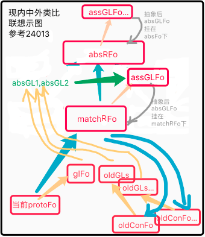
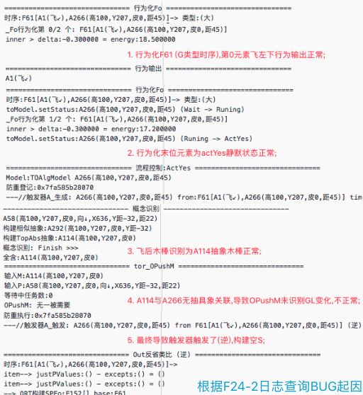
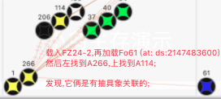
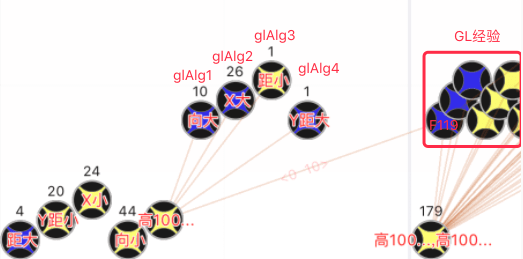

# 防撞训练

> 注:
> 1. 在n23中,已经由子任务测试到GL了,但GL还没完全跑顺当;

> 名词解析:
> 1. OVM : ToValueModel
> 2. 稳定性: 是指经验的效用,有效率;

***

<!-- TOC -->

- [防撞训练](#防撞训练)
  - [n24p01 GL行为化迭代](#n24p01-gl行为化迭代)
  - [n24p02 AIKVPointer集成type迭代](#n24p02-aikvpointer集成type迭代)
  - [n24p03 单元测试-自检告警机制](#n24p03-单元测试-自检告警机制)
  - [n24p04 子任务迭代](#n24p04-子任务迭代)
  - [n24p05 十二测:继续进行GL相关测试训练](#n24p05-十二测继续进行gl相关测试训练)

<!-- /TOC -->

## n24p01 GL行为化迭代
`CreateTime 2021.09.09`

本节针对GL行为化与PM中关于GL相关进行不应期迭代;

| 24011 | 迭代项 |
| --- | --- |
| 迭代1 | 对PM生成toValueModel做防重,以防止一模一样的OVM多次GL行为化; |
| 迭代2 | 对PM中找修正GL的目标:`glValue4M`,做不应期,比如G不行就L试下; |

| 24012 | GL体用协作问题 `参考:23229-方案3` |
| --- | --- |
| 问题 | 1. 表现为在FZ22重新训练中,很难抽象出[飞方向,木棒]的节点; |
|  | 2. 内类比生成了许多Y距GL经验,但在getGL中却取不到一条适合修正用的; |
| 分析 | 分析当前代码做法: |
| 1. 体 | 内中外类比现在的assFo是以取absRFos与其具象得出; |
|  | > 具象混乱(因为它可能与当前protoFo无关系) & 抽象失真(absRFo太抽象); |
|  | > 导致很难抽象出[飞方向,木棒],且识别时也没法识别到[飞方向,木棒]; |
|  | 原则: 认知期,抽象优先`absRFos`,照顾具象`matchRFos`; |
| 2. 用 | getGL现在的curMasks是仅取absRFos来得出; |
|  | > 问题: absRFos太抽象,而gl又少又抽象,稳定性极差; |
|  | > 考虑改为matchRFos与其抽象取GL经验 (从稳定找普适); |
|  | 原则: 决策期,具象优先`matchRFos`,延展抽象`matchRFos.absPorts`; |
|  | 延展: matchRFos有匹配度,如有问题可考虑加入cutIndex实现精准控制; |
| 实践 | 通过前面分析1,2中的原则,来制定代码迭代; |
| 1. 体 |  |
| 2. 用 |  |
| 结果 | 将`体`改为absRFos+matchRFos后,发现永远取不到assGLFo `转至24013` |

| 24013 | GL到absGL未冷启问题 `T` |
| --- | --- |
| 问题 | 见24012结果,gl一直停留在最具象,没有向抽象寸进,导致assGLFo总为0条; |
| 分析 | 1. 在构建absRFos时,没有做任何GL抽象操作; |
|  | 2. 在内中外类比v5中,absRFos和matchRFos也都是抽象的,全没GL嵌套; |
| 方案1 | 内中外类比中,应对首条seemFo(相似非全含fo)做支持,完成gl抽象起步; |
|  | 内中外类比中,应对首条seemFo进行外类比; |
| 方案2 | 或直接用matchRFos.conPorts作为seemFo `即回滚到原v4代码` |
|  | 此时seemFo外类比就不用了,因为matchRFos就是它们的外类比抽象结果; |
| 选定 | 因为方案2比方案1更适用于内中外类比的`起步`,且与原v4一致,故选用; |
| 示图 |  |
| 结果 | 如图,代码回滚到v4,且改为支持absRFos,后回测生成absGL正常了; |

| 24014 | 重训GL的体与用 | 步骤+结果 |
| --- | --- | --- |
| 1 | 重新进行`x向飞,直击`xN次; | 24015第1,2步,正常 |
| 2 | 看生成[x向,木棒]时序是否正常; | 24015第1,2步,正常 |
| 3 | 看[x向,木棒]下,能否正常构建嵌套gl; | FZ23-2日志,正常 |
| 4 | 看getInnerGL中,能否正常取到gl经验 | 非Y距取到了,Y距还没测 |

| 24015 | 训练步骤整理 | 训练目标 |
| --- | --- | --- |
| FZ23-1 | 边直击边飞至左下 | 被撞和不被撞经验,GL经验 |
| FZ23-2 | 边直击边飞至右上 | 被撞和不被撞经验,GL经验 |
| FZ23-3 | 在安全地带各处偏击10次 (危险地带下方) | 加训P经验 |
| FZ23-4 | 在危险地带各处直击10次 | 加训S经验 |

| 24016 | 抽象GL经验太少问题 `T` |
| --- | --- |
| 说明 | 在训练24015前两步时,发现抽象GL极少执行; |
| 方案 | 可尝试,将内中外类比的配置limit调高 (要广放少收); |
| 结果 | 把limit从3和2调整为5和5时,训练第2步抽象GL经验从1条变成6条,有效; |

| 24017 | 训练FZ23并测问题 |
| --- | --- |
| 复现 | 按24015训练得到FZ23,然后`FZ23,右下飞,直投`; |
| 问题1 | 全是`PM评价速0不通过,修正(速0->速233)`; |
|  | 分析: 其实速不重要,下帧会飞到哪才重要; |
|  | 方案1: 退方案,把速从视觉中去掉,速不重要,因为HE视觉本来就是离散的; |
|  | 方案2: 进方案,让HE认识到速不重要 `速并不需要修正,但每条P经验又都有` |
|  | > 所以每次P评价都有速,必须加工,但又其实没办法行为化解决它; |
|  | 结果: 先采用方案1,方案2提到的问题以后还会遇到,到时再说; |
| 问题2 | 性能问题,发现FZ23在训练中太卡了,内类比慢; |
|  | 分析: 内中外类比里的limit5,5,20三个参数再调下试试; |
|  | 重训1: 调整内中外类比Limit为:6,2,10,重训为FZ24 `略好些` `最终选定`; |
|  | 重训2: 调整内中外类比Limit为:2,2,10,重训为FZ25 `又好些`; |
|  | 结果: 调整值不能根本解决问题,卡是从GL学全开始的,即决策系统在卡; |
|  | 跟进: 分析决策系统卡的问题 (后再测,先改24018问题); |

| 24018 | 训练FZ24,FZ25并测问题 |
| --- | --- |
| 训练 | 按24017问题2重训`1,2`,得到`FZ24,FZ25` |
| 问题 | FZ24-2和FZ25-4,发现取GL时,绝大多数经验已被评过否; |
| 线索1 | 查最初空S构建日志`FZ24-2`,得出OPushM中mIsC可能失败,如下图: |
|  |  |
|  | 如图,A114与A266判定mIsC失败,导致OPushM失败,进一步NV查它俩关系; |
|  | 调试:  |
|  | 说明: 示图有关联,打日志时没关联,可能是日志后很久又联上的; |
|  | 分析1: A114是刚构建TopAbs出来的,所以与旧有A266还没关联也正常; |
|  | 分析2: 示图说明后来也关联上了,当时还没学确切有此问题正常; |
|  | 分析3: 只是可惜这条GL经验被空S干掉了,比较冤枉; |
|  | 影响面: 此问题仅出现在未学习确切情况下,影响面不大; |
|  | 结果: 当时无关联正常,GL被冤枉干掉,不过影响面不大,以后再改吧; |
|  | TODO: 看来单条空S评否不合理,后改进之; |
| 线索2 | 查`FZ24-4`,得出GL可能取混乱,如下图: |
|  |  |
|  | 如图,可视化GL中的maskFo,看是否会混,为何会混; |
|  | 调试: `FZ24,右下,直击,右上,直击`,能取到F179,且X与Y距时,共同的F132; |
|  |  |
|  | 如图,F179有许多GL经验,任一条,就测得其glConAlg竟同时是4个glAlg的具象; |
|  | 问题: 这样的话F119就可以用于解决`向大,X大,距小,Y距大`,互相空S掉; |
|  | 方案: 将atType集成到AIKVPointer中,并作用于alg防重,可以避免它混乱; |

| 24019 | glFo&glAlg防重不全面,导致空S混乱问题代码实践 |
| --- | --- |
| 说明 | 防重不全面,是因为未全面根据type和distanceY `转至n24p02`; |

   

## n24p02 AIKVPointer集成type迭代
`CreateTime 2021.09.19`

| 24021 | glFo&glAlg防重不全面,导致空S混乱问题代码实践 |
| --- | --- |
| 各类示图 |  |
| 示图改1 | `GL下探在V,需要at&ds&type判别`,`而HNSPD仅在AF,type即可判别`; |
| 实践简介 | 需要将视觉属性名如`distanceY`和type如`G`集成到glConAlg中; |
| 套用实例 | 1. 将glConAlg赋值pointer.type & 并将distanceY赋值到ds; |
|  | 2. 将glFo赋值pointer.type & 并将distanceY赋值到ds; |
|  | 3. 仅GL时,需将`distanceY`赋值传递到A和F的ds下 (参考:示图改1); |
|  | 结果: 这样话,F179就会有四个不同的F119,分别各自被空S,避免彼此误伤; |
| 概念部分 | 1. 将所有的createAbsAlg_NoRepeat()新增type节点; `T` |
|  | 2. 将Same类型全改成ATDefault类型; `T` |
|  | 3. 构建glAlg时,将`distanceY`这些传递赋值到ds `T`; |
|  | 4. 构建glAlg时,将`FLY_RDS`这些传递赋值到at (因为有时没ds) `T`; |
| 时序部分 | 1. 将所有的createAbsFo_NoRepeat()新增type节点 `T`; |
|  | 2. 构建glFo时,将`distanceY`这些传递赋值到ds `T`; |
|  | 3. 构建glFo时,将`FLY_RDS`这些传递赋值到at (因为有时没ds) `T`; |
| 使用部分 | 1. 废弃dataSource和type互转,及所有调用代码 `T`; |
|  | 2. 废弃getHNGLConAlg_ps(),以及glConAlgs的包含判断代码; `T`; |
|  | > 联想GL经验路径早改为场景联想,现又改了vDS==fo.ds匹配判断; |
|  | 3. 在AINetUtils中取ports的众多方法中,用ds筛选改成用type筛选 `T`; |
|  | 4. 把所有生成AIKVPointer的方法,加上type参数 `T`; |

| 24022 | 迭代完回归测试 |
| --- | --- |
| BUG1 | glFo内中外类比,非末位alg类比构建absAlg时,使用Type=GL的问题 `T`; |
| BUG2 | 构建SFo时,at&ds竟有值,经查是从conNodes中取的,改为仅GL时才取 `T`; |
| BUG3 | 有时外类比构建absAlg时,两个conAlg不是同一类型,触发自检6 `T`; |
|  | > 原因1是构建SPFo时,收集的shortAlg为Default类型,而非SP类型导致; |
|  | > 原因2是alg构建器中,从conAlgs中防重没判断at&sp&type导致错乱; |
| BUG4 | FZ26-1训练中,发现H类型Fo中有S类型的Alg,触发自检6 `T`; |
|  | > 原因是在TIR_Alg识别中,取refPorts时没有筛选normal类型; |
| BUG5 | 因为ATSame和ATDiff导致TIR_Fo识别到Fos结果很少 `T`; |
|  | > 在TIR_Fo中,仅取normal结果,所以没包含ATSame和ATDiff; |
|  | > 将这俩type外类比时改为Default,因为这俩只是描述mv实虚并非fo类型; |
| BUG6 | 有时R取到dsFo解决方案,却又指向实mv `T`; |
|  | > 查应该是BUG5不区分Diff和Same,导致原本虚Fo防重无效,重赋值成实fo; |
|  | > 方案: 将BUG5改成不区分ATSame,但区分ATDiff; |

| 24023 | 训练步骤整理 | 训练目标 |
| --- | --- | --- |
| FZ26-1 | 边直击边飞至左下 | 被撞和不被撞经验,GL经验 |
| FZ26-2 | 边直击边飞至右上 | 被撞和不被撞经验,GL经验 |
| FZ26-3 | 在安全地带各处偏击10次 (危险地带下方) | 加训P经验 |
| FZ26-4 | 在危险地带各处直击10次 | 加训S经验 |
| 结果 | 训练得到FZ26 |  |

   

## n24p03 单元测试-自检告警机制
`CreateTime 2021.09.24`

在HE的测试中,经常因为改了一小点代码,导致其影响的部分,只有后天训练时,才可能看到bug,编译期和执行前期都不会有任何问题,所以有必要在其可能影响到的代码处,或者系统运行的关键且可能出错处,做一些自检告警机制,使我们可以在出问题的时候,更及时快速的定位问题;

| 24031 | AIKVPointer集成type迭代后->告警目录 |
| --- | --- |
| 自检1 | 测下getHN经验时vDS匹配判断代码是否多余,多余告警; |
| 自检2 | 测生成GL的AIKVPointer时的ds是否正常赋值,因为它影响node防重; |
| 自检3 | 测生成非GL的AIKVPointer时的ds是否为" ",因为它影响node防重; |
| 自检4 | 行为飞稀疏码的isOut为false的问题; |
| 自检5 | 测生成GL的AIKVPointer时的at是否正常赋值,因为它影响node防重; |
| 自检6 | 测从conNodes取at&ds&type应唯一,否则查为何不同的node会类比抽象; |
| 自检7 | 测构建SPFo时,元素有两种类型的原因(参考24022BUG3) |
| 自检8 | 测构建Fo时,有不匹配type的元素原因(参考24022BUG4) |

   

## n24p04 子任务迭代
`CreateTime 2021.09.28`

本节针对两个问题展开:
1. 主任务怕疼,子任务又预测到疼,父子同质 (父子同质问题,参考24041);
2. 即使喝自来水不是很干净,为了解渴我也喝了 (pk池迭代,参考24042);

| 24041 | 子任务与父任务同质mv问题 |
| --- | --- |
| 示图 |  |
| 说明 | 如图,主任务和子任务都是疼任务,而这样的繁琐嵌套许多许多次发生; |
| 复现 | `FZ26,右上飞,直击` |
| 举例 | 累了`{累-9}`想喝水,买水跑路也很累`{累-5}`; |
| 方案1 | status新增pk`竞争状态`,反思流程`转至24042`; |
|  | 分析: 示图套入24042流程,F493子任务仍会形成并行为化,并不解决此问题; |
| 方案2 | 跑路累就考虑是否可解决,比如让外面朋友帮忙稍回来一瓶; |
|  | 分析: 此条本来就是现在的做法,无需要代码改动; |
| 结果 | 方案1无效,方案2认为当前本来就没问题,采纳方案2,不用改; |

**24042-子任务决策流程: pk池迭代计划**
1. 反思评分>=0时,直接继续行为化 (即以往的反思通过);
2. 反思评分<0时,形成子任务 (即以往子任务);
   - 当limit条全<0时,形成子任务,并尝试`规划决策`;
     - 第1条为去买水累`{-5}`;
       - 能不能避免跑路买水?答案不能,还是-5,加入pk池;
     - 第2条为喝自来水`{-10}`;
       - 能不能自来水变干净,答案能,烧开即可好许多,变成-1,加入pk池;
     - 第3条为喝过期水`{-20}`;
       - 能不能过期水加工?答案不能,还是-20;
     - 第4条为喝冰箱可乐会肚子痛`{-25}`;
       - 能不能加热,答案能,烧开即可,变成0,直接执行;
   - 对子任务`规划决策`后,有如下几种可能:
     - `评分 < 0 && 评分 > 主任务-9`,则加入pk池 (如第1,2条);
     - `评分 < 0 && 评分 <= 主任务-9`,则直接失败 (如第3条);
     - `评分 >= 0`,则直接执行 (如第4条);
   - 当没有`第4条`时,则对第1,2条进行pk排序,排序后,第2条为-1,优先执行;
3. 结果: 对于目前的乌鸦训练来说,pk池需求并不迫切;
   - 因为目前R任务的ds解决方案只有mv0,不可能变成-1这种值,所以此迭代`暂停`;

   

## n24p05 十二测:继续进行GL相关测试训练
`CreateTime 2021.09.29`

在十一测中,最后在getGL经验上有了互相空S掉的混乱BUG,在n24p02中进行了节点类型大排查后,重新训练了FZ26,现在回归测试,进行十二测;

| 24051 | FZ26回测-危险地带Y距在PM中评价通过的问题 |
| --- | --- |
| 复现 | `FZ26,直击` |
| 说明 | 发现日志中,Y距的S要么是0条,要么即使不是0条也没有P评分大,导致通过; |
| 分析 | 从FZ26-4日志可见,在危险地带有多次被乌鸦躲开没撞到,导致S经验不足; |
| 方案 | 尝试对FZ26-4进行加训,危险地带多撞几次,习得更多S经验; |
| 结果 | 危险地带多撞失败,它每次都躲飞到下方安全地带,改为重训FZ27,转24052; |

| 24052 | 训练步骤整理 | 训练目标 |
| --- | --- | --- |
| FZ26-1 | 边直击边飞至左下 | 被撞和不被撞经验,GL经验 |
| FZ26-2 | 边直击边飞至右上 | 被撞和不被撞经验,GL经验 |
| FZ27-3 | 在危险地带各处直击10次 | 加训S经验 |
| FZ27-4 | 在安全地带各处偏击10次 (危险地带下方) | 加训P经验 |
| 结果 | 训练得到FZ27 |  |

| 24053 | FZ27回测-危险地带Y距在PM中评价通过的问题2 |
| --- | --- |
| 简写 | `1.rMatchFo=R任务预测源`,`2.前期=指IRT时期`,`3.后期=指ORT时期`; |
| 复现 | `FZ27,直击` |
| 回测 | 问题依旧,S经验不足,但可以顺利加训S了,但加训后,S依然不足; |
| 分析 | 怀疑dsFo进入PM时,毕竟dsFo本就是解决方案,自然P(顺)多S(逆)少; |
| 分析 | 尝试将rMatchFo.SP加入PM分析中,因为它预测生成任务,自然S多P少; |
| 调试 | 1.代码: 从生成SP代码处,分析SP的baseFo来源; |
|  | > IRT从matchPFos预测而来,即从指向了mv的Normal节点; |
|  | > ORT从actYes反省而来,即hngl和dsFo和p+模式的Fo三种都有可能触发; |
|  | 结果1: dsFo的SP依赖后期,因为ORT的第2种是它,而IRT没它; |
|  | 结果2: rMatchFo的SP依赖前期,因为IRT有它,而ORT中没它(因它指向-mv); |
| 调试 | 2.数据: 调试rMatchFo的SP数,看是否与预期相符,前期有较多SP; |
|  | 结果1: 发现rMatchFo的SP虽然不少,但没一条是与当前评价稀疏码同区的; |
|  | 继续查: IRT的SP由protoFo-matchFo得来,应该有同区码才对; |
| 白话 | dsFo.SP表示: 当前解决,方案内,怎样较好; |
|  | 例如: 这个变向,需要更快速度,使变向动作`本身得到更好效果`; |
|  | rMatchFo.SP表示: 当前场景,方案外,怎样较好; |
|  | 例如: 这个变向,需要更大幅度,使变身动作`能够闪开面前大壮`; |
| 原因 | 现R任务对dsFo进行PM时,它是后期SP,所以很难取到足够的SP供评价; |
| 求解 | 所以在PM中,仅靠dsFo.SP是不够的,想办法将IRT也加入进来很重要; |
| 方案 | 发R模式将dsFo传入PM时,补充将rMatchFo.SP也作用于评价; |
| 实践 | 1. pm_GetValidSPAlg_ps()取rMatchFo的SP(直接absPorts取即可) T |
|  | 2. AIScore.VRS()中,支持demand传入,并对rMatchFo进行评分; T |
|  | 3. AIScore.score4Value()中,兼容支持rMatchFo时的评分; T |
|  | 4. 在AIScore.VRS()中,支持将rMatchFo的评分作用于评价; |
|  | 5. 在PM()中,支持从rMatchFo.SP取最近的p做修正目标; |
| TODO | 1. 对P模式的matchFo的SP也要作用于评价 `随后重回觅食训练时,再支持`; |
|  | > 因为P模式也有导致任务的matchFo,只是它现在没保留到pDemand中; |
|  | 2. 考虑将PM中P最近的mostSimilarAlg废弃掉,而转为采用强度最强的; |
|  | > 因为直接取mostSimilar与自由竞争相违背,不改先,后有时间再改; |
|  | 3. 为避免VRS束波求和SP数多者占优,考虑将平均作用力也作用其中; |
|  | > tips:加入平均作用力是否有新的不公呢? `考虑明白后再实践` |

| 24054 | 24053改动回测 |
| --- | --- |
| BUG1 | distanceY(顺) 新增:1x12=12.00 累计:12 依据:F278[A277(Y距35)] |
| 复现 | FZ27,直击 |
| 导致 | 它会导致Y距35被VRS误评价为通过; |
| 说明 | Y距35在危险地带,却P强度12(经历多),说明每一次躲开都计入为P了; |
| 分析 | 既然躲开了,那么Y距35其实已经失效了,理应废弃这条反思,以最新Y距为准; |

     
