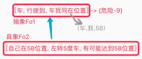
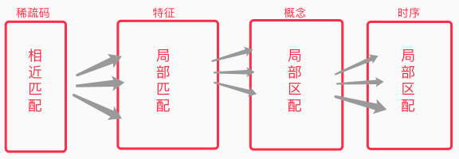
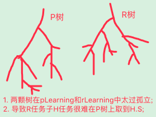

# 废弃HN & 分裂:理性反省和感性反省 & 相近匹配 & 想像力

> 注:
> 1. 在n24中，测了GL部分并发现它脱离场景的问题，从而对整个螺旋架构做了迭代，将过去两年的细节完善全部整合进螺旋架构。但最终的hSolution处，怕HN会再犯GL脱离场景的问题，本节直接废弃HN，并重新设计hSolution方法，然后回归测试训练。

***

<!-- TOC -->

- [废弃HN & 分裂:理性反省和感性反省 & 相近匹配 & 想像力](#废弃hn--分裂理性反省和感性反省--相近匹配--想像力)
  - [n25p01 螺旋架构-hSolution](#n25p01-螺旋架构-hsolution)
  - [n25p02 分裂理性反省和感性反省](#n25p02-分裂理性反省和感性反省)
  - [n25p03 反省分裂迭代-forecastIRT](#n25p03-反省分裂迭代-forecastirt)
  - [n25p04 回归测试-十三测试-HRP下首条S问题](#n25p04-回归测试-十三测试-hrp下首条s问题)
  - [n25p05 十三测训练2](#n25p05-十三测训练2)
  - [n25p06 deltaTime改成from-to表征](#n25p06-deltatime改成from-to表征)
  - [n25p07 十三测训练3-训练认识到危险地带](#n25p07-十三测训练3-训练认识到危险地带)
  - [n25p08 相近匹配](#n25p08-相近匹配)
  - [n25p09 想像力](#n25p09-想像力)
  - [n25p10 十四测-pFos&rFos双树融合](#n25p10-十四测-pfosrfos双树融合)
  - [n25p11 十五测](#n25p11-十五测)

<!-- /TOC -->

## n25p01 螺旋架构-hSolution
`CreateTime 2021.12.22`

H以往是用maskAlg联想的(参考n23p03),但它脱离场景,本文对hSolution进行迭代,使之能够取到更加契合当前场景的H解决方案;

| 25011 | hSolution迭代: `顺序原则`分析 |
| --- | --- |
| 简介 | 本表通过分析H联想的顺序,得出`顺序`线索; |
| 原则1 | ---->**本体在前,具象在后;** |
| 示例 | 找武器时没武器,先想到刀再想到厨房有刀,而无法直接武器想到厨房; |
| 反例 | 想吃香蕉时,去冰箱找食物,所以也有可能抽象在后,此顺序不明确; |
| 原则2 | ---->**当前场景在前,抽象场景在后,具象场景再后;** |
| 示例 | 在家时先想到厨房,但H失败后才会想到点外卖,在北京则先想到外卖; |
| 结果 | **综上,原则1不明确,原则2明确,对方案分析有重要意义;** |

| 25012 | hSolution迭代方案 |
| --- | --- |
| 方案1 | **--->补充mask,将当前场景所有已发生部分参与H联想;** |
| 途径1 | 将当前短时记忆树里任何cutIndex已发生的部分,做为mask用于H联想; |
| 途径2 | 将当前瞬时记忆序列,做为mask用于H联想; |
|  | 顺着抽到具象的优先级,逐个联想H解决方案 |
| 缺点1 | 毕竟脱离了场景 (因为这条联想路径,必然是先找到hAlg,再取hFo的); |
| 缺点2 | 因为脱离场景,导致取到大量不可行的H方案,浪费思维效率(尽想没用的); |
| 否掉 | 所以无法照顾到`原则2`,所以此方案pass `5%`; |
| 方案2 | **--->类似rSolution方式,写hSolution进行H联想;** |
| 分析 | 直接在场景内,找到mIsC的alg (分析模型图,评估可行性); |
| 优点 | 此方案不脱离场景,且支持`原则2-场景排序`,可以选用 `95%`; |
| 结果 | 选定方案2,实践参考25015; |

| 25013 | 是否废弃H节点 |
| --- | --- |
| 1不废弃 | HN内类比先不废弃,先这么写,等后面再考虑废弃之 (参考24171-3); |
|  | 虽然已经选择了方案2,但如果方案2实测不顺,可能还会用到HN,所以HN先留着; |
| 2废弃 | 选择了方案2,所以H节点可考虑废弃,`从普通时序中找元素,替代H`; |
|  | a. rSolution是阻止(N),而hSolution是推进(H); |
|  | b. 此处hSolution可参考rSolution的方式 (参考25012-方案2); |
| 3废弃 | 选择了方案2,所以H节点可考虑废弃,`从SP时序中找元素,替代H`; |

| 25014 | rSolution和hSolution对比 |
| --- | --- |
| R描述 | rSolution是从短时记忆树的RS取conPorts解决方案并做稳定性PK得出; |
| R特性 | rSolution偏感性`稳定性=SP的率`; |
| H描述 | hSolution是从当前场景下,取`自身+向抽象+向具象`,并分别在其SP中找H |
| H特性 | hSolution偏理性`经验性=SP的内容`; |

| 25015 | 代码规划 |
| --- | --- |
| 1 | 将HFo的末位,传到regroup(),进行识别反思 `暂不支持,随后需要再说`; |
|  | a. 目前已经支持在feedback反馈后,传到regroup `feedbackRegroup`; |
|  | b. 而取到hSolution后,行为化和反馈前,是否进行regroup反思 (需分析); |
| 2 | 尝试迭代rSolution (与N契合模型分析) `T`; |
|  | 分析: SP替代了N的作用,所以不必迭代之 `T`; |
| 3 | feedbackTIR和TOR两个理性反馈,构建的SP中找H经验 `T`; |
|  | 分析: 只有SP是在当前场景下的反馈 |
| 4 | 弃用H类型节点 (因为脱离场景,用SP替代) `参考25013-1,转至25025-3 T`; |
| 5 | hSolution的maskFos要收集:`自身+向抽象+向具象` `T`; |
| 6 | 在maskFos中根据SP评分竞争,找出最好的H解决方案 `T`; |
| 7 | TOOut.out()中isHNGL_toModel判断要改掉,因为H类型已弃用 `T`; |
| 8 | 核实原有SP对新hSolution的支持 `T` |

   

## n25p02 分裂理性反省和感性反省
`CreateTime 2021.12.24`

在上节中,rSolution和hSolution各需要感性和理性的SP经验`参考25014`,所以本节对反省算法做理性和感性分裂,使之能够分别支持二者;

| 25021 | 理性反省的路径 |
| --- | --- |
| I构建 | ①TCForecast预测输入时序，②feedbackTIR反馈，③IRT反省构建SP |
| O增强 | ④HDemand使用SP，⑤feedbackTOR反馈，⑥ORT反省增强SP |

| 25022 | 感性反省的路径 |
| --- | --- |
| I构建 | ①TCForecast预测输入P时序，②feedbackTIP反馈，③IRT反省构建SP |
| O增强 | ④P/RDemand使用SP，⑤feedbackTOP反馈，⑥ORT反省增强SP |
| 注③ | 现在此处是`正反向反馈外类比,并且是废弃状态`; |

| 25023 | 进一步分析: 可行性分析 & 问题分析 |
| --- | --- |
| 新使用 | hSolution如何用SP做评价竞争,如何执行; |
|  | 可以参考rSolution,场景相关fos以SP做稳定性评价,然后执行fo; |
| 新优点 | 感理性的分裂,有助于智能更理性 `参考25024-实例1`; |
|  | 解析: 理性和感性分别对应不同类型的反省和SP,使系统更精准智能; |
| 原问题 | 原HN有抽象,但没有稳定性(因为HN未开放反省),抽象的未必是稳定的; |
|  | 导致HN有可能遇到明明很指导,但就是不行的问题,此次废弃HN正好解决; |

| 25024 | 进一步分析: 实例分析 |
| --- | --- |
| 说明 | 为明确本节改动可行,本表找一些实例套入实例分析; |
| 实例1 | 理性不稳感性稳例: 过林未必遇虎,但遇虎时就必定危险`参考25023-优点` |

| 25025 | 代码规划 |
| --- | --- |
| 1 | TCForecast预测输入时序,在理性反省路径要处理PFos也要处理RFos `T`; |
| 2 | 正反向反馈外类比,改成感性IRT反省,构建感性SP `T`; |
| 3 | 废弃HN构建 (可先关掉,但不删代码,等hSolution跑定再删) `T`; |
| 4 | 感性和理性SP的表征,可以给SP节点增加spIndex来表示 `T`; |
| 5 | 写理性IRT算法 `T`; |
| 6 | 写感性IRT算法 `T`; |
| 7 | 写理性ORT算法 `T`; |
| 8 | 写感性ORT算法 `T`; |
| 9 | rSolution()算法迭代_针对SP反省分裂迭代的兼容 `T`; |

   

## n25p03 反省分裂迭代-forecastIRT
`CreateTime 2021.12.25`

反省分裂迭代,首先要对forecastIRT进行迭代(参考25025-1&2),本节对这部分深入分析与实践;

| 25031 | forecastIRT迭代分析 |
| --- | --- |
| 1 | pFos+rFos都参与反省 `T`; |
| 2 | 仅反省一步:非末位理性反省cutIndex后一帧,末位且有mv时则感性反省 `T` |
| 3 | 表征1: fo节点新增spDic<spIndex,spStrong> (末位key=fo长度) `T`; |
| 4 | 表征2: 将SP节点拆分成内容和强度值:内容保留于时序中,强度在spDic `T` |
| 5 | 表征3: spStrong表征S和P强度值 (这样SP节点也可废弃了) `T`; |
| 6 | 反省1: 这样也无需对SP再外类比了 (SP内容留在时序中,没的类比了) `T`; |
| 7 | 强度: SP增强单纯为线性,不存在再外类比的爆发式增涨 (更稳定,好事) `T`; |
| 8 | 反省2: IRT反省可直接重写,改动太大 `T`; |
| 9 | 决策: h解决方案在action()达到目标帧targetSPIndex时,调用hActYes`T` |
| 10 | 决策: 下标不急(弄巧成拙)评价,兼容支持输出类型(不能主动放出狮子) `T`; |
| 11 | 反馈: 整个rActYes针对rSolutionFo进行反省,而不是demand.fo `T`; |
| 12 | 模型: 4个feedback反省分别对应4个rethink反省 `T`; |

| 25032 | 反省分裂迭代-在系统内整体运行流程 |
| --- | --- |
| 说明 | 本表步骤为现有步骤的基础上整理,有一部分要调整,大部分无需调整; |
| 1 | 在TCForecast中构建IRT触发器 `T`; |
| 2 | 在TIR和TIP两个feedback中反馈 `T`; |
| 3 | 触发IRT反省算法 `构建` (独立写TCRethink) `T`; |
| 4 | hSolution和rSolution使用SP (SP稳定性竞争) `T`; |
| 5 | actYes输出后,构建ORT反省触发器 `T`; |
| 6 | 在feedbackTOP和TOR中反馈 `T`; |
| 7 | 触发ORT反省算法 `增强` `T`; |

   

## n25p04 回归测试-十三测试-HRP下首条S问题
`CreateTime 2021.12.27`

PRH三个任务在生成后,都直接转向了TCScore,而此时PRH下没有一条S,要从TCPlan下选出最优S,则肯定选不到,导致为空,本节解决这一部分;

| 25041 | 工作记忆树任务下_首条S的支持-问题分析 |
| --- | --- |
| 问题 | HRP三种Demand在任务生成后,都直接调用了TCScore,此时它们S为空; |
| 分析 | 此时执行score和plan,取最优路径末枝S(因为为空); |
| 说明 | 本表重要解决这一问题的继续决策问题; |
| 方案1 | 在scoreDic中把SRH都收集下,solution()只直接执行行为化; |
| 方案2 | 在scoreDic还是仅收集S,然后在solution()判断subDemands; |
| 方案3 | 在scoreDic还是仅收集S,后在plan中判断subDemand,solution只执行; |
| 分析1 | RH之间不存在评分竞争关系,所以不合适放到scoreDic和plan.best竞争; |
|  | 所以选择方案2,在solution中写死规则来实现即可 `废弃`; |
| 分析2 | Score评分,Plan路径,Solution解决,路径未必是竞争,RH优先级也是; |
|  | 所以选择方案3,plan对S取最优,同时对末尾RH做优先级规则 `转25041`; |

| 25042 | 工作记忆树任务下_首条S的支持-代码实践 |
| --- | --- |
| 1 | 在Plan竞争方法中对子subDemands判断和优先级来实现 `T`; |
| 2 | 其中subDemand: finish和without的不做处理 `T` |
| 3 | 其中subDemand: actYes状态则中止决策,继续等待; |
| 4 | 其它状态的,就以先R后H的优先级处理 (磨刀不误砍柴) `原本如此 T`; |
| 5 | 其它状态的,如是为空S,直接返回subDemand为末枝 (root也照样) `T`; |
| 6 | 每一级,都取最优S继续深入 `T`; |
| 7 | 每一级,只要感性淘汰,则不继续深入 `T`; |
| 8 | bestFo下所有subDemands都已完成或失败时,继续bestFo `T`; |

   

## n25p05 十三测训练2
`CreateTime 2021.12.28`

| 25051 | BUG1_rSolution()下取rs的问题 |
| --- | --- |
| 说明 | 原本rs是从loopCache任务池取同抽具象路径上的R任务组; |
| 问题 | 但事实上现在loopCache只存root,rs方法算过期无用方法; |
| 结果 | 改为在rSolution中取:R任务生成时的pFos下同mv标识的替代RS `T`; |

| 25052 | 训练步骤规划 | 训练目标 |
| --- | --- | --- |
| 1 | 各危险地带,直击 x N | 被撞经验,危险地带概念 |
| 2 | 各安全地带,偏击 x N | 不被撞经验,安全地带概念 |
| 3 | 各危险地带飞(上/下)到安全地带 x N | 飞行经验,安全地带P经验 |
| 4 | 在危险地带直击 | 预测危险,并R任务决策飞躲 |

| 25053 | 时间紧急评否后的死循环问题 |
| --- | --- |
| 说明 | 时间紧急已评否,但还在不断对其进行决策,再评否,再决策,死循环; |
| 结果 | 在score_Single()中,对时间紧急评否的,评为理性淘汰 `T`; |

| 25054 | HDemand在feedbackTOR时未必是ActYes状态的问题 |
| --- | --- |
| 问题 | jump转HDemand后,即使不是actYes状态也应处理反馈; |
| 举例 | 比如我去工具房拿锤子,还没走到工具房,在窗台上就看到锤子了; |
| 分析 | 动中动是actYes状态,但动中静不是,但也应处理反馈输入; |
|  | 即: `动中静`转`静中静`,并非actYes状态,也应处理被动反馈; |
| 代码 | 在feedbackTOR中,对HDemand时的处理,非actYes状态的也处理 `T`; |

| 25055 | scoreDic常把已淘汰取成0分 |
| --- | --- |
| 问题 | 错取成0分,导致ActNo淘汰的S还继续进行solution,死循环; |
| 分析 | scoreDic的key直接用kvPointer导致常取不到value,导致默认值0; |
| 结果 | 将key由kvPointer改成Pit2FStr(kvPointer) `T`; |

| 25056 | scoreDic还是偶然把已淘汰取成0分 |
| --- | --- |
| 示图 |  |
| 分析 | 工作记忆树的枝点未防重处理,所以评分会有重复key,覆写导致错取成0分; |
| 方案1 | 分析对工作记忆树枝点防重; |
| 方案2 | 将scoreDic的key改成solutionFo的%p内存指针地址; |
| 示例 | 比如砸钉子，只需要一个锤子，却需要分别砸两次。 |
| 分析 | 锤子可以复用,但砸钉子任务必须是两个,所以不做防重处理,选择方案2; |
| 结果 | 将scoreDic的key改成:sFo内存指针地址+Pit2FStr(sFo) `T`; |

| 25057 | hSolution死循环问题 |
| --- | --- |
| 示图 |  |
| 分析 | F118中首条元素就是A1:不能做为H解决方案 `因为首条没因,不能凭空出现` |
| 结果 | 把h解决方案取spIndex改成从0开始判断,并必须>0才有效 `T`; |

   

## n25p06 deltaTime改成from-to表征
`CreateTime 2022.01.10`

反省迭代后,对deltaTime的判断越来越多,而紧急评价为否也越来越多;可以发现像触发器一般取deltaTime的max值,而紧急评价时又可以取它的min值,因为抓抓紧可能0.3s内也可以做完一个篮球动作,而慢一点这个动作可以延长到1s以上;本文将针对此需求把deltaTime表征成from-to方式,以使两种用法都支持;

   

## n25p07 十三测训练3-训练认识到危险地带
`CreateTime 2022.01.10`

GL废弃后，必须明确的对撞不到或者安全地带有明确独立的概念，本文对此分析。

| 25071 | 危险地带的理性认识 |
| --- | --- |
| 方案1 | 视觉看到公路,从而明确危险地带的概念; |
|  | 说明: 概念有明确的特征值,判别它属于危险还是安全; |
| 方案2 | 视觉看不到公路,根据特征相似的概念来预测更像安全或危险; |
|  | 说明: 概念无明确的特征值,特征相似的概念,其实就是TIR_Alg中的Seem; |
| 分析 | 方案1虽然简单,但方案2是在废弃GL后迟早要面对的 `转25072`; |

| 25072 | 特征值不明确时: 相近匹配概念的预测流程 |
| --- | --- |
| 实例1 | 直行车辆的驶来主观角度,预测它是否会撞到; |
|  |  |
|  | 解决方案: 根据SP稳定性分析,偏角越大到安全值,越安全; |
| 实例2 | 转变中车辆,转弯的幅度,预测它是否会撞到; |
|  |  |
|  | 解决方案: 根据SP稳定性分析,站到车左侧安全区域,则安全; |
| 分析 | 两个例子,其实都是综合了seemFos的预测,`车可能到的地方`即危险地带; |
|  | 1. `车可能到的地方`只是危险地带,但并不危险; |
|  |  |
|  | 2. `车`开到`自己`的位置时,指向危险mv; |
|  |  |
| 结果 | 本表只是大致思路,本次主要迭代概念识别算法,支持相近度,`转25074`; |

| 25073 | F1`[A1我在5B,A2车开到5B]`如何识别为F2`[我,A3车开过来]`? |
| --- | --- |
| 分析 | 抽象`[车我无位置]->{危险-9}`,具象指向[车我位置5B],[车我位置3B]等 |
|  | 所以,`车开过来`其实是预测了`车和我同在的概念`; |
| 关键 | 重点是:已有的A1能否与预测中的A2融合成A3; |
|  | 即: 视觉标识下,我和车都有同值5B,所以依据此来融合成A3? |
| 结果 | 此问题涉及想像力(即时序中的概念重组) `转n25p09`; |

| 25074 | 方案2-复查当前代码现状 & 规划改进 |
| --- | --- |
| 现状1 | 视觉感官算法现在是每个HEView独立输入视觉算法的; |
|  | 改成: 不再区分view,而是整屏所有的dic整合到一起输入 `先不改,需要再改`; |
| 现状2 | 现在alg识别根据matchCount,支持全含和局部匹配两种结果; |
|  | 现状例子: 看某物飞行像蚊子,会联想到蚊子飞行路径,但此时并没看到蚊子 |
|  | 扩展支持: 本次主要改进`全含匹配`,使索引支持`相近V: 稀疏码相近度`; |
|  | 相近度公式: `near = 1 - delta / (max - min)`; |
| 结果 | 本表只是大致代码规划-需深入分析下`相近稀疏码的难点,转n25p08`; |

本节共有两个难点,其中相近匹配转n25p08,想像力转n25p09;

   

## n25p08 相近匹配
`CreateTime 2022.01.12`

在25074中,涉及到十三轮测试中最大的一个问题,即相近匹配,本节围绕解决这一问题展开;

| 25081 | 概念识别算法相近匹配迭代分析 |
| --- | --- |
| 问题 | 现在的TIR_Alg算法,仅有matchCount匹配度,没有matchValue相近度; |
| 分析 | 需要分析下,根据稀疏码相近值,来做相近稀疏码匹配,再做局部概念匹配; |
| 原则 | 局部匹配和相似匹配是两回事,局部是指匹配数小于全含,相似是V值相近; |
| 方案1 | 从索引序列中取相近的value,根据refPorts取到别的具象局部匹配概念; |
|  | 说明: 微向宏,其实后面的操作还是全含匹配,只是有一个值不一样; |
|  | 缺点: 但有可能相近的多个相邻码,refPorts的概念与当前概念毫无关系; |
|  | 分析: refPorts本来无关的就多,只是在识别中判断了全含; |
|  | 性能: protoA全是多变码时,每个都需十数条相近码.refPorts; |
| 方案2 | 从partAlgs中,找出同区不同码的,根据值排序,取出最相近的; |
|  | 缺点: 这可能出现较多低质量的结果,这些结果可能都不是相近的; |
|  | 缺点: protoA全是多变码时,根本取不到partAlgs,何谈从中取相似匹配; |
|  | 结果: 从局部匹配里找相近匹配,乱中找乱 `不采纳`; |
| 方案3 | 从抽象向具象找`含同区不同值`的具象概念,并值排序; |
|  | 缺点: protoA全是多变码时,不存在任何抽具象Alg结果,何谈从中取什么; |
| 分析 | 从顺应情况来看,最洽当的应该是方案1微向宏; |
| 分析 | 从缺点来看,方案2和3完全不可行,只有1至少可行; |
| 结果 | 参考`n21p3`,以及现在的概念识别算法里取refPorts方式,`转25082` |

| 25082 | 相近匹配模型示图分析 |
| --- | --- |
| 前言 | 无非是取交集,与现有做法大体不变,但需要针对性细化下不致有性能问题; |
| 难点 | 相近匹配的难点之一,就是涉及数量很多的相近索引都要取refPorts; |
|  | 解答:索引难免被大量使用,有内存缓存与复用,索引本就擅长这个; |
| 细模型 |  |
| 公式1 | 稀疏码相近度公式: `nearV = 1 - delta / span`; |
|  | 其中: `span=max-min`,`span=0时nearV=1`,`span的范围为0-1`; |
| 整模型 |  |
| 公式2 | 概念相近度公式: `nearA = sum(nearV) / matchCount`; |
| 说明 | 如图,从微到宏全是一对多复用,而除了V能值运算,别的全是指针; |
|  | 所以,稀疏码采用相近匹配,特征概念时序全采用局部匹配; |
| 结果 | 局部匹配早已有代码支持,本次迭代主要面向相近匹配 `转25083-实践` |

| 25083 | 相近匹配代码实践 |
| --- | --- |
| 问题 | 参考方案1-识别是从微向宏,V可控,宏观不可控,但有3个控制手段; |
| 1 | 广入: 所有的稀疏码索引序列的refPorts全取出做交集; |
| 2 | 有序: 全含的按`nearA`排序,局部的按`nearA * matchValue`排序; |
|  | 其中: `matchValue = matchCount / algContentCount`; |
| 3 | 窄出: 可以限定概念结果数量 (取nearA有序序列的前limit条); |

| 25084 | 相近匹配代码实践2 |
| --- | --- |
| 问题 | 25083-2中matchValue需要取出每个alg选手来取count,有性能问题; |
| 1 | 而支持相近匹配后,其实每个都是全含,所以可以先试下只按nearA排序; |

| 25085 | 回归测试 |
| --- | --- |
| 日志 |  |
| 通过 | 经测: `确实只有全含了` & `相近度排序正常`; |

   

## n25p09 想像力
`CreateTime 2022.01.13`

在25073中,涉及到一个非常关键的问题,即`我的时序`和`车的时序`两个预测,共同重组后,靠想像力预测到了危险`[车撞到我]->{危险-9}`;

| 25091 | 想像力-初步分析 |
| --- | --- |
| 实例 | 一: 输入A1(B5位置的我),预测到`F1[A1,A1,A1]`自己位置不变; |
|  | 二: 输入A2(车右转5度),预测到`F2[A2,A3(B5位置的车)]`; |
|  | 三: 对F1和F2进行时序重组,触发想像力; |
| 注1 | `想像力`与`旧有反思`同原理,复用现有regroup和recognition代码; |
| 注2 | 与反思不同的是,此处时序的重组时,概念也要重组; |
| 注3 | 反思是应对输出期OR反馈概念的,而想像力是应对输入期IR预测时序的; |

| 25092 | 想像力-问题分析 |
| --- | --- |
| 问题1 | 对pFos和rFos尝试重组,两两重组性能不行,分析下怎么弄; |
|  | 解答: 最新一帧分别与旧帧的`预测时序未发生部分`进行重组; |

| 25093 | 套入`乌鸦演示`分析当前此需求的必要性 |
| --- | --- |
| 说明 | 未深入分析,但从表面思考,应该目前是不需要写想像力功能的; |
| 结果 | 等后面十四测训练中,有了迫切需求,再来继续这里 `暂停`; |

   

## n25p10 十四测-pFos&rFos双树融合
`CreateTime 2022.01.15`

n25p08的相近匹配已写完并初步测试ok，n25p09的想像力需求还不迫切暂停了。所以本文先进行十四测，回归测试训练。

| 25101 | 训练步骤规划 `参考25052` | 训练目标 |
| --- | --- | --- |
| 1 | 各危险地带,直击 x N | 被撞经验,危险地带概念 |
| 2 | 各安全地带,偏击 x N | 不被撞经验,安全地带概念 |
| 3 | 木棒中停,↑飞至安全地带 x 5 | 飞行经验,安全地带P经验 |
| 4 | 木棒中停,↓飞至安全地带 x 5 | 飞行经验,安全地带P经验 |
| 5 | 木棒中停,↗飞至安全地带 x 5 | 飞行经验,安全地带P经验 |
| 6 | 木棒中停,↘飞至安全地带 x 5 | 飞行经验,安全地带P经验 |
| 7 | 在危险地带直击 | 预测危险,并R任务决策飞躲 |

| 25102 | 测试关键节点规划 |
| --- | --- |
| 1 | 依25101步骤训练，测试能否预测到“危险地带”生成R任务。`T` |
| 2 | 测试能否根据R任务，S解决方案向安全地带加工。 |

| 25103 | BUG_无法习得`↑至安全地带`的H解决经验1 `T` |
| --- | --- |
| 说明 | 在25101训练第3步后,R无法获得躲开解决方案,可是明明已经飞上躲过; |
| 调试 | 第3步,全构建的`[木,↑,木,↑]`这样的时序,参考FZ33-3,如下: |
|  | 时序识别rFo:`F255[A1(木棒),A92(飞↑),A242(木棒),A92(飞↑)]` |
|  | 再抽象absRFo:`F274[A251(木棒),A92(飞↑),A273(木棒),A92(飞↑)]` |
| 分析 | `木棒中停`后先看到木棒,后面每一次↑,都跟着一次视觉: |
|  | 导致无法形成: `[↑,木]`经验,都是以木开头,且一木一↑交替的经验; |
| 方案 | 多飞几下,把飞3次调整成飞5次,旧的瞬时都被踢成新的就ok了; |
| 重训 | 成功有了protoFo:F292[飞↑,木,飞↑,木] `参考25105图` |
| 结果 | 虽然已解决本表问题,但本BUG还有别的问题,转25104 `T`; |

| 25104 | BUG_无法习得`↑至安全地带`的H解决经验2 `T` |
| --- | --- |
| 问题 | 在25103修复并重新训练第3步后,仍R无法获得躲开解决方案; |
| 调试 |  |
| 分析 | 经分析F4和抽象的全是pFo,没有rFo,而H经验应该多在rFo中; |
|  | 设：A=`无mv指向的Fo`、B=`有mv指向的Fo`、C=`单纯的mv`; |
|  | R任务是B,R任务的S也是B,推进R.S行为化时,生成的H任务也是源于R.S; |
| 线索 | hSolution现在也是从`R.S取抽具象(全是B)`来获取,但H.S多在A; |
| 验证 | 经查`时序识别`后,rFos和pFos之间没有构建抽具象; |
| 本质 | 本质上是`P和R衔接不足`的问题,可增强其衔接,即两颗独立树合为一树; |
| 两树 |  |
| 方案 | 可将R.S的抽具象加入A,即时序识别后pFos也加入rLearning()中; |
| 实践 | 已将两树衔接融合,根据25101前3步训练FZ35; |
| 结果 | `FZ35,直击,重启上飞直击`,可从hSolution得到上飞并成功躲开,如下图; |
| 回测 |  |

| 25105 | 时序识别中明明不相符却全含匹配的问题 `T` |
| --- | --- |
| 示图 |  |
| 分析 | 应该是相近匹配导致的,飞上和飞左向相近匹配了,导致了二者抽具象关联; |
| 结果 | 把`概念识别`后的抽象改为外类比后,重新根据25101训练FZ34,ok `T`; |

| 25106 | rSolution经常是时间紧急状态,有时还无计可施 `T` |
| --- | --- |
| 分析 | 当前时间不急评价在action中,紧急时设为ActNo,导致3条全紧急就完了; |
| 结果 | 将`时间不急评价`封装成FRS_Time,并前移到rSolution调用 `T`; |

| 25107 | 训练步骤规划 `参考25101` | 训练目标 |
| --- | --- | --- |
| 1 | 木棒中停,边飞边直击至右上角 | 安全危险地带,飞行经验,SP经验 |
| 2 | 在危险地带直击 | 预测危险,并R任务决策飞躲 |

| 25108 | 下标不急评价未生效BUG |
| --- | --- |
| 说明 | 训练25101前3步后,仅上飞预测R任务,Solution首帧上飞,就输出上飞了 |
| 问题 | 但此时还没看到木棒,没必要马上就飞离; |
| 结果 | 不知是不是春节前修复25106时顺便给解决了 `未复现,参考25111`; |

   

## n25p11 十五测
`CreateTime 2022.02.17`

此次春节在家呆了26天，春节回京后，此处接续上继续测试训练。

| 25111 | 训练FZ36 |
| --- | --- |
| 说明 | 按照25101全6步训练得到FZ36; |
| BUG1 | `载入FZ36-6,执行第7步直击`,发现R任务的两个解决方案全在危险地带? |
|  | `F186[A1(高100,Y207,X2,距121,Y距35,向←,皮0)]-> FRS_PK评分:0` |
|  | `F4[A1(高100,Y207,X2,距121,Y距35,向←,皮0)]->M1{↑疼-9} FRS_PK评分:0` |
| 怀疑1 | 经查,在FZ36-5左右时,发现即使安全地带偏击,也会反省S,而不是P; |
| 怀疑2 | 训练3-6步中停,导致危险地带却不被撞,从而危险地带许多P; |
|  | 验证: 可对危险地带取rSolution时打出SP日志验证猜想; |
|  | 解决: 可调整训练步骤,不中停 `转25112`; |

| 25112 | 训练步骤规划 `参考25101` | 训练目标 |
| --- | --- | --- |
| 1 | 各危险地带,直击 x N | 被撞经验,危险地带概念 |
| 2 | 各安全地带,偏击 x N | 不被撞经验,安全地带概念 |
| 3 | 边↑飞,边直击至安全地带 x 5 | 飞行经验,安全地带P经验 |
| 4 | 边↓飞,边直击至安全地带 x 5 | 飞行经验,安全地带P经验 |
| 5 | 边↗飞,边直击至安全地带 x 5 | 飞行经验,安全地带P经验 |
| 6 | 边↘飞,边直击至安全地带 x 5 | 飞行经验,安全地带P经验 |
| 7 | 在危险地带直击 | 预测危险,并R任务决策飞躲 |

     
