等价# 废弃HN & 分裂:理性反省和感性反省 & 相近匹配 & 想像力

> 注:
> 1. 在n24中，测了GL部分并发现它脱离场景的问题，从而对整个螺旋架构做了迭代，将过去两年的细节完善全部整合进螺旋架构。但最终的hSolution处，怕HN会再犯GL脱离场景的问题，本节直接废弃HN，并重新设计hSolution方法，然后回归测试训练。

***

<!-- TOC -->

- [废弃HN & 分裂:理性反省和感性反省 & 相近匹配 & 想像力](#废弃hn--分裂理性反省和感性反省--相近匹配--想像力)
  - [n25p01 螺旋架构-hSolution](#n25p01-螺旋架构-hsolution)
  - [n25p02 分裂理性反省和感性反省](#n25p02-分裂理性反省和感性反省)
  - [n25p03 反省分裂迭代-forecastIRT](#n25p03-反省分裂迭代-forecastirt)
  - [n25p04 回归测试-十三测试-HRP下首条S问题](#n25p04-回归测试-十三测试-hrp下首条s问题)
  - [n25p05 十三测训练2](#n25p05-十三测训练2)
  - [n25p06 deltaTime改成from-to表征](#n25p06-deltatime改成from-to表征)
  - [n25p07 十三测训练3-训练认识到危险地带](#n25p07-十三测训练3-训练认识到危险地带)
  - [n25p08 相近匹配](#n25p08-相近匹配)
  - [n25p09 想像力](#n25p09-想像力)
  - [n25p10 十四测-pFos&rFos双树融合](#n25p10-十四测-pfosrfos双树融合)
  - [n25p11 十五测](#n25p11-十五测)
  - [n25p12 十五测2](#n25p12-十五测2)
  - [n25p13 十五测3](#n25p13-十五测3)
  - [n25p14 十五测4](#n25p14-十五测4)
  - [n25p15 支持强化学习训练](#n25p15-支持强化学习训练)
  - [n25p16 定帧被动感官](#n25p16-定帧被动感官)
  - [n25p17 单帧输入单模型](#n25p17-单帧输入单模型)
  - [n25p18 TOMVision工作记忆可视化迭代V2](#n25p18-tomvision工作记忆可视化迭代v2)
  - [n25p19 强化学习训练-代码实现](#n25p19-强化学习训练-代码实现)
  - [n25p20 废弃fo的mv指向 & 废弃P任务](#n25p20-废弃fo的mv指向--废弃p任务)
  - [n25p21 强化学习训练-控制台](#n25p21-强化学习训练-控制台)
  - [n25p22 十六测-强化学习训练](#n25p22-十六测-强化学习训练)
  - [n25p23 决策流程中的信息边界修整](#n25p23-决策流程中的信息边界修整)

<!-- /TOC -->

## n25p01 螺旋架构-hSolution
`CreateTime 2021.12.22`

H以往是用maskAlg联想的(参考n23p03),但它脱离场景,本文对hSolution进行迭代,使之能够取到更加契合当前场景的H解决方案;

| 25011 | hSolution迭代: `顺序原则`分析 |
| --- | --- |
| 简介 | 本表通过分析H联想的顺序,得出`顺序`线索; |
| 原则1 | ---->**本体在前,具象在后;** |
| 示例 | 找武器时没武器,先想到刀再想到厨房有刀,而无法直接武器想到厨房; |
| 反例 | 想吃香蕉时,去冰箱找食物,所以也有可能抽象在后,此顺序不明确; |
| 原则2 | ---->**当前场景在前,抽象场景在后,具象场景再后;** |
| 示例 | 在家时先想到厨房,但H失败后才会想到点外卖,在北京则先想到外卖; |
| 结果 | **综上,原则1不明确,原则2明确,对方案分析有重要意义;** |

| 25012 | hSolution迭代方案 |
| --- | --- |
| 方案1 | **--->补充mask,将当前场景所有已发生部分参与H联想;** |
| 途径1 | 将当前短时记忆树里任何cutIndex已发生的部分,做为mask用于H联想; |
| 途径2 | 将当前瞬时记忆序列,做为mask用于H联想; |
|  | 顺着抽到具象的优先级,逐个联想H解决方案 |
| 缺点1 | 毕竟脱离了场景 (因为这条联想路径,必然是先找到hAlg,再取hFo的); |
| 缺点2 | 因为脱离场景,导致取到大量不可行的H方案,浪费思维效率(尽想没用的); |
| 否掉 | 所以无法照顾到`原则2`,所以此方案pass `5%`; |
| 方案2 | **--->类似rSolution方式,写hSolution进行H联想;** |
| 分析 | 直接在场景内,找到mIsC的alg (分析模型图,评估可行性); |
| 优点 | 此方案不脱离场景,且支持`原则2-场景排序`,可以选用 `95%`; |
| 结果 | 选定方案2,实践参考25015; |

| 25013 | 是否废弃H节点 |
| --- | --- |
| 1不废弃 | HN内类比先不废弃,先这么写,等后面再考虑废弃之 (参考24171-3); |
|  | 虽然已经选择了方案2,但如果方案2实测不顺,可能还会用到HN,所以HN先留着; |
| 2废弃 | 选择了方案2,所以H节点可考虑废弃,`从普通时序中找元素,替代H`; |
|  | a. rSolution是阻止(N),而hSolution是推进(H); |
|  | b. 此处hSolution可参考rSolution的方式 (参考25012-方案2); |
| 3废弃 | 选择了方案2,所以H节点可考虑废弃,`从SP时序中找元素,替代H`; |

| 25014 | rSolution和hSolution对比 |
| --- | --- |
| R描述 | rSolution是从短时记忆树的RS取conPorts解决方案并做稳定性PK得出; |
| R特性 | rSolution偏感性`稳定性=SP的率`; |
| H描述 | hSolution是从当前场景下,取`自身+向抽象+向具象`,并分别在其SP中找H |
| H特性 | hSolution偏理性`经验性=SP的内容`; |

| 25015 | 代码规划 |
| --- | --- |
| 1 | 将HFo的末位,传到regroup(),进行识别反思 `暂不支持,随后需要再说`; |
|  | a. 目前已经支持在feedback反馈后,传到regroup `feedbackRegroup`; |
|  | b. 而取到hSolution后,行为化和反馈前,是否进行regroup反思 (需分析); |
| 2 | 尝试迭代rSolution (与N契合模型分析) `T`; |
|  | 分析: SP替代了N的作用,所以不必迭代之 `T`; |
| 3 | feedbackTIR和TOR两个理性反馈,构建的SP中找H经验 `T`; |
|  | 分析: 只有SP是在当前场景下的反馈 |
| 4 | 弃用H类型节点 (因为脱离场景,用SP替代) `参考25013-1,转至25025-3 T`; |
| 5 | hSolution的maskFos要收集:`自身+向抽象+向具象` `T`; |
| 6 | 在maskFos中根据SP评分竞争,找出最好的H解决方案 `T`; |
| 7 | TOOut.out()中isHNGL_toModel判断要改掉,因为H类型已弃用 `T`; |
| 8 | 核实原有SP对新hSolution的支持 `T` |

   

## n25p02 分裂理性反省和感性反省
`CreateTime 2021.12.24`

在上节中,rSolution和hSolution各需要感性和理性的SP经验`参考25014`,所以本节对反省算法做理性和感性分裂,使之能够分别支持二者;

| 25021 | 理性反省的路径 |
| --- | --- |
| I构建 | ①TCForecast预测输入时序，②feedbackTIR反馈，③IRT反省构建SP |
| O增强 | ④HDemand使用SP，⑤feedbackTOR反馈，⑥ORT反省增强SP |

| 25022 | 感性反省的路径 |
| --- | --- |
| I构建 | ①TCForecast预测输入P时序，②feedbackTIP反馈，③IRT反省构建SP |
| O增强 | ④P/RDemand使用SP，⑤feedbackTOP反馈，⑥ORT反省增强SP |
| 注③ | 现在此处是`正反向反馈外类比,并且是废弃状态`; |

| 25023 | 进一步分析: 可行性分析 & 问题分析 |
| --- | --- |
| 新使用 | hSolution如何用SP做评价竞争,如何执行; |
|  | 可以参考rSolution,场景相关fos以SP做稳定性评价,然后执行fo; |
| 新优点 | 感理性的分裂,有助于智能更理性 `参考25024-实例1`; |
|  | 解析: 理性和感性分别对应不同类型的反省和SP,使系统更精准智能; |
| 原问题 | 原HN有抽象,但没有稳定性(因为HN未开放反省),抽象的未必是稳定的; |
|  | 导致HN有可能遇到明明很指导,但就是不行的问题,此次废弃HN正好解决; |

| 25024 | 进一步分析: 实例分析 |
| --- | --- |
| 说明 | 为明确本节改动可行,本表找一些实例套入实例分析; |
| 实例1 | 理性不稳感性稳例: 过林未必遇虎,但遇虎时就必定危险`参考25023-优点` |

| 25025 | 代码规划 |
| --- | --- |
| 1 | TCForecast预测输入时序,在理性反省路径要处理PFos也要处理RFos `T`; |
| 2 | 正反向反馈外类比,改成感性IRT反省,构建感性SP `T`; |
| 3 | 废弃HN构建 (可先关掉,但不删代码,等hSolution跑定再删) `T`; |
| 4 | 感性和理性SP的表征,可以给SP节点增加spIndex来表示 `T`; |
| 5 | 写理性IRT算法 `T`; |
| 6 | 写感性IRT算法 `T`; |
| 7 | 写理性ORT算法 `T`; |
| 8 | 写感性ORT算法 `T`; |
| 9 | rSolution()算法迭代_针对SP反省分裂迭代的兼容 `T`; |

   

## n25p03 反省分裂迭代-forecastIRT
`CreateTime 2021.12.25`

反省分裂迭代,首先要对forecastIRT进行迭代(参考25025-1&2),本节对这部分深入分析与实践;

| 25031 | forecastIRT迭代分析 |
| --- | --- |
| 1 | pFos+rFos都参与反省 `T`; |
| 2 | 仅反省一步:非末位理性反省cutIndex后一帧,末位且有mv时则感性反省 `T` |
| 3 | 表征1: fo节点新增spDic<spIndex,spStrong> (末位key=fo长度) `T`; |
| 4 | 表征2: 将SP节点拆分成内容和强度值:内容保留于时序中,强度在spDic `T` |
| 5 | 表征3: spStrong表征S和P强度值 (这样SP节点也可废弃了) `T`; |
| 6 | 反省1: 这样也无需对SP再外类比了 (SP内容留在时序中,没的类比了) `T`; |
| 7 | 强度: SP增强单纯为线性,不存在再外类比的爆发式增涨 (更稳定,好事) `T`; |
| 8 | 反省2: IRT反省可直接重写,改动太大 `T`; |
| 9 | 决策: h解决方案在action()达到目标帧targetSPIndex时,调用hActYes`T` |
| 10 | 决策: 下标不急(弄巧成拙)评价,兼容支持输出类型(不能主动放出狮子) `T`; |
| 11 | 反馈: 整个rActYes针对rSolutionFo进行反省,而不是demand.fo `T`; |
| 12 | 模型: 4个feedback反省分别对应4个rethink反省 `T`; |

| 25032 | 反省分裂迭代-在系统内整体运行流程 |
| --- | --- |
| 说明 | 本表步骤为现有步骤的基础上整理,有一部分要调整,大部分无需调整; |
| 1 | 在TCForecast中构建IRT触发器 `T`; |
| 2 | 在TIR和TIP两个feedback中反馈 `T`; |
| 3 | 触发IRT反省算法 `构建` (独立写TCRethink) `T`; |
| 4 | hSolution和rSolution使用SP (SP稳定性竞争) `T`; |
| 5 | actYes输出后,构建ORT反省触发器 `T`; |
| 6 | 在feedbackTOP和TOR中反馈 `T`; |
| 7 | 触发ORT反省算法 `增强` `T`; |

   

## n25p04 回归测试-十三测试-HRP下首条S问题
`CreateTime 2021.12.27`

PRH三个任务在生成后,都直接转向了TCScore,而此时PRH下没有一条S,要从TCPlan下选出最优S,则肯定选不到,导致为空,本节解决这一部分;

| 25041 | 工作记忆树任务下_首条S的支持-问题分析 |
| --- | --- |
| 问题 | HRP三种Demand在任务生成后,都直接调用了TCScore,此时它们S为空; |
| 分析 | 此时执行score和plan,取最优路径末枝S(因为为空); |
| 说明 | 本表重要解决这一问题的继续决策问题; |
| 方案1 | 在scoreDic中把SRH都收集下,solution()只直接执行行为化; |
| 方案2 | 在scoreDic还是仅收集S,然后在solution()判断subDemands; |
| 方案3 | 在scoreDic还是仅收集S,后在plan中判断subDemand,solution只执行; |
| 分析1 | RH之间不存在评分竞争关系,所以不合适放到scoreDic和plan.best竞争; |
|  | 所以选择方案2,在solution中写死规则来实现即可 `废弃`; |
| 分析2 | Score评分,Plan路径,Solution解决,路径未必是竞争,RH优先级也是; |
|  | 所以选择方案3,plan对S取最优,同时对末尾RH做优先级规则 `转25041`; |

| 25042 | 工作记忆树任务下_首条S的支持-代码实践 |
| --- | --- |
| 1 | 在Plan竞争方法中对子subDemands判断和优先级来实现 `T`; |
| 2 | 其中subDemand: finish和without的不做处理 `T` |
| 3 | 其中subDemand: actYes状态则中止决策,继续等待; |
| 4 | 其它状态的,就以先R后H的优先级处理 (磨刀不误砍柴) `原本如此 T`; |
| 5 | 其它状态的,如是为空S,直接返回subDemand为末枝 (root也照样) `T`; |
| 6 | 每一级,都取最优S继续深入 `T`; |
| 7 | 每一级,只要感性淘汰,则不继续深入 `T`; |
| 8 | bestFo下所有subDemands都已完成或失败时,继续bestFo `T`; |

   

## n25p05 十三测训练2
`CreateTime 2021.12.28`

| 25051 | BUG1_rSolution()下取rs的问题 |
| --- | --- |
| 说明 | 原本rs是从loopCache任务池取同抽具象路径上的R任务组; |
| 问题 | 但事实上现在loopCache只存root,rs方法算过期无用方法; |
| 结果 | 改为在rSolution中取:R任务生成时的pFos下同mv标识的替代RS `T`; |

| 25052 | 训练步骤规划 | 训练目标 |
| --- | --- | --- |
| 1 | 各危险地带,直击 x N | 被撞经验,危险地带概念 |
| 2 | 各安全地带,偏击 x N | 不被撞经验,安全地带概念 |
| 3 | 各危险地带飞(上/下)到安全地带 x N | 飞行经验,安全地带P经验 |
| 4 | 在危险地带直击 | 预测危险,并R任务决策飞躲 |

| 25053 | 时间紧急评否后的死循环问题 |
| --- | --- |
| 说明 | 时间紧急已评否,但还在不断对其进行决策,再评否,再决策,死循环; |
| 结果 | 在score_Single()中,对时间紧急评否的,评为理性淘汰 `T`; |

| 25054 | HDemand在feedbackTOR时未必是ActYes状态的问题 |
| --- | --- |
| 问题 | jump转HDemand后,即使不是actYes状态也应处理反馈; |
| 举例 | 比如我去工具房拿锤子,还没走到工具房,在窗台上就看到锤子了; |
| 分析 | 动中动是actYes状态,但动中静不是,但也应处理反馈输入; |
|  | 即: `动中静`转`静中静`,并非actYes状态,也应处理被动反馈; |
| 代码 | 在feedbackTOR中,对HDemand时的处理,非actYes状态的也处理 `T`; |

| 25055 | scoreDic常把已淘汰取成0分 |
| --- | --- |
| 问题 | 错取成0分,导致ActNo淘汰的S还继续进行solution,死循环; |
| 分析 | scoreDic的key直接用kvPointer导致常取不到value,导致默认值0; |
| 结果 | 将key由kvPointer改成Pit2FStr(kvPointer) `T`; |

| 25056 | scoreDic还是偶然把已淘汰取成0分 |
| --- | --- |
| 示图 |  |
| 分析 | 工作记忆树的枝点未防重处理,所以评分会有重复key,覆写导致错取成0分; |
| 方案1 | 分析对工作记忆树枝点防重; |
| 方案2 | 将scoreDic的key改成solutionFo的%p内存指针地址; |
| 示例 | 比如砸钉子，只需要一个锤子，却需要分别砸两次。 |
| 分析 | 锤子可以复用,但砸钉子任务必须是两个,所以不做防重处理,选择方案2; |
| 结果 | 将scoreDic的key改成:sFo内存指针地址+Pit2FStr(sFo) `T`; |

| 25057 | hSolution死循环问题 |
| --- | --- |
| 示图 |  |
| 分析 | F118中首条元素就是A1:不能做为H解决方案 `因为首条没因,不能凭空出现` |
| 结果 | 把h解决方案取spIndex改成从0开始判断,并必须>0才有效 `T`; |

   

## n25p06 deltaTime改成from-to表征
`CreateTime 2022.01.10`

反省迭代后,对deltaTime的判断越来越多,而紧急评价为否也越来越多;可以发现像触发器一般取deltaTime的max值,而紧急评价时又可以取它的min值,因为抓抓紧可能0.3s内也可以做完一个篮球动作,而慢一点这个动作可以延长到1s以上;本文将针对此需求把deltaTime表征成from-to方式,以使两种用法都支持;

   

## n25p07 十三测训练3-训练认识到危险地带
`CreateTime 2022.01.10`

GL废弃后，必须明确的对撞不到或者安全地带有明确独立的概念，本文对此分析。

| 25071 | 危险地带的理性认识 |
| --- | --- |
| 方案1 | 视觉看到公路,从而明确危险地带的概念; |
|  | 说明: 概念有明确的特征值,判别它属于危险还是安全; |
| 方案2 | 视觉看不到公路,根据特征相似的概念来预测更像安全或危险; |
|  | 说明: 概念无明确的特征值,特征相似的概念,其实就是TIR_Alg中的Seem; |
| 分析 | 方案1虽然简单,但方案2是在废弃GL后迟早要面对的 `转25072`; |

| 25072 | 特征值不明确时: 相近匹配概念的预测流程 |
| --- | --- |
| 实例1 | 直行车辆的驶来主观角度,预测它是否会撞到; |
|  |  |
|  | 解决方案: 根据SP稳定性分析,偏角越大到安全值,越安全; |
| 实例2 | 转变中车辆,转弯的幅度,预测它是否会撞到; |
|  | 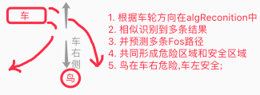 |
|  | 解决方案: 根据SP稳定性分析,站到车左侧安全区域,则安全; |
| 分析 | 两个例子,其实都是综合了seemFos的预测,`车可能到的地方`即危险地带; |
|  | 1. `车可能到的地方`只是危险地带,但并不危险; |
|  |  |
|  | 2. `车`开到`自己`的位置时,指向危险mv; |
|  |  |
| 结果 | 本表只是大致思路,本次主要迭代概念识别算法,支持相近度,`转25074`; |

| 25073 | F1`[A1我在5B,A2车开到5B]`如何识别为F2`[我,A3车开过来]`? |
| --- | --- |
| 分析 | 抽象`[车我无位置]->{危险-9}`,具象指向[车我位置5B],[车我位置3B]等 |
|  | 所以,`车开过来`其实是预测了`车和我同在的概念`; |
| 关键 | 重点是:已有的A1能否与预测中的A2融合成A3; |
|  | 即: 视觉标识下,我和车都有同值5B,所以依据此来融合成A3? |
| 结果 | 此问题涉及想像力(即时序中的概念重组) `转n25p09`; |

| 25074 | 方案2-复查当前代码现状 & 规划改进 |
| --- | --- |
| 现状1 | 视觉感官算法现在是每个HEView独立输入视觉算法的; |
|  | 改成: 不再区分view,而是整屏所有的dic整合到一起输入 `先不改,需要再改`; |
| 现状2 | 现在alg识别根据matchCount,支持全含和局部匹配两种结果; |
|  | 现状例子: 看某物飞行像蚊子,会联想到蚊子飞行路径,但此时并没看到蚊子 |
|  | 扩展支持: 本次主要改进`全含匹配`,使索引支持`相近V: 稀疏码相近度`; |
|  | 相近度公式: `near = 1 - delta / (max - min)`; |
| 结果 | 本表只是大致代码规划-需深入分析下`相近稀疏码的难点,转n25p08`; |

本节共有两个难点,其中相近匹配转n25p08,想像力转n25p09;

   

## n25p08 相近匹配
`CreateTime 2022.01.12`

在25074中,涉及到十三轮测试中最大的一个问题,即相近匹配,本节围绕解决这一问题展开;

| 25081 | 概念识别算法相近匹配迭代分析 |
| --- | --- |
| 问题 | 现在的TIR_Alg算法,仅有matchCount匹配度,没有matchValue相近度; |
| 分析 | 需要分析下,根据稀疏码相近值,来做相近稀疏码匹配,再做局部概念匹配; |
| 原则 | 局部匹配和相似匹配是两回事,局部是指匹配数小于全含,相似是V值相近; |
| 方案1 | 从索引序列中取相近的value,根据refPorts取到别的具象局部匹配概念; |
|  | 说明: 微向宏,其实后面的操作还是全含匹配,只是有一个值不一样; |
|  | 缺点: 但有可能相近的多个相邻码,refPorts的概念与当前概念毫无关系; |
|  | 分析: refPorts本来无关的就多,只是在识别中判断了全含; |
|  | 性能: protoA全是多变码时,每个都需十数条相近码.refPorts; |
| 方案2 | 从partAlgs中,找出同区不同码的,根据值排序,取出最相近的; |
|  | 缺点: 这可能出现较多低质量的结果,这些结果可能都不是相近的; |
|  | 缺点: protoA全是多变码时,根本取不到partAlgs,何谈从中取相似匹配; |
|  | 结果: 从局部匹配里找相近匹配,乱中找乱 `不采纳`; |
| 方案3 | 从抽象向具象找`含同区不同值`的具象概念,并值排序; |
|  | 缺点: protoA全是多变码时,不存在任何抽具象Alg结果,何谈从中取什么; |
| 分析 | 从顺应情况来看,最洽当的应该是方案1微向宏; |
| 分析 | 从缺点来看,方案2和3完全不可行,只有1至少可行; |
| 结果 | 参考`n21p3`,以及现在的概念识别算法里取refPorts方式,`转25082` |

| 25082 | 相近匹配模型示图分析 |
| --- | --- |
| 前言 | 无非是取交集,与现有做法大体不变,但需要针对性细化下不致有性能问题; |
| 难点 | 相近匹配的难点之一,就是涉及数量很多的相近索引都要取refPorts; |
|  | 解答:索引难免被大量使用,有内存缓存与复用,索引本就擅长这个; |
| 细模型 | 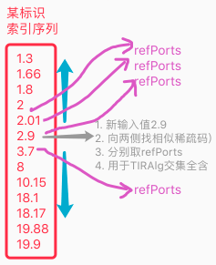 |
| 公式1 | 稀疏码相近度公式: `nearV = 1 - delta / span`; |
|  | 其中: `span=max-min`,`span=0时nearV=1`,`span的范围为0-1`; |
| 整模型 |  |
| 公式2 | 概念相近度公式: `nearA = sum(nearV) / matchCount`; |
| 说明 | 如图,从微到宏全是一对多复用,而除了V能值运算,别的全是指针; |
|  | 所以,稀疏码采用相近匹配,特征概念时序全采用局部匹配; |
| 结果 | 局部匹配早已有代码支持,本次迭代主要面向相近匹配 `转25083-实践` |

| 25083 | 相近匹配代码实践 |
| --- | --- |
| 问题 | 参考方案1-识别是从微向宏,V可控,宏观不可控,但有3个控制手段; |
| 1 | 广入: 所有的稀疏码索引序列的refPorts全取出做交集; |
| 2 | 有序: 全含的按`nearA`排序,局部的按`nearA * matchValue`排序; |
|  | 其中: `matchValue = matchCount / algContentCount`; |
| 3 | 窄出: 可以限定概念结果数量 (取nearA有序序列的前limit条); |

| 25084 | 相近匹配代码实践2 |
| --- | --- |
| 问题 | 25083-2中matchValue需要取出每个alg选手来取count,有性能问题; |
| 1 | 而支持相近匹配后,其实每个都是全含,所以可以先试下只按nearA排序; |

| 25085 | 回归测试 |
| --- | --- |
| 日志 | 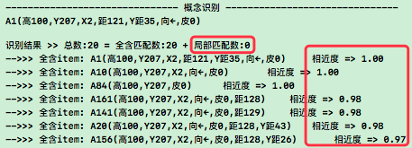 |
| 通过 | 经测: `确实只有全含了` & `相近度排序正常`; |

   

## n25p09 想像力
`CreateTime 2022.01.13`

在25073中,涉及到一个非常关键的问题,即`我的时序`和`车的时序`两个预测,共同重组后,靠想像力预测到了危险`[车撞到我]->{危险-9}`;

| 25091 | 想像力-初步分析 |
| --- | --- |
| 实例 | 一: 输入A1(B5位置的我),预测到`F1[A1,A1,A1]`自己位置不变; |
|  | 二: 输入A2(车右转5度),预测到`F2[A2,A3(B5位置的车)]`; |
|  | 三: 对F1和F2进行时序重组,触发想像力; |
| 注1 | `想像力`与`旧有反思`同原理,复用现有regroup和recognition代码; |
| 注2 | 与反思不同的是,此处时序的重组时,概念也要重组; |
| 注3 | 反思是应对输出期OR反馈概念的,而想像力是应对输入期IR预测时序的; |

| 25092 | 想像力-问题分析 |
| --- | --- |
| 问题1 | 对pFos和rFos尝试重组,两两重组性能不行,分析下怎么弄; |
|  | 解答: 最新一帧分别与旧帧的`预测时序未发生部分`进行重组; |

| 25093 | 套入`乌鸦演示`分析当前此需求的必要性 |
| --- | --- |
| 说明 | 未深入分析,但从表面思考,应该目前是不需要写想像力功能的; |
| 结果 | 等后面十四测训练中,有了迫切需求,再来继续这里 `暂停`; |

   

## n25p10 十四测-pFos&rFos双树融合
`CreateTime 2022.01.15`

n25p08的相近匹配已写完并初步测试ok，n25p09的想像力需求还不迫切暂停了。所以本文先进行十四测，回归测试训练。

| 25101 | 训练步骤规划 `参考25052` | 训练目标 |
| --- | --- | --- |
| 1 | 各危险地带,直击 x N | 被撞经验,危险地带概念 |
| 2 | 各安全地带,偏击 x N | 不被撞经验,安全地带概念 |
| 3 | 木棒中停,↑飞至安全地带 x 5 | 飞行经验,安全地带P经验 |
| 4 | 木棒中停,↓飞至安全地带 x 5 | 飞行经验,安全地带P经验 |
| 5 | 木棒中停,↗飞至安全地带 x 5 | 飞行经验,安全地带P经验 |
| 6 | 木棒中停,↘飞至安全地带 x 5 | 飞行经验,安全地带P经验 |
| 7 | 在危险地带直击 | 预测危险,并R任务决策飞躲 |

| 25102 | 测试关键节点规划 |
| --- | --- |
| 1 | 依25101步骤训练，测试能否预测到“危险地带”生成R任务。`T` |
| 2 | 测试能否根据R任务，S解决方案向安全地带加工。 |

| 25103 | BUG_无法习得`↑至安全地带`的H解决经验1 `T` |
| --- | --- |
| 说明 | 在25101训练第3步后,R无法获得躲开解决方案,可是明明已经飞上躲过; |
| 调试 | 第3步,全构建的`[木,↑,木,↑]`这样的时序,参考FZ33-3,如下: |
|  | 时序识别rFo:`F255[A1(木棒),A92(飞↑),A242(木棒),A92(飞↑)]` |
|  | 再抽象absRFo:`F274[A251(木棒),A92(飞↑),A273(木棒),A92(飞↑)]` |
| 分析 | `木棒中停`后先看到木棒,后面每一次↑,都跟着一次视觉: |
|  | 导致无法形成: `[↑,木]`经验,都是以木开头,且一木一↑交替的经验; |
| 方案 | 多飞几下,把飞3次调整成飞5次,旧的瞬时都被踢成新的就ok了; |
| 重训 | 成功有了protoFo:F292[飞↑,木,飞↑,木] `参考25105图` |
| 结果 | 虽然已解决本表问题,但本BUG还有别的问题,转25104 `T`; |

| 25104 | BUG_无法习得`↑至安全地带`的H解决经验2 `T` |
| --- | --- |
| 问题 | 在25103修复并重新训练第3步后,仍R无法获得躲开解决方案; |
| 调试 | 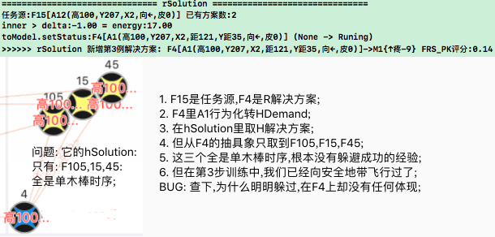 |
| 分析 | 经分析F4和抽象的全是pFo,没有rFo,而H经验应该多在rFo中; |
|  | 设：A=`无mv指向的Fo`、B=`有mv指向的Fo`、C=`单纯的mv`; |
|  | R任务是B,R任务的S也是B,推进R.S行为化时,生成的H任务也是源于R.S; |
| 线索 | hSolution现在也是从`R.S取抽具象(全是B)`来获取,但H.S多在A; |
| 验证 | 经查`时序识别`后,rFos和pFos之间没有构建抽具象; |
| 本质 | 本质上是`P和R衔接不足`的问题,可增强其衔接,即两颗独立树合为一树; |
| 两树 |  |
| 方案 | 可将R.S的抽具象加入A,即时序识别后pFos也加入rLearning()中; |
| 实践 | 已将两树衔接融合,根据25101前3步训练FZ35; |
| 结果 | `FZ35,直击,重启上飞直击`,可从hSolution得到上飞并成功躲开,如下图; |
| 回测 |  |

| 25105 | 时序识别中明明不相符却全含匹配的问题 `T` |
| --- | --- |
| 示图 |  |
| 分析 | 应该是相近匹配导致的,飞上和飞左向相近匹配了,导致了二者抽具象关联; |
| 结果 | 把`概念识别`后的抽象改为外类比后,重新根据25101训练FZ34,ok `T`; |

| 25106 | rSolution经常是时间紧急状态,有时还无计可施 `T` |
| --- | --- |
| 分析 | 当前时间不急评价在action中,紧急时设为ActNo,导致3条全紧急就完了; |
| 结果 | 将`时间不急评价`封装成FRS_Time,并前移到rSolution调用 `T`; |

| 25107 | 训练步骤规划 `参考25101` | 训练目标 |
| --- | --- | --- |
| 1 | 木棒中停,边飞边直击至右上角 | 安全危险地带,飞行经验,SP经验 |
| 2 | 在危险地带直击 | 预测危险,并R任务决策飞躲 |

| 25108 | 下标不急评价未生效BUG |
| --- | --- |
| 说明 | 训练25101前3步后,仅上飞预测R任务,Solution首帧上飞,就输出上飞了 |
| 问题 | 但此时还没看到木棒,没必要马上就飞离; |
| 结果 | 不知是不是春节前修复25106时顺便给解决了 `未复现,参考25111`; |

   

## n25p11 十五测
`CreateTime 2022.02.17`

此次春节在家呆了26天，春节回京后，此处接续上继续测试训练。

| 25111 | 训练FZ36 |
| --- | --- |
| 说明 | 按照25101全6步训练得到FZ36; |
| BUG | `载入FZ36-6,执行第7步直击`,发现R任务的几个解决方案全在危险地带? |
|  | 如:`F186[A1(高100,Y207,X2,距121,Y距35,向←,皮0)]->FRS_PK评分:0` |
| 怀疑 | 训练3-6步中停,导致危险地带却不被撞,从而危险地带许多P; |
|  | 解决: 可调整训练步骤,不中停; |
|  | 实践: 原因充足,步骤调整转25112,但目前未从日志中验证到此问题; |
|  | 结果: 已调整训练步骤,但未重新训练,可在随后用新步骤重新训练; |
| 分析 | 上面`怀疑`虽然看似正确,但并不解决当前问题; |
| 分析 | 当前问题的关键在于,rSolution()中未取到真正ATPlus正向的解决方案; |
| 结果 | 转25111B,继续深入从代价调试和FZ36日志中找线索; |

| 25111B | rSolution()找不到ATPlus解决方案的问题:`从debug和FZ36日志找` |
| --- | --- |
| 说明 | 接25111的BUG,rSolution找到的R解决方案稳定性全是0分,且在危险地带; |
| 1.调试 | 经调试rSolution()中所有R解决方案的SP全是0; |
| 2.日志 | 查FZ36日志,只有前两条RSolution有反省多次经历,但SP也是0,如下图; |
|  | 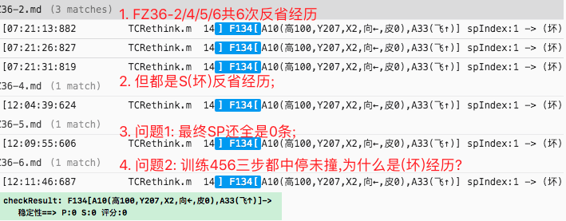 |
| 3.问题 | 经查,在FZ36-5左右时,发现即使安全地带偏击,也会反省S,而不是P; |
| 分析 | 经调试,并不是没有SP,而是spIndex都是1,而F134这些mvSPIndex=2; |
| 方案1 | 反省时,不仅要反省当下index的SP,也要计入反省末尾到mv的SP; |
|  | 分析,否掉,因为一堆烩在一起就乱套了; |
| 方案2 | 在计算spScore稳定性评分时,从startSPIndex到endSPIndex综合评分; |
|  | 采纳,这样评分更综合,更全面,也更准确 `转25114`; |

| 25112 | 训练步骤规划 `参考25101` | 训练目标 |
| --- | --- | --- |
| 1 | 各危险地带,直击 x N | 被撞经验,危险地带概念 |
| 2 | 各安全地带,偏击 x N | 不被撞经验,安全地带概念 |
| 3 | 边↑飞,边直击至安全地带 x 5 | 飞行经验,安全地带P经验 |
| 4 | 边↓飞,边直击至安全地带 x 5 | 飞行经验,安全地带P经验 |
| 5 | 边↗飞,边直击至安全地带 x 5 | 飞行经验,安全地带P经验 |
| 6 | 边↘飞,边直击至安全地带 x 5 | 飞行经验,安全地带P经验 |
| 7 | 在危险地带直击 | 预测危险,并R任务决策飞躲 |
| 7改 | 在危险地带直击 x N | FZ37后第7步改成这条 (参考25121); |

| 25113 | rSolution中靠前最有效的几条解决方案往往又太耗时 `T` |
| --- | --- |
| 示图 |  |
| 说明 | 随着训练,如果耗时是取MAX(A,B)的话,那么训练越有效的耗时也越大; |
| 方案1 | 单取MAX不行,可考虑改成MIN和MAX两个deltaTime值; |
| 方案2 | 发现判断`时间不急`所需是算到mv发生,应该改为仅取后一帧即可 `T`; |
|  | 分析: 因为很多solution只需要一帧就改到正确的道路上了 `T`; |
| 结果 | 方案2简单可行性高,先做方案2,方案1暂不弄 `T`; |

| 25114 | 综合计算SPIndex评分 `T` |
| --- | --- |
| 说明 | 参考25111B方案2,从startSPIndex->endSPIndex综合计算稳定性评分; |
| 公式 | `综评 = startSPScore * start+1SPScore * ... * endSPScore;` |
| 细节 | 1. 每个index下的spScore默认为1.0分; |
|  | 2. 每个index下的spScore评分范围为0-1分; |
| TODO1 | 在TCSolution中实现稳定性综评SPScore `T`; |
| TODO2 | 在TCScore将单纯的匹配度综评,改为用稳定性综评,可提高决策理性; |
| TODO3 | 时序识别中的匹配度,可改为稳定性综评,可提高识别准确度; |
| 代码 | TODO2和3,等随后需求更明确,或训练中迫切遇到它带来的问题时再改; |
| 结果 | TODO1已ok,延伸的TODO2和3暂不弄,先继续测训; |

   

## n25p12 十五测2
`CreateTime 2022.02.22`

| 25121 | 根据25112重新训练`FZ37` |
| --- | --- |
| BUG1 | 训练过程ok,第7步验收时,发现R任务太具体(含Y距); |
| 示图 |  |
| 分析 | 查FZ37-1日志,初生时训练非常单调,都没有时序外类比; |
|  | 所以第7步训练时,R任务太具象(未抽象过),且其r解决方案全是危险地带; |
| 解决 | 增加第7步训练的步数,在多个不同位置分别直击; |

| 25122 | r解决方案最终mv未解决问题,稳定性综合评分却是1分的问题 |
| --- | --- |
| 复现 | `FZ37,多个危险地带直击 (参考25121)`; |
| 示图 |  |
| 分析 | 负mv的时序越顺越不好,所以在稳定性综合评分上应采用不同的公式; |
|  | 即在公式上取反,使越容易导致坏mv,评分越低; |
| 定义 | SP现在的定义是: `理性阶段SP为顺与逆`,`感性阶段SP为好与坏`; |
| 正公式 | 正mv综合评价 = 理性评分 * 感性评分 `这个没BUG,不用改`; |
| 负公式 | 本BUG主要针对负MV的公式改动,如下: |
|  | 正正相乘方案: `负mv综合评价 = (1-理性评分) * 感性评分` |
|  | 负负相乘方案: `负mv综合评价 = 1 - 理性评分 * (1-感性评分)` |
|  | 分析: 采用负负相乘方案,因为正正在这里不是且关系,而是或关系; |
|  | 举例: 当理评=0.8,感评=0.3时,综合评分=1-0.8*0.7=0.44; |
|  | 结果: 负mv综合评价 = 1 - 理性评分 * (1-感性评分); |
| 结果 | 已将新公式用于稳定性综合评分算法中,并回测ok `T`; |

| 25123 | 当时序发生时SP是否也应累计分 |
| --- | --- |
| 简介 | 类似以前的`反思`中生成SP,那么现在fo实际发生一次,是否也应累计分; |
| 示图 |  |
| 说明 | 图中的`1=S5P0`,其中P不可能为0分,因为F149构建时,P就应该已是1分; |
| 分析 | 1. 分析现在的IRT是否已经部分实现了这一问题中提到的功能; |
|  | 2. 如果确实需要计分,那么建议独立存一个spDic中; |
| 结果 | 虽然这个能够提高SP综合评分精度,但目前没有它也还可以 `暂不实现`; |

| 25124 | 新的强化训练方式 |
| --- | --- |
| 迁移 | 迁移训练更适合于用一步步训练观察:知识结构的形成与决策中应用; |
| 强化 | 强化训练更适合于用更多经历来加强迁移成果的SP反馈计数; |
|  | 所以,在迁移训练结果后,可以规划一下强化的加训方案; |
| 方案 | 用限定规则下又随机的行为组来训练一段时间,并总结现实反馈SP计数; |
| 代码 | 1. 智能体负载状态判断 (在空闲时开始下一步) `T`; |
|  | 2. 可以自动重启训练场景,使类似现实世界情况多次发生; |
|  | 3. 对决策质量的质量动态评分; |
| 结果 | 迁移训练的成果在SP的强度上,未必就这么缺,等到这么缺时再做本题不迟; |

   

## n25p13 十五测3
`CreateTime 2022.02.24`

| 25131 | 训练步骤规划 `参考25112` | 训练目标 |
| --- | --- | --- |
| 1-6 | 前6步参考25112 | 参考25112 |
| 7 | 在危险地带直击 x N | 加训危险地带 |
| 8 | 右上,直击 |  |

| 25132 | 根据25131重新训练`FZ38` |
| --- | --- |
| 验收 | 第8步,可以自行右上飞躲避; |
| TODO | 明日计划: 别的还没来的及验收,回头看看; |
| 问题1 | 第8步,右上飞,还没直击,就自行右上飞躲避 `转25133`; |
| 问题2 | 第8步,右下飞,直击,没有任何解决方案经验 `转25134`; |

| 25133 | 右上飞未直击就躲避的BUG `BUG不成立` |
| --- | --- |
| 示图 |  |
| 分析 | 上图可见,右上飞,本身已经预测到危险,此时解决方案首帧即是右上飞躲避; |
| 线索 | 看起来此BUG不算BUG,就像是在车道中间站着没车也担心危险; |
| 方案 | 是站在路上顶着危险解决别的任务,还是躲避危险,这完全是综评竞争问题; |
| 结果 | 此BUG不成立,等到`觅食,防撞`融合训练时,到综合竞争里再测有没问题; |

| 25134 | `FZ38,右下飞,直击`没有解决方案的BUG |
| --- | --- |
| 调试 | 在第7步后,重复训练第6步:`↘飞,直击 x 5次`; |
| 示图 | 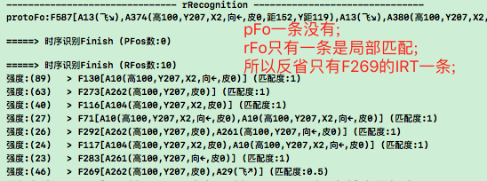 |
| 分析 | 经调试,在飞到安全地带直击时,pFos识别结果竟然没有[↘,木棒]->{疼}; |
| 线索 | 导致没有rLearning再抽象,也没有rt反省到SP值,所以没有解决方案; |
| 调试 | 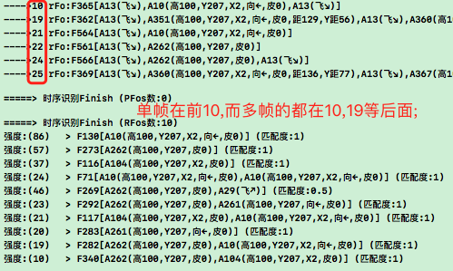 |
|  | 经查时序识别前10条大量单帧,导致取前10条后更有用的多帧rFo被挤掉; |
| 分析 | pFo单帧还ok,rFos的单帧真没啥用,没预测作用,还占位置; |
| 方案1 | 可考虑将rFo的单帧结果排除掉 `否掉,需针对性分析时序识别结果的用途`; |
| 变更 | 方案1否掉,本质上是prFos在各地的用途不同,分析方案2如下: |
| 三用途 | 时序识别结果prFos只做三件事: `学习抽象,预测反省和生成需求`; |
| A学习 | 理性学习: `筛选出全含的prFos` (如[↗飞]就预测危险,即片面还常发); |
|  | 感性学习: `筛选出所有的pFos` (无论匹配度是多少,感性学习都ok); |
| B预测 | 理性预测: `筛选非全含的prFos` (因为全含的已全发生,不存在预测); |
|  | 感性预测: `筛选出全含的pFos` (即下步就该cmv了,进行感性预测); |
| C需求 | 新增需求: `筛选出所有的pFos` (有mv,任何匹配度都能新增PR需求); |
| 方案2 | 综上,根据不同用途重新制定取prFos的筛选和排序规则,如下: |
|  | **1. 筛选: ABC三种用途的不同筛选方式参考上面`灰色文字说明`;** |
|  | **2. 排序: 全含结果应以fo更长排序 & 非全含应以匹配度(默认)排序;** |
| 结果 | 采用方案2,并代码实践 `T` |

| 25135 | 按照25131步骤重新训练FZ39 |
| --- | --- |
| 说明 | 训练FZ39后,第8步回测大体ok; |

   

## n25p14 十五测4
`CreateTime 2022.03.06`

| 25141 | FZ39BUG_RSolution取到坏经验 `T` |
| --- | --- |
| 示图 |  |
| 说明 | 如图F442为-mv经验,但它的index2下SP为0分,所以负但不顺利,评为1分; |
| 问题 | 如图取F442做解决方案有些怪异,分析与解决思路如下: |
| 思路1 | 可考虑排除-mv经验 (因为-mv的导致越努力结果越差) `废弃`; |
|  | 正例: 如取F442为解决方案,则会推进它,到index2反而把1分推成0分了; |
|  | 反例: 如有一轻一重两种惩罚交替进行,在重罚时,就希望切换成轻罚; |
|  | 结果: 见反例,其实各个解决方案就是公平的稳定性竞争,不论mv正负; |
| 思路2 | 可考虑把0分的排除 (都没成功过一次,直接pass省得浪费时间) `T`; |
| 思路3 | 考虑加大训练力度,来增加SP的经历 `参考25124 & 转25133`; |

| 25142 | FZ39右下躲到出屏才停下的问题 `T` |
| --- | --- |
| 问题 | `FZ39,右上飞`,自行飞躲到出屏才停下,早就安全了为什么那么远才停? |
| 思路 | 对安全地带的概念判断:测下能否从抽象无Y距概念,的具象判断安全地带; |
| 分析 | 现在的飞躲,仅仅飞没直击就躲了,所以压根扯不到判断是否安全地带; |
| 分析 | 因为原地飞立马预测危险,而原地飞其实并不意味着危险; |
| 方案 | 应该加训空飞,然后在生成任务时计算迫切度时,将SP率也计入其中; |
|  | 解释: 这样当生成的任务迫切度足够低的时候,飞懒值都超过它,就不动了; |
| TODO1 | 改进: 不做懒值,现在的energy消耗即可,任务不迫切,活跃度自然低 `T`; |
| TODO2 | 生成伤时,将SP率计入其中 `T`; |
| TODO3 | 废弃energy,由mvScoreV2值限制它在工作记忆树的下辖分支数 `暂不做` |
| TODO4 | 将TCScore评分升级为应用mvScoreV2 `T`; |
| TODO5 | 将任务管理器中,根任务排序方式改成以mvScoreV2为准 `T`; |
| 结果 | 改完后,`FZ39,右上飞`立马就不再飞了,因为这一步预测不会发生危险; |

| 25143 | FZ39直击躲不开的问题 `T` |
| --- | --- |
| 说明 | `FZ39,直击`,则鸟哪也没躲,因为没有任何有效的决策方案; |
| 调试 | 用网络可视化,看[木棒]->{危险}的具象指向为什么没解决方案; |
|  | 查当`飞到安全地带躲开`时,这条经验与`[木棒]->{危险}`有没抽具象关联; |
| 调试 | 在FZ39它的具象确实没有解决方案,但向下飞直击两三下,就有了; |
| 结果 | 单纯就是训练的太少所致,不算BUG,暂不改啥; |

| 25144 | FZ39下飞躲不开的问题 `T` |
| --- | --- |
| 说明 | `FZ39,下飞,直击`,这个过程鸟没躲开; |
| 调试 |  |
| 如图 | [下飞,木棒]并未指向mv; |
| 分析 | 查下为什么明明多次经历下飞被撞,却还是没指向mv; |
| 调试 | 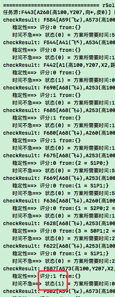 |
| 说明 | 其实有识别到F443->疼,也有解决方案,只是rSolution只取前3条; |
| 分析 | 只取前3条,大几率被稳定性为0,或时间不急评价筛掉; |
| 方案 | 广入窄出:将强度前3改成15条,然后排`稳定性>0 && 时间来的急`最前3条; |
| 结果 | 暂时先这么做,后续可以考虑将conPorts改成SP评分排序; |

| 25145 | 强化训练设计_增加SP经验 `转n25p15` |
| --- | --- |

| 25146 | hSolution半途而废的BUG `T` |
| --- | --- |
| 问题 |  |
| 复现 | 25133-`FZ39,直击,下飞,直击,重启,直击,下飞`...大致是这步骤; |
| 怀疑1 | 怀疑无飞后视觉,没及时反馈,可考虑改为每秒3帧视觉 `转n25p16`; |
| 转疑2 | 经查代码现在有飞后视觉,但怀疑木棒飞出屏,所以视觉为空帧; |
|  | 分析: 只是因为飞出屏,鸟又看不到自己,所以飞后没有视觉目标; |
|  | 解决: 可让鸟看到自己与场景边缘的距离,即自身pos(x,y)值; |
|  | TODO1: 将鸟自身的一些关键数据(pos)加到视觉 (避免空帧); |
|  | TODO2: 将视觉内所有View整合到一个视觉数据model中 `转n25p17`; |
| 转疑3 | 经调试,左下飞后,看到了木棒,并非空帧; |
|  | 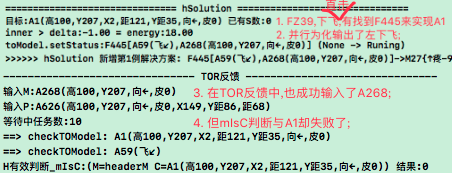 |
|  | 分析: 如图mIsC只判断了A268抽象指向A1当然会失败; |
|  | 举例: H任务是找苹果,H解决方案为去水果市场,反馈为水果而不是苹果; |
|  | > 所以在判断A268(水果) is A1(苹果)失败了; |
|  | 分析: matchAlgs中可能包含:水果,物体,苹果等,水果不是苹果,不表示全否; |
|  | 解决: 可以改成proto或matchAlgs中任一条mIsC成立即可; |
|  | 方案: 将mIsC改为: `mIsC_2(protoAlg,C)` `T`; |

   

## n25p15 支持强化学习训练
`CreateTime 2022.03.10`

1. 现状与需求: 以往的训练更偏向于迁移学习的训练,最多支撑到:"初学会走路的幼儿"状态,但它此时还依然有许多不确定行为,走路不走,动作不齐,容易摔跤;

2. 问题与解决: 而随着SP综合评分越来越完善,显现出了当前SP经验训练不足的缺点,本文针对这个问题,做强化学习训练相关的设计,以实现SP经验的增强,以及让"幼儿走路走利落,走确定";

| 25151 | 强化训练设计分析 |
| --- | --- |
| 方案1 | 设计加训或强化训练方式,对指定的步骤自动进行训练; |
|  | 实现: 可设定脚本,编辑脚本后,可以指定跑某脚本,来达到强化训练目标; |

   

## n25p16 定帧被动感官
`CreateTime 2022.03.12`

1. 视觉现状：以往的视觉虽然也是被动的，但是以Demo指定事件为触发的（比如投出木棒）。
2. 本质问题：而真正的现实世界没有Demo，这触发机制就行不通了，所以迟早要将之替代为定帧被动视觉（比如每秒5帧）。
3. 时机不到：不过当前《乌鸦挑战》还未全部训练成功，当前成熟度不够，不建议现在就这么做。
4. 强做弊端：如果现在就做，会导致日志增多、性能要求更高，对当前尚属前期的训练测试是不利的。
5. 未来计划：而下一版本要面向现实世界做演示，到时候才是做定帧被动感官的成熟时机。

   

## n25p17 单帧输入单模型
`CreateTime 2022.03.12`

在以往每帧视觉输入会根据subView数量分别输入model,本文将将所有subView整合到一个model中.原因如下:
1. 现实世界没有Demo没有subView,必须是统一到一个model中;
2. 鸟将自身model和木棒model分开,未必是好事,明明鸟与木棒同帧时,就是同帧同概念,却因为分了subView而分成多帧输入,看似帮忙he拆分概念,事实却是帮倒忙,让he的时序更加不好预测;
3. 举例: 说白了,当前是概念:(鸟在路上时),而不是时序:[鸟在时,就会有路];
4. 搁置: 当前一般情况下都是单个subView输入的,所以现在先不做,随后有了多个subView时再来改弄这个;

   

## n25p18 TOMVision工作记忆可视化迭代V2
`CreateTime 2022.03.13`

工作记忆的可视化：以往V1版本TOModelVision是较为简单时用无序表日志即可将就看，随着前段时间螺旋架构的一次大的整理迭代，工作记忆的可视化需求越来越高。再加上下步要做强化训练设计，到时候日志量会爆发，再看日志有点不太现实。所以本节主要设计开发一个“工作记忆可视化”工具。可以在可视化UI里动态的观察到HE的思维过程等。

| 25181 | 功能设计分析 |
| --- | --- |
| 1 | 每次变动记录为一帧 (仅记录变化部分); |
| 2 | 每轮循环记录循环数; |
| 3 | 可以录制; |
| 4 | 可播放暂停; |
| 5 | 可调整不同倍速; |

| 25182 | 展示面板原型图 |
| --- | --- |
| 示图 | 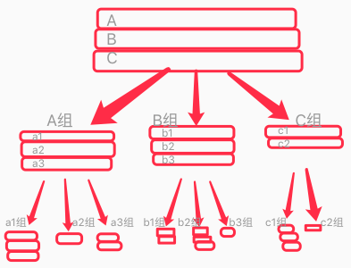 |
| 说明 | 1. 分枝为了显示内容方便,用几个长条累叠显示 `如ABC累叠`; |
|  | 2. 一组sub共用一条连接线 (避免一堆线看着发麻) `如a1a2a3共用A组线`; |
|  | 3. 缩放展示: 子组宽度 = 父组宽度 / 子组数量; |
|  | 4. 每组view宽=组宽的60%; |
|  | 5. 播放时,默认将当前焦点(变化中)处缩放为max(minSize,curSize)显示; |

| 25183 | 操作面板原型图 |
| --- | --- |
| 示图 |  |
| 说明 | 1. 播放 / 暂停 |
|  | 2. 进度显示条 (时间,循环圈数,帧三种进度); |
|  | 3. 进度调整 (先左侧选中调整项高亮,拉动调整,配合右侧单数进退调整); |
|  | 4. 播放速度调整 (0.25倍到3倍,黄色高亮为当前速度); |
|  | 5. 触发帧日志consoleLog框 `暂不做`; |

| 25184 | 深拷贝TOModel-RDemand中的inModel太大问题 `选用方案2` |
| --- | --- |
| 问题 | 现在的rDemand.inModel仅用做需求来源,存整个inModel太大了; |
| 分析 | inModel太大,对序列化性能影响也大,弃用inModel; |
| 方案1 | 改成仅存生成任务的那几条pFos; |
|  | 分析: 废弃,pFos也不小,并且有些pFo并未生成rDemand |
| 方案2 | 来源标识fromIden,用inModel的内存地址,替代原inModel (采用); |
|  | 分析: 取用RDemand的同伴时,从树中遍历同批次的RDemands即可; |

| 25185 | TOMVision2各帧间复用数据,导致各帧变化未保留 `T` |
| --- | --- |
| 问题 | 在TVPanelView.models中,测得各帧数据都一模一样; |
| 分析 | 因为models各帧间数据在内存中是复用的,导致更新后,新旧不分; |
| 冲突 | 而因为nodeView要复用,判断各帧间哪些有变化; |
| 需求 | 所以,即需要帧帧更新,又要保证内存地址可判断是同一个TOModel; |
| 方案1 | 加上序列化方法,序列化时,将内存地址也记录下来; |
|  | 细节1: 只需要序列化roots就行,下面的sub自动跟到里面了; |
|  | 细节2: 序列化时把内存地址计入其中,反序列化后,equal时就用它对比; |
|  | 优点1: 这样序列化后,就不复用内存了,新旧都能独立保存; |
|  | 优点2: 而又记录了内存地址,可用来判断它们是否有变化; |
|  | 实践1. 序列化内存地址,仅用初次实例的,后面再复制持久化等,此地址不变; |
| 方案2 | 看能不能自定义序列化,一个字典搞定,每个key都是内存地址; |
|  | 细节1: 每个value都是它的content_p,status,cutIndex,subs等; |
|  | 细节2: 每个sub又是个dic数组,key又为内存地址; |
|  | 分析: oc自带NSCoding序列化方案,自己写麻烦; |
| 结果 | 选用方案1,并实践完成; |

| 25186 | 思维可视化-进度简述表(滚动歌词) |
| --- | --- |
| 示图 | 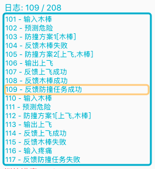 |

   

## n25p19 强化学习训练-代码实现
`CreateTime 2022.03.28`

　　随着HE去年的架构大迭代和春节以来的十五测回测，迁移训练接近尾声。而迁移训练的知识大多稳定性不足，导致HE体现出许多刚学会走路似的不确定小动作（如下例）。使得强化稳定性训练需求越来越迫切，在之前的25124和n25p15也已有过两次关于强化学习训练的初步设想。此节中，将对此进行代码实现。

　　例：比如在FZ39中，大致都能躲开木棒，但是HE做出决策的过程细节未必是我们想要的，它可能有些小步骤是瞎猫碰到死耗子，但这耗子还真是因为有经验经历过，只是还不知道它的稳定性其实很差。

| 25191 | 强化训练需求分析 `参考25124 & n25p15` |
| --- | --- |
| 训练目标 | 总结现实反馈,使SP稳定 (从摇摇晃晃到走利落); |
| 训练模式 | 工作模式1. 用限定规则下随机的行为组来训练一段时间; |
|  | 工作模式2. 可设定脚本,编辑脚本后,可以指定跑某脚本; |
| 训练多久 | `跑固定时长` 或 `跑固定圈数` 或 `跑SP稳定性目标阈值`; |
| 推进训练 | 智能体负载状态判断 (在空闲时开始下一步,参考25124) `T`; |
| 重载场景 | 可以自行重启训练场景,使类似现实世界情况多次发生; |
| 训练信息 | 1. 对训练过程中决策质量动态评分 (SP稳定性综合评分); |

| 25192 | 代码规划 |
| --- | --- |
| 1 | demo中每功能块将自身包含的某训练小步骤上报给强化训练系统; |
|  | 数据: 上报:`功能名,className,methodName`,如`飞,birdView,fly()` |
| 2 | 强化训练系统调用时,只需要在脚本写下功能名即可反射调用; |
|  | 比如: 直接调用"飞"; |

| 25193 | 前期验证 |
| --- | --- |
| 说明 | 手动跑下强化训练,前期验证效果; |
| 准备 | 将FZ39最近做思维可视化`下飞直击`许多次后打包成FZ40; |
| 调试 | 经调试FZ39的SP值约为0,5,12等,而FZ40的SP高的有两百四百; |
| 结果 | 可见,多做训练是非常有利于提高稳定性的; |

| 25194 | 代码规划2-先做防撞实验的强化设计 |
| --- | --- |
| 说明 | 先对防撞训练为目标做`强化训练`实践; |
| 飞方向 | 1. 屏内时,8向随机 `T`; |
|  | 2. 边缘时,随机向内侧三个方向 `T`; |
|  | 3. 屏外时,仅1方向先飞回屏幕 `暂不用,第2条就行`; |
| 投木棒 | 飞完后在屏内时,执行扔木棒1次 `T`; |
| 控制台 | 1. 记录动作次数,训练时长,训练过程动态报告,及训练结果报告; |
|  | 2. 自动对`记忆`和`思维录制`进行保存; |

| 25195 | 任务决策质量评价机制 |
| --- | --- |
| 说明 | 对整树评分,供训练`动态报告`和`结果报告`中使用; |
| 方法 | 1. 有解决方案率; |
|  | 2. 解决方案稳定性; |
|  | 3. 最终付出mvDelta成本; |
| 结果 | 强化学习训练器控制台原型图设计 `转n25p21`; |

   

## n25p20 废弃fo的mv指向 & 废弃P任务
`CreateTime 2022.03.28`

* 说明: 早有这方面想法,其实P任务也是R任务,瞬疼毕是不会产生任务的;
* 例子: 比如木棒撞就没有P任务,只有R任务;
* 改进1: fo不再指向mv,mv基本模型改成单纯的fo,mv只是它content里的元素;
* 改进2: 废弃P任务;
* 临时方案: 短期内,可以对mv传达`持续性`类型标识,来临时用着先;
  - 比如1: 饥饿是持续的 (不吃饱就越来越饿);
  - 比如2: 瞬间的疼是不持续的 (疼完就没了);
* 结果: 现在先做`强化训练实践`,等后续回归`饥饿训练`时,再来支持这个;

   

## n25p21 强化学习训练-控制台
`CreateTime 2022.04.14`

| 25211 | 强化学习训练器控制台原型图设计 `参考25195` |
| --- | --- |
| 要素 | 实时显示如下要素; |
|  | 1. 整树和当前分支综合mvDelta评分; |
|  | 2. 整树和当前分支综合SP稳定性评分; |
|  | 3. 整树和当前分支有解决方案率; |
|  | 4. 滚动字幕功能 (类似歌词,显示每步简述); |
| 示图 | 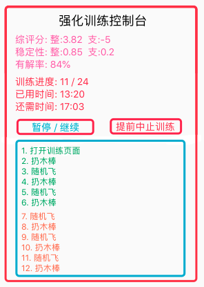 |

| 25212 | 性能优化 |
| --- | --- |
| 说明 | 强化训练的速度,取决于性能优化,所以可考虑优化下,使强化训练更快; |
| 分析 | 可以写个debug工具,来分析`TC模块中哪个更慢`,`循环轮数`; |
| TODO | 1. 优化慢的TC模块 (改参数配置,或缓存,或持久化序列); |
|  | 2. 调整循环轮数 (energy值和消耗配置调整); |
| 代码 | 每次TC模块执行,都向debug工具上报,直到下一模块执行前,都算它的耗时; |
|  | 将每个模块的`执行次数`x`平均耗时`=`总耗时`,`耗时占比%`,都打印显示; |
| 实测 | 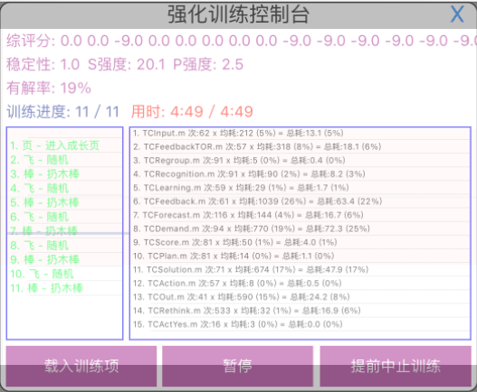 |
|  | 如图: 许多模块单次执行就要200到1000ms,这显然太慢了; |
|  | 下步: 可以将每模块执行的io操作计数分析下 `T`; |
| 跟进 | IO分析后,发现写不卡,Solution读多,Input读多,Demand没读写但也慢; |
| 方案 | 优化顺序:Solution(读取优化)>Input(读取优化)>Demand(代码优化); |
| 结果 | 目前虽略慢,但不至于慢到影响强化训练,先训练后再来优化 `暂停`; |

   

## n25p22 十六测-强化学习训练
`CreateTime 2022.04.23`

本节用强化学习训练器，边做防撞训练，边测试性能并优化下。

| 25221 | 跑强训,得到FZ40 |
| --- | --- |
| 训练 | 1. `随机飞,扔木棒,循环15次`x1次; |
|  | 2. `随机飞,扔木棒,循环5次`x2次; |
| 记录 | S强,P强每5次循环记录一次值分别为: |
|  | `10,0.6 / 16,3.5 / 24,4 / 34,4 / 39,4` |
| 说明 | 初步可见SP有加强效果,防撞效果待测试; |

| 25222 | 强训F40后,`下飞,直击`还是躲不好 |
| --- | --- |
| 复现 | F40,下飞,直击; |
| 日志 | 在RSolution中,有许多稳定性好的方案,因时间来不及,不被选用; |
| 分析 | 选不中方案,就不会有SP成长机会; |
| 原因 | 因为现在思考速度慢,而现实世界发生又太快,一根木棒转瞬即至,谈何学会; |
| 举例 | 就像快速绊倒学步幼儿,还希望他能学会躲避; |
| 方案 | 可尝试将木棒击出速度变慢,然后重训; |

| 25223 | 调整木棒击出速度后-重训FZ41 | 训练目标 |
| --- | --- | --- |
| 1 | 各危险地带,直击 x N | 被撞经验,危险地带概念 |
| 2 | 各安全地带,偏击 x N | 不被撞经验,安全地带概念 |
| 3 | 边↑飞,边直击至安全地带 x 2 | 飞行经验,安全地带P经验 |
| 4 | 边↓飞,边直击至安全地带 x 5 | 飞行经验,安全地带P经验 |
| 5 | 边↗飞,边直击至安全地带 x 3 | 飞行经验,安全地带P经验 |
| 6 | 边↘飞,边直击至安全地带 x 5 | 飞行经验,安全地带P经验 |
| 7 | 在危险地带直击 x N | 加训危险地带 |
| 8 | 随机飞,扔木棒,循环5次 x 5 | 强化加训 |

| 25224 | 躲错方向的问题 |
| --- | --- |
| 问题 | FZ41,有时明明在路面偏上,却向下躲,越躲越危险 |
| 结果 | 此时应该向上飞更好,但HE不知道,即Y距没让HE更理性 `转n25p23`; |

   

## n25p23 决策流程中的信息边界修整
`CreateTime 2022.04.28`

1. 在25224中,测试到躲错方向的问题,其实此问题老以前就提过多次,即最初的`时序概念化`(当时针对某作用来定义概念,比如:`路上偏上位置的木棒`);
2. 或者去年做相近匹配时,其实可以延伸做这个(当时提出空概念的具象集合就是它的评价源,但没有更进一步做它的实践);
3. 本节将针对此问题继续推进实现;
4. 本节结尾,需要训练实测能够解决`躲错方向`的问题,即为达成目标;
5. 本节共经历了三个阶段;
   * 前段: 本节前半段为`多fo稳定性综评`
   * 中段: 但中段发现它们仅是竞争关系,后半部分改为`两步竞争`方式来实现;
   * 后段: 再后段发现其实是`决策流程中的信息边界修整`;

| 25231 | 躲错方向问题-方案分析 |
| --- | --- |
| 复现 | `FZ41,直击`,有R任务后,SP最稳定的解决方案即向下飞; |
| 问题 | 即使在路面上偏上(有Y距),也会取到solution向下飞,来躲避; |
| 方案1 | 表征两个抽象概念: `absF1靠下无Y距棒`和`absF2靠上无Y距棒`; |
|  | 分析: 这两个抽象概念的定义,着点于作用类似,但`作用`又体现在其具象中; |
|  | 思路: 所以absF1和absF2无法表征,所以这种空概念是不存在的 `方案废弃`; |
| 方案2 | 时序概念化: 旧话再提,根据作用将时序概念化; |
|  | 分析: 不必搞这种添乱方案,时序与概念的组分关系不能乱 `方案废弃`; |
| 方案3 | 通过`决策期`更好的使用知识来解决; |
|  | 分析: 解铃还需系铃人,表征既无从下手,且已提供了该提供的所有知识; |
|  | 分析: `靠上`或`靠下`的判别不在于哪个更相近,而在于作用类似 `选用`; |

| 25232 | 多Fo综合稳定性评价-实践分析-步骤分析 |
| --- | --- |
| 说明 | 本表在现有基础上,分析TCSolution迭代代码规划; |
| 现有 | 识别的概念: 已支持相近匹配partAlgs; |
| 示图 | 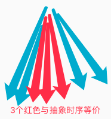 |
| 步骤1 | 直接根据作用类似,来取到共同作用的conFos,取用满足如下条件: |
|  | 1. 用partAlgs.refFos与RDemand.matchFo之间有抽具象关联; |
|  | 2. 且等价(作用类似): `导致同类型的mv 或 产生同cHav`; |
| 步骤2 | 计算多fo综合稳定性,为避免不公平,所以要计入如下要素: |
|  | 1. 将相近度乘进稳定性中; |
|  | 2. 然后所有的稳定性再求平均值,即为:最终稳定性 `废弃,多fo是竞争关系`; |
| 步骤3 | 得出稳定性后,最后取解决方案; |
|  | 问题: 多fo稳定性得出了,从哪个fo取解决方案? |
|  | 方案1: 从多fo的解决方案先取交集,然后再竞争解决方案 `乱套,不采纳`; |
|  | 方案2: 从多fo竞争稳定性,然后从最稳定的fo取解决方案 `采纳,转25234`; |
| 结果 | 废弃多fo稳定性综评,它们仅是赢家通吃的竞争关系 `转25233b-原则`; |

| 25233 | 多fo稳定性综评-实践分析2-两步稳定性 |
| --- | --- |
| 原则1 | 评分主要作用于偏认知期,而决策期主要还是看稳定性; |
| 原则2 | 其实做这些,最终目的就是让稳定的脱颖而出,让不稳定的退居幕后; |
| 第1步 | 找出稳定的rDemand.matchFo (更确定有任务); |
| todo1 | `多等价fo`构建同一个任务,然后这些fo再稳定性竞争; |
|  | > 以往任务池是综评分竞争,而不是稳定性竞争; |
|  | > 记得以前代码对等价有任务防重,可以去看下能否复用改下; |
| 第2步 | 找出稳定的rSolution解决方案 (更确定解任务); |
|  | > 记得rSolution中,已有取等价fo的代码 (核实下,能否复用); |
|  | > 如果第1步改成多fo构建任务,就不用找等价fos,直接从rDemand取即可; |
|  | > 但每个任务都有cutIndex等属性,所以没法多个生成一个任务; |
|  | > 目前已有TOUtils.getSeemFromIdenRDemands()取等价demands.fos |
|  | > 所以对等价demands要避免重复决策 `转25234-2`; |

| 25233b | 决策流程中的信息边界修整-分析 |
| --- | --- |
| 原则 | 整体兼顾`整体边界要流畅平滑`,个体竞争`内部每条线都要自由竞争`; |
| 问题 | 躲错方向问题,过于抽象mFo在找解决方案,有卡断等水流不合理的问题; |
| 示图 | 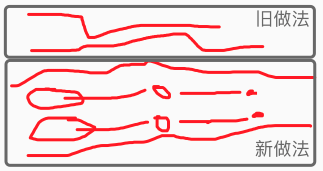 |
| 说明 | 1. 旧有方式有些地方卡断严重,导致损失关键信息; |
|  | 2. 后期又突然张开,会导致平白无故的信息激活; |
|  | 3. 新做法,就是将这些问题都改掉,使之贴合实际又不损失不多余; |
| 1 | 前微观都有机会到后期,后宏观要竞争 `实践转25234-1`; |
| 2 | 任务需求要能明确 "稳定性竞争" `实践转25234-4` |
| 3 | 任务解决也要明确 "稳定性竞争" `实践转25234-5` |

| 25234 | 决策流程中的信息边界修整-代码规划 |
| --- | --- |
| 1 | 时序识别,要兼顾到matchAlgs和partAlgs,分别识别N个结果 `T`; |
|  | > 现在仅使用了matchAlgs做时序识别,怪不得难以识别偏路边; |
|  | > 现在fos4Demand下前10条,可能错过更多样化的时序结果; |
| 2 | 等价demands.fos要避免重复决策 (协同决策,共享成果) `后面再搞`; |
| 3 | rDemand的等价fos判断 `T本就支持`; |
| 4 | 对等价fos`rDemand.matchFos`做稳定性竞争; |
| 5 | 对最稳定的fo取解决方案,并对解决方案再做稳定性竞争; |
| 6 | 全含判断迭代: 用每帧里的matchAlgs和partAlgs判断全含 `T`; |

     
