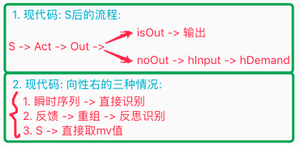

# 乌鸦挑战-TC数据流配置测调

> 注:
> 1. 在n26中，做了继续整理了TC数据流,快慢思考,AIAnalyst分析器,本文在此基础上继续做TC数据流整理,并回归训练;

***

<!-- TOC -->

- [乌鸦挑战-TC数据流配置测调](#乌鸦挑战-tc数据流配置测调)
  - [n27p01 S候选集再抽象](#n27p01-s候选集再抽象)
  - [n27p02 十九测: 回归改BUG](#n27p02-十九测-回归改bug)
  - [n27p03 快慢思考性能优化](#n27p03-快慢思考性能优化)
  - [n27p04 安全地带却飞躲卡顿BUG-代码实践](#n27p04-安全地带却飞躲卡顿bug-代码实践)

<!-- /TOC -->

## n27p01 S候选集再抽象
`CreateTime 2022.06.20`

在26235中,S解决方案都太具象繁杂,并且还经常测时有各种方向乱飞的情况,本节针对这一问题进行分析解决;

| 27011 | S候选集再抽象-方案分析 |
| --- | --- |
| 原因 | 快思考候选集随时可能加入新的，且综合排名可能靠前 |
| 原则 | 乱飞肯定是抽象度不够。 |
| 方案 | 可以尝试将其类比抽象。 |

| 27012 | S候选集再抽象-实践分析 |
| --- | --- |
| 问1 | 触发外类比的时机: |
|  | 思路: 使抽象S挂载到具象场景Fo下; |
|  | 答: 可以在输出新S结果时，与已有S类比。 |
| 问2 | 排名机制 (抽象排前机制): |
|  | 思路: 用strong强度为排序因子(抽象的强度更强); |
|  | 答1: 用强度加宽入limit即可。 |
|  | 答2: 将强度加到综合排名里做第四个排名科目; |

| 27013 | S候选集再抽象-代码实践 |
| --- | --- |
| TODO1 | 将effDic中的itemArr的指针改成AIPort类型; |

| 27014 | 反例分析 |
| --- | --- |
| 反例 | 如果8向改成无数向,那么会不会一抽象就没有具体飞躲方向了; |
|  | 思路: 所以是否意味着,进行再抽象必然会丢细节; |
|  | 思路: 到了S这一步,其实是应该保留更多细节了,要用于行为输出参数; |
| 分析 | 反例无效,因为抽象只负责找出抽象候选S,而丢细节后是否有效归effect管; |
| 所以 | 无论是否有效,都先抽象再说,抽象后: |
|  | 1. 如果抽象不合理则通过`有效率`将其否掉; |
|  | 2.如果抽象合理,则通过`有效率`使其成长; |

***

## n27p02 十九测: 回归改BUG
`CreateTime 2022.07.05`

前段时间因北京疫情中断20天,本文衔接26234-root循环卡顿的BUG,继续;

| 27021 | root循环卡顿-BUG回顾 |
| --- | --- |
| 说明 | 参考26234,在训练中遇到root循环卡顿 (finish状态的root有92条); |
| 调试 | `直击预测危险->S方案左飞->棒,左飞又预测危险->又S方案左飞`循环; |
| 疑点1 | [棒,左飞]: 为什么会预测到危险`[左飞,棒]`,即使明明在安全地带; |
| 疑点2 | [棒,左飞]: 得到解决方案[棒,左飞,棒],为什么还会左飞,飞应该是前段; |

| 27022 | root循环卡顿-BUG不复现 |
| --- | --- |
| 说明 | `FZ55,路上方直击`,此BUG死活不再复现了; |
| 重训 | 经26233重训,第2步到30%左右时卡循环,但卡20分钟后过去了,中止训练; |
| 复现 | 相当于重现了此BUG,得到FZ56; |
| 分析 | 如已在安全地带,此时`S评分 < 任务fo评分`,所以S不执行行为化; |
| 追问 | 但demandFo评分永远为负,而S评分永远为正,所以永远都会执行行为化; |
| 所以 | 问题在于究竟离路边多远,HE才会认为自己安全了? `转27023` |

| 27023 | 路边很远却预测危险在飞躲的BUG-复现与方案分析 |
| --- | --- |
| 示图 |  |
| 复现 | `FZ56,出生在下方靠近底部,直击`; |
| 说明 | 如图: 前段时间打开了抽象识别,所以很可能无论多远,都会识别到危险; |
| 回顾 | 查一下当时打开抽象的原因; |
|  | > 在2619e-因为随着躲的越来越好,在危险地带也难以识别预测到危险; |
| 方案1 | 看能不能改成仅识别抽象,但不用于价值预测; |
|  | 不采纳: 抽象预测危险是原则,预测危险后可判断没必要躲,但不能不知险; |
| 方案2 | 价值pk方案: `在反思时,判断到任务价值 > 执行后带来的后果评分`; |
|  | `危险系数很低时,懒得动` 或 `涉及别的负价值,不值得` |
| 结果 | 采纳方案2 `代码实践转n27p04`; |

***

## n27p03 快慢思考性能优化
`CreateTime 2022.07.07`

目前性能问题主要体现在cansetS太长(700多条以上),所以可考虑cansetS所有候选集加一个宽入limit,比如慢思考整体按稳定性排,然后取前100条,再做三科综合排名;

***

## n27p04 安全地带却飞躲卡顿BUG-代码实践
`CreateTime 2022.07.09`

前段时间有明明在安全地带,却不断飞躲停不下来的BUG,然后在27023最终采纳了方案2,而本节主要做代码实践;

本节过程大纲:
1. 因为root循环卡顿,所以懒得时候应该中止循环,转27041
2. 任务评分与S评分进行PK,应该放在TCSolution算法中,转27042
3. 分两层limit,无论胜败每个pFo取3条,pFos总共胜的条数最多取5条,转27043
4. 胜败PK中,很可能误放noMvFo为S,所以在rInput时,不构建fo,转27044
5. 在生物钟触发器时只会计数SP,而不会构建noMvFo,所以它会绝种,转27045
6. 提前分析noMvFo消失后的影响,与消失后的决策预演(尤其是退出root循环),转27046

| 27041 | 懒-实现方案分析 |
| --- | --- |
| 方案1 | 与别的mv一样,每次行为输出都触发懒mv; |
| 方案2 | 直接在代码里写死,每条行为输出对应懒mv评分值; |
| 分析 | 方案1更符合模型原则,但方案2更方便简单; |
| 结果 | 先做方案2,后面有需求了,再改为方案1,现在方案2也不至于影响到根本; |

| 27042 | `判断任务价值 > 执行后带来的后果评分`-模型大致分析 |
| --- | --- |
| 简介 | 参考27023-方案2,本表针对它的实现,先做些模型分析; |
| 示图 |  |
| 说明 | 1. S需要整体价值预测,而不能单帧重组; |
|  | 2. S的情况对比另外两种,S本身很健全,且指向的mv明确; |
| 结论 | 所以关于S价值pk拦截,应该直接放在S算法中; |

| 27043 | `判断任务价值 > 执行后带来的后果评分`-模型细节分析 |
| --- | --- |
| 简介 | 从27042中分析可得,S价值pk要在S算法中,本节具体在S算法中分析细节; |
| 方案1 | 取结果前,先pk拦截; |
|  | 700多条候选集,如果PK拦截的过早则起不到作用,其余500条未必就有效; |
| 方案2 | 取结果后,再pk拦截; |
|  | 700多条,很可能前limit3条全pk失败,导致整个任务失败; |
| 分析 | 前两个方案要么太早(太松),要么太晚(太紧),导致都不好,所以方案3如下; |
| 方案3 | 每一个pFo下都取limit条(如3条)尝试pk (无论pk胜与败,最多limit条); |
|  | 注: 与TCSolution共取5条pk胜者不冲突; |
| 结果 | 方案1太松,方案2太紧,所以选定方案3,并尝试实践 `转下面TODO表`; |

| 27044 | 方案3-有可能误放`还没发生的S`问题分析 |
| --- | --- |
| 说明 | 在rInput输出一帧时,并不意味着它最终不会撞到,只是现在还未发生; |
| 问题 | 但rInput生成的时序,如果放到S候选集中pk肯定能获胜,因为它不指向mv; |
| 分析 | `还没发生mv`和`最终没发生mv`不是一种情况; |
| 思路 | 这种还没发生P就生成的R时序,即noMvNo,我们应避免noMvFo干扰; |
| 方案 | 可以在rInput之后,只识别预测,但不构建`noMvFo`; |
| 结果 | 此方案从根本上避免了`noMvFo`对后续决策的干扰,实践 `转下面TODO表`; |
| 追加 | 分析下,此改动,会不会导致noMvFo绝种 `转27045`; |

| 27045 | rInput输入不生成时序会不会导致noMvFo绝种问题 |
| --- | --- |
| 简介 | 参考27044-方案,这会导致noMvFo大量减少,会不会绝种? |
| 分析 | 不会绝种,27044-分析中,`最终没发生mv`即可生成noMvFo; |
| 思路 | 在生物钟触发器触发时,如果mv未反馈,则构建noMvFo; |
| 现状 | 但现做法是,对spDic末帧P计数+1,并不会构建noMvFo; |
| 结果 | 现P计数的做法也没啥问题,但要分析下noMvFo消失后会带来什么问题; |

| 27046 | 提前分析noMvFo消失后的影响与决策中退出循环机制 |
| --- | --- |
| 优点 | 排除了`还没发生mv`的影响; |
| 缺点 | 在安全地带的时序可能识别不到了 (其实因为只是它SP危险率极低); |
| 总结 | 变成一个概率加工游戏,动与不动各举一例如下: |
|  | 1. 动: 概率上能从更危险变更安全,就行为躲(动); |
|  | 2. 不动: 概率低在pk中失败,就行为不动; |

| 27047 | 安全地带却飞躲卡顿BUG-方案2-代码实践 |
| --- | --- |
| TODO1 | 反思与AIScore价值pk `现在本来就支持,不用改代码 T`; |
| TODO2 | 取到解决方案,要先进行反思,而不是先行为化; |
| TODO3 | 在评分<懒阈值时,懒得解决它 (参考27041-方案2); |
| TODO4 | 在快慢思考后,不过滤负价值的候选集,S评分<任务分时,不行为化 `废弃`; |
|  | 弃因1: 目前测试中mv比较单一,只有撞疼一种,所以此条可先不做; |
|  | 弃因2: 并且应该由TODO2反思来实现才更融于当前模型,而不是这个; |

     
