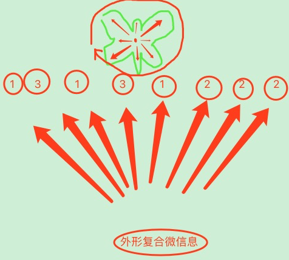
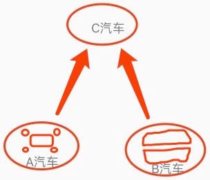

<!-- TOC -->

- [1. 有什么的问题](#1-%E6%9C%89%E4%BB%80%E4%B9%88%E7%9A%84%E9%97%AE%E9%A2%98)
- [2. 扩展算法result复合值 / 复合微信息](#2-%E6%89%A9%E5%B1%95%E7%AE%97%E6%B3%95result%E5%A4%8D%E5%90%88%E5%80%BC--%E5%A4%8D%E5%90%88%E5%BE%AE%E4%BF%A1%E6%81%AF)
- [3. 扩展模糊祖母](#3-%E6%89%A9%E5%B1%95%E6%A8%A1%E7%B3%8A%E7%A5%96%E6%AF%8D)
- [4. 扩展主动视觉](#4-%E6%89%A9%E5%B1%95%E4%B8%BB%E5%8A%A8%E8%A7%86%E8%A7%89)
- [5. 视觉等大量数据不必进入硬盘 T](#5-%E8%A7%86%E8%A7%89%E7%AD%89%E5%A4%A7%E9%87%8F%E6%95%B0%E6%8D%AE%E4%B8%8D%E5%BF%85%E8%BF%9B%E5%85%A5%E7%A1%AC%E7%9B%98-t)
- [6. 使用bool0和1来替代微信息中各种值](#6-%E4%BD%BF%E7%94%A8bool0%E5%92%8C1%E6%9D%A5%E6%9B%BF%E4%BB%A3%E5%BE%AE%E4%BF%A1%E6%81%AF%E4%B8%AD%E5%90%84%E7%A7%8D%E5%80%BC)
- [7. 对dataIn的结构化迭代](#7-%E5%AF%B9datain%E7%9A%84%E7%BB%93%E6%9E%84%E5%8C%96%E8%BF%AD%E4%BB%A3)
- [8. AI的表达](#8-ai%E7%9A%84%E8%A1%A8%E8%BE%BE)
- [9. mv高教](#9-mv%E9%AB%98%E6%95%99)
- [10. 固化网络-小脑](#10-%E5%9B%BA%E5%8C%96%E7%BD%91%E7%BB%9C-%E5%B0%8F%E8%84%91)
- [11. 瞬时记忆迭代计划](#11-%E7%9E%AC%E6%97%B6%E8%AE%B0%E5%BF%86%E8%BF%AD%E4%BB%A3%E8%AE%A1%E5%88%92)
- [12. 语言支持](#12-%E8%AF%AD%E8%A8%80%E6%94%AF%E6%8C%81)
- [13. 扩展微信息的模糊匹配](#13-%E6%89%A9%E5%B1%95%E5%BE%AE%E4%BF%A1%E6%81%AF%E7%9A%84%E6%A8%A1%E7%B3%8A%E5%8C%B9%E9%85%8D)
- [14. v3.0版本计划](#14-v30%E7%89%88%E6%9C%AC%E8%AE%A1%E5%88%92)
- [15. 特征网络](#15-%E7%89%B9%E5%BE%81%E7%BD%91%E7%BB%9C)
- [16. 取消subView构建为概念节点](#16-%E5%8F%96%E6%B6%88subview%E6%9E%84%E5%BB%BA%E4%B8%BA%E6%A6%82%E5%BF%B5%E8%8A%82%E7%82%B9)
- [17. 内类比,支持多个值的变化;](#17-%E5%86%85%E7%B1%BB%E6%AF%94%E6%94%AF%E6%8C%81%E5%A4%9A%E4%B8%AA%E5%80%BC%E7%9A%84%E5%8F%98%E5%8C%96)
- [18. 方向索引的强度序列](#18-%E6%96%B9%E5%90%91%E7%B4%A2%E5%BC%95%E7%9A%84%E5%BC%BA%E5%BA%A6%E5%BA%8F%E5%88%97)
- [19. 简化神经网络节点](#19-%E7%AE%80%E5%8C%96%E7%A5%9E%E7%BB%8F%E7%BD%91%E7%BB%9C%E8%8A%82%E7%82%B9)
- [20. at&ds](#20-atds)
- [21. 去掉内类比大小](#21-%E5%8E%BB%E6%8E%89%E5%86%85%E7%B1%BB%E6%AF%94%E5%A4%A7%E5%B0%8F)
- [22. 遗忘](#22-%E9%81%97%E5%BF%98)
- [23. 恢复概念嵌套](#23-%E6%81%A2%E5%A4%8D%E6%A6%82%E5%BF%B5%E5%B5%8C%E5%A5%97)
- [24. 时序嵌套](#24-%E6%97%B6%E5%BA%8F%E5%B5%8C%E5%A5%97)
- [25. Ports拆分单存](#25-ports%E6%8B%86%E5%88%86%E5%8D%95%E5%AD%98)
- [26. 从TIP转移内类比到TIR](#26-%E4%BB%8Etip%E8%BD%AC%E7%A7%BB%E5%86%85%E7%B1%BB%E6%AF%94%E5%88%B0tir)
- [其它](#%E5%85%B6%E5%AE%83)

<!-- /TOC -->

### 1. 有什么的问题

| 简介 >> |
| --- |
| 关于场景的祖母,`如小鸟生存场景,包含了树,公路,坚果等祖母` |
| 分析 >> |
| 本质上是:`祖母的嵌套问题`,也就是:`纵向组分循环的问题` ,`有什么`的问题 |

| 理性思维问题,分析TODO `190920` `参考note17` |
| --- |
| 分析,在衣服袋里,发现一个夹子,由此疑问夹子从哪来,然后联想到晾衣夹; (此理性过程的疑问从哪来,如何思维解?) |

### 2. 扩展算法result复合值 / 复合微信息

> 单值表达局限,但对于变化敏感;
> 如: 颜色用单值表达即局限;距离用单值表达变化即敏感;
> 注: 可与第3条,第11条,模糊匹配共同开发;

| 简介 >> |
| --- |
| 算法值不仅是"值类型",也有可能是一些复合类型; |
| 单值比如: 距离 |
| 复合值比如: 颜色的冷暖,颜色的红,绿,蓝; |

| 正文 >> |  |
| --- | --- |
| 1. 类比大小 | 单值可比大小,复合值不可,比如距离的远近+-祖母节点,而颜色没有; |
| 2. 类比相等 | 复合值中的每个值,都匹配,才可匹配; |
| 3. 模糊匹配 | 复合值中的每个值,各自进行模糊匹配; |

| 复合微信息示图 >> |
| --- |
|  |
| 1. 绿色为蝴蝶,此处的外形算法,精细度为8; |
| 2. 从左开始,顺时针一共取8个值; (傅里叶变换) |
| 3. 最终我们得到1,3,1,3,1,2,2,2这样的微信息结果; |
| 4. 下方是外形复合微信息,此复合微信息指向8个微信息值; |

| 复合微信息到概念节点示图 >> |
| --- |
|  |
| 1. 红蝴蝶外形,和颜色算法单独处理; |
| 2. 得出两个概念节点后,可类比抽象出蝴蝶; |
| 3. 抽象蝴蝶只保留了共同处,而不含`头的形状`和`颜色`这些细节信息; |
| 4. 匹配时,是优先与`抽象蝴蝶节点`匹配 (此时不管头的形状或任何颜色,都会被识别为蝴蝶); |

### 3. 扩展模糊祖母

> 注: v2.0小鸟大脑应用到现实世界,必须扩展支持模糊匹配功能;
> 当0.3是红,0.7也是红,那么会模糊到0.3->0.7都是红色;

| 简介 >> |
| --- |
| 可以用from-to来表示模糊匹配; |

| 方案 >> | DESC | 采用率 |
| --- | --- | --- |
| 1 | 将from-to用到祖母节点中; | 10% |
| 2 | 将from-to用于索引value中; | 90% |

### 4. 扩展主动视觉

| 简介 >> |
| --- |
| 1. 被动视觉虽然简单,但具有很多局限性,所以在迭代中,要逐步以成熟化来突破局限; |
| 注: 视觉不是主动的,主动的只是转动头,或者云台罢了; |

### 5. 视觉等大量数据不必进入硬盘 T

> 对于快销品,来说,是快速类比(识别等)后,便会快速遗忘的,此类信息不必进入硬盘;

### 6. 使用bool0和1来替代微信息中各种值

> 1. 使用Bool来替代微信息的方式,只是在微信息处加了一层,并不影响根本,但却可能有非常意外的收获;
> 2. 其实目前已经是这样,微信息在计算机自动处理的中间层,在转换了0和1;

### 7. 对dataIn的结构化迭代

> 1. 在识别dataIn_NoMV_RecognitionIs取前limit个,或者dataIn_NoMV_RecognitionUse中firstPort,都是影响思维灵活性,可考虑用更结构化,(不应期+联想匹配)的方式,来解决此问题;

### 8. AI的表达

> 三上智也建议:名实分离  
> 小吧主:指代关系,nlp

### 9. mv高教

> 破耳狼建议:友善,可爱的硅基朋友;

### 10. 固化网络-小脑
`CreateTime 2019.05.19`

开发小脑固化网络 : 参考n16p11;

### 11. 瞬时记忆迭代计划
`CreateTime 2019.06.24`

> 迭代将瞬时记忆分为两个来源:
> 1. 不限制:我们所看到的最近信息的同时;
> 2. 限制x条:我们识别到的信息;
> 原理分析:4-8条,不是因为容量,而是因为思维活力仅能做到4到8条的识别;且未识别的信息部分,有极大可能被持久化之前就遗忘;但这丝毫不影响这些并不那么重要的信息被构建到具象概念节点中;

### 12. 语言支持
`CreateTime 2019.07.15`

1. 迭代支持初步的一些语言认知学习和决策输出;
2. 解释:语言输入也是认知信号输入,语言输出也是行为信息输出;
3. 比如:慢慢试各种输出,连"爸爸"这样的词,也得学很久;
4. 正如:走路,这样的动作,都要不断的试试试,不断的犯错,修正,才能学会走路;
5. 还有一个弱点,就是会形成一种动作习惯,很难改掉;

### 13. 扩展微信息的模糊匹配
`CreateTime 2019.07.22`

> 注: v2.0小鸟大脑应用到现实世界,必须扩展支持模糊匹配功能;
> 当0.3是红,0.7也是红,那么会模糊到0.3->0.7都是红色;
> 注: 模糊匹配功能可与第2条复合微信息功能同时开发;

|  |
| --- |
| 1. 改进二分算法找最相似微信息 (如图中1.45匹配data序列中1.4) |
| 2. 微信息模块,支持内存网络,规则如下: |
| 规则1. 构建时在内存网络; |
| 规则2. 抽象时迁移硬盘化; |
| 规则3. 只需跟着时序与概念的规则走就行; |

### 14. v3.0版本计划
`CreateTime 2019.07.23`

1. 迭代微信息对更加应用场景的支持: "我不能要求现实世界变的更简单,只能要求he能够适应更加复杂的现实世界";
2. 复合微信息
3. 微信息模糊匹配
2. 改用java80%/c20%做主开发语言;
3. 团队化运作;
4. 找合作伙伴;
5. 对开放接口规范;

### 15. 特征网络
`CreateTime 2019.08.09`

　　当前，要求皮层算法必须输出一个数值为稀疏码微信息，但单数值表现力有限，故需要扩展为支持数组输出。如表示一个形状等。

　　此时，对于输入的数据，需要扩展支持：“特征网络”，即在“稀疏码微信息”与“概念网络”之间，需要再加一个网络模块。

　　问题：皮层算法可否直接支持结构化算法结果，而不是单纯的数组一对多关系。此时，特征网络也须相应支持横向结构化一对多（即横向多模块特征网络）。

### 16. 取消subView构建为概念节点
`CreateTime 2019.08.16`

　　InputModels中的subView应取消直接构建成概念节点，而仅构建场景概念节点，别的概念应由抽象来生成。

### 17. 内类比,支持多个值的变化;

　　需支持特征网络后再做。否则同场景下，多个view中，有多个同区值时，可能出现即大、又小的情况。
　　有了特征网络后，对微信息的分组更加详细，即可支持多个值的变化。（或者不需要特征网络，目前已支持这样的view分组，编个号，非同一view下的微信息值，不可类比）。

### 18. 方向索引的强度序列
`CreateTime 2019.08.23`

1. 支持微信息模糊匹配后，mv索引要有更精细的匹配。比如（有点饿，饿，非常饿）。
2. 行为化成功时强度+n，失败时-n（其中n与当前任务的急迫度正相关）。

### 19. 简化神经网络节点

1. 把absNode和conNode合并成一个,且都含absPorts和conPorts端口;

### 20. at&ds

> 目前的比较混乱,
> 例如:at和ds在微信息中,分别表示算法区类型和算法类型;
> 再如:at和ds在概念中,分别表示当前概念指针地址pId,和继承由微信息组传过来的at作为ds;

1. 把所有的dataSource改成curType;
2. 把所有的algsType改成fromType;

### 21. 去掉内类比大小
`CreateTime 2019.09.12`

1. 因为抛物线,各种不同轨迹的运动方式;比如某物运行,可能是10-9-8,然后突然变成0;
2. 将内类比大小,由时序替代,比如A10-A9-A8-A0;
3. 由时序替代后,时序需要支持delta索引,比如上例为-1,-1,-8;

### 22. 遗忘
`CreateTime 2019.09.18`

1. 长时硬盘网络的强度序列ports.limit=10000; (TODOv3.0)
2. 短时内存网络的时间序列ports还维持目前的时间销毁;

### 23. 恢复概念嵌套
`CreateTime 2019.09.20`

| 恢复概念嵌套备忘 >> |
| --- |
|  |
| 1. A汽车有 `4轮+主体`; |
| 2. B汽车有 `左半车+右半车` |
| 3. A和B都是嵌套概念,且A和B都抽象指向`C汽车`,而A与B是两个具象节点; |

### 24. 时序嵌套
`CreateTime 2019.09.24`

> 1. 比如,先转身过人,后投篮得分;
> 2. 其中,转身过人,和投篮得分,都可能是单独的时序,且可能还不止一个;
> 3. 复杂的嵌套结构,目前不予支持,待v3.0或者再后面版本,迭代支持;

### 25. Ports拆分单存
`CreateTime 2019.09.25`

> 1. 目前,像内存网络中,还有value_p中,都已经是单存状态,但algNode和foNode还是存在节点下;
> 2. 思考一下性能,看是否把HdNet中节点的refPorts,absPorts,conPorts,content_ps都进行拆分单存文件;

### 26. 从TIP转移内类比到TIR
`CreateTime 2019.10.12`

> v2.0版本,不需要应该也可以,但到3.0时,需要将此工作完成;

1. 恢复出TIR的内类比代码,并每桢输入都执行,最后一条的内类比;
2. 将TIP中的内类比取消掉,理性内类比,仅在TIR逐桢运作;

## 其它

| 其它 >> | 一句话需求 |
| --- | --- |
| 1 | 对特征网络与mv的直接关联; |
