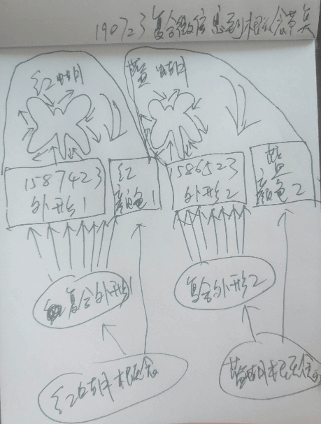
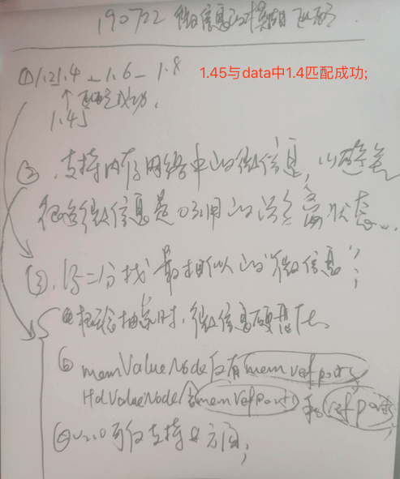

<!-- TOC -->

- [1. 有什么的问题](#1-%E6%9C%89%E4%BB%80%E4%B9%88%E7%9A%84%E9%97%AE%E9%A2%98)
- [2. 扩展算法result复合值](#2-%E6%89%A9%E5%B1%95%E7%AE%97%E6%B3%95result%E5%A4%8D%E5%90%88%E5%80%BC)
- [3. 扩展模糊祖母](#3-%E6%89%A9%E5%B1%95%E6%A8%A1%E7%B3%8A%E7%A5%96%E6%AF%8D)
- [4. 扩展主动视觉](#4-%E6%89%A9%E5%B1%95%E4%B8%BB%E5%8A%A8%E8%A7%86%E8%A7%89)
- [5. 视觉等大量数据不必进入硬盘 T](#5-%E8%A7%86%E8%A7%89%E7%AD%89%E5%A4%A7%E9%87%8F%E6%95%B0%E6%8D%AE%E4%B8%8D%E5%BF%85%E8%BF%9B%E5%85%A5%E7%A1%AC%E7%9B%98-t)
- [6. 使用bool0和1来替代微信息中各种值](#6-%E4%BD%BF%E7%94%A8bool0%E5%92%8C1%E6%9D%A5%E6%9B%BF%E4%BB%A3%E5%BE%AE%E4%BF%A1%E6%81%AF%E4%B8%AD%E5%90%84%E7%A7%8D%E5%80%BC)
- [7. 对dataIn的结构化迭代](#7-%E5%AF%B9datain%E7%9A%84%E7%BB%93%E6%9E%84%E5%8C%96%E8%BF%AD%E4%BB%A3)
- [8. AI的表达](#8-ai%E7%9A%84%E8%A1%A8%E8%BE%BE)
- [9. mv高教](#9-mv%E9%AB%98%E6%95%99)
- [10. 瞬时记忆迭代计划](#10-%E7%9E%AC%E6%97%B6%E8%AE%B0%E5%BF%86%E8%BF%AD%E4%BB%A3%E8%AE%A1%E5%88%92)
- [11. 扩展微信息的模糊匹配](#11-%E6%89%A9%E5%B1%95%E5%BE%AE%E4%BF%A1%E6%81%AF%E7%9A%84%E6%A8%A1%E7%B3%8A%E5%8C%B9%E9%85%8D)
- [其它](#%E5%85%B6%E5%AE%83)

<!-- /TOC -->

### 1. 有什么的问题

| 简介 >> |
| --- |
| 关于场景的祖母,`如小鸟生存场景,包含了树,公路,坚果等祖母` |

| 分析 >> |
| --- |
| 本质上是:`祖母的嵌套问题`,也就是:`纵向组分循环的问题` ,`有什么`的问题 |

### 2. 扩展算法result复合值

> 单值表达局限,但对于变化敏感;
> 如: 颜色用单值表达即局限;距离用单值表达变化即敏感;
> 注: 可与第3条,第11条,模糊匹配共同开发;

| 简介 >> |
| --- |
| 算法值不仅是"值类型",也有可能是一些复合类型; |
| 单值比如: 距离 |
| 复合值比如: 颜色的冷暖,颜色的红,绿,蓝; |

| 正文 >> |  |
| --- | --- |
| 1. 类比大小 | 单值可比大小,复合值不可,比如距离的远近+-祖母节点,而颜色没有; |
| 2. 类比相等 | 复合值中的每个值,都匹配,才可匹配; |
| 3. 模糊匹配 | 复合值中的每个值,各自进行模糊匹配; |

| 复合微信息示图 >> |
| --- |
|  |
| 1. 绿色为蝴蝶,此处的外形算法,精细度为8; |
| 2. 从左开始,顺时针一共取8个值; (傅里叶变换) |
| 3. 最终我们得到1,3,1,3,1,2,2,2这样的微信息结果; |
| 4. 下方是外形复合微信息,此复合微信息指向8个微信息值; |

| 复合微信息到概念节点示图 >> |
| --- |
|  |
| 1. 红蝴蝶外形,和颜色算法单独处理; |
| 2. 得出两个概念节点后,可类比抽象出蝴蝶; |
| 3. 抽象蝴蝶只保留了共同处,而不含`头的形状`和`颜色`这些细节信息; |
| 4. 匹配时,是优先与`抽象蝴蝶节点`匹配 (此时不管头的形状或任何颜色,都会被识别为蝴蝶); |

### 3. 扩展模糊祖母

> 注: v2.0小鸟大脑应用到现实世界,必须扩展支持模糊匹配功能;
> 当0.3是红,0.7也是红,那么会模糊到0.3->0.7都是红色;

| 简介 >> |
| --- |
| 可以用from-to来表示模糊匹配; |

| 方案 >> | DESC | 采用率 |
| --- | --- | --- |
| 1 | 将from-to用到祖母节点中; | 10% |
| 2 | 将from-to用于索引value中; | 90% |

### 4. 扩展主动视觉

| 简介 >> |
| --- |
| 1. 被动视觉虽然简单,但具有很多局限性,所以在迭代中,要逐步以成熟化来突破局限; |

### 5. 视觉等大量数据不必进入硬盘 T

> 对于快销品,来说,是快速类比(识别等)后,便会快速遗忘的,此类信息不必进入硬盘;

### 6. 使用bool0和1来替代微信息中各种值

> 1. 使用Bool来替代微信息的方式,只是在微信息处加了一层,并不影响根本,但却可能有非常意外的收获;
> 2. 其实目前已经是这样,微信息在计算机自动处理的中间层,在转换了0和1;

### 7. 对dataIn的结构化迭代

> 1. 在识别dataIn_NoMV_RecognitionIs取前limit个,或者dataIn_NoMV_RecognitionUse中firstPort,都是影响思维灵活性,可考虑用更结构化,(不应期+联想匹配)的方式,来解决此问题;

### 8. AI的表达

> 三上智也建议:名实分离
> 小吧主:指代关系,nlp

### 9. mv高教

> 破耳狼建议:友善,可爱的硅基朋友;

### 10. 瞬时记忆迭代计划
`CreateTime 2019.06.24`

> 迭代将瞬时记忆分为两个来源:
> 1. 不限制:我们所看到的最近信息的同时;
> 2. 限制x条:我们识别到的信息;
> 原理分析:4-8条,不是因为容量,而是因为思维活力仅能做到4到8条的识别;且未识别的信息部分,有极大可能被持久化之前就遗忘;但这丝毫不影响这些并不那么重要的信息被构建到具象概念节点中;

### 11. 扩展微信息的模糊匹配
`CreateTime 2019.07.22`

> 注: v2.0小鸟大脑应用到现实世界,必须扩展支持模糊匹配功能;
> 当0.3是红,0.7也是红,那么会模糊到0.3->0.7都是红色;
> 注: 模糊匹配功能可与第2条复合微信息功能同时开发;

|  |
| --- |
| 1. 改进二分算法找最相似微信息 (如图中1.45匹配data序列中1.4) |
| 2. 微信息模块,支持内存网络,规则如下: |
| 规则1. 构建时在内存网络; |
| 规则2. 抽象时迁移硬盘化; |
| 规则3. 只需跟着时序与概念的规则走就行; |

## 其它

| 其它 >> | 一句话需求 |
| --- | --- |
| 1 | 对特征网络与mv的直接关联; |
